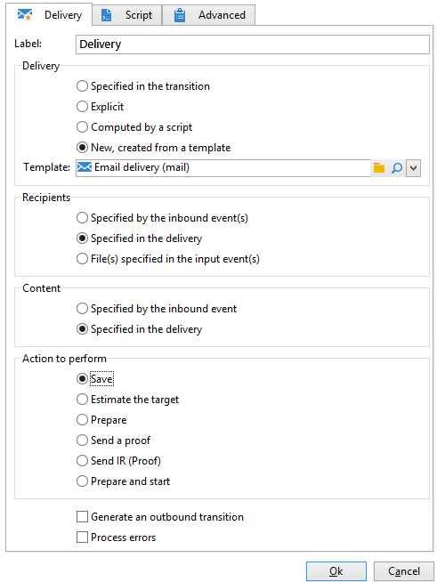

# Leveringscontent laden{#loading-delivery-content}

Als uw leveringsinhoud beschikbaar is in een HTML-bestand dat zich op Amazon S3-, FTP- of SFTP-servers bevindt, kunt u deze inhoud gemakkelijk laden in Adobe Campaign-leveringen.

Dit doet u als volgt:

1. Als u nog geen verbinding hebt gedefinieerd tussen Adobe Campaign en de (S)FTP-server die als host fungeert voor de inhoudsbestanden, maakt u een nieuwe externe S3-, FTP- of SFTP-account in **[!UICONTROL Administration]** > **[!UICONTROL Platform]** > **[!UICONTROL External Accounts]**. Geef in deze externe account het adres en de referenties op waarmee de verbinding met de S3- of (S)FTP-server tot stand wordt gebracht.

   Hier is een voorbeeld van een externe S3-account:

   

1. Een nieuwe workflow maken, bijvoorbeeld op basis van **[!UICONTROL Profiles and Targets]** > **[!UICONTROL Jobs]** > **[!UICONTROL Targeting workflows]**.
1. Voeg een **[!UICONTROL File transfer]** activiteit in uw werkschema, en vorm het door te specificeren

   * De externe account die moet worden gebruikt om verbinding te maken met de S3- of (S)FTP-server.
   * Het pad van het bestand op de S3- of (S)FTP-server.

   

1. Voeg een **[!UICONTROL Delivery]** activiteit en verbind het met de uitgaande overgang van **[!UICONTROL File transfer]** activiteit. Configureer dit als volgt:

   * Aflevering: Afhankelijk van uw behoeften, kan het een specifieke levering zijn die reeds in het systeem, of een nieuwe levering wordt gecreeerd die op een bestaand malplaatje wordt gebaseerd.
   * Ontvangers: In dit voorbeeld wordt ervan uitgegaan dat het doel is opgegeven in de levering zelf.
   * Inhoud: Zelfs als de inhoud in de vorige activiteit wordt geïmporteerd, selecteert u **[!UICONTROL Specified in the delivery]**. Aangezien de inhoud rechtstreeks wordt geïmporteerd uit een bestand op een externe server, heeft de inhoud geen id wanneer deze wordt verwerkt door de workflow en kan niet worden geïdentificeerd als afkomstig van de binnenkomende gebeurtenis.
   * Uit te voeren handeling: Selecteren **[!UICONTROL Save]** om de levering op te slaan en deze vanuit **[!UICONTROL Campaign management]** > **[!UICONTROL Deliveries]** zodra de workflow is uitgevoerd.

   

1. In de **[!UICONTROL Script]** tabblad van het dialoogvenster **[!UICONTROL Delivery]** activiteit, voeg het volgende bevel toe om de inhoud van het ingevoerde dossier in de levering te laden:

   ```
   delivery.content.md.source=loadFile(vars.filename)
   ```

   

1. Sla de workflow op en voer deze uit. Een nieuwe levering met de geladen inhoud wordt onder gemaakt **[!UICONTROL Campaign management]** > **[!UICONTROL Deliveries]**.

