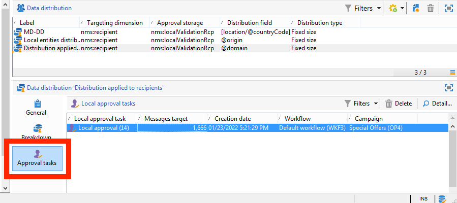

# De lokale goedkeuringsactiviteit gebruiken{#using-the-local-approval-activity}

De **[!UICONTROL Local approval]** Met de activiteit die in een doelworkflow is geïntegreerd, kunt u een goedkeuringsproces voor ontvangers instellen voordat de levering wordt verzonden.

>[!CAUTION]
>
>Als u deze functie wilt gebruiken, moet u de module Distributed Marketing aanschaffen. Dit is een optie Campagne. Controleer hiervoor uw licentieovereenkomst.

Voor het instellen van dit gebruiksgeval hebben we de volgende workflow voor doelversie gemaakt:

De belangrijkste stappen in het lokale goedkeuringsproces zijn:

1. De bevolking die het gevolg is van doelgerichte acties kan beperkt worden dankzij een **[!UICONTROL Split]** type activiteit gebruikend een model van de gegevensdistributie.

   

1. De **[!UICONTROL Local approval]** de activiteit neemt dan en verzendt een bericht e-mail naar elke lokale supervisor over. De activiteit wordt opgeschort tot elke lokale supervisor de ontvangers goedkeurt die aan hen worden toegewezen.

1. Wanneer de deadline voor goedkeuring is bereikt, wordt de workflow opnieuw gestart. In dit voorbeeld wordt **[!UICONTROL Delivery]** de activiteit begint en de levering wordt naar de goedgekeurde streefcijfers gezonden .

   >[!NOTE]
   >
   >Zodra de deadline is bereikt, worden ontvangers die niet zijn goedgekeurd, uitgesloten van doelbinding.

   

1. Een paar dagen later, de tweede **[!UICONTROL Local approval]** type activiteit verzendt een bericht e-mail naar elke lokale supervisor met een samenvatting van de acties die door hun contacten worden uitgevoerd (kliks, opent enz.).

## Stap 1: De sjabloon voor gegevensdistributie maken {#step-1--creating-the-data-distribution-template-}

Met de sjabloon voor gegevensdistributie kunt u de populatie beperken die het resultaat is van het richten op basis van gegevensgroepering, terwijl u elke waarde kunt toewijzen aan een lokale toezichthouder. In dit voorbeeld hebben we de **[!UICONTROL Email address domain]** veld als een distributieveld en een domein toegewezen aan elke lokale toezichthouder

Raadpleeg voor meer informatie over het maken van een sjabloon voor gegevensdistributie [Het aantal subsetrecords per gegevensdistributie beperken](split.md#limiting-the-number-of-subset-records-per-data-distribution).

1. Ga naar de **[!UICONTROL Resources > Campaign management > Data distribution]** knoop en klik **[!UICONTROL New]**.

   

1. Selecteer het tabblad **[!UICONTROL General]**. 

   

1. Voer de **[!UICONTROL Label]** en de **[!UICONTROL Distribution context]**. In dit voorbeeld hebben we de **[!UICONTROL Recipient]** richtingsschema en **[!UICONTROL Email domain]** veld als een distributieveld. De lijst met ontvangers wordt uitgesplitst naar domein.
1. In de **[!UICONTROL Distribution type]** in het veld selecteert u hoe de waarde van de doelbeperking wordt uitgedrukt in het **[!UICONTROL Distribution]** tab. Hier hebben we gekozen **[!UICONTROL Percentage]**.
1. In de **[!UICONTROL Approval storage]** voert u het opslagschema in van de goedkeuringen die overeenkomen met het gebruikte doelschema. Hier gaan wij het standaardopslagschema gebruiken: **[!UICONTROL Local approval of recipients]**.
1. Klik vervolgens op de knop **[!UICONTROL Advanced parameters]** koppeling.

   

1. Houd de **[!UICONTROL Approve the targeted messages]** geselecteerd zodat alle ontvangers vooraf zijn geselecteerd in de lijst met ontvangers die moeten worden goedgekeurd.
1. In de **[!UICONTROL Delivery label]** -veld, hebben we de standaardexpressie verlaten (tekenreeks van de levering berekenen). Het standaardlabel van de levering wordt gebruikt in de feedbackmelding.
1. In de **[!UICONTROL Grouping field]** -sectie hebben we de **[!UICONTROL Gender]** veld als groeperingsveld voor het weergeven van ontvangers in goedkeurings- en feedbackberichten.
1. In de **[!UICONTROL Edit targeted messages]** -sectie, hebben we de **[!UICONTROL Edit recipients]** webtoepassing en de **[!UICONTROL recipientId]** parameter. In de goedkeurings- en feedbackberichten kunnen ontvangers klikken en verwijzen ze naar de URL van de webtoepassing. De extra URL-parameter wordt **[!UICONTROL recipientId]**.
1. Klik vervolgens op de knop **[!UICONTROL Distribution]** tab. Voer voor elk domein de volgende velden in:

   

   * **[!UICONTROL Value]**: voer de waarde van de domeinnaam in.
   * **[!UICONTROL Percentage / Fixed]**: Voer voor elk domein de maximale waarde in. aantal ontvangers waarnaar u de levering wilt verzenden. In dit voorbeeld willen we de levering beperken tot 10% per domein.
   * **[!UICONTROL Label]**: voer het label in van het domein dat moet worden weergegeven in de goedkeurings- en feedbackberichten.
   * **[!UICONTROL Group or operator]**: selecteer de operator of groep van operatoren die aan het domein zijn toegewezen.

     >[!CAUTION]
     >
     >Controleer of de juiste rechten aan de exploitanten zijn toegekend.

## Stap 2: De doelworkflow maken {#step-2--creating-the-targeting-workflow}

Voor het instellen van dit gebruiksgeval hebben we de volgende workflow voor doelversie gemaakt:

De volgende activiteiten zijn toegevoegd:

* Twee **[!UICONTROL Query]** activiteiten,
* Eén **[!UICONTROL Intersection]** activiteit,
* Eén **[!UICONTROL Split]** activiteit,
* Eén **[!UICONTROL Local approval]** activiteit,
* Eén **[!UICONTROL Delivery]** activiteit,
* Eén **[!UICONTROL Wait]** activiteit,
* Een seconde **[!UICONTROL Local approval]** activiteit,
* Eén **[!UICONTROL End]** activiteit.

### Zoekopdrachten, doorsnede en Splitsen {#queries--intersection-and-split}

Het stroomopwaartse richten bestaat uit twee vragen, één doorsnede en één spleet. De populatie die het resultaat is van gerichte acties, kan worden beperkt door een **[!UICONTROL Split]** activiteit die een malplaatje van de gegevensdistributie gebruikt.

Voor meer bij het vormen van een gespleten activiteit, verwijs naar [Splitsen](split.md). Het maken van een sjabloon voor gegevensdistributie wordt nader beschreven in [Het aantal subsetrecords per gegevensdistributie beperken](split.md#limiting-the-number-of-subset-records-per-data-distribution).

Als u de populatie van de query niet wilt beperken, hoeft u de opdracht **[!UICONTROL Query]**, **[!UICONTROL Intersection]**, en **[!UICONTROL Split]** activiteiten. Vul in dit geval de sjabloon voor gegevensdistributie in het eerste **[!UICONTROL Local approval]** activiteit.

1. In de **[!UICONTROL Record count limitation]** selecteert u de **[!UICONTROL Limit the selected records]** en klik op de knop **[!UICONTROL Edit]** koppeling.

   

1. Selecteer de **[!UICONTROL Keep only the first records after sorting]** en klik op **[!UICONTROL Next]**.

   

1. In de **[!UICONTROL Sort columns]** toevoegen, voegt u het veld toe waarop de sortering wordt toegepast. Hier hebben we gekozen voor de **[!UICONTROL Email]** veld. Klik op **[!UICONTROL Next]**.

   

1. Selecteer de **[!UICONTROL By data distribution]** optie, selecteer eerder gecreeerd distributiemalplaatje (verwijs naar [Stap 1: Het creëren van het malplaatje van de gegevensdistributie](#step-1--creating-the-data-distribution-template-)) en klik op **[!UICONTROL Finish]**.

   

In het distributiemalplaatje, hebben wij ervoor gekozen om de bevolking tot 10% per groeperingswaarde te beperken, die met de waarden samenvalt die in het werkschema worden getoond (340 als input en 34 als output).

### Goedkeuringsmelding {#approval-notification}

De **[!UICONTROL Local approval]** de activiteit laat u een bericht naar elke lokale supervisor verzenden.

Voor meer informatie over het configureren van de **[!UICONTROL Local approval]** activiteit, zie [Lokale goedkeuring](local-approval.md).

De volgende velden moeten worden ingevuld:

1. Selecteer in de sectie **[!UICONTROL Action to execute]** de optie **[!UICONTROL Target approval notification]**.
1. Selecteer in de sectie **[!UICONTROL Distribution context]** de optie **[!UICONTROL Specified in the transition]**.

   Als u de doelpopulatie niet wilt beperken, selecteert u de optie **[!UICONTROL Explicit]** hier de distributiesjabloon invoeren die eerder in het dialoogvenster **[!UICONTROL Data distribution]** veld.

1. In de **[!UICONTROL Notification]** selecteert u de leveringssjabloon en het onderwerp dat voor de e-mailmelding moet worden gebruikt. Hier hebben we de standaardsjabloon gekozen: **[!UICONTROL Local approval notification]**.
1. In de **[!UICONTROL Approval schedule]** hebben we de standaardgoedkeuringsdeadline (3 dagen) gehandhaafd en een herinnering toegevoegd. De levering duurt 3 dagen na de aanvang van de goedkeuring. Zodra de goedkeuringsdeadline is bereikt, worden de ontvangers die niet zijn goedgekeurd niet in aanmerking genomen door zich te richten.

Er wordt een e-mailbericht verzonden door de **[!UICONTROL Local approval]** activiteiten voor lokale toezichthouders.

### Wachten {#wait}

Met de wachtactiviteiten kunt u het starten van de tweede lokale goedkeuringsactiviteit uitstellen die de feedbackmelding voor levering verzendt. In de **[!UICONTROL Duration]** veld, zijn we ingegaan op **[!UICONTROL 5d]** waarde (5 dagen). De acties die de ontvangers gedurende vijf dagen na de verzending van de levering uitvoeren, worden in de feedbackmelding opgenomen.

### Feedbackmelding {#feedback-notification}

De tweede **[!UICONTROL Local approval]** de activiteit laat u een levering terugkoppelen bericht naar elke lokale supervisor verzenden.

De volgende velden moeten worden ingevoerd.

1. In de **[!UICONTROL Action to execute]** sectie, kiest u **[!UICONTROL Delivery feedback report]**.
1. In de **[!UICONTROL Delivery]** sectie, kiest u **[!UICONTROL Specified in the transition]**.
1. In de **[!UICONTROL Notification]** selecteert u de leveringssjabloon en het onderwerp dat voor de e-mailmelding moet worden gebruikt.

Zodra de termijn die in de wachttijdactiviteit wordt gevormd wordt bereikt, tweede **[!UICONTROL Local approval]** type activiteit verzendt het volgende bericht e-mail naar elke lokale supervisor:

### Goedkeuring bijhouden door de beheerder {#approval-tracking-by-the-administrator}

Telkens wanneer de lokale goedkeuringsactiviteit begint, wordt een goedkeuringstaak gecreeerd. De beheerder kan elk van deze goedkeuringstaken controleren.

Ga naar de doelworkflow van uw campagne en klik op de knop **[!UICONTROL Local approval tasks]** tab.

De lijst met lokale goedkeuringstaken kan ook worden geraadpleegd via de **[!UICONTROL Approval tasks]** tabblad van de sjabloon voor gegevensdistributie.

Selecteer de taak die u wilt controleren en klik op **[!UICONTROL Detail]** knop. De **[!UICONTROL General]** van de lokale goedkeuringstaak kunt u informatie over de taak bekijken. Indien nodig kunt u de goedkeuringsdatums en de herinneringsdatums wijzigen.

Dit tabblad bevat de volgende informatie:

* het label en de id van de taak
* het gebruikte distributiemalplaatje
* het aantal gerichte berichten
* de gekoppelde workflow en campagne
* het taakschema

De **[!UICONTROL Distribution]** kunt u de goedkeuringslogboeken, hun status, het aantal berichten dat u wilt ontvangen, de goedkeuringsdatum en de beheerder die de levering heeft goedgekeurd, weergeven.

Selecteer een goedkeuringslogboek en klik op de knop **[!UICONTROL Detail]** voor meer informatie. De **[!UICONTROL General]** van het lokale goedkeuringslogboek kunt u algemene logboekinformatie bekijken. U kunt ook de goedkeuringsstatus wijzigen.

Dit tabblad bevat de volgende informatie:

* de daarmee verband houdende goedkeuringstaak
* de goedkeuringsstatus (**[!UICONTROL Approved]** of **[!UICONTROL Pending]**)
* het gebruikte distributiemalplaatje
* de lokale toezichthouder die de goedkeuring heeft verleend en de goedkeuringsdatum
* het aantal gerichte en goedgekeurde berichten

De **[!UICONTROL Targeted]** tabblad van het goedkeuringslogboek bevat de lijst met beoogde ontvangers en hun goedkeuringsstatus. U kunt deze status desgewenst wijzigen.

