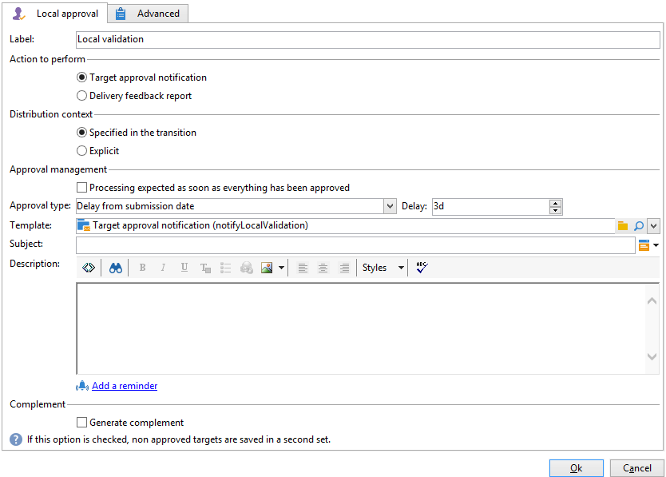

# Lokale goedkeuring{#local-approval}

Wanneer de **[!UICONTROL Local approval]** -activiteit is geïntegreerd in een doelworkflow, kunt u een goedkeuringsproces voor ontvangers instellen voordat de levering wordt verzonden.

>[!CAUTION]
>
>Om deze activiteit te gebruiken, moet u de Verdeelde module van de Marketing hebben gekocht, die een optie van de Campagne is. Controleer hiervoor uw licentieovereenkomst.

Voor een voorbeeld van de **[!UICONTROL Local approval]** activiteit met een distributiemalplaatje, verwijs naar [&#x200B; Gebruikend de lokale goedkeuringsactiviteit &#x200B;](local-approval-activity.md).

Voer eerst een label in voor de activiteit en het veld **[!UICONTROL Action to execute]** :

* Selecteer de optie **[!UICONTROL Target approval notification]** om een bericht-mail naar lokale supervisors vóór de levering te verzenden, vragend hen om de ontvangers goed te keuren die aan hen worden toegewezen.

* **Incrementele vraag**: laat u een vraag uitvoeren en zijn uitvoering plannen. Verwijs naar de [&#x200B; Incrementele vraag &#x200B;](incremental-query.md) sectie.

  

## Doelgoedkeuring {#target-approval-notification}

In dit geval wordt de **[!UICONTROL Local approval]** -activiteit geplaatst tussen de upstream-oriëntatie en de levering:

De velden die moeten worden ingevuld in het geval van een kennisgeving voor goedkeuring als doel zijn:

* **[!UICONTROL Distribution context]** : selecteer de optie **[!UICONTROL Specified in the transition]** als u een **[!UICONTROL Split]** -type-activiteit gebruikt om de doelpopulatie te beperken. In dit geval wordt de distributiesjabloon in de splitsingsactiviteit ingevoerd. Als u de doelpopulatie niet beperkt, selecteert u hier de optie **[!UICONTROL Explicit]** en voert u de distributiesjabloon in het veld **[!UICONTROL Data distribution]** in.

  Voor meer bij het creëren van een malplaatje van de gegevensdistributie, verwijs naar [&#x200B; Beperkend het aantal subsetverslagen per gegevensdistributie &#x200B;](split.md#limiting-the-number-of-subset-records-per-data-distribution).

* **[!UICONTROL Approval management]**

   * Selecteer de leveringssjabloon en het onderwerp dat voor het e-mailbericht wordt gebruikt. Er is een standaardsjabloon beschikbaar: **[!UICONTROL Local approval notification]**. U kunt ook een beschrijving toevoegen die boven de lijsten met ontvangers wordt weergegeven in de goedkeurings- en feedbackberichten.
   * Geef de **[!UICONTROL Approval type]** op die overeenkomt met de deadline van de goedkeuring (datum of deadline vanaf het begin van de goedkeuring). Op deze datum wordt de workflow opnieuw gestart en wordt bij het bepalen van de doelen geen rekening gehouden met de ontvangers die niet zijn goedgekeurd. Zodra de berichten zijn verzonden, wordt de activiteit een rij gevormd zodat de lokale supervisors hun contacten kunnen goedkeuren.

     >[!NOTE]
     >
     >Wanneer het goedkeuringsproces wordt gestart, wordt de activiteit standaard drie dagen voortgezet.

     U kunt ook een of meer herinneringen toevoegen om lokale toezichthouders te laten weten dat de deadline nadert. Klik hiertoe op de koppeling **[!UICONTROL Add a reminder]** .

* **[!UICONTROL Complementary set]**: met de optie **[!UICONTROL Generate complement]** kunt u een tweede set genereren die alle niet-goedgekeurde doelen bevat.

  >[!NOTE]
  >
  >Deze optie is standaard uitgeschakeld.

## Feedbackrapport leveren {#delivery-feedback-report}

In dit geval wordt de **[!UICONTROL Local approval]** -activiteit na de levering geplaatst:

In het geval van een feedbackrapport voor levering moeten de volgende velden worden ingevuld:

* Selecteer de optie **[!UICONTROL Specified in the transition]** als de levering is gestart tijdens een vorige activiteit. Selecteer **[!UICONTROL Explicit]** om de levering in de lokale goedkeuringsactiviteit te specificeren.
* Selecteer de leveringssjabloon en het object van het e-mailbericht. Er is een standaardsjabloon: **[!UICONTROL Local approval notification]**.

## Voorbeeld: een workflowlevering goedkeuren {#example--approving-a-workflow-delivery}

In dit voorbeeld wordt getoond hoe u een goedkeuringsproces voor workflowlevering instelt. Voor meer informatie over het creëren van leveringswerkschema&#39;s, verwijs naar het [&#x200B; Voorbeeld: leveringswerkschema &#x200B;](delivery.md#example--delivery-workflow) sectie.

Een exploitant kan een levering op één van twee manieren goedkeuren: het gebruiken van de Web-pagina verbonden in het e-mailbericht, of via de Console van de Cliënt.

* Webgoedkeuring

  Met het e-mailbericht dat naar beheerders van de groep Beheerders wordt verzonden, kunt u het leveringsdoel goedkeuren. Het bericht gebruikt de gedefinieerde tekst en de JavaScript-expressie wordt vervangen door de berekende waarde (in dit geval &#39;574&#39;)

  Als u de levering wilt goedkeuren, klikt u op de desbetreffende koppeling en meldt u zich aan bij de Adobe Campaign Client Console.

  

  Maak een keuze en klik op de knop **[!UICONTROL Submit]** .

  

* Goedkeuring via de clientconsole

  In de boomstructuur bevat het knooppunt **[!UICONTROL Administration > Production > Objects created automatically > Approvals pending]** de lijst met taken die moeten worden goedgekeurd door de operator die momenteel is verbonden. In de lijst moet één regel worden weergegeven. Dubbelklik op deze regel om te reageren. Het volgende venster wordt weergegeven:

Selecteer **ja**, dan klik **[!UICONTROL Approve]**. U ontvangt een bericht met de mededeling dat de reactie is opgenomen.

Ga terug naar het workflowscherm: Na tien seconden of zo wordt het diagram als volgt weergegeven:

De workflow heeft de taak **[!UICONTROL Delivery control]** uitgevoerd, wat in dit geval betekent dat de eerder gemaakte levering wordt gestart. De workflow is zonder fouten voltooid.
