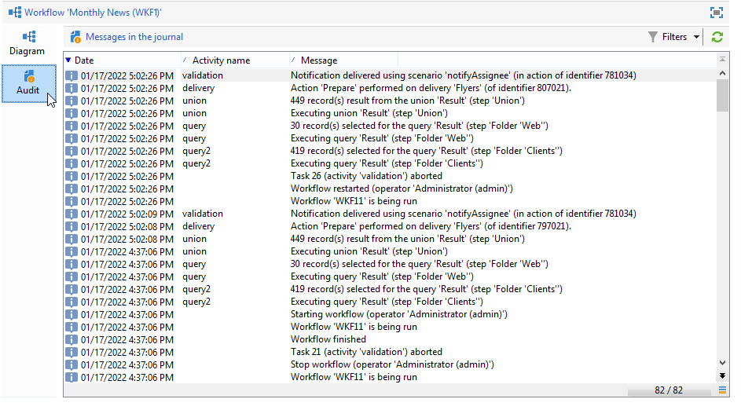

# Workflowuitvoering controleren {#monitoring-workflow-execution}

Deze sectie geeft informatie over hoe te om de uitvoering van uw werkschema&#39;s te controleren.

Een gebruiksgeval op hoe te om een werkschema tot stand te brengen dat u de status van een reeks werkschema&#39;s laat controleren die &quot;gepauzeerd&quot;zijn, &quot;gestopt&quot;of &quot;met fouten&quot;is ook beschikbaar in [ deze sectie ](workflow-supervision.md#supervising-workflows).

Bovendien, kunnen de beheerders van de instantie het **spoor van de Controle** gebruiken om activiteiten en laatste wijzigingen te controleren die aan werkschema&#39;s, de staat van uw werkschema&#39;s worden gedaan. Leer meer over het spoor van de Controle in deze [ pagina ](../../v8/reporting/audit-trail.md){target="_blank"}.

## Voortgang weergeven {#displaying-progress}

U kunt de uitvoering controleren door de voortgang weer te geven met het juiste pictogram op de werkbalk.

Met het pictogram **[!UICONTROL Display progress information]** kunt u de status en het activiteitenresultaat weergeven in het uitvoeringsscherm.


Als deze optie is geselecteerd, worden uitgevoerde activiteiten in blauw weergegeven, knipperende activiteiten in behandeling, worden waarschuwingen in oranje weergegeven en fouten in rood. Met deze optie geeft u ook het resultaat weer van activiteiten bij de uitgaande overgang, gevolgd door het label van het resultaat zoals gedefinieerd in de eigenschappen activity en de duur van de taak als deze langer is dan één seconde


## Logboeken weergeven {#displaying-logs}

Het logbestand bevat de geschiedenis of audittrail van de workflow. Hiermee worden alle gebruikersacties, alle uitgevoerde bewerkingen en aangetroffen fouten geregistreerd. U kunt:

* Selecteer de tab **[!UICONTROL Tracking]** in het detail. Deze lijst bevat alle workflowberichten.

  

* Filter de logboekberichten door activiteit. Klik hiertoe op **[!UICONTROL Display the tasks and the log]** op de werkbalk boven het diagram om de tabbladen **[!UICONTROL Log]** en **[!UICONTROL Tasks]** onder het diagram weer te geven. Selecteer een activiteit om alle verwante berichten te bekijken. Deze lijst bevat alle berichten als er geen activiteit is geselecteerd.

  

  >[!NOTE]
  >
  >Klik op de achtergrond van het diagram om de selectie van alle elementen op te heffen.

* Alleen die berichten weergeven die zijn gekoppeld aan een bepaalde taak. Selecteer hiertoe het tabblad **[!UICONTROL Tasks]** en selecteer vervolgens een activiteit in het diagram om de lijst te beperken. Dubbelklik op een taak om de informatie weer te geven. Het laatste tabblad in het venster bevat het logboek.

  

  Met de knop **[!UICONTROL Details...]** kunt u alle aanvullende informatie over de uitvoering van de activiteit weergeven. U kunt bijvoorbeeld de validatieoperator weergeven en, indien van toepassing, de opmerking die ze tijdens de goedkeuring hebben ingevoerd.

>[!NOTE]
>
>Het logbestand wordt niet gewist wanneer een workflow opnieuw wordt gestart. Alle berichten worden bewaard. Als u de berichten van een vorige uitvoering wilt verwijderen, moet u de geschiedenis wissen.

Het logboek toont de chronologische lijst van uitvoeringsberichten met betrekking tot het richten van werkschemaactiviteiten.

* Logboek van een doelgerichte campagne

  Nadat een doelcampagne is uitgevoerd, klikt u op de tab **[!UICONTROL Tracking]** om de uitvoeringstrace weer te geven.

  

  Alle campagneberichten worden getoond: campagnes worden uitgevoerd evenals waarschuwingen of fouten.

* Logboek van een activiteit

  U kunt het uitvoeringslogboek en de details van elke activiteit ook bekijken. Er zijn twee manieren om dit te doen:

   1. Selecteer de doelactiviteit en klik op het pictogram **[!UICONTROL Display the tasks and the log]** .

      

      De onderste sectie van het diagram toont twee lusjes: Logboek en Taken.

      De activiteiten die binnen het diagram worden geselecteerd handelen als filters op het logboek en de taaklijst.

      

   1. Klik met de rechtermuisknop op de doelactiviteit en selecteer **[!UICONTROL Display logs]** .

      

      Het logboek wordt getoond in een afzonderlijk venster.

## De logbestanden leegmaken {#purging-the-logs}

De historie van de workflow wordt niet automatisch gewist: alle berichten worden standaard bijgehouden. De geschiedenis kan worden gewist via het menu **[!UICONTROL File > Actions]** of door op de knop **[!UICONTROL Actions]** op de werkbalk boven de lijst te klikken. Selecteer **[!UICONTROL Purge history]**. De opties beschikbaar in het **[!UICONTROL Actions]** menu worden gedetailleerd in de [ werkbalk van Acties ](start-a-workflow.md) sectie.


## Worktables and workflow schema {#worktables-and-workflow-schema}

De workflow geeft worktables weer die via bepaalde activiteiten kunnen worden bewerkt. Met Adobe Campaign kunt u via gegevensbeheeractiviteiten de kolommen van workflows aanpassen, hernoemen en verrijken, bijvoorbeeld om ze aan te passen aan de nomenclatuur afhankelijk van de behoeften van de klant, om aanvullende informatie te verzamelen over de co-begunstigde van een contract, enz.

Het is ook mogelijk om verbindingen tussen diverse het werkdimensies tot stand te brengen en afmetingsveranderingen te bepalen. Voor elk contract dat bijvoorbeeld in de database is opgenomen, richt u zich tot de hoofdhouder en gebruikt u de gegevens van de medehouder in de aanvullende informatie.

De werktafels van de workflow worden automatisch verwijderd wanneer de workflow wordt gepassiveerd. Als u wenst om een het werklijst te houden, bewaar het in een lijst via de **[!UICONTROL List update]** activiteit (verwijs naar [ update van de Lijst ](list-update.md)).

## Fouten beheren {#managing-errors}

Wanneer een fout optreedt, wordt de werkstroom gepauzeerd en wordt de activiteit uitgevoerd wanneer de fout optrad met rood. In het workflowoverzicht kunt u onder de koppeling **[!UICONTROL Monitoring]** tab - **[!UICONTROL Workflows]** alleen werkstromen met fouten weergeven, zoals hieronder wordt weergegeven.


In Adobe Campaign Explorer wordt standaard een kolom **[!UICONTROL Failed]** weergegeven in de workflowlijst.


Wanneer een workflow een fout bevat, worden de operatoren die tot de groep voor workflowtoezicht behoren, via e-mail op de hoogte gebracht, zolang hun e-mailadres in hun profiel wordt vermeld. Deze groep is geselecteerd in het veld **[!UICONTROL Supervisor(s)]** van de workfloweigenschappen.


De inhoud van het bericht wordt geconfigureerd in de standaardsjabloon **[!UICONTROL Workflow manager notification]** : deze sjabloon wordt geselecteerd op het tabblad **[!UICONTROL Execution]** van de workfloweigenschappen. In het bericht wordt de naam van de foutworkflow en de betreffende taak weergegeven.

Voorbeeld van melding:


Met de koppeling hebt u toegang tot de Adobe Campaign Client Console in de webmodus en kunt u werken aan de foutworkflow nadat u zich hebt aangemeld.


U kunt de workflow zodanig configureren dat deze niet wordt onderbroken en verder wordt uitgevoerd in het geval van fouten. Hiervoor bewerkt u de workflow **[!UICONTROL Properties]** en selecteert u in de **[!UICONTROL Error management]** -sectie de optie **[!UICONTROL Ignore]** in het **[!UICONTROL In case of error]** -veld. Vervolgens kunt u opgeven hoeveel opeenvolgende fouten kunnen worden genegeerd voordat het proces wordt gepauzeerd.

In dit geval wordt de fouttaak afgebroken. Deze modus is vooral geschikt voor workflows die zijn ontworpen om de campagne later weer te geven (periodieke acties).


>[!NOTE]
>
>U kunt deze configuratie afzonderlijk toepassen voor elke activiteit. Hiervoor bewerkt u de eigenschappen van de activiteit en selecteert u de modus voor foutbeheer op het tabblad **[!UICONTROL Advanced]** .

## Verwerkingsfouten {#processing-errors}

Met betrekking tot activiteiten geeft de optie **[!UICONTROL Process errors]** een specifieke overgang weer die wordt ingeschakeld als een fout wordt gegenereerd. In dit geval gaat de workflow niet naar de foutmodus en gaat de uitvoering verder.

Fouten waarmee rekening wordt gehouden, zijn fouten in het bestandssysteem (het bestand kan niet worden verplaatst, de map kan niet worden geopend, enz.).

Deze optie verwerkt geen fouten met betrekking tot activiteitsconfiguratie, d.w.z. ongeldige waarden. Fouten met betrekking tot een onjuiste configuratie maken deze overgang niet mogelijk (map bestaat niet, enz.).

Als een werkstroom wordt gepauzeerd (handmatig of automatisch na een fout), start de knop **[!UICONTROL Start]** de werkstroomuitvoering opnieuw op de plaats waar deze is gestopt. De foutieve activiteit (of gepauzeerde activiteit) wordt opnieuw uitgevoerd. De vorige activiteiten worden niet opnieuw uitgevoerd.

Gebruik de knop **[!UICONTROL Restart]** om alle workflowactiviteiten opnieuw uit te voeren.

Als u activiteiten wijzigt die al werden uitgevoerd, worden de wijzigingen niet in aanmerking genomen wanneer de werkstroom opnieuw wordt uitgevoerd.

Als u niet-uitgevoerde activiteiten wijzigt, wordt hiermee rekening gehouden wanneer de werkstroom opnieuw wordt uitgevoerd.

Als u gepauzeerde activiteiten wijzigt, kunnen de wijzigingen niet correct worden doorgevoerd wanneer de workflow opnieuw wordt gestart.

Indien mogelijk raden we u aan de workflow opnieuw te starten nadat u wijzigingen hebt aangebracht.

## Instantie controleren {#instance-supervision}

Op de pagina **[!UICONTROL Instance supervision]** kunt u de Adobe Campaign-serveractiviteit weergeven en een lijst met workflows en leveringen met fouten weergeven.

Ga naar de tab **[!UICONTROL Monitoring]** en klik op de koppeling **[!UICONTROL General view]** om deze pagina te openen.


Klik op de koppeling **[!UICONTROL Workflows]** om alle workflows weer te geven. Gebruik de vervolgkeuzelijst om de workflows op het platform weer te geven op basis van hun status.


Klik op de koppeling in een workflow met fouten om deze te openen en het bijbehorende logboek weer te geven.


## Meerdere uitvoeringen voorkomen {#preventing-simultaneous-multiple-executions}

Eén workflow kan meerdere uitvoeringen tegelijk uitvoeren. In sommige gevallen moet u dit voorkomen.

Bijvoorbeeld, kunt u een planner hebben die de werkschemauitvoering elk uur teweegbrengt, maar soms neemt de uitvoering van het volledige werkschema meer dan een uur. U kunt de uitvoering overslaan als de workflow al wordt uitgevoerd.

Als u een signaalactiviteit aan het begin van het werkschema hebt kunt u het signaal willen overslaan als het werkschema loopt.

Het algemene beginsel is als volgt:


De oplossing is een instantievariabele te gebruiken. Instantievariabelen worden gedeeld door alle parallelle uitvoeringen van de workflows.

Hier volgt een eenvoudige testworkflow:


De **[!UICONTROL Scheduler]** activeert elke minuut een gebeurtenis. De volgende **[!UICONTROL Test]** activiteit gaat de **isRunning** instantievariabele testen om al dan niet te besluiten om de uitvoering voort te zetten:


>[!NOTE]
>
>**isRunning** is een veranderlijke naam die voor dit voorbeeld wordt gekozen. Dit is geen ingebouwde variabele.

De activiteit onmiddellijk na **[!UICONTROL Test]** in **ja** tak moet de instantievariabele in zijn **manuscript van de Initialisatie** plaatsen:

```
instance.vars.isRunning = true
```

De allerlaatste activiteit in **ja** tak moet de variabele aan vals in zijn **manuscript van de Initialisatie** terugkeren:

```
instance.vars.isRunning = false
```

Let op:

* U kunt de huidige waarde van de instantievariabele via het **lusje van Variabelen** in het werkschema **Eigenschappen** controleren.
* Instantievariabelen worden opnieuw ingesteld wanneer u een workflow opnieuw start.
* In JavaScript is een ongedefinieerde waarde false in een test, zodat de instantievariabele ook kan worden getest voordat deze is geïnitialiseerd.
* U kunt de activiteiten controleren die niet wegens dit mechanisme door een registrereninstructie aan het initialiseringsmanuscript van &quot;geen&quot;beëindigend worden verwerkt toe te voegen.

  ```
  logInfo("Workflow already running, parallel execution not allowed.");
  ```

Een gebruiksgeval wordt voorgesteld in deze sectie: [ Coördinerend gegevensupdates ](coordinate-data-updates.md).

## Database-onderhoud {#database-maintenance}

Workflows gebruiken veel werktabellen die ruimte verbruiken en het hele platform vertragen als het niet wordt onderhouden.

De **schoonmaakbeurt van het Gegevensbestand** werkschema toegankelijk via het **Beleid > Productie > Technische werkschema&#39;s** knoop, laat u verouderde gegevens schrappen om exponentiële groei van het gegevensbestand te vermijden. De workflow wordt automatisch geactiveerd zonder tussenkomst van de gebruiker.

U kunt ook specifieke technische workflows maken om overbodige gegevensverbruikende ruimte te wissen. Zie   en deze [ sectie ](#purging-the-logs).

## Afhandeling van gepauzeerde workflows {#handling-of-paused-workflows}

Als een werkstroom wordt gepauzeerd, worden de werktabellen standaard niet gewist. Vanaf build 8880 worden workflows die al te lang in een pauzestatus zijn gepauzeerd, automatisch gestopt en worden hun werktabellen gewist. Dit gedrag wordt als volgt geactiveerd:

* De werkschema&#39;s die sinds meer dan 7 dagen zijn gepauzeerd verschijnen als waarschuwing in het controledashboard (en controle API) en een bericht wordt verzonden naar de supervisorgroep.
* Dit gebeurt elke week, wanneer de **[!UICONTROL cleanupPausedWorkflows]** technische workflow wordt geactiveerd. Voor meer details over het werkschema, verwijs naar [ deze sectie ](delivery.md).
* Na 4 meldingen (dat wil zeggen een maand in de pauzestatus) wordt de workflow onvoorwaardelijk gestopt. Er wordt een logboek weergegeven in de workflow nadat het is gestopt. De tabellen worden gewist bij de volgende **[!UICONTROL cleanup]** uitvoeringsworkflow

Deze periodes kunnen via de optie NmsServer_PausedWorkflowPeriod worden gevormd.

Workflowtoezichthouders worden op de hoogte gesteld. De maker en laatste gebruiker die de workflow heeft gewijzigd, wordt ook op de hoogte gesteld. Beheerders ontvangen de meldingen niet.

## Workflows filteren op basis van hun status {#filtering-workflows-status}

De interface van Campaign Classic staat u toe om de uitvoeringsstatus van alle werkschema&#39;s op uw instantie te controleren gebruikend vooraf bepaalde **meningen**. Open het knooppunt **[!UICONTROL Administration]** / **[!UICONTROL Audit]** / **[!UICONTROL Workflows Status]** om deze weergaven te openen.

De volgende weergaven zijn beschikbaar:

* **[!UICONTROL Running]**: geeft een overzicht van alle actieve workflows.
* **[!UICONTROL Paused]**: geeft alle gepauzeerde workflows weer.
* **[!UICONTROL Failed]**: geeft alle mislukte workflows weer.
* ** ).


Deze weergaven zijn standaard toegankelijk in de map **[!UICONTROL Audit]** . U kunt ze echter wel opnieuw maken op de locatie die u kiest in de mappenstructuur. Op deze manier zijn ze beschikbaar voor standaardgebruikers zonder beheerrechten.

Dit doet u als volgt:

1. Klik met de rechtermuisknop op de map waaraan u de weergave wilt toevoegen.
1. Selecteer in **[!UICONTROL Add new folder]** / **[!UICONTROL Administration]** de weergave die u wilt toevoegen.
1. Nadat de map aan de structuur is toegevoegd, configureert u deze als een weergave, zodat alle workflows worden weergegeven, ongeacht de oorspronkelijke map. Voor meer op hoe te om meningen te vormen, verwijs naar [ deze pagina ](../../v8/audiences/folders-and-views.md#turn-a-folder-to-a-view).

Naast deze weergaven kunt u ook mappen met filters instellen waarmee u de lijst met workflows kunt filteren op basis van hun uitvoeringsstatus. Dit doet u als volgt:

1. Open een map van het type workflow en selecteer vervolgens het menu **[!UICONTROL Filters]** / **[!UICONTROL Advanced filter]** .
1. Configureer het filter zodanig dat het veld **[!UICONTROL @status]** van de workflow gelijk is aan de status van uw keuze.
1. Sla het filter op en geef het een naam. Deze functie is dan rechtstreeks beschikbaar in de lijst met filters.


Raadpleeg de volgende secties voor meer informatie:
