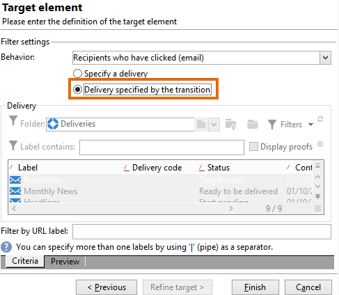

# Een query uitvoeren op de leveringssinformatie {#querying-delivery-information}

## Aantal klikken voor een specifieke levering {#number-of-clicks-for-a-specific-delivery}

In dit voorbeeld, kijken wij terug het aantal klikken voor een specifieke levering. Deze kliks worden geregistreerd dankzij ontvankelijke die logboeken volgen over een bepaalde periode worden genomen. De ontvanger wordt geïdentificeerd via zijn e-mailadres. Deze query gebruikt de tabel **[!UICONTROL Recipient tracking logs]** .

* Welke tabel moet worden geselecteerd?

  De tabel voor bijhouden van het logboek van ontvangers (**[!UICONTROL nms:trackingLogRcp]**)

* Velden die moeten worden geselecteerd voor uitvoerkolommen?

  Primaire sleutel (met aantal) en E-mail

* Op basis van welke criteria wordt de informatie gefilterd?

  Een specifieke periode en een element van het leveringsetiket

Voer de volgende stappen uit om dit voorbeeld uit te voeren:

1. Open **[!UICONTROL Generic query editor]** en selecteer het **[!UICONTROL Recipient tracking logs]** schema.

   

1. In het venster **[!UICONTROL Data to extract]** willen we een aggregaat maken om informatie te verzamelen. Hiervoor voegt u de primaire sleutel toe (boven het hoofdelement **[!UICONTROL Recipient tracking logs]** ): het bijhouden van het aantal logbestanden wordt uitgevoerd in dit **[!UICONTROL Primary key]** -veld. De bewerkte expressie zal **[!UICONTROL x=count(primary key)]** zijn. De som van de verschillende trackinglogboeken wordt aan één e-mailadres gekoppeld.

   Dit doet u als volgt:

   * Klik op het pictogram **[!UICONTROL Add]** rechts van het veld **[!UICONTROL Output columns]** . Selecteer in het **[!UICONTROL Formula type]** -venster de optie **[!UICONTROL Edit the formula using an expression]** en klik op **[!UICONTROL Next]** . Klik in het **[!UICONTROL Field to select]** -venster op **[!UICONTROL Advanced selection]** .

     

   * Voer in het **[!UICONTROL Formula type]** -venster een proces uit op de statistische functie. Dit proces zal een primaire zeer belangrijke telling zijn.

     Selecteer **[!UICONTROL Process on an aggregate function]** in de **[!UICONTROL Aggregate]** -sectie en klik op **[!UICONTROL Count]** .

     

     Klik op **[!UICONTROL Next]**.

   * Selecteer het veld **[!UICONTROL Primary key (@id)]** . De uitvoerkolom **[!UICONTROL count (primary key)]** is geconfigureerd.

     

1. Selecteer het andere veld dat in de uitvoerkolom moet worden weergegeven. Open in de kolom **[!UICONTROL Available fields]** het knooppunt **[!UICONTROL Recipient]** en kies **[!UICONTROL Email]** . Schakel het selectievakje **[!UICONTROL Group]** naar **[!UICONTROL Yes]** in om de trackinglogboeken te groeperen op e-mailadres: deze groep koppelt elk logboek aan de ontvanger.

   

1. Vorm kolomsortering zodat de actiefste ontvangers (met de meeste het volgen logboeken) eerst worden getoond. Controleer **[!UICONTROL Yes]** in de kolom **[!UICONTROL Descending sort]** .

   

1. Vervolgens filtert u de logboeken die u interesseert, dat wil zeggen de logboeken die jonger zijn dan twee weken en die betrekking hebben op leveranties.

   Dit doet u als volgt:

   * Gegevensfiltering configureren. Selecteer hiervoor **[!UICONTROL Filter conditions]** en klik op **[!UICONTROL Next]** .

     

   * Herstel het volgen logboeken over een bepaalde periode voor een specifieke levering. Er zijn drie filtervoorwaarden nodig: twee datumvoorwaarden om de zoekperiode in te stellen tussen twee weken vóór de huidige datum en de dag vóór de huidige datum, en een andere voorwaarde om de zoekopdracht te beperken tot een bepaalde levering.

     Configureer in het **[!UICONTROL Target element]** -venster de datum vanaf wanneer er rekening wordt gehouden met trackinglogboeken. Klik op **[!UICONTROL Add]**. Er wordt een voorwaardelijn weergegeven. Bewerk de kolom **[!UICONTROL Expression]** door op de functie **[!UICONTROL Edit expression]** te klikken. Kies **[!UICONTROL Date (@logDate)]** in het **[!UICONTROL Field to select]** -venster.

     

     Selecteer de operator **[!UICONTROL greater than]** . Klik in de kolom **[!UICONTROL Value]** op **[!UICONTROL Edit expression]** en selecteer **[!UICONTROL Process on dates]** in het venster **[!UICONTROL Formula type]** . Voer in **[!UICONTROL Current date minus n days]** ten slotte &quot;15&quot; in.

     Klik op **[!UICONTROL Finish]**.

     

   * Als u de einddatum van het zoeken van het trackinglogboek wilt selecteren, maakt u een tweede voorwaarde door op **[!UICONTROL Add]** te klikken. Kies nogmaals **[!UICONTROL Date (@logDate)]** in de kolom **[!UICONTROL Expression]** .

     Selecteer de operator **[!UICONTROL less than]** . Klik in de kolom **[!UICONTROL Value]** op **[!UICONTROL Edit expression]** . Ga voor datumverwerking naar het venster **[!UICONTROL Formula type]** en voer &quot;1&quot; in **[!UICONTROL Current date minus n days]** in.

     Klik op **[!UICONTROL Finish]**.

     

     Nu willen wij de derde filtervoorwaarde, d.w.z. het leveringsetiket vormen dat onze vraag betrekking heeft.

   * Klik op de functie **[!UICONTROL Add]** om een andere filtervoorwaarde te maken. Klik in de kolom **[!UICONTROL Expression]** op **[!UICONTROL Edit expression]** . Kies in het **[!UICONTROL Field to select]** -venster **[!UICONTROL Label]** in het **[!UICONTROL Delivery]** -knooppunt.

     Klik op **[!UICONTROL Finish]**.

     

     Zoek naar een levering die het woord &quot;verkoop&quot;bevat. Aangezien u het exacte label niet meer onthoudt, kunt u de operator **[!UICONTROL contains]** kiezen en &quot;sales&quot; invoeren in de kolom **[!UICONTROL Value]** .

     

1. Klik op **[!UICONTROL Next]** totdat u naar het **[!UICONTROL Data preview]** -venster gaat: hier is geen opmaak nodig.
1. Klik in het **[!UICONTROL Data preview]** -venster op **[!UICONTROL Start the preview of the data]** om het aantal trackinglogboeken voor elke ontvanger van de levering weer te geven.

   Het resultaat wordt in aflopende volgorde weergegeven.

   

   Het hoogste aantal logboeken voor een gebruiker is 6 voor deze levering. Vijf verschillende gebruikers hebben het bezorgingsbericht geopend of op een van de koppelingen in het e-mailbericht geklikt.

## Ontvangers die geen levering hebben geopend {#recipients-who-did-not-open-any-delivery}

In dit voorbeeld willen we ontvangers filteren die de afgelopen 7 dagen geen e-mail hebben geopend.

U kunt dit voorbeeld maken door de volgende stappen toe te passen:

1. Sleep een **[!UICONTROL Query]** -activiteit naar een werkstroom en open de activiteit.
1. Klik op **[!UICONTROL Edit query]** en stel de doel- en filterafmetingen in op **[!UICONTROL Recipients]** .

   

1. Selecteer **[!UICONTROL Filtering conditions]** en klik op **[!UICONTROL Next]** .
1. Klik op **[!UICONTROL Add]** en selecteer **[!UICONTROL Tracking logs]** .
1. Stel de **[!UICONTROL Operator]** van de **[!UICONTROL Tracking logs]** expressie in op **[!UICONTROL Do not exist such as]** .

   

1. Voeg nog een expressie toe. Selecteer **[!UICONTROL Type]** in de categorie **[!UICONTROL URL]** .
1. Stel vervolgens de **[!UICONTROL Operator]** in op **[!UICONTROL equal to]** en de **[!UICONTROL Value]** op **[!UICONTROL Open]** .

   

1. Voeg nog een expressie toe en selecteer **[!UICONTROL Date]** . **[!UICONTROL Operator]** moet worden ingesteld op **[!UICONTROL on or after]** .

   

1. Als u de waarde in het veld  wilt instellen, klikt u op de knop **[!UICONTROL Edit expression]** in het veld **[!UICONTROL Value]** .
1. Selecteer **[!UICONTROL Current date minus n days]** in de categorie **[!UICONTROL Function]** en voeg het aantal dagen toe dat u als doel wilt instellen. Hier willen we ons richten op de laatste 7 dagen.

   

De uitgaande overgang bevat ontvangers die de afgelopen 7 dagen geen e-mail hebben geopend.

Als u daarentegen ontvangers wilt filteren die ten minste één e-mail hebben geopend, moet uw query er als volgt uitzien. Houd er rekening mee dat in dit geval de **[!UICONTROL Filtering dimension]** moet worden ingesteld op **[!UICONTROL Tracking logs (Recipients)]** .

## Ontvangers die een levering hebben geopend {#recipients-who-have-opened-a-delivery}

In het volgende voorbeeld ziet u hoe u zich kunt richten op profielen die de levering in de afgelopen twee weken hebben geopend:

1. Als u profielen wilt aanwijzen die een levering hebben geopend, moet u trackinglogboeken gebruiken. ze worden opgeslagen in een gekoppelde tabel: selecteer eerst deze tabel in de vervolgkeuzelijst van het veld **[!UICONTROL Filtering dimension]** , zoals hieronder wordt weergegeven:

   

1. Voor filtervoorwaarden klikt u op het pictogram **[!UICONTROL Edit expression]** van de criteria die worden weergegeven in de subboomstructuur van de logbestanden voor bijhouden. Selecteer het veld **[!UICONTROL Date]** .

   

   Klik op **[!UICONTROL Finish]** om de selectie te bevestigen.

   Selecteer de operator **[!UICONTROL Greater than]** om alleen de traceringslogboeken van minder dan twee weken te herstellen.

   

   Klik vervolgens op het pictogram **[!UICONTROL Edit expression]** in de kolom **[!UICONTROL Value]** om de toe te passen berekeningsformule te definiëren. Selecteer de formule **[!UICONTROL Current date minus n days]** en voer 15 in het verwante veld in.

   

   Klik op de knop **[!UICONTROL Finish]** van het formulevenster. Klik in het filtervenster op de tab **[!UICONTROL Preview]** om de criteria voor het toewijzen van doelen te controleren.

   

## Gedrag van ontvangers filteren na levering {#filtering-recipients--behavior-folllowing-a-delivery}

In een workflow kunt u met de vakken **[!UICONTROL Query]** en **[!UICONTROL Split]** een gedrag selecteren dat volgt op een eerdere levering. Deze selectie wordt uitgevoerd via het filter **[!UICONTROL Delivery recipient]** .

* Doel van het voorbeeld

  In een leveringswerkstroom zijn er verschillende manieren om een eerste e-mailcommunicatie te volgen. Bij dit type bewerking wordt het vak **[!UICONTROL Split]** gebruikt.

* Context

  Er wordt een aanbod voor de zomersport verzonden. Vier dagen na de levering worden twee andere leveringen verzonden. Een daarvan is &quot;watersportaanbod&quot;, het andere is een follow-up van het eerste aanbod voor de zomersport.

  De levering &quot;Watersportaanbod&quot; wordt verzonden naar ontvangers die bij de eerste levering op de link &quot;Watersport&quot; hebben geklikt. Deze kliks tonen aan dat de ontvanger in het onderwerp geinteresseerd is. Het heeft zin om ze naar soortgelijke aanbiedingen te sturen. Ontvangers die niet op het zomersportaanbod hebben geklikt, krijgen echter weer dezelfde inhoud.

In de volgende stappen wordt getoond hoe u het vak **[!UICONTROL Split]** kunt configureren door twee verschillende gedragingen te integreren:

1. Voeg het vak **[!UICONTROL Split]** in de workflow in. Deze doos zal de ontvangers van de eerste levering in de volgende twee leveringen verdelen. De onderbreking komt voor gebaseerd op de het filtreren voorwaarden verbonden aan ontvankelijk gedrag tijdens de eerste levering.

   

1. Open het vak **[!UICONTROL Split]** . In het **[!UICONTROL General]** lusje, ga een etiket in: **Splitst die op gedrag** wordt gebaseerd bijvoorbeeld.

   

1. Definieer op het tabblad **[!UICONTROL Subsets]** de eerste gesplitste vertakking. Bijvoorbeeld, ga het **Geklikte** etiket voor deze tak in.
1. Selecteer de optie **[!UICONTROL Add a filtering condition on the incoming population]** . Klik op **[!UICONTROL Edit]**.
1. Dubbelklik in het venster **[!UICONTROL Targeting and filtering dimension]** op het filter **[!UICONTROL Recipients of a delivery]** .

   

1. Selecteer in het **[!UICONTROL Target element]** -venster het gedrag dat u op deze vertakking wilt toepassen: **[!UICONTROL Recipients having clicked (email)]** .

   Selecteer hieronder de optie **[!UICONTROL Delivery specified by the transition]** . Deze functionaliteit zal automatisch de mensen herstellen die tijdens de eerste levering worden gericht.

   Dit is de levering van het &quot;Watersportaanbod&quot;.

   

1. De tweede vertakking definiëren. Deze vertakking bevat het e-mailbericht met dezelfde inhoud als voor de eerste levering. Ga naar de tab **[!UICONTROL Subsets]** en klik op **[!UICONTROL Add]** om deze te maken.

   

1. Er wordt een ander subtabblad weergegeven. Noem het &quot;**klikte niet**&quot;.
1. Klik op **[!UICONTROL Add a filtering condition for the incoming population]**. Klik vervolgens op **[!UICONTROL Edit...]**.

   

1. Klik op **[!UICONTROL Delivery recipients]** in het **[!UICONTROL Targeting and filtering dimension]** -venster.
1. Selecteer in het **[!UICONTROL Target element]** -venster het gedrag **[!UICONTROL Recipients who did not click (email)]** . Selecteer de optie **[!UICONTROL Delivery specified by the transition]** zoals deze voor de laatste vertakking wordt weergegeven.

   De box **[!UICONTROL Split]** is nu volledig geconfigureerd.

   

Hieronder ziet u de lijst met de diverse componenten die standaard zijn geconfigureerd:

* **[!UICONTROL All recipients]**
* **[!UICONTROL Recipients of successfully sent messages,]**
* **[!UICONTROL Recipients who opened or clicked (email),]**
* **[!UICONTROL Recipients who clicked (email),]**
* **[!UICONTROL Recipients of a failed message,]**
* **[!UICONTROL Recipients who didn't open or click (email),]**
* **[!UICONTROL Recipients who didn't click (email).]**

  
