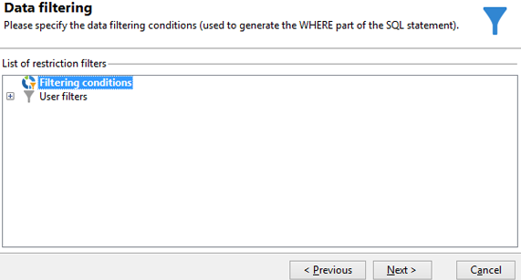

# Een query uitvoeren op de leveringssinformatie {#querying-delivery-information}

## Aantal klikken voor een specifieke levering {#number-of-clicks-for-a-specific-delivery}

In dit voorbeeld, kijken wij terug het aantal klikken voor een specifieke levering. Deze kliks worden geregistreerd dankzij ontvankelijke die logboeken volgen over een bepaalde periode worden genomen. De ontvanger wordt geïdentificeerd via zijn e-mailadres. Deze query gebruikt de **[!UICONTROL Recipient tracking logs]** tabel.

* Welke tabel moet worden geselecteerd?

   De tabel met het bijhouden van het logboek van de ontvanger (**[!UICONTROL nms:trackingLogRcp]**)

* Velden die moeten worden geselecteerd voor uitvoerkolommen?

   Primaire sleutel (met aantal) en E-mail

* Op basis van welke criteria wordt de informatie gefilterd?

   Een specifieke periode en een element van het leveringsetiket

Voer de volgende stappen uit om dit voorbeeld uit te voeren:

1. Open de **[!UICONTROL Generic query editor]** en selecteert u de **[!UICONTROL Recipient tracking logs]** schema.

   

1. In de **[!UICONTROL Data to extract]** -venster, willen we een aggregaat maken om informatie te verzamelen. Hiervoor voegt u de primaire sleutel toe (boven de hoofdtoets) **[!UICONTROL Recipient tracking logs]** element): Op deze manier wordt het bijhouden van het logbestand uitgevoerd **[!UICONTROL Primary key]** veld. De bewerkte expressie wordt **[!UICONTROL x=count(primary key)]**. De som van de verschillende trackinglogboeken wordt aan één e-mailadres gekoppeld.

   Dit doet u als volgt:

   * Klik op de knop **[!UICONTROL Add]** pictogram rechts van **[!UICONTROL Output columns]** veld. In de **[!UICONTROL Formula type]** venster, selecteert u de **[!UICONTROL Edit the formula using an expression]** en klik op **[!UICONTROL Next]**. In de **[!UICONTROL Field to select]** venster, klikt u op **[!UICONTROL Advanced selection]**.

      

   * In de **[!UICONTROL Formula type]** -venster, voert u een proces uit op de statistische functie. Dit proces zal een primaire zeer belangrijke telling zijn.

      Selecteren **[!UICONTROL Process on an aggregate function]** in de **[!UICONTROL Aggregate]** en klik op **[!UICONTROL Count]**.

      

      Klik op **[!UICONTROL Next]**.

   * Selecteer **[!UICONTROL Primary key (@id)]** veld. De **[!UICONTROL count (primary key)]** de outputkolom wordt gevormd.

      

1. Selecteer het andere veld dat in de uitvoerkolom moet worden weergegeven. In de **[!UICONTROL Available fields]** kolom, opent u de **[!UICONTROL Recipient]** knooppunt en kies **[!UICONTROL Email]**. Controleer de **[!UICONTROL Group]** vak naar **[!UICONTROL Yes]** om de trackinglogboeken te groeperen op e-mailadres: deze groep verbindt elk logboek aan zijn ontvanger.

   

1. Vorm kolomsortering zodat de actiefste ontvangers (met de meeste het volgen logboeken) eerst worden getoond. Controleren **[!UICONTROL Yes]** in de **[!UICONTROL Descending sort]** kolom.

   

1. Vervolgens filtert u de logboeken die u interesseert, dat wil zeggen de logboeken die jonger zijn dan twee weken en die betrekking hebben op leveranties.

   Dit doet u als volgt:

   * Gegevensfiltering configureren. Selecteer **[!UICONTROL Filter conditions]** klik vervolgens op **[!UICONTROL Next]**.

      

   * Herstel het volgen logboeken over een bepaalde periode voor een specifieke levering. Er zijn drie filtervoorwaarden nodig: twee datumvoorwaarden om de zoekperiode in te stellen tussen twee weken vóór de huidige datum en de dag vóór de huidige datum; en een andere voorwaarde om de zoekopdracht te beperken tot een bepaalde levering.

      In de **[!UICONTROL Target element]** , vormt de datum die begint waarmee de volgende logboeken in aanmerking zullen worden genomen. Klik op **[!UICONTROL Add]**. Er wordt een voorwaardelijn weergegeven. Bewerk de **[!UICONTROL Expression]** kolom door op de knop **[!UICONTROL Edit expression]** functie. In de **[!UICONTROL Field to select]** venster, kiest u **[!UICONTROL Date (@logDate)]**.

      

      Selecteer **[!UICONTROL greater than]** operator. In de **[!UICONTROL Value]** kolom, klikt u op **[!UICONTROL Edit expression]** en in de **[!UICONTROL Formula type]** venster, selecteert u **[!UICONTROL Process on dates]**. Tot slot, in **[!UICONTROL Current date minus n days]**, typt u &quot;15&quot;.

      Klik op **[!UICONTROL Finish]**.

      

   * Als u de einddatum van de zoekopdracht in het trackinglogboek wilt selecteren, maakt u een tweede voorwaarde door op **[!UICONTROL Add]**. In de **[!UICONTROL Expression]** kolom, kies **[!UICONTROL Date (@logDate)]** opnieuw.

      Selecteer **[!UICONTROL less than]** operator. In de **[!UICONTROL Value]** kolom, klikt u op **[!UICONTROL Edit expression]**. Ga voor datumverwerking naar de **[!UICONTROL Formula type]** venster, typ &quot;1&quot; in **[!UICONTROL Current date minus n days]**.

      Klik op **[!UICONTROL Finish]**.

      

      Nu willen wij de derde filtervoorwaarde, d.w.z. het leveringsetiket vormen dat onze vraag betrekking heeft.

   * Klik op de knop **[!UICONTROL Add]** om een andere filtervoorwaarde te maken. In de **[!UICONTROL Expression]** kolom, klikt u op **[!UICONTROL Edit expression]**. In de **[!UICONTROL Field to select]** venster, kiest u **[!UICONTROL Label]** in de **[!UICONTROL Delivery]** knooppunt.

      Klik op **[!UICONTROL Finish]**.

      

      Zoek naar een levering die het woord &quot;verkoop&quot;bevat. Omdat u het exacte label niet meer onthoudt, kunt u de optie **[!UICONTROL contains]** en &quot;verkoop&quot; in het **[!UICONTROL Value]** kolom.

      

1. Klikken **[!UICONTROL Next]** totdat u de **[!UICONTROL Data preview]** venster: hier is geen opmaak nodig .
1. In de **[!UICONTROL Data preview]** venster, klikt u op **[!UICONTROL Start the preview of the data]** om het aantal het volgen logboeken voor elke leveringsontvanger te zien.

   Het resultaat wordt in aflopende volgorde weergegeven.

   

   Het hoogste aantal logboeken voor een gebruiker is 6 voor deze levering. Vijf verschillende gebruikers hebben het bezorgingsbericht geopend of op een van de koppelingen in het e-mailbericht geklikt.

## Ontvangers die geen levering hebben geopend {#recipients-who-did-not-open-any-delivery}

In dit voorbeeld willen we ontvangers filteren die de afgelopen 7 dagen geen e-mail hebben geopend.

U kunt dit voorbeeld maken door de volgende stappen toe te passen:

1. Sleep een **[!UICONTROL Query]** activiteit in een werkstroom en open de activiteit.
1. Klikken **[!UICONTROL Edit query]** en stel de doel- en filterafmetingen in op **[!UICONTROL Recipients]**.

   

1. Selecteren **[!UICONTROL Filtering conditions]** klik vervolgens op **[!UICONTROL Next]**.
1. Klik op de knop **[!UICONTROL Add]** en selecteert u **[!UICONTROL Tracking logs]**.
1. Stel de **[!UICONTROL Operator]** van de **[!UICONTROL Tracking logs]** expressie naar **[!UICONTROL Do not exist such as]**.

   

1. Voeg nog een expressie toe. Selecteren **[!UICONTROL Type]** in de **[!UICONTROL URL]** categorie.
1. Stel vervolgens de **[!UICONTROL Operator]** tot **[!UICONTROL equal to]** en **[!UICONTROL Value]** tot **[!UICONTROL Open]**.

   

1. Voeg nog een expressie toe en selecteer **[!UICONTROL Date]**. **[!UICONTROL Operator]** moet worden ingesteld op **[!UICONTROL on or after]**.

   

1. Als u de waarde wilt instellen voor de laatste 7 dagen, klikt u op de knop **[!UICONTROL Edit expression]** in de **[!UICONTROL Value]** veld.
1. In de **[!UICONTROL Function]** categorie, selecteert u **[!UICONTROL Current date minus n days]** en voeg het aantal dagen toe dat u als doel wilt instellen. Hier willen we ons richten op de laatste 7 dagen.

   

De uitgaande overgang bevat ontvangers die de afgelopen 7 dagen geen e-mail hebben geopend.

Als u daarentegen ontvangers wilt filteren die ten minste één e-mail hebben geopend, moet uw query er als volgt uitzien. Let op: in dit geval **[!UICONTROL Filtering dimension]** moet worden ingesteld op **[!UICONTROL Tracking logs (Recipients)]**.

## Ontvangers die een levering hebben geopend {#recipients-who-have-opened-a-delivery}

In het volgende voorbeeld ziet u hoe u zich kunt richten op profielen die de levering in de afgelopen twee weken hebben geopend:

1. Als u profielen wilt aanwijzen die een levering hebben geopend, moet u trackinglogboeken gebruiken. ze worden opgeslagen in een gekoppelde tabel: Selecteer deze tabel in de vervolgkeuzelijst van het dialoogvenster **[!UICONTROL Filtering dimension]** veld, zoals hieronder weergegeven:

   

1. Klik op de knop **[!UICONTROL Edit expression]** pictogram van de criteria die in de subboomstructuur van het volgende logbestand worden getoond. Selecteer **[!UICONTROL Date]** veld.

   

   Klikken **[!UICONTROL Finish]** om de selectie te bevestigen.

   Als u alleen de trackinglogboeken van minder dan twee weken oud wilt herstellen, selecteert u de optie **[!UICONTROL Greater than]** operator.

   

   Klik vervolgens op de knop **[!UICONTROL Edit expression]** in het deelvenster **[!UICONTROL Value]** kolom om de toe te passen berekeningsformule te bepalen. Selecteer **[!UICONTROL Current date minus n days]** en voert u 15 in het desbetreffende veld in.

   

   Klik op de knop **[!UICONTROL Finish]** van het formulevenster. Klik in het filtervenster op de knop **[!UICONTROL Preview]** -tab om de criteria voor het opgeven van doelen te controleren.

   

## Gedrag van ontvangers filteren na levering {#filtering-recipients--behavior-folllowing-a-delivery}

In een workflow kunt u de opdracht **[!UICONTROL Query]** en **[!UICONTROL Split]** kunt u een gedrag selecteren na een vorige levering. Deze selectie vindt plaats via de **[!UICONTROL Delivery recipient]** filter.

* Doel van het voorbeeld

   In een leveringswerkstroom zijn er verschillende manieren om een eerste e-mailcommunicatie te volgen. Bij dit type bewerking moet u de opdracht **[!UICONTROL Split]** doos.

* Context

   Er wordt een aanbod voor de zomersport verzonden. Vier dagen na de levering worden twee andere leveringen verzonden. Een daarvan is &quot;watersportaanbod&quot;, de andere is een follow-up van de eerste &quot;Zomersportaanbieding&quot;.

   De levering &quot;Watersportaanbod&quot; wordt verzonden naar ontvangers die bij de eerste levering op de link &quot;Watersport&quot; hebben geklikt. Deze kliks tonen aan dat de ontvanger in het onderwerp geinteresseerd is. Het heeft zin om ze naar soortgelijke aanbiedingen te sturen. Ontvangers die niet op het zomersportaanbod hebben geklikt, krijgen echter weer dezelfde inhoud.

De volgende stappen tonen u hoe te om te vormen **[!UICONTROL Split]** door twee verschillende gedragingen te integreren:

1. Voeg de **[!UICONTROL Split]** in de workflow. Deze doos zal de ontvangers van de eerste levering in de volgende twee leveringen verdelen. De onderbreking komt voor gebaseerd op de het filtreren voorwaarden verbonden aan ontvankelijk gedrag tijdens de eerste levering.

   

1. Open de **[!UICONTROL Split]** doos. In de **[!UICONTROL General]** voert u een label in: **Splitsen op basis van gedrag** bijvoorbeeld.

   

1. In de **[!UICONTROL Subsets]** , definieert u de eerste gesplitste vertakking. Voer bijvoorbeeld de **Geklikt** label voor deze vertakking.
1. Selecteer **[!UICONTROL Add a filtering condition on the incoming population]** optie. Klik op **[!UICONTROL Edit]**.
1. In de **[!UICONTROL Targeting and filtering dimension]** venster, dubbelklikt u op de knop **[!UICONTROL Recipients of a delivery]** filter.

   

1. In de **[!UICONTROL Target element]** selecteert u het gedrag dat u op deze vertakking wilt toepassen: **[!UICONTROL Recipients having clicked (email)]**.

   Selecteer hieronder de **[!UICONTROL Delivery specified by the transition]** optie. Deze functionaliteit zal automatisch de mensen herstellen die tijdens de eerste levering worden gericht.

   Dit is de levering van het &quot;Watersportaanbod&quot;.

   

1. De tweede vertakking definiëren. Deze vertakking bevat de e-mail met follow-up met dezelfde inhoud als voor de eerste levering. Ga naar de **[!UICONTROL Subsets]** en klik op **[!UICONTROL Add]** om het te maken.

   

1. Er wordt een ander subtabblad weergegeven. Geef de naam &quot;**Niet geklikt**&quot;.
1. Klik op **[!UICONTROL Add a filtering condition for the incoming population]**. Klik vervolgens op **[!UICONTROL Edit...]**.

   

1. Klikken **[!UICONTROL Delivery recipients]** in de **[!UICONTROL Targeting and filtering dimension]** venster.
1. In de **[!UICONTROL Target element]** venster, selecteert u de **[!UICONTROL Recipients who did not click (email)]** gedrag. Selecteer **[!UICONTROL Delivery specified by the transition]** zoals getoond voor de laatste tak.

   De **[!UICONTROL Split]** box is nu volledig gevormd.

   

Hieronder ziet u de lijst met de diverse componenten die standaard zijn geconfigureerd:

* **[!UICONTROL All recipients]**
* **[!UICONTROL Recipients of successfully sent messages,]**
* **[!UICONTROL Recipients who opened or clicked (email),]**
* **[!UICONTROL Recipients who clicked (email),]**
* **[!UICONTROL Recipients of a failed message,]**
* **[!UICONTROL Recipients who didn't open or click (email),]**
* **[!UICONTROL Recipients who didn't click (email).]**

   
