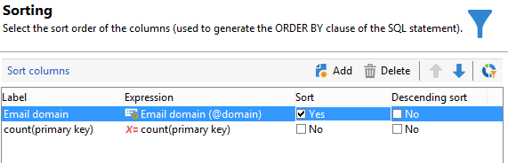

# Een query uitvoeren met behulp van groeperingsbeheer {#querying-using-grouping-management}

In dit voorbeeld willen we een query uitvoeren om alle e-maildomeinen te zoeken die meer dan 30 keer zijn aangewezen tijdens eerdere leveringen.

* Welke tabel moet worden geselecteerd?

  De tabel met ontvangers (nms:ontvanger)

* Velden die moeten worden geselecteerd in uitvoerkolommen?

  E-maildomein en primaire sleutel (met aantal)

* Gegevensgroepering?

  Gebaseerd op e-maildomein met een aantal primaire sleutels boven 30. Deze bewerking wordt uitgevoerd met de optie **[!UICONTROL Group by + Having]** . Met **[!UICONTROL Group by + Having]** kunt u gegevens groeperen (&quot;groeperen voor&quot;) en een selectie maken van gegroepeerd (&quot;hebben&quot;).

U kunt dit voorbeeld maken door de volgende stappen toe te passen:

1. Open **[!UICONTROL Generic query editor]** en kies de Ontvankelijke lijst (**nms:ontvanger**).

   

1. Selecteer in het **[!UICONTROL Data to extract]** -venster de velden **[!UICONTROL Email domain]** en **[!UICONTROL Primary key]** . Een telling uitvoeren op het veld **[!UICONTROL Primary key]** .

1. Schakel het selectievakje **[!UICONTROL Handle groupings (GROUP BY + HAVING)]** in.

   

1. Sorteer de e-maildomeinen in aflopende volgorde in het venster **[!UICONTROL Sorting]** . Hiervoor controleert u **[!UICONTROL Yes]** in de kolom **[!UICONTROL Descending sort]** . Klik op **[!UICONTROL Next]**.

   

1. Selecteer **[!UICONTROL Filtering conditions]** in **[!UICONTROL Data filtering]** . Ga naar het **[!UICONTROL Target elements]** -venster en klik op **[!UICONTROL Next]** .
1. Selecteer in het **[!UICONTROL Data grouping]** -venster de **[!UICONTROL Email domain]** door op **[!UICONTROL Add]** te klikken.

   Dit venster voor gegevensgroepering wordt alleen weergegeven als het vak **[!UICONTROL Handle groupings (GROUP BY + HAVING]** ) is ingeschakeld.

   

1. Geef in het venster **[!UICONTROL Grouping condition]** een aantal primaire sleutels op dat groter is dan 30, omdat we alleen willen dat e-maildomeinen die meer dan 30 keer zijn bedoeld, als resultaten worden geretourneerd.

   Dit venster wordt weergegeven wanneer het selectievakje **[!UICONTROL Manage groupings (GROUP BY + HAVING)]** is ingeschakeld. In dit venster wordt het groeperingsresultaat gefilterd (HAVING).

   

1. Klik in het **[!UICONTROL Data formatting]** -venster op **[!UICONTROL Next]** : hier is geen opmaak nodig.
1. Klik in het venster met gegevensvoorvertoning op **[!UICONTROL Launch data preview]** : hier worden drie verschillende e-maildomeinen geretourneerd die meer dan 30 keer als doel zijn ingesteld.

   
