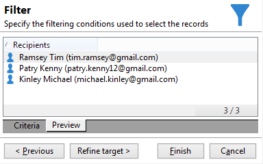

# Query{#query}

## Een query maken {#creating-a-query}

Met een query kunt u een doel selecteren op basis van criteria. U kunt een segmentcode aan het vraagresultaat associëren en extra gegevens opnemen in het.
Leer hoe te om vragen door gebruiksgevallen in [ te bouwen deze sectie ](querying-recipient-table.md). Zie ook de sectie over de [ redacteur van de Vraag ](../../v8/start/query-editor.md).

{width="70%" align="center" zoomable="yes"}

>[!NOTE]
>
>De gebruikersinterface van het Web van Adobe Campaign kenmerkt een krachtige vraagmodeler die het proces van het filtreren van gegevensbestanden vereenvoudigt om specifieke doelstellingen te selecteren die op diverse criteria worden gebaseerd, die u toestaan om uw vraag tot stand te brengen en gemakkelijker te beheren. Meer over de modelleerling van de Vraag voor Web UI leren, gelieve te verwijzen naar de [ documentatie van het Web UI van Adobe Campaign ](https://experienceleague.adobe.com/en/docs/campaign-web/v8/query-database/query-modeler-overview){target=_blank}.

Met de koppeling **[!UICONTROL Edit query...]** kunt u het doeltype, de beperkingen en de selectiecriteria voor de bevolking als volgt definiëren:

1. Selecteer het richten en het filtreren dimensie. Standaard is het doel geselecteerd bij de ontvangers. De lijst met restrictiefilters is gelijk aan de lijst die wordt gebruikt voor het opgeven van doelen voor levering.

   De doelgerichte dimensie valt samen met het soort element waaraan wij zullen werken, bijvoorbeeld de bevolking die voor de operatie in aanmerking komt.

   De filterdimensie maakt het mogelijk deze elementen te verzamelen, bijvoorbeeld informatie over de doelpersoon (contracten, volledige en definitieve schikkingen, enz.).

   Voor meer op dit, verwijs naar [ het richten en het filtreren dimensies ](targeting-workflows.md#targeting-and-filtering-dimensions).

   {width="70%" align="center" zoomable="yes"}

   Een vraag kan op gegevens van de binnenkomende overgang worden gebaseerd, indien nodig, door **[!UICONTROL Temporary schema]** te selecteren wanneer het kiezen van het richten en het filtreren dimensies.

   {width="70%" align="center" zoomable="yes"}

1. Definieer de populaties met de wizard. De velden die moeten worden ingevoerd, kunnen verschillen afhankelijk van het type doel. U kunt een voorvertoning van de doelpopulatie met de huidige criteria weergeven via het tabblad **[!UICONTROL Preview]** .

   {width="70%" align="center" zoomable="yes"}

1. Als u **[!UICONTROL Filtering conditions]** hebt geselecteerd bij stap 1 of de optie **[!UICONTROL Filters]** > **[!UICONTROL Advanced filter...]** gebruikt, moet u later handmatig filtercriteria toevoegen.

   U kunt ook voorwaarden voor gegevensgroepering toevoegen door het desbetreffende vak in te schakelen. Om dit te doen, moet de het filtreren dimensie aan de vraag richten afmeting verschillend zijn. Voor meer informatie bij het groeperen, verwijs naar deze [ sectie ](query-grouping-management.md).

   U kunt meer criteria ook toevoegen door de [ bouwer van de Uitdrukking te gebruiken ](../../v8/start/filter-conditions.md#using-and--or--except) en het te combineren met de logische opties EN, OF, en UITZONDEREN.

   Sla het filter op als u het later opnieuw wilt gebruiken.

## Gegevens toevoegen {#adding-data}

In de aanvullende kolommen kunt u aanvullende informatie over de doelpopulatie verzamelen, bijvoorbeeld contractnummers, abonnementen op nieuwsbrieven of oorsprong. Deze gegevens kunnen worden opgeslagen in de Adobe Campaign-database of in een externe database.

Met de koppeling **[!UICONTROL Add data...]** kunt u de aanvullende gegevens selecteren die u wilt verzamelen.

{width="70%" align="center" zoomable="yes"}

Selecteer eerst het type gegevens dat u wilt toevoegen:

{width="70%" align="center" zoomable="yes"}

* Selecteer **[!UICONTROL Data linked to the filtering dimension]** om de gegevens in de Adobe Campaign-database te selecteren.
* Selecteer **[!UICONTROL External data]** om gegevens uit een externe database toe te voegen. Deze optie is slechts beschikbaar als u de **Federated optie van de Toegang van Gegevens** hebt gekocht. Voor meer op dit, verwijs naar [ Toegang tot een extern gegevensbestand (FDA) ](accessing-an-external-database-fda.md).
* Selecteer de optie **[!UICONTROL An offer proposition]** om een set kolommen toe te voegen waarin u de beste propositie kunt opslaan die door de aanbiedingsengine wordt gegenereerd. Deze optie is slechts beschikbaar als u de **module van de Interactie** hebt gekocht.

Als er geen optionele module op het platform is geïnstalleerd, wordt dit werkgebied niet weergegeven. U wordt rechtstreeks naar de volgende fase geleid.

Gegevens toevoegen uit de Adobe Campaign-database:

1. Selecteer het type gegevens dat u wilt toevoegen. Dit kunnen gegevens zijn die tot de het filtreren afmeting of gegevens behoren die in verbonden lijsten worden opgeslagen.

   {width="70%" align="center" zoomable="yes"}

1. Als de gegevens tot de het filtreren dimensie van de vraag behoren, selecteer eenvoudig het in de lijst van beschikbare gebieden om het in de outputkolommen te tonen.

   {width="70%" align="center" zoomable="yes"}

   U kunt toevoegen:

   * Een veld dat wordt berekend op basis van gegevens van de doelpopulatie of een geaggregeerd (aantal lopende aankopen in de laatste maand, gemiddeld bedrag van een ontvangstbewijs enz.). Voor een voorbeeld, ga naar [ Uitgezochte gegevens ](targeting-workflows.md#selecting-data).
   * Een nieuw veld, gemaakt met de knop **[!UICONTROL Add]** rechts van de lijst met uitvoerkolommen.

     U kunt ook een verzameling gegevens toevoegen, bijvoorbeeld een lijst met contracten, de laatste vijf leveringen, enzovoort. Verzamelingen komen overeen met velden die meerdere waarden kunnen hebben voor hetzelfde profiel (1-N relatie). Voor meer op dit, verwijs naar [ geef extra gegevens ](targeting-workflows.md#editing-additional-data) uit.

Een verzameling gegevens toevoegen die verband houden met een doelgroep:

1. Selecteer in de eerste stap van de wizard de optie **[!UICONTROL Data linked to the filtering dimension]** :
1. Selecteer de tabel met de gegevens die u wilt verzamelen en klik op **[!UICONTROL Next]** .

   {width="70%" align="center" zoomable="yes"}

1. Geef indien nodig het aantal elementen van de verzameling op dat u wilt behouden door een van de waarden in het veld **[!UICONTROL Data collected]** te selecteren. Standaard worden alle regels van de collectie hersteld en gefilterd volgens de voorwaarden die in de volgende stap zijn opgegeven.

   * Als één element van de verzameling samenvalt met de filtervoorwaarden voor deze verzameling, selecteert u **[!UICONTROL Single row]** in het veld **[!UICONTROL Data collected]** .

     >[!IMPORTANT]
     >
     >Deze wijze optimaliseert de SQL vraag die dankzij een directe verbinding op de inzamelingselementen wordt geproduceerd.
     >
     >Als niet aan de oorspronkelijke voorwaarde wordt voldaan, kan het resultaat onjuist zijn (ontbrekende of overlappende lijnen).

   * Als u meerdere regels wilt herstellen (**[!UICONTROL Limit the line count]**), kunt u opgeven hoeveel regels moeten worden verzameld.
   * Indien de verzamelde kolommen aggregaten bevatten, bijvoorbeeld het aantal gedeclareerde fouten, de gemiddelde uitgaven op een locatie, enz. u kunt de waarde **[!UICONTROL Aggregates]** gebruiken.

   {width="70%" align="center" zoomable="yes"}

1. Geef de subselectie van de verzameling op.

   {width="70%" align="center" zoomable="yes"}

1. Als u de optie **[!UICONTROL Limit the line count]** hebt geselecteerd, definieert u de volgorde waarin de verzamelde gegevens moeten worden gefilterd. Zodra het aantal verzamelde lijnen meer dan het aantal lijnen is dat u specificeerde om te houden, staat de het filtreren orde u toe om te specificeren welke lijnen te houden.

## Voorbeeld: gericht op eenvoudige attributen voor ontvangers {#example--targeting-on-simple-recipient-attributes}

In het volgende voorbeeld probeert de query mannen tussen 18 en 30 jaar te identificeren die in Frankrijk wonen. Deze query wordt gebruikt in een workflow die als doel heeft deze bijvoorbeeld tot een exclusieve aanbieding te maken.

>[!NOTE]
>
>De extra vraagsteekproeven worden voorgesteld in [ deze sectie ](querying-recipient-table.md).

1. Geef de query een naam en selecteer vervolgens de koppeling **[!UICONTROL Edit query...]** .
1. Selecteer **[!UICONTROL Filtering conditions]** in de lijst met beschikbare filtertypen.
1. Voer de verschillende criteria voor het voorgestelde doel in. De volgende criteria worden gecombineerd met de optie AND. Om in de selectie te worden opgenomen, moeten de ontvangers aan de volgende vier voorwaarden voldoen:

   * Ontvangers de waarvan titel &quot;Mr.&quot;is (kan ook worden gevonden gebruikend het **Geslacht** gebied en het selecteren **Mannelijke** als waarde).
   * Ontvangers jonger dan 30 jaar.
   * Ontvangers ouder dan 18 jaar.
   * Ontvangers die in Frankrijk wonen.

   {width="70%" align="center" zoomable="yes"}

   U kunt de SQL bekijken die uw criteria combineert:

   {width="70%" align="center" zoomable="yes"}

1. U kunt controleren of uw criteria correct zijn door op het relevante tabblad een voorvertoning weer te geven van de ontvangers die overeenkomen met uw query:

   {width="70%" align="center" zoomable="yes"}

1. Sla de filters op zodat u ze later weer kunt gebruiken door op **[!UICONTROL Finish]** > **[!UICONTROL OK]** te klikken.
1. Ga door met het bewerken van uw workflow door er andere activiteiten aan toe te voegen. Zodra het is gelanceerd en de vorige vraagstap gebeëindigd, zal het aantal gevonden ontvangers worden getoond. U kunt meer details weergeven met het pop-upmenu Muis (klik met de rechtermuisknop op de overgang > **[!UICONTROL Display the target...]** ).

   {width="70%" align="center" zoomable="yes"}

## Uitvoerparameters {#output-parameters}

* tableName
* schema
* recCount

Deze reeks van drie waarden identificeert de bevolking die door de vraag wordt gericht. **[!UICONTROL tableName]** is de naam van de lijst die de doelherkenningstekens registreert, **[!UICONTROL schema]** is het schema van de bevolking (gewoonlijk nms :recipient) en **[!UICONTROL recCount]** is het aantal elementen in de lijst.

Deze waarde is het schema van de het werklijst. Deze parameter is geldig voor alle overgangen met **[!UICONTROL tableName]** en **[!UICONTROL schema]** .

## Uw query&#39;s optimaliseren {#optimizing-queries}

In de onderstaande sectie vindt u tips en trucs voor het optimaliseren van query&#39;s die op Adobe Campaign worden uitgevoerd om de werkbelasting van de database te beperken en de gebruikerservaring te verbeteren.

### Verbindingen en indexen {#joins-and-indexes}

* De efficiënte vragen baseren zich op indexen.
* Gebruik een index voor alle verbindingen.
* Het bepalen van verbindingen op het schema zal bepalen toetreedt voorwaarden. De gekoppelde tabel moet een unieke index hebben op de primaire sleutel en de samenvoeging moet zich in dit veld bevinden.
* Verbindingen uitvoeren door sleutels op numerieke gebieden in plaats van koordgebieden te bepalen.
* Vermijd het uitvoeren van buitenste verbindingen. Gebruik waar mogelijk de Nul-id-record om de functie voor buitenste verbindingen te bereiken.
* Gebruik het correcte gegevenstype voor verbindingen.

  Zorg ervoor dat de component `where` van hetzelfde type is als het veld.

  Een algemene fout is: `iBlacklist='3'` waarbij `iBlacklist` een numeriek veld is en `3` een tekstwaarde.

  Zorg ervoor u weet wat het uitvoeringsplan van uw vraag zal zijn. Vermijd volledig lijstaftasten, vooral voor vragen in real time of dichtbij vragen in real time die elke minuut lopen.

### Functies {#functions}

* Pas op voor functies zoals `Lower(...)` . Wanneer de functie Lower wordt gebruikt, wordt de Index niet gebruikt.
* Controleer query&#39;s met de ‘soortgelijke’ instructie of de ‘bovenste’ of ‘onderste’ instructies zorgvuldig. Pas &quot;Upper&quot;op de gebruikersinput, niet op het gegevensbestandgebied toe.

### Afmetingen filteren {#filtering-dimensions}

Gebruik de het filtreren dimensie van de vraag in plaats van het gebruiken van &quot;bestaat zoals&quot;exploitant.

{width="70%" align="center" zoomable="yes"}

In query&#39;s zijn &#39;bestaat zoals&#39;-voorwaarden in filters niet efficiënt. Ze zijn het equivalent van een subquery in SQL:

`select iRecipientId from nmsRecipient where iRecipientId IN (select iRecipientId from nmsBroadLog where (...))`

De beste praktijken moeten in plaats daarvan de het filtreren afmeting van de vraag gebruiken:

{width="70%" align="center" zoomable="yes"}

Het equivalent van de het filtreren afmeting in SQL is de binnenvoeging:

`select iRecipientId from nmsRecipient INNER JOIN nmsBroadLog ON (...)`

Voor meer bij het filtreren van dimensies, verwijs naar [ deze sectie ](build-a-workflow.md#targeting-and-filtering-dimensions).

### Architectuur {#architecture}

* Bouw een ontwikkelingsplatform met gelijkaardige volumes, parameters, en architectuur als productieplatform.
* Gebruik dezelfde waarden voor de ontwikkelings- en productieomgeving. Gebruik zoveel mogelijk hetzelfde:

   * Besturingssysteem
   * Versie,
   * gegevens,
   * toepassing,
   * Volume.

  >[!NOTE]
  >
  >Een functie die in een ontwikkelomgeving werkt, werkt mogelijk niet in een productieomgeving waarin de gegevens verschillend kunnen zijn. Probeer de belangrijkste verschillen vast te stellen om risico&#39;s te anticiperen en oplossingen voor te bereiden.

* Maak configuraties die overeenkomen met de doelvolumes. Voor grote volumes zijn specifieke configuraties vereist. Een configuratie die voor 100.000 ontvangers werkte kan niet voor 10.000.000 ontvangers werken.

  Bedenk hoe het systeem wordt geschaald wanneer het live gaat. Enkel omdat iets op kleine schaal werkt, betekent dat niet dat het geschikt zal zijn met grotere volumes. De tests moeten worden uitgevoerd met volumes die vergelijkbaar zijn met het productievolume. U zou ook het effect van veranderingen in volumes (aantal vraag, grootte van het gegevensbestand) bij piekuren, piekdagen, en over het leven van het project moeten evalueren.
