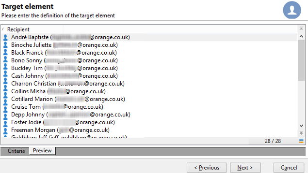

# Een query uitvoeren op de tabel met ontvangers {#querying-recipient-table}

In dit voorbeeld willen we de namen en e-mails herstellen van ontvangers wier e-maildomein &quot;orange.co.uk&quot; is en die niet in Londen wonen.

* Welke tabel moeten we kiezen?

  De tabel met ontvangers (nms:ontvanger)

* Velden die moeten worden geselecteerd als uitvoerkolommen

  E-mail, naam, plaats en rekeningnummer

* Wat zijn de filtervoorwaarden van de ontvangers?

  Plaats en e-maildomein

* Is een soort gevormd?

  Ja, op basis van **[!UICONTROL Account number]** en **[!UICONTROL Last name]**

U kunt dit voorbeeld maken door de volgende stappen toe te passen:

1. Klik **[!UICONTROL Tools > Generic query editor...]** en kies de **Ontvangers** (**nms:ontvanger**) lijst. Klik vervolgens op **[!UICONTROL Next]**.
1. Kies: **[!UICONTROL Last name]**, **[!UICONTROL First name]**, **[!UICONTROL Email]**, **[!UICONTROL City]** en **[!UICONTROL Account number]** . Deze velden worden toegevoegd aan **[!UICONTROL Output columns]** . Klik vervolgens op **[!UICONTROL Next]**.

   

1. Sorteer de kolommen om ze in de juiste volgorde weer te geven. Hier willen we rekeningnummers in aflopende volgorde en namen in alfabetische volgorde sorteren. Klik vervolgens op **[!UICONTROL Next]**.

   

1. Verfijn de zoekopdracht in het venster **[!UICONTROL Data filtering]** : kies **[!UICONTROL Filtering conditions]** en klik op **[!UICONTROL Next]** .
1. In het venster **[!UICONTROL Target element]** kunt u de filterinstellingen invoeren.

   Definieer de volgende filtervoorwaarde: ontvangers met een e-maildomein dat gelijk is aan &quot;orange.co.uk&quot;. Om dit te doen, verkies **E-maildomein (@email)** in de **[!UICONTROL Expression]** kolom, kies **gelijk aan** in de **[!UICONTROL Operator]** kolom en ga &quot;orange.co.uk&quot;in de **[!UICONTROL Value]** kolom in.

   

1. Klik zo nodig op de knop **[!UICONTROL Distribution of values]** om een distributie weer te geven op basis van het e-maildomein met perspectieven. Voor elk e-maildomein in de database is een percentage beschikbaar. Andere domeinen dan &quot;orange.co.uk&quot; worden weergegeven totdat het filter wordt toegepast.

   Een samenvatting van de vraag wordt getoond bij de bodem van het venster: **E-maildomein gelijk aan &quot;orange.co.uk&quot;**.

1. Klik op **[!UICONTROL Preview]** om een idee te krijgen van het resultaat van de query: alleen de e-maildomeinen &quot;orange.co.uk&quot; worden weergegeven.

   

1. Wij zullen nu de vraag veranderen om contacten te vinden die niet in Londen wonen.

   Selecteer **[!UICONTROL City (location/@city)]** in de **[!UICONTROL Expression]** kolom, **[!UICONTROL different from]** als een operator en voer **[!UICONTROL London]** in de **[!UICONTROL Value]** kolom in.

   

1. Hiermee gaat u naar het venster van **[!UICONTROL Data formatting]** . Controleer de kolomvolgorde. Verplaats de kolom &quot;Plaats&quot; omhoog onder de kolom &quot;Rekeningnummer&quot;.

   Schakel de kolom Voornaam uit om deze uit de lijst te verwijderen.

   

1. Klik in het **[!UICONTROL Data preview]** -venster op **[!UICONTROL Start the preview of the data]** . Deze functie berekent het resultaat van de query.

   Op het tabblad **[!UICONTROL Column results]** wordt het queryresultaat in kolommen weergegeven.

   Het resultaat toont alle ontvangers met een &quot;orange.co.uk&quot;e-maildomein die niet in Londen wonen. De kolom Voornaam wordt niet weergegeven omdat deze tijdens het vorige werkgebied niet is ingeschakeld. Accountnummers worden in aflopende volgorde gesorteerd.

   

   Op het tabblad **[!UICONTROL XML result]** wordt het resultaat weergegeven in XML-indeling.

   

   Het tabblad **[!UICONTROL Generated SQL queries]** geeft het queryresultaat weer in SQL-indeling.

   
