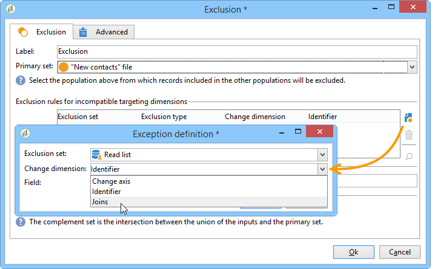

# Lijst lezen{#read-list}

Gegevens die in een werkstroom worden verwerkt, kunnen afkomstig zijn van lijsten waarin de gegevens vooraf zijn voorbereid of gestructureerd (na een eerdere segmentatie of bestandsupload).

De **[!UICONTROL Read list]** Met activiteit kunt u de gegevens kopiëren uit een lijst in de werkstroom, zoals gegevens uit een query. Het is dan toegankelijk door het werkschema.

De lijst die moet worden verwerkt, kan expliciet worden opgegeven, door een script worden berekend of dynamisch worden gelokaliseerd, afhankelijk van de geselecteerde opties en de gedefinieerde parameters in een **[!UICONTROL Read list]** activiteit.

Als de lijst niet uitdrukkelijk wordt gespecificeerd, moet u een lijst verstrekken die als malplaatje moet worden gebruikt om zijn structuur te weten te komen.

Als de lijstselectie is geconfigureerd, kunt u een filter toevoegen met de opdracht **[!UICONTROL Edit query]** optie om één deel van de bevolking voor de volgende werkschema te houden.

>[!CAUTION]
>
>Als u een filter wilt maken in een leeslijstactiviteit, moet de relevante lijst een &quot;bestandstype&quot;zijn.

De lijsten kunnen rechtstreeks in Adobe Campaign worden gemaakt via de **[!UICONTROL Profiles and Targets > Lists]** koppeling van de startpagina. Ze kunnen ook in een workflow worden gemaakt met de opdracht **[!UICONTROL List update]** activiteit.

**Voorbeeld: Een lijst met verzendadressen uitsluiten**

In het volgende voorbeeld kunt u een lijst met e-mailadressen gebruiken om gegevens uit te sluiten van het doel voor e-maillevering.

De profielen in de **Nieuwe contactpersonen** de map moet worden geactiveerd door een leveringsactie. De e-mailadressen die van het doel moeten worden uitgesloten, worden opgeslagen in een externe lijst. In ons voorbeeld is alleen de informatie over e-mailadressen vereist voor uitsluiting.

1. De **Nieuwe contactpersonen** met een query voor mapselectie moet u de e-mailadressen van de geselecteerde profielen laden om uitlijning met de gegevens in de lijst mogelijk te maken.

   

1. Hier wordt de lijst opgeslagen in de **Lijsten** map en het label ervan worden berekend.

   

1. Om de e-mailadressen van de externe lijst van het belangrijkste doel uit te sluiten, moet u de uitsluitingsactiviteit vormen en specificeren dat **Nieuwe contactpersonen** bevat de gegevens die moeten worden bewaard. De gezamenlijke gegevens tussen deze set en andere binnenkomende sets uit de uitsluitingsactiviteit worden uit het doel verwijderd.

   

   De uitsluitingsregels worden geconfigureerd in de centrale sectie van het bewerkingsgereedschap. Klik op de knop **[!UICONTROL Add]** om het type uitsluiting te definiëren dat moet worden toegepast.

   U kunt verschillende uitsluitingen definiëren afhankelijk van het aantal inkomende overgangen van de activiteit.

1. In de **[!UICONTROL Exclusion set]** veld selecteert u de **[!UICONTROL Read list]** activiteit: de gegevens in deze activiteit moeten van de hoofdreeks worden uitgesloten .

   In ons voorbeeld hebben we een uitzondering op joins: de gegevens in de lijst worden in overeenstemming gebracht met de gegevens van de hoofdset via het veld met het e-mailadres . Om te vormen verbind, selecteer **[!UICONTROL Joins]** in de **[!UICONTROL Change dimension]** veld.

   

1. Selecteer vervolgens het veld dat overeenkomt met het e-mailadres in de twee sets (bron en doel). De kolommen zullen dan worden verbonden en de ontvangers waarvan e-mailadres in de lijst van ingevoerde adressen is zullen van het doel worden uitgesloten.
