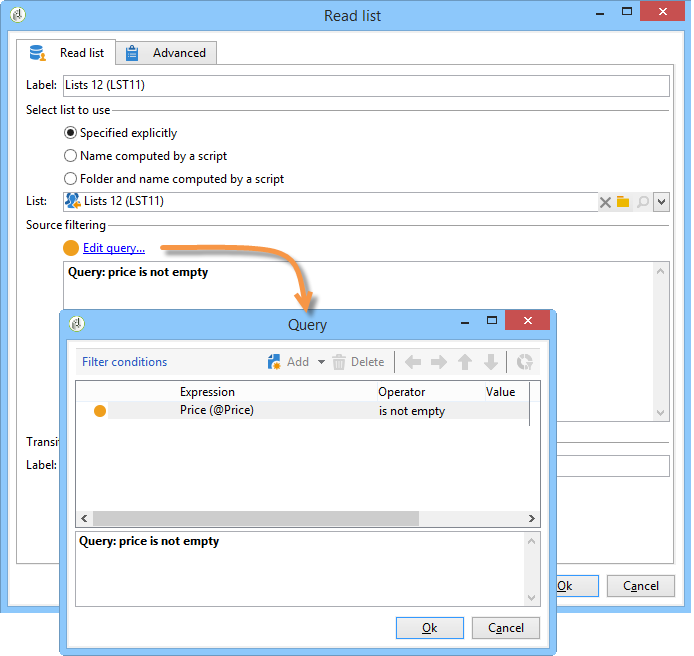

# Lijst lezen{#read-list}

Gegevens die in een werkstroom worden verwerkt, kunnen afkomstig zijn van lijsten waarin de gegevens vooraf zijn voorbereid of gestructureerd (na een eerdere segmentatie of het uploaden van bestanden).

Met de **[!UICONTROL Read list]** -activiteit kunt u de gegevens kopiëren uit een lijst in de werktabel van de werkstroom, zoals gegevens uit een query. Het is dan toegankelijk door het werkschema.

De lijst die moet worden verwerkt, kan expliciet worden opgegeven, via een script worden berekend of dynamisch worden gelokaliseerd, afhankelijk van de geselecteerde opties en de parameters die in een **[!UICONTROL Read list]** -activiteit zijn gedefinieerd.

Als de lijst niet uitdrukkelijk wordt gespecificeerd, moet u een lijst verstrekken die als malplaatje moet worden gebruikt om zijn structuur te weten te komen.

Nadat de lijstselectie is geconfigureerd, kunt u een filter toevoegen met de optie **[!UICONTROL Edit query]** om een deel van de bevolking voor de volgende workflow te houden.

>[!CAUTION]
>
>Als u een filter wilt maken in een leeslijstactiviteit, moet de relevante lijst een &quot;bestandstype&quot;zijn.

De lijsten kunnen rechtstreeks in Adobe Campaign worden gemaakt via de koppeling **[!UICONTROL Profiles and Targets > Lists]** op de startpagina. Ze kunnen ook in een workflow worden gemaakt met de activiteit **[!UICONTROL List update]** .

**Voorbeeld: Sluit een lijst van uit verzendt adressen**

In het volgende voorbeeld kunt u een lijst met e-mailadressen gebruiken om gegevens uit te sluiten van het doel voor e-maillevering.

De profielen in de **Nieuwe omslag van Contacten** worden bevat moeten door een leveringsactie worden gericht. De e-mailadressen die van het doel moeten worden uitgesloten, worden opgeslagen in een externe lijst. In ons voorbeeld is alleen de informatie over e-mailadressen vereist voor uitsluiting.

1. De **Nieuwe vraag van de de omslagselectie van Contacten** moet u toelaten om de geselecteerde profielen&#39; e-mailadressen te laden, om groepering met de informatie in de lijst toe te laten.

   

1. Hier, wordt de lijst opgeslagen in de **omslag van Lijsten** en zijn etiket wordt berekend.

   

1. Om de e-mailadressen van de externe lijst van het belangrijkste doel uit te sluiten, moet u de uitsluitingsactiviteit vormen en specificeren dat de **Nieuwe omslag van Contacten** de te houden gegevens bevat. De gezamenlijke gegevens tussen deze set en andere binnenkomende sets uit de uitsluitingsactiviteit worden uit het doel verwijderd.

   

   De uitsluitingsregels worden geconfigureerd in de centrale sectie van het bewerkingsgereedschap. Klik op de knop **[!UICONTROL Add]** om het type uitsluiting te definiëren dat u wilt toepassen.

   U kunt verschillende uitsluitingen definiëren op basis van het aantal binnenkomende overgangen van de activiteit.

1. Selecteer in het veld **[!UICONTROL Exclusion set]** de activiteit **[!UICONTROL Read list]** : de gegevens in deze activiteit moeten worden uitgesloten van de hoofdset.

   In ons voorbeeld geldt een uitzondering voor verbindingen: de gegevens in de lijst worden afgestemd op de gegevens van de hoofdset via het veld met het e-mailadres. Selecteer **[!UICONTROL Joins]** in het veld **[!UICONTROL Change dimension]** om de verbinding te configureren.

   

1. Selecteer vervolgens het veld dat overeenkomt met het e-mailadres in de twee sets (Source en Doel). De kolommen zullen dan worden verbonden en de ontvangers waarvan e-mailadres in de lijst van ingevoerde adressen is zullen van het doel worden uitgesloten.
