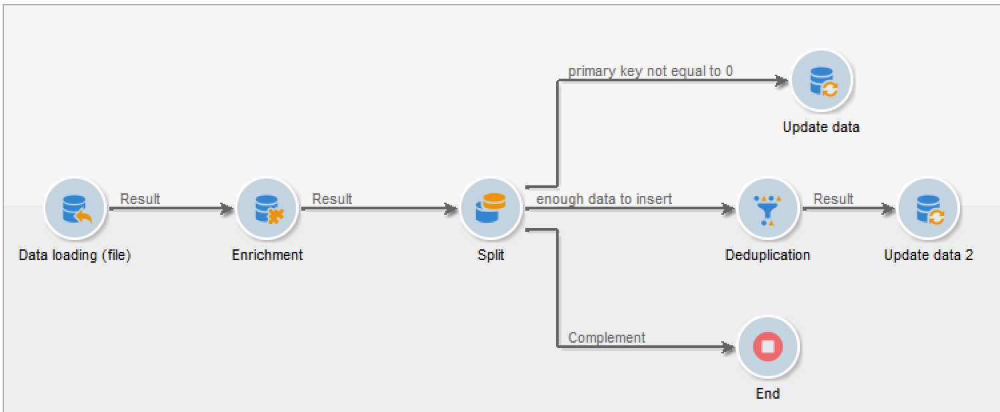

# Een workflow instellen voor terugkerende importactiviteiten {#setting-up-a-recurring-import}


Het gebruik van een werkstroomsjabloon is de beste manier als u regelmatig bestanden met dezelfde structuur moet importeren.

In dit voorbeeld ziet u hoe u een workflow instelt die opnieuw kan worden gebruikt voor het importeren van profielen die afkomstig zijn van een CRM in de Adobe Campaign-database. Voor meer informatie over alle mogelijke montages voor elke activiteit, verwijs naar deze [ sectie ](activities.md).

1. Maak een nieuw werkstroomsjabloon vanuit **[!UICONTROL Resources > Templates > Workflow templates]** .
1. Voeg de volgende activiteiten toe:

   * **[!UICONTROL Data loading (file)]**: hiermee definieert u de verwachte structuur van het bestand met de gegevens die u wilt importeren.
   * **[!UICONTROL Enrichment]**: combineer de geïmporteerde gegevens met databasegegevens.
   * **[!UICONTROL Split]**: maak filters om records te verwerken die anders zijn, afhankelijk van de vraag of ze met elkaar in overeenstemming kunnen worden gebracht.
   * **[!UICONTROL Deduplication]**: dupliceer de gegevens uit het binnenkomende bestand voordat deze in de database worden ingevoegd.
   * **[!UICONTROL Update data]**: Werk de database bij met de geïmporteerde profielen.

   

1. Configureer de **[!UICONTROL Data Loading (file)]** -activiteit:

   * Geef de verwachte structuur op door een voorbeeldbestand te uploaden. Het voorbeeldbestand mag slechts een paar regels bevatten, maar alle kolommen die nodig zijn voor het importeren. Controleer en bewerk de bestandsindeling om ervoor te zorgen dat het type van elke kolom correct is ingesteld: tekst, datum, geheel getal, enz. Bijvoorbeeld:

     ```
     lastname;firstname;birthdate;email;crmID
     Smith;Hayden;23/05/1989;hayden.smith@mailtest.com;123456
     ```

   * Selecteer **[!UICONTROL Upload a file from the local machine]** in de sectie **[!UICONTROL Name of the file to load]** en laat het veld leeg. Telkens wanneer een nieuwe werkstroom van dit malplaatje wordt gecreeerd, kunt u hier het dossier specificeren u wilt, zolang het aan de bepaalde structuur beantwoordt.

     U kunt alle opties gebruiken, maar u moet de sjabloon dienovereenkomstig aanpassen. Als u bijvoorbeeld **[!UICONTROL Specified in the transition]** selecteert, kunt u een **[!UICONTROL File Transfer]** -activiteit toevoegen voordat u het bestand ophaalt dat u wilt importeren van een FTP-/SFTP-server. Met S3- of SFTP-verbinding kunt u ook segmentgegevens importeren naar Adobe Campaign met Adobe Real-time Customer Data-platform. Voor meer op dit, verwijs naar [ documentatie van Adobe Experience Platform ](https://experienceleague.adobe.com/docs/experience-platform/destinations/catalog/email-marketing/adobe-campaign.html?lang=nl-NL){target="_blank"}.

     

1. Configureer de **[!UICONTROL Enrichment]** -activiteit. Het doel van deze activiteit in dit verband is de identificatie van de binnenkomende gegevens.

   * Selecteer **[!UICONTROL Add data]** op het tabblad **[!UICONTROL Enrichment]** en definieer een koppeling tussen de geïmporteerde gegevens en de ontvangers voor dimensie. In dit voorbeeld, wordt het **douanegebied van identiteitskaart van 0&rbrace; CRM &lbrace;gebruikt om te creëren zich bij voorwaarde aansluit.** Gebruik het veld of de combinatie van velden die u nodig hebt, zolang u unieke records kunt identificeren.
   * Laat op het tabblad **[!UICONTROL Reconciliation]** de optie **[!UICONTROL Identify the document from the working data]** uitgeschakeld.

   

1. Configureer de **[!UICONTROL Split]** -activiteit om onderling afgestemde ontvangers in één overgang en ontvangers op te halen die niet in overeenstemming konden worden gebracht maar die voldoende gegevens in een tweede overgang hebben.

   De overgang met onderling verzochte ontvangers kan dan worden gebruikt om het gegevensbestand bij te werken. De overgang met onbekende ontvangers kan dan worden gebruikt om nieuwe ontvankelijke ingangen in het gegevensbestand tot stand te brengen als een minimumreeks informatie in het dossier beschikbaar is.

   Ontvangers die niet in overeenstemming kunnen worden gebracht en niet genoeg gegevens hebben, worden in een complementaire uitgaande overgang geselecteerd en kunnen in een afzonderlijk bestand worden geëxporteerd of eenvoudig worden genegeerd.

   * Selecteer op het tabblad **[!UICONTROL General]** van de activiteit de optie **[!UICONTROL Use the additional data only]** voor filteren en zorg ervoor dat de instelling **[!UICONTROL Targeting dimension]** automatisch wordt ingesteld op **[!UICONTROL Enrichment]** .

     Controleer de optie **[!UICONTROL Generate complement]** om te kunnen zien of een record niet in de database kan worden ingevoegd. Indien nodig kunt u de aanvullende gegevens verder verwerken: bestanden exporteren, lijst bijwerken, enz.

   * In de eerste subset van het tabblad **[!UICONTROL Subsets]** voegt u een filtervoorwaarde toe aan de binnenkomende populatie om alleen records te selecteren waarvoor de primaire sleutel van de ontvanger niet gelijk is aan 0. Op deze manier worden gegevens uit het bestand die in overeenstemming zijn met ontvangers uit de database, geselecteerd in die subset.

     

   * Voeg een tweede subset toe die onverzochte records selecteert die voldoende gegevens bevatten om in de database te worden ingevoegd. Bijvoorbeeld: e-mailadres, voornaam en achternaam.

     Subsets worden verwerkt in hun aanmaakvolgorde. Dit houdt in dat wanneer deze tweede subset wordt verwerkt, alle records die al in de database bestaan al in de eerste subset zijn geselecteerd.

     

   * Alle records die niet in de eerste twee subsets zijn geselecteerd, worden in de **[!UICONTROL Complement]** geselecteerd.

1. Configureer de **[!UICONTROL Update data]** -activiteit die zich na de eerste uitgaande overgang van de eerder geconfigureerde **[!UICONTROL Split]** -activiteit bevindt.

   * Selecteer **[!UICONTROL Update]** als **[!UICONTROL Operation type]** omdat de inkomende overgang alleen ontvangers bevat die al in de database aanwezig zijn.
   * Selecteer **[!UICONTROL Using reconciliation keys]** in de sectie **[!UICONTROL Record identification]** en definieer een sleutel tussen de doeldimensie en de koppeling die in de sectie **[!UICONTROL Enrichment]** wordt gemaakt. In dit voorbeeld, wordt het **douanegebied van identiteitskaart van 0&rbrace; CRM &lbrace;gebruikt.**
   * Geef in de sectie **[!UICONTROL Fields to update]** de velden van de afmeting ontvangers op die moeten worden bijgewerkt met de waarde van de corresponderende kolom in het bestand. Als de namen van de bestandskolommen identiek of bijna identiek zijn aan de namen van de afmetingsvelden van de ontvangers, kunt u de toverknop gebruiken om de verschillende velden automatisch aan te passen.

     

1. Configureer de **[!UICONTROL Deduplication]** -activiteit die zich na de overgang bevindt en die niet-compatibele ontvangers bevat:

   * Selecteer **[!UICONTROL Edit configuration]** en stel de doeldimensie in op het tijdelijke schema dat is gegenereerd op basis van de **[!UICONTROL Enrichment]** -activiteit van de workflow.

     

   * In dit voorbeeld wordt het e-mailveld gebruikt om unieke profielen te zoeken. U kunt elk veld gebruiken waarvan u zeker weet dat het is ingevuld en deel uitmaakt van een unieke combinatie.
   * Selecteer in het **[!UICONTROL Deduplication method]** -scherm **[!UICONTROL Advanced parameters]** en schakel de optie **[!UICONTROL Disable automatic filtering of 0 ID records]** in om ervoor te zorgen dat records met een primaire sleutel gelijk aan 0 (die alle records van deze overgang moeten zijn) niet worden uitgesloten.

   

1. Configureer de **[!UICONTROL Update data]** -activiteit die zich bevindt na de **[!UICONTROL Deduplication]** -activiteit die eerder is geconfigureerd.

   * Selecteer **[!UICONTROL Insert]** as **[!UICONTROL Operation type]** omdat de inkomende overgang alleen ontvangers bevat die niet in de database aanwezig zijn.
   * Selecteer **[!UICONTROL Directly using the targeting dimension]** in de sectie **[!UICONTROL Record identification]** en kies de **[!UICONTROL Recipients]** -dimensie.
   * Geef in de sectie **[!UICONTROL Fields to update]** de velden van de afmeting ontvangers op die moeten worden bijgewerkt met de waarde van de corresponderende kolom in het bestand. Als de namen van de bestandskolommen identiek of bijna identiek zijn aan de namen van de afmetingsvelden van de ontvangers, kunt u de toverknop gebruiken om de verschillende velden automatisch aan te passen.

     

1. Voeg na de derde overgang van de **[!UICONTROL Split]** -activiteit een **[!UICONTROL Data extraction (file)]** activiteit en een **[!UICONTROL File transfer]** activiteit toe als u wilt bijhouden welke gegevens niet in de database zijn ingevoegd. Configureer die activiteiten om de kolom die u nodig hebt te exporteren en om het bestand over te brengen naar een FTP- of SFTP-server waar u het bestand kunt ophalen.
1. Voeg een **[!UICONTROL End]** -activiteit toe en sla de werkstroomsjabloon op.

De sjabloon kan nu worden gebruikt en is beschikbaar voor elke nieuwe workflow. U hoeft alleen het bestand op te geven dat de gegevens bevat die u wilt importeren in de **[!UICONTROL Data loading (file)]** -activiteit.


