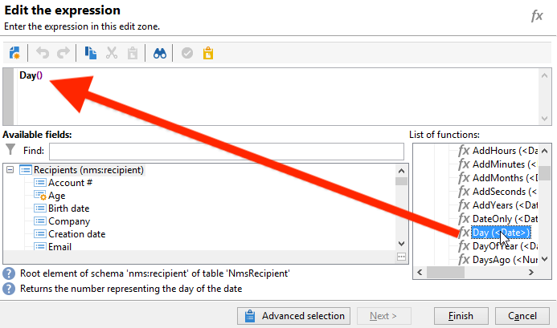
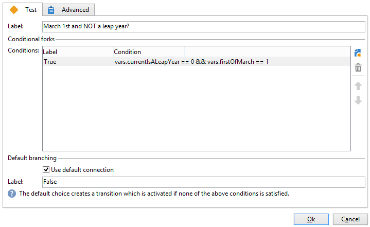

# Een verjaardags-e-mail verzenden{#sending-a-birthday-email}

In dit geval wordt beschreven hoe u een terugkerende e-mail naar een lijst met ontvangers op de dag van hun geboortedatum wilt sturen.

Voor het instellen van dit gebruiksgeval hebben we de volgende workflow voor doelversie gemaakt:


Met deze (dagelijkse) workflow worden alle ontvangers geselecteerd die op de huidige datum jarig zijn.

Om dit te doen, creeer een campagne en voeg a [ campagnewerkschema ](campaign-workflows.md) toe.

Voer vervolgens de hieronder beschreven stappen uit.

## Ontvangers identificeren van wie de geboortedatum is {#identifying-recipients-whose-birthday-it-is}

Nadat u de **[!UICONTROL Scheduler]** -activiteit hebt geconfigureerd, zodat de workflow elke dag start, identificeert u alle ontvangers waarvan de geboortedatum gelijk is aan de huidige datum.

Hiervoor voert u de volgende stappen uit:

1. Sleep een **[!UICONTROL Query]** -activiteit naar de werkstroom en dubbelklik erop.
1. Klik **geef vraag** verbinding uit en selecteer **[!UICONTROL Filtering conditions]**.

   

1. Klik op de eerste cel van de kolom **[!UICONTROL Expression]** en klik op **[!UICONTROL Edit expression]** om de expressie-editor te openen.

   

1. Klik op **[!UICONTROL Advanced selection]** om de filtermodus te selecteren.

   

1. Selecteer **[!UICONTROL Edit the formula using an expression]** en klik op **[!UICONTROL Next]** om de expressie-editor weer te geven.
1. Dubbelklik in de lijst met functies op **[!UICONTROL Day]** , die toegankelijk is via het knooppunt **[!UICONTROL Date]** . Deze functie retourneert het getal dat de dag vertegenwoordigt die overeenkomt met de datum die als parameter is doorgegeven.

   

1. Dubbelklik op **[!UICONTROL Birth date]** in de lijst met beschikbare velden. In het bovenste gedeelte van de editor wordt dan de volgende formule weergegeven:

   ```
   Day(@birthDate)
   ```

   Klik op **[!UICONTROL Finish]** om te bevestigen.

1. Selecteer **[!UICONTROL equal to]** in de eerste cel van de kolom **[!UICONTROL Operator]** in de query-editor.

   

1. Klik vervolgens op de eerste cel van de tweede kolom (**[!UICONTROL Value]**) en klik op **[!UICONTROL Edit expression]** om de expressie-editor te openen.
1. Dubbelklik in de lijst met functies op **[!UICONTROL Day]** , die toegankelijk is via het knooppunt **[!UICONTROL Date]** .
1. Dubbelklik op de functie **[!UICONTROL GetDate]** om de huidige datum op te halen.

   

   In het bovenste gedeelte van de editor wordt de volgende formule weergegeven:

   ```
   Day(GetDate())
   ```

   Klik op **[!UICONTROL Finish]** om te bevestigen.

1. Herhaal deze procedure om de geboortemaand van de huidige maand op te halen. Klik hiertoe op de knop **[!UICONTROL Add]** en herhaal stap 3 tot en met 10, waarbij u **[!UICONTROL Day]** vervangt door **[!UICONTROL Month]** .

   De volledige vraag is als volgt:

   

Koppel het resultaat van de **[!UICONTROL Query]** -activiteit aan een **[!UICONTROL Email delivery]** -activiteit om een e-mail te verzenden naar de lijst met al uw ontvangers op hun verjaardag.

## Inclusief ontvangers geboren op 29 februari (optioneel) {#including-recipients-born-on-february-29th--optional-}

Als u alle ontvangers wilt opnemen die op 29 februari zijn geboren, toont deze gebruikszaak hoe u een terugkerende e-mail naar een lijst met ontvangers voor hun verjaardag wilt sturen - of het nu een schrikkeljaar is of niet.

De belangrijkste implementatiestappen voor dit gebruiksgeval zijn:

* Ontvangers selecteren
* Kiezen of het een schrikkeljaar is
* Ontvangers selecteren die op 29 februari zijn geboren

Voor het instellen van dit gebruiksgeval hebben we de volgende workflow voor doelversie gemaakt:


Als het huidige jaar **geen schrikkeljaar** is en het werkschema op 1 Maart in werking wordt gesteld, moeten wij alle ontvangers selecteren die hun verjaardag gisteren (29 februari) zouden hebben gehad en hen toevoegen aan de lijst van ontvangers. In alle andere gevallen is geen aanvullende actie vereist.

### Stap 1: Selecteer de ontvangers {#step-1--selecting-the-recipients}

Nadat u de **[!UICONTROL Scheduler]** -activiteit hebt geconfigureerd, zodat de workflow elke dag start, identificeert u alle ontvangers waarvan de verjaardag de huidige dag is.

>[!NOTE]
>
>Als het huidige jaar een schrikkeljaar is, worden alle ontvangers die op 29 februari geboren zijn automatisch opgenomen.


Het selecteren van ontvangers de waarvan verjaardag aan de huidige datum beantwoordt wordt voorgesteld in [ het identificeren van ontvangers de waarvan verjaardag het ](#identifying-recipients-whose-birthday-it-is) sectie is.

### Stap 2: Geef aan of het een schrikkeljaar is {#step-2--select-whether-or-not-it-is-a-leap-year}

Met de **[!UICONTROL Test]** -activiteit kunt u controleren of het een schrikkeljaar is en of de huidige datum 1 maart is.

Als de test wordt geverifieerd (het jaar is geen schrikkeljaar - er is geen 29 februari - en de huidige datum is inderdaad 1 maart), wordt de overgang van **[!UICONTROL True]** ingeschakeld en worden de ontvangers die op 29 februari geboren worden toegevoegd aan de levering van 1 maart. Anders wordt de overgang **[!UICONTROL False]** ingeschakeld en ontvangen alleen de ontvangers die op de huidige datum geboren zijn de levering.

Kopieer en plak de onderstaande code in de sectie **[!UICONTROL Initialization script]** van het tabblad **[!UICONTROL Advanced]** .

```
function isLeapYear(iYear)
{
    if(iYear/4 == Math.floor(iYear/4))
    {
        if(iYear/100 != Math.floor(iYear/100))
        {
            // Divisible by 4 only -> Leap Year
            return 1;
        }
        else
        {
            if(iYear/400 == Math.floor(iYear/400))
            {
                // Divisible by 4, 100 and 400 -> Leap year
                return 1;
            }
        }
    }
    // all others: no leap year
    return 0;
}

// Return today's date and time
var currentTime = new Date()
// returns the month (from 0 to 11)
var month = currentTime.getMonth() + 1
// returns the day of the month (from 1 to 31)
var day = currentTime.getDate()
// returns the year (four digits)
var year = currentTime.getFullYear()

// is current year a leap year?
vars.currentIsALeapYear = isLeapYear(year);

// is current date the first of march?
if(month == 3 && day == 1) {
  // today is 1st of march
vars.firstOfMarch = 1;
}
```


Voeg de volgende voorwaarde toe aan de sectie **[!UICONTROL Conditional forks]** :

```
vars.currentIsALeapYear == 0 && vars.firstOfMarch == 1
```



### Stap 3: Selecteer de ontvangers die op 29 februari zijn geboren {#step-3--select-any-recipients-born-on-february-29th}

Maak een **[!UICONTROL Fork]** -activiteit en koppel een van de uitgaande overgangen aan een **[!UICONTROL Query]** -activiteit.

Selecteer in deze query alle ontvangers waarvan de geboortedatum 29 februari is.


Combineer de resultaten met een **[!UICONTROL Union]** -activiteit.

Koppel de resultaten van de twee **[!UICONTROL Test]** activity-vertakkingen aan een **[!UICONTROL Email delivery]** -activiteit om een e-mail te sturen naar de lijst met al uw ontvangers op hun verjaardag, zelfs naar de ontvangers die op 29 februari tijdens een niet-schrikkeljaar geboren zijn.

## Een terugkerende levering maken {#creating-a-recurring-delivery-in-a-targeting-workflow}

Voeg a **Terugkomende die levering** activiteit toe op het malplaatje wordt gebaseerd van de verjaardags e-mail dat u wilt verzenden.

>[!CAUTION]
>
>Om de workflows uit te voeren, moeten de technische workflows met betrekking tot het campagnepakket worden gestart. Voor meer op dit, verwijs naar de [ Lijst van technische werkschema&#39;s ](technical-workflows.md) sectie.
>
>Als de goedkeuringsstappen voor de campagne zijn ingeschakeld, worden de leveringen pas verzonden nadat deze stappen zijn bevestigd. Raadpleeg voor meer informatie de   sectie.


