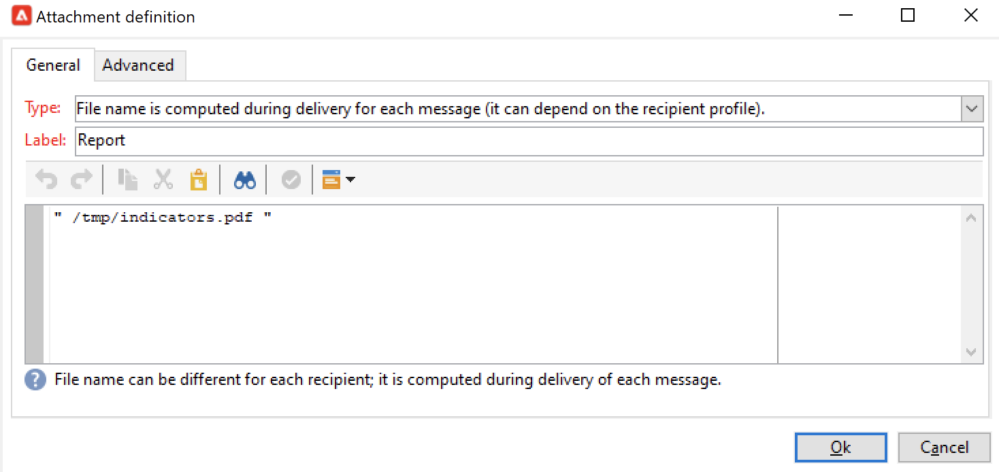
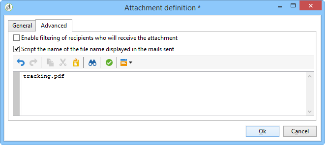

# Een rapport naar een lijst verzenden{#sending-a-report-to-a-list}


Met dit gebruiksgeval kunt u elke maand een out-of-the-box genereren **[!UICONTROL Tracking indicators]** rapporteren in PDF-indeling en hoe deze naar een lijst met ontvangers wordt verzonden.


De belangrijkste implementatiestappen voor dit gebruiksgeval zijn:

* Een lijst maken van ontvangers die de levering zullen ontvangen (zie: [Stap 1: De lijst met ontvangers maken](#step-1--creating-the-recipient-list)).
* Creërend een leveringsmalplaatje dat u een nieuwe levering zal laten produceren telkens als het werkschema wordt uitgevoerd (verwijs naar: [Stap 2: De leveringssjabloon maken](#step-2--creating-the-delivery-template)).
* Creërend een werkschema dat u het rapport in PDF formaat zal produceren en het naar de lijst van ontvangers zal verzenden (verwijs naar: [Stap 3: De workflow maken](#step-3--creating-the-workflow)).

## Stap 1: De lijst met ontvangers maken {#step-1--creating-the-recipient-list}

Ga naar de **[!UICONTROL Profiles and targets]** klikt u op de knop **[!UICONTROL Lists]** dan de koppeling **[!UICONTROL Create]** knop. Selecteren **[!UICONTROL New list]** en maak een nieuwe lijst met ontvangers voor het rapport dat u wilt verzenden.


Raadpleeg dit voor meer informatie over het maken van lijsten.

## Stap 2: De leveringssjabloon maken {#step-2--creating-the-delivery-template}

1. Ga naar de **[!UICONTROL Resources > Templates > Delivery templates]** knooppunt van de Adobe Campaign-verkenner en dupliceer de **[!UICONTROL Email delivery]** out-of-the-box sjabloon.

   

   Raadpleeg dit voor meer informatie over het maken van een leveringssjabloon.

1. Voer de verschillende sjabloonparameters in: label, doel (de lijst met eerder gemaakte ontvangers), onderwerp en inhoud.

   

1. Elke keer dat de workflow wordt uitgevoerd, wordt **[!UICONTROL Tracking indicators]** rapport is bijgewerkt (zie [Stap 3: De workflow maken](#step-3--creating-the-workflow)). Als u de meest recente versie van het rapport in de levering wilt opnemen, moet u een **[!UICONTROL Calculated attachment]**:

   Raadpleeg dit voor meer informatie over het maken van een berekende bijlage.

   * Klik op de knop **[!UICONTROL Attachments]** koppeling en klik op **[!UICONTROL Add]** selecteert u vervolgens **[!UICONTROL Calculated attachment]**.

      

   * Ga naar de **[!UICONTROL Type]** en selecteer de vierde optie: **[!UICONTROL File name is computed during delivery of each message (it may then depend on the recipient profile)]**.

      

      De waarde die wordt ingevoerd in het dialoogvenster **[!UICONTROL Label]** wordt niet weergegeven in de uiteindelijke levering.

   * Ga naar de bewerkingszone en voer het toegangspad en de naam van het bestand in.

      

      >[!CAUTION]
      >
      >Het bestand moet aanwezig zijn op de server. Het pad en de naam ervan moeten identiek zijn aan die in het **[!UICONTROL JavaScript code]** type activiteit van de workflow (zie: [Stap 3: De workflow maken](#step-3--creating-the-workflow)).

   * Selecteer **[!UICONTROL Advanced]** tab en check **[!UICONTROL Script the name of the file name displayed in the mails sent]**. Ga naar de uitgeeft streek en ga de naam in u de gehechtheid in de definitieve levering wilt geven.

      

## Stap 3: De workflow maken {#step-3--creating-the-workflow}

De volgende workflow is gemaakt voor dit gebruik. Het heeft drie activiteiten:

* Eén **[!UICONTROL Scheduler]** type activiteit waarmee u de workflow één keer per maand kunt uitvoeren;
* Eén **[!UICONTROL JavaScript code]** type activiteit die u het rapport in PDF formaat laat produceren,
* één **[!UICONTROL Delivery]** type activiteit die het eerder gecreeerde leveringsmalplaatje gebruikt.


1. Ga nu naar de **[!UICONTROL Administration > Production > Technical workflows]** en een nieuwe workflow maken.

   

1. Begin door een **[!UICONTROL Scheduler]** type activiteit en vorm het zodat het werkschema op de eerste Maandag van de maand uitvoert.

   

   Voor meer bij het vormen van de planner, verwijs naar [Planner](scheduler.md).

1. Voeg vervolgens een **[!UICONTROL JavaScript code]** type activiteit.

   

   Voer de volgende code in de bewerkingszone in:

   ```
   var reportName = "deliveryFeedback";
   var path = "/tmp/deliveryFeedback.pdf";
   var exportFormat = "PDF";
   var reportURL = "<PUT THE URL OF THE REPORT HERE>";
   var _ctx = <ctx _context="global" _reportContext="deliveryFeedback" />
   var isAdhoc = 0;
   
   xtk.report.export(reportName, _ctx, exportFormat, path, isAdhoc);
   ```

   De volgende variabelen worden gebruikt:

   * **var reportName**: Voer de interne naam van het rapport tussen dubbele aanhalingstekens in. In dat geval wordt de interne naam van de **Trackingindicator** rapport is &quot;deliveryFeedback&quot;.
   * **var path**: Voer het opslagpad in van het bestand (&quot;tmp/files/&quot;), de naam die u aan het bestand wilt geven (&quot;deliveryFeedback&quot;) en de bestandsextensie (&quot;.pdf&quot;). In dit geval hebben we de interne naam gebruikt als bestandsnaam. Waarden moeten tussen dubbele aanhalingstekens liggen en door het plusteken (+) worden gescheiden.

      >[!CAUTION]
      >
      >Het bestand moet op de server worden opgeslagen. U moet hetzelfde pad en dezelfde naam invoeren in het dialoogvenster **[!UICONTROL General]** tabblad van het bewerkvenster voor de berekende bijlage (zie: [Stap 2: De leveringssjabloon maken](#step-2--creating-the-delivery-template)).

   * **var exportFormat**: Voer de exportindeling van het bestand in (&quot;PDF&quot;).
   * **var_ctx** (context): in dit geval gebruiken wij de **[!UICONTROL Tracking indicators]** verslag uitbrengen in zijn mondiale context.

1. Voltooien door een **[!UICONTROL Delivery]** Typ activiteit met de volgende opties:

   * **[!UICONTROL Delivery]**: selecteren **[!UICONTROL New, created from a template]** en selecteer de eerder gemaakte leveringssjabloon.
   * Voor de **[!UICONTROL Recipients]** en **[!UICONTROL Content]** velden, selecteren **[!UICONTROL Specified in the delivery]**.
   * **[!UICONTROL Action to execute]**: selecteren **[!UICONTROL Prepare and start]**.
   * Uitschakelen **[!UICONTROL Generate an outbound transition]** en **[!UICONTROL Process errors]**.
   
