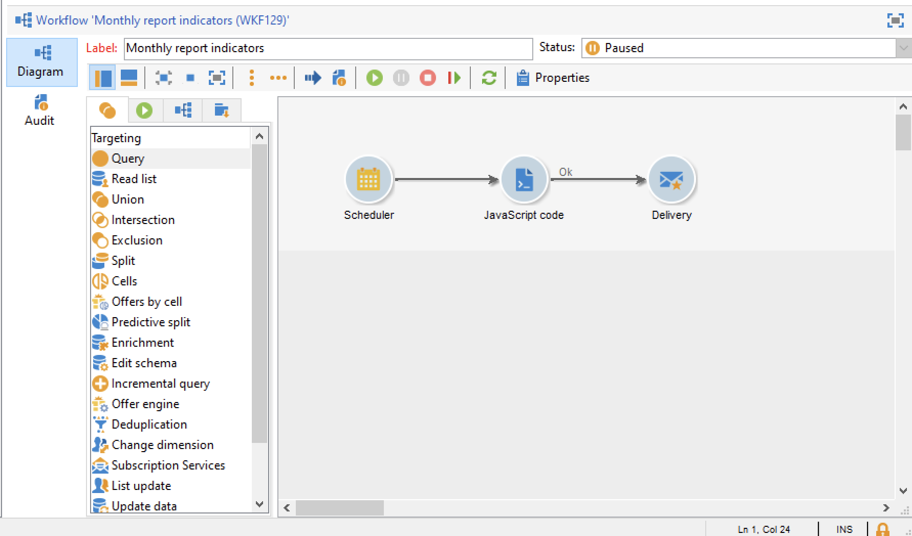

# Een rapport naar een lijst verzenden{#send-a-report-to-a-list}

In dit geval wordt beschreven hoe u een maandelijks out-of-the-box **[!UICONTROL Tracking indicators]** -rapport in PDF-indeling kunt genereren en hoe u dit rapport naar een lijst met ontvangers kunt verzenden.


De belangrijkste implementatiestappen voor dit gebruiksgeval zijn:

* Maak een lijst met ontvangers voor dit rapport. [Meer informatie](#step-1--create-the-recipient-list).
* Maak een leveringssjabloon die elke keer dat de workflow wordt uitgevoerd een nieuwe levering maakt. [Meer informatie](#step-2--create-the-delivery-template).
* Maak een workflow die het rapport genereert in PDF-indeling en verstuurt het naar de lijst met ontvangers. [&#x200B; leer meer &#x200B;](#step-3--create-the-workflow)).

## Stap 1: Maak de lijst met ontvangers {#step-1--create-the-recipient-list}

Voer de volgende stappen uit om de lijst met doelontvangers te maken:

1. Blader naar het tabblad **[!UICONTROL Profiles and targets]** en klik op de koppeling **[!UICONTROL Lists]** .
1. Klik op de knop **[!UICONTROL Create]**.
1. Selecteer **[!UICONTROL New list]** en maak een nieuwe lijst met ontvangers waarnaar het rapport moet worden verzonden.

Voor meer bij het creëren van lijsten, verwijs naar [&#x200B; deze sectie &#x200B;](../../v8/audiences/create-audiences.md).

## Stap 2: De leveringssjabloon maken {#step-2--create-the-delivery-template}

Volg onderstaande stappen om de leveringssjabloon te maken:

1. Blader naar het knooppunt **[!UICONTROL Resources > Templates > Delivery templates]** van de Adobe Campaign Explorer en dupliceer de **[!UICONTROL Email delivery]** ingebouwde sjabloon.

   Voor meer bij het creëren van een leveringsmalplaatje, verwijs naar [&#x200B; deze sectie &#x200B;](../../v8/send/create-templates.md).

1. Voer de sjabloonparameters in: label, doel (de lijst met eerder gemaakte ontvangers), onderwerp en inhoud.

   Telkens als het werkschema wordt uitgevoerd, wordt het **[!UICONTROL Tracking indicators]** rapport bijgewerkt zoals verklaard in [&#x200B; Stap 3: Creeer het werkschema &#x200B;](#step-3--creating-the-workflow)).

1. Als u de meest recente versie van het rapport in de levering wilt opnemen, moet u een **[!UICONTROL Calculated attachment]** toevoegen:

   * Klik op de koppeling **[!UICONTROL Attachments]** en klik op de pijl naast de knop **[!UICONTROL Add]** . Selecteer **[!UICONTROL Calculated attachment...]**.

     

   * Selecteer in de vervolgkeuzelijst **[!UICONTROL Type]** de meest recente optie: **[!UICONTROL File name is computed during delivery of each message (it may then depend on the recipient profile)]** .

     

     De waarde die in het veld **[!UICONTROL Label]** wordt ingevoerd, wordt niet weergegeven in de uiteindelijke aflevering.

   * Voer in de tekstzone het toegangspad en de naam van het bestand in.

     

     >[!CAUTION]
     >
     >De weg en de naam moeten aan die ingegaan in de **[!UICONTROL JavaScript code]** typeactiviteit van het werkschema, zoals die in [&#x200B; wordt verklaard Stap 3 zijn: Creeer het werkschema &#x200B;](#step-3--creating-the-workflow).

   * Selecteer de tab **[!UICONTROL Advanced]** en controleer **[!UICONTROL Script the name of the file name displayed in the mails sent]** . Voer in de tekstzone de naam van de bijlage in bij de uiteindelijke levering.

     

## Stap 3: De workflow maken {#step-3--creating-the-workflow}

Maak de volgende workflow voor dit gebruik.



Er zijn drie activiteiten:

* Een **[!UICONTROL Scheduler]** -activiteit die de workflow één keer per maand uitvoert,
* A **[!UICONTROL JavaScript code]** activity that generate the report in PDF format,
* Een **[!UICONTROL Delivery]** -activiteit die verwijst naar de eerder gemaakte leveringssjabloon.

Volg onderstaande stappen om deze workflow te maken:

1. Blader naar het knooppunt **[!UICONTROL Administration > Production > Technical workflows]** van Campagne exploere en maak een nieuwe map voor de opslag van uw workflows.
1. Maak een nieuwe workflow.

   

1. Begin door een **[!UICONTROL Scheduler]** type activiteit toe te voegen en vorm het zodat het werkschema op de eerste Maandag van de maand uitvoert.

   

   Voor meer bij het vormen van de planner, verwijs naar [&#x200B; Planner &#x200B;](scheduler.md).

1. Voeg vervolgens een **[!UICONTROL JavaScript code]** type-activiteit toe.

   

   Voer de volgende code in de bewerkingszone in:

   ```sql
   var reportName = "indicators";
   var path = "/tmp/indicators.pdf";
   var exportFormat = "PDF";
   var reportURL = "<PUT THE URL OF THE REPORT HERE>";
   var _ctx = <ctx _context="global" _reportContext="deliveryFeedback" />
   var isAdhoc = 0;
   
   xtk.report.export(reportName, _ctx, exportFormat, path, isAdhoc);
   ```


   met de volgende variabelen:

   * **var reportName**: ga de interne naam van het rapport in dubbele citaten in. In dit geval, is de interne naam van het **het Volgen indicator** rapport &quot;deliveryFeedback&quot;.
   * **var weg**: ga sparen weg van het dossier (&quot;tmp&quot;), de naam in u het dossier (&quot;deliveryFeedback&quot;) en de dossieruitbreiding (&quot;.pdf&quot;) wilt geven. In dit geval hebben we de interne naam gebruikt als bestandsnaam. Waarden moeten tussen dubbele aanhalingstekens liggen en door het plusteken (+) worden gescheiden.

     >[!CAUTION]
     >
     >Het bestand moet op de server worden opgeslagen. U moet de zelfde weg en de zelfde naam zoals in het **[!UICONTROL General]** lusje van uitgeven venster voor de berekende gehechtheid ingaan, zoals gedetailleerd [&#x200B; hier &#x200B;](#step-2--create-the-delivery-template)).

   * **var exportFormat**: ga het uitvoerformaat van het dossier (&quot;PDF&quot;) in.
   * **var _ctx** (context): in dit geval, gebruiken wij het **[!UICONTROL Tracking indicators]** rapport in zijn globale context.

1. Voltooi door een **[!UICONTROL Delivery]** -activiteit toe te voegen met de volgende opties:

   

   * **[!UICONTROL Delivery]**: selecteer **[!UICONTROL New, created from a template]** en selecteer de eerder gemaakte leveringssjabloon.
   * Selecteer **[!UICONTROL Specified in the delivery]** voor de velden **[!UICONTROL Recipients]** en **[!UICONTROL Content]** .
   * **[!UICONTROL Action to perform]**: select **[!UICONTROL Prepare and start]** .
   * Schakel de opties **[!UICONTROL Generate an outbound transition]** en **[!UICONTROL Process errors]** uit.

1. Sla uw wijzigingen op en start de workflow. Het bericht wordt verzonden naar de lijst van ontvangers elke eerste maand van de maand, met het bijgevoegde rapport.
