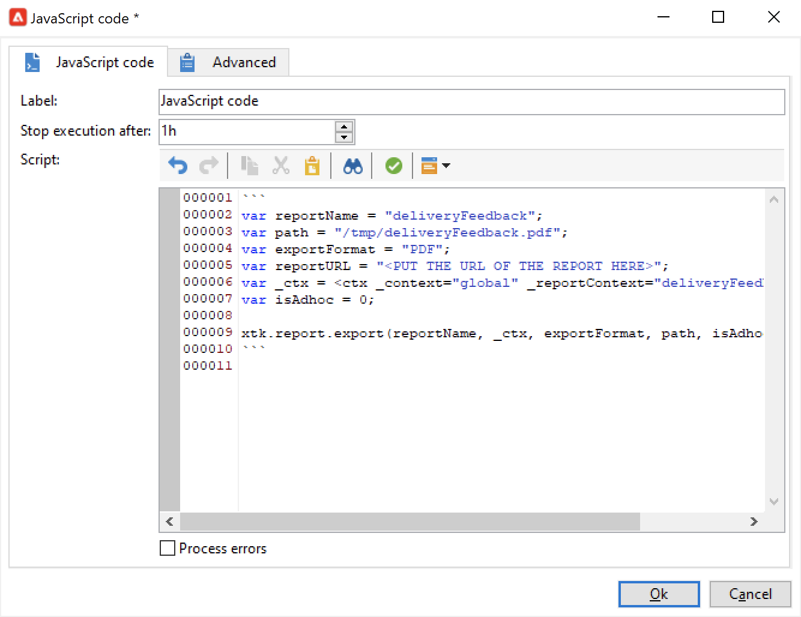

# Een rapport naar een lijst verzenden{#send-a-report-to-a-list}

Met dit gebruiksgeval kunt u elke maand een out-of-the-box genereren **[!UICONTROL Tracking indicators]** rapporteren in PDF-indeling en hoe deze naar een lijst met ontvangers wordt verzonden.


De belangrijkste implementatiestappen voor dit gebruiksgeval zijn:

* Maak een lijst met ontvangers voor dit rapport. [Meer informatie](#step-1--create-the-recipient-list).
* Maak een leveringssjabloon die elke keer dat de workflow wordt uitgevoerd een nieuwe levering maakt. [Meer informatie](#step-2--create-the-delivery-template).
* Maak een workflow die het rapport genereert in de indeling PDF en het verzendt naar de lijst met ontvangers. [Meer informatie](#step-3--create-the-workflow)).

## Stap 1: De lijst met ontvangers maken {#step-1--create-the-recipient-list}

Voer de volgende stappen uit om de lijst met doelontvangers te maken:

1. Bladeren naar de **[!UICONTROL Profiles and targets]** klikt u op de knop **[!UICONTROL Lists]** koppeling.
1. Klik op de knop **[!UICONTROL Create]**.
1. Selecteren **[!UICONTROL New list]** en maak een nieuwe lijst met ontvangers voor het rapport dat u wilt verzenden.

Raadpleeg voor meer informatie over het maken van lijsten [deze sectie](../../v8/audiences/create-audiences.md).

## Stap 2: De leveringssjabloon maken {#step-2--create-the-delivery-template}

Volg onderstaande stappen om de leveringssjabloon te maken:

1. Bladeren naar de **[!UICONTROL Resources > Templates > Delivery templates]** knooppunt van de Adobe Campaign-verkenner en dupliceer de **[!UICONTROL Email delivery]** ingebouwde sjabloon.

   Raadpleeg voor meer informatie over het maken van een leveringssjabloon [deze sectie](../../v8/send/create-templates.md).

1. Voer de sjabloonparameters in: label, doel (de lijst met eerder gemaakte ontvangers), onderwerp en inhoud.

   Elke keer dat de workflow wordt uitgevoerd, wordt **[!UICONTROL Tracking indicators]** het rapport wordt bijgewerkt zoals beschreven in [Stap 3: De workflow maken](#step-3--creating-the-workflow)).

1. Als u de meest recente versie van het rapport in de levering wilt opnemen, moet u een **[!UICONTROL Calculated attachment]**:

   * Klik op de knop **[!UICONTROL Attachments]** en klik op de pijl naast de **[!UICONTROL Add]** knop. Selecteer **[!UICONTROL Calculated attachment...]**.

      

   * In de **[!UICONTROL Type]** de meest recente optie: **[!UICONTROL File name is computed during delivery of each message (it may then depend on the recipient profile)]**.

      

      De waarde die wordt ingevoerd in het dialoogvenster **[!UICONTROL Label]** wordt niet weergegeven in de uiteindelijke levering.

   * Voer in de tekstzone het toegangspad en de naam van het bestand in.

      

      >[!CAUTION]
      >
      >Het pad en de naam moeten identiek zijn aan de in het **[!UICONTROL JavaScript code]** type activiteit van de werkstroom, zoals uitgelegd in [Stap 3: De workflow maken](#step-3--creating-the-workflow).

   * Selecteer **[!UICONTROL Advanced]** tab en check **[!UICONTROL Script the name of the file name displayed in the mails sent]**. In de tekstzone, ga de naam van de gehechtheid in de definitieve levering in.

      

## Stap 3: De workflow maken {#step-3--creating-the-workflow}

Maak de volgende workflow voor dit gebruik.


Er zijn drie activiteiten:

* A **[!UICONTROL Scheduler]** activiteit die de workflow eenmaal per maand uitvoert;
* A **[!UICONTROL JavaScript code]** activiteit die het rapport in PDF-formaat genereert;
* A **[!UICONTROL Delivery]** activiteit die naar het eerder gecreeerde leveringsmalplaatje verwijst.

Volg onderstaande stappen om deze workflow te maken:

1. Bladeren naar de **[!UICONTROL Administration > Production > Technical workflows]** knoop van Campaign exploere en creeer een nieuwe omslag om uw werkschema&#39;s op te slaan.
1. Maak een nieuwe workflow.

   

1. Begin door een **[!UICONTROL Scheduler]** type activiteit en vorm het zodat het werkschema op de eerste Maandag van de maand uitvoert.

   

   Voor meer bij het vormen van de planner, verwijs naar [Planner](scheduler.md).

1. Voeg vervolgens een **[!UICONTROL JavaScript code]** type activiteit.

   

   Voer de volgende code in de bewerkingszone in:

   ```sql
   var reportName = "indicators";
   var path = "/tmp/indicators.pdf";
   var exportFormat = "PDF";
   var reportURL = "<PUT THE URL OF THE REPORT HERE>";
   var _ctx = <ctx _context="global" _reportContext="deliveryFeedback" />
   var isAdhoc = 0;
   
   xtk.report.export(reportName, _ctx, exportFormat, path, isAdhoc);
   ```


   met de volgende variabelen:

   * **var reportName**: Voer de interne naam van het rapport tussen dubbele aanhalingstekens in. In dat geval wordt de interne naam van de **Trackingindicator** rapport is &quot;deliveryFeedback&quot;.
   * **var path**: Voer het opslagpad in van het bestand (&quot;tmp&quot;), de naam die u aan het bestand wilt geven (&quot;deliveryFeedback&quot;) en de bestandsextensie (&quot;.pdf&quot;). In dit geval hebben we de interne naam gebruikt als bestandsnaam. Waarden moeten tussen dubbele aanhalingstekens liggen en door het plusteken (+) worden gescheiden.

      >[!CAUTION]
      >
      >Het bestand moet op de server worden opgeslagen. U moet hetzelfde pad en dezelfde naam invoeren als in het dialoogvenster **[!UICONTROL General]** tabblad van het bewerkvenster voor de berekende bijlage, zoals gedetailleerd [hier](#step-2--create-the-delivery-template)).

   * **var exportFormat**: Voer de exportindeling van het bestand in (&quot;PDF&quot;).
   * **var_ctx** (context): in dit geval gebruiken wij de **[!UICONTROL Tracking indicators]** verslag uitbrengen in zijn mondiale context.

1. Voltooien door een **[!UICONTROL Delivery]** activiteit met de volgende opties:

   

   * **[!UICONTROL Delivery]**: selecteren **[!UICONTROL New, created from a template]** en selecteer de eerder gemaakte leveringssjabloon.
   * Voor de **[!UICONTROL Recipients]** en **[!UICONTROL Content]** velden, selecteren **[!UICONTROL Specified in the delivery]**.
   * **[!UICONTROL Action to perform]**: selecteren **[!UICONTROL Prepare and start]**.
   * De **[!UICONTROL Generate an outbound transition]** en **[!UICONTROL Process errors]** opties.

1. Sla uw wijzigingen op en start de workflow. Het bericht wordt verzonden naar de lijst van ontvangers elke eerste maand van de maand, met het bijgevoegde rapport.
