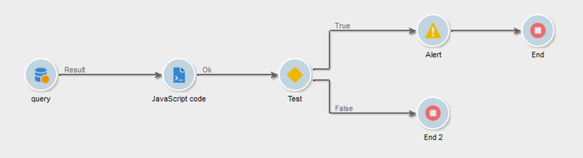
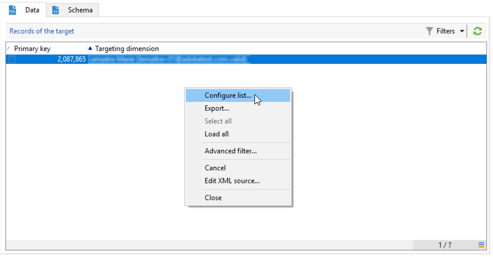

# Gepersonaliseerde waarschuwingen verzenden naar operatoren{#sending-personalized-alerts-to-operators}


In dit voorbeeld willen wij een alarm naar een exploitant verzenden die de naam van profielen zal bevatten die een nieuwsbrief opende maar niet de verbinding klikte het bevat.

De velden voor de voornaam en achternaam van de profielen zijn gekoppeld aan de **[!UICONTROL Recipients]** de doelgerichtheid van **[!UICONTROL Alert]** activiteit is gekoppeld aan de **[!UICONTROL Operator]** doelgerichtheid. Als gevolg hiervan is er geen veld beschikbaar tussen de twee doeldimensies om een afstemming uit te voeren en de velden voor de voornaam en achternaam op te halen en deze weer te geven in de activiteit Waarschuwing.

Het proces bestaat uit het ontwikkelen van een workflow zoals hieronder:

1. Een **[!UICONTROL Query]** activiteit aan doelgegevens.
1. Voeg een **[!UICONTROL JavaScript code]** activiteit in het werkschema om de bevolking te bewaren van de vraag aan de instantievariabele.
1. Een **[!UICONTROL Test]** activiteit om het aantal inwoners te controleren.
1. Een **[!UICONTROL Alert]** activiteit om een alarm naar een exploitant te verzenden, afhankelijk van **[!UICONTROL Test]** resultaat van activiteit.



## De populatie opslaan in de instantievariabele {#saving-the-population-to-the-instance-variable}

Voeg de onderstaande code toe aan de **[!UICONTROL JavaScript code]** activiteit.

```
var query = xtk.queryDef.create(  
    <queryDef schema="temp:query" operation="select">  
      <select>  
       <node expr="[target/recipient.@firstName]"/>  
       <node expr="[target/recipient.@lastName]"/>  
      </select>  
     </queryDef>  
  );  
  var items = query.ExecuteQuery();
```

Zorg ervoor dat de Javascript-code overeenkomt met uw workflowgegevens:

* De **[!UICONTROL queryDef schema]** de markering zou aan de naam van de het richten dimensie moeten beantwoorden die in de vraagactiviteit wordt gebruikt.
* De **[!UICONTROL node expr]** -tag moet overeenkomen met de naam van de velden die u wilt ophalen.


Volg onderstaande stappen om deze gegevens op te halen:

1. Klik met de rechtermuisknop op de uitgaande overgang van de **[!UICONTROL Query]** activiteit, selecteer dan **[!UICONTROL Display the target]**.

   

1. Klik met de rechtermuisknop op de lijst en selecteer vervolgens **[!UICONTROL Configure list]**.

   

1. De query voor dimensie en veldnamen wordt in de lijst weergegeven.

   

## Het aantal inwoners testen {#testing-the-population-count}

Voeg de onderstaande code toe aan de **[!UICONTROL Test]** activiteiten om te controleren of de doelpopulatie ten minste één profiel bevat.

```
var.recCount>0
```


## De waarschuwing instellen {#setting-up-the-alert}

Nu de populatie is toegevoegd aan de instantievariabele met de gewenste gebieden, kunt u deze informatie in toevoegen **[!UICONTROL Alert]** activiteit.

Om dit te doen, voeg in toe **[!UICONTROL Source]** tabblad de onderstaande code:

```
<ul>
<%
var items = new XML(instance.vars.items)
for each (var item in items){
%>
<li><%= item.target.@firstName %> <%= item.target.@lastName %></li>
<%
} %></ul>
```

>[!NOTE]
>
>De **[!UICONTROL <%= item.target.recipient.@fieldName %>]** Met deze opdracht kunt u een van de velden toevoegen die via de **[!UICONTROL JavaScript code]** activiteit.\
>U kunt zo veel velden toevoegen als u wilt, mits deze zijn ingevoegd in de JavaScript-code.


