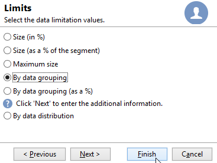
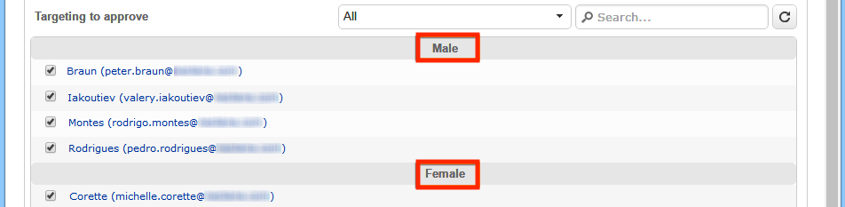

# Splitsen{#split}

A **gespleten** - type activiteit laat u een doel in verscheidene ondergroepen verdelen. Het doel is samengesteld met alle ontvangen resultaten: alle eerdere activiteiten moeten dus zijn voltooid om deze activiteit te kunnen uitvoeren.

Deze activiteit leidt niet tot een unie van binnenkomende populaties. Als meerdere overgangen in één gesplitste activiteit landen, raden we u aan een **[!UICONTROL Union]** -activiteit voor deze activiteit in te voegen.

>[!NOTE]
>
>Splitsen kan niet worden uitgevoerd voor tabellen met verschillende bronnen. Voor dit doel, moet u een **Verrijking** activiteit vóór de **Gesplitste** activiteit toevoegen.

* Voor een voorbeeld van de gespleten activiteit die wordt gebruikt, verwijs naar [&#x200B; deze sectie &#x200B;](targeting-workflows.md#create-subsets-using-the-split-activity).
* Een voorbeeld dat illustreert hoe te om de Gesplitste activiteit te gebruiken om het doel in verschillende populaties te segmenteren gebruikend het filtreren voorwaarden wordt beschreven in [&#x200B; deze sectie &#x200B;](cross-channel-delivery-workflow.md).
* Een voorbeeld dat toont hoe te om een instantievariabele in een Gesplitste activiteit te gebruiken is beschikbaar in [&#x200B; deze sectie &#x200B;](javascript-scripts-and-templates.md).

Als u deze activiteit wilt configureren, definieert u de inhoud en het label van de subset op het tabblad **[!UICONTROL Subsets]** en kiest u vervolgens de doeldimensie op het tabblad **[!UICONTROL General]** .

## Subsets maken {#create-subsets}

Een subset maken:

1. Klik op het label in het desbetreffende veld en selecteer het filter dat u wilt toepassen.
1. Als u de binnenkomende populatie wilt filteren, selecteert u de optie **[!UICONTROL Add a filtering condition]** en klikt u op de koppeling **[!UICONTROL Edit...]** .

   Selecteer het type filter dat op de gegevens moet worden toegepast om het in deze set op te nemen.

   Het proces is het zelfde als voor a **vraag** - type activiteit.

   >[!NOTE]
   >
   >U kunt de gegevens filteren in maximaal twee externe databases (FDA).

1. U kunt het maximumaantal records opgeven dat uit het doel moet worden geëxtraheerd om de subset te maken. Controleer hiervoor de optie **[!UICONTROL Limit the selected records]** en klik op de koppeling **[!UICONTROL Edit...]** .

   Met een wizard kunt u de selectiemodus kiezen voor records van deze subset. [Meer informatie](#limit-the-number-of-subset-records).

   

1. Als u wenst, kunt u andere subsets **toevoegen gebruikend de &#x200B;** [!UICONTROL Add]&#x200B;**knoop.**

   

   >[!NOTE]
   >
   >Als de optie **[!UICONTROL Enable overlapping of output populations]** niet is ingeschakeld, worden subsets gemaakt in de volgorde van de tabbladen. Gebruik de pijlen in de rechterbovensectie van dit venster om ze te verplaatsen. Als de eerste subset bijvoorbeeld 70% van de oorspronkelijke populatie herstelt, past de volgende subset zijn selectiecriteria alleen toe op de resterende 30%, enzovoort.

   Voor elke gemaakte subset wordt een uitgaande overgang toegevoegd aan de splitsingsactiviteit.

   

   U kunt één uitgaande overgang genereren (en sets identificeren met behulp van bijvoorbeeld de segmentcode): hiervoor selecteert u de optie **[!UICONTROL Generate subsets in the same table]** op het tabblad **[!UICONTROL General]** .

   Als het wordt voltooid, wordt de segmentcode van elke subset automatisch opgeslagen in een extra kolom. Deze kolom zal in de verpersoonlijkingsgebieden op leveringsniveau toegankelijk zijn.

## Het aantal subsetrecords beperken {#limit-the-number-of-subset-records}

Als u niet de gehele populatie wilt gebruiken die zich in een subset bevindt, kunt u het aantal records beperken dat deze bevat.

1. Controleer in het bewerkingsvenster van de subset de optie **[!UICONTROL Limit the selected records]** en klik op de koppeling **[!UICONTROL Edit...]** .
1. Selecteer het type limiet voor uw keuze:

   * **[!UICONTROL Activate random sampling]** : voor deze optie wordt een willekeurige steekproef van de records genomen. Het type willekeurige bemonstering is afhankelijk van de database-engine.
   * **[!UICONTROL Keep only the first records after sorting]** : met deze optie kunt u een beperking definiëren op basis van een of meer sorteervolgordes. Als u het veld **[!UICONTROL Age]** selecteert als sorteercriterium en 100 als limiet, worden alleen de jongste 100 ontvangers bewaard.
   * **[!UICONTROL Keep the first ones after sorting (criteria, random)]**: met deze optie worden de twee vorige opties gecombineerd. Hiermee kunt u een beperking definiëren op basis van een of meer sorteervolgorden en vervolgens een willekeurige selectie toepassen op de eerste records als sommige records dezelfde waarden hebben als de gedefinieerde criteria.

     Als u bijvoorbeeld het veld **[!UICONTROL Age]** selecteert als sorteercriteria en u vervolgens een limiet van 100 definieert, maar de 2000 jongste ontvangers in de database zijn alle 18, worden 100 ontvangers willekeurig geselecteerd uit die 2000.

   

1. Als u sorteercriteria wilt definiëren, kunt u met een extra stap de kolommen en de sorteervolgorde definiëren.

   

1. Kies vervolgens de methode voor gegevensbeperking.

   

   Er zijn verschillende manieren om dit te doen:

   * **[!UICONTROL Size (in %)]** : een percentage records. De configuratie hieronder extraheert bijvoorbeeld 10% van de totale bevolking.

     Het percentage is van toepassing op de initiële populatie, niet op het resultaat van de activiteit.

   * **[!UICONTROL Size (as a % of the segment)]**: een percentage records dat alleen betrekking heeft op de subgroepen en niet op de eerste populatie.
   * **[!UICONTROL Maximum size]** : een maximum aantal records.
   * **[!UICONTROL By data grouping]**: u kunt een limiet instellen voor het aantal records, afhankelijk van de waarden in een opgegeven veld van de binnenkomende populatie. [Meer informatie](#limit-the-number-of-subset-records-by-data-grouping).
   * **[!UICONTROL By data grouping (in %)]**: u kunt een limiet instellen voor het aantal records, afhankelijk van de waarden in een opgegeven veld van de binnenkomende populatie met een percentage. [Meer informatie](#limit-the-number-of-subset-records-by-data-grouping).
   * **[!UICONTROL By data distribution]**: als uw groeperingsvelden te veel waarden hebben of als u wilt voorkomen dat de waarden opnieuw worden ingevoerd voor elke nieuwe gesplitste activiteit, kunt u met Adobe Campaign een **[!UICONTROL By data distribution]** -beperking (optionele module Distributed Marketing) configureren. [Meer informatie](#limit-the-number-of-subset-records-per-data-distribution).

1. Klik op **[!UICONTROL Finish]** om de criteria voor recordselectie goed te keuren. De bepaalde configuratie wordt dan getoond in het middelste venster van de redacteur.

## Het aantal subsetrecords beperken op gegevensgroepering {#limit-the-number-of-subset-records-by-data-grouping}

U kunt het aantal records beperken door gegevensgroepering. Deze grenswaarde kan met een vaste waarde of een percentage worden vastgesteld.

Als u bijvoorbeeld het veld **[!UICONTROL Language]** selecteert als een groepsveld, kunt u een lijst met records voor elke taal definiëren.

1. Selecteer **[!UICONTROL By data grouping]** of **[!UICONTROL By data grouping (as a %)]** nadat u de gegevensbeperkingswaarden hebt geselecteerd en klik op **[!UICONTROL Next]** .

   

1. Selecteer vervolgens het groeperingsveld (bijvoorbeeld het **[!UICONTROL Language]** veld) en klik op **[!UICONTROL Next]** .

   

1. Geef ten slotte de drempelwaarden voor gegevensgroepering op (waarbij de vaste waarden of percentages worden gebruikt, afhankelijk van de eerder geselecteerde groeperingsmethode). Als u dezelfde drempel voor elke waarde wilt instellen, bijvoorbeeld als u het aantal records voor elke taal wilt instellen op 10, selecteert u de optie **[!UICONTROL All data groupings are the same size]** . Als u een andere limiet voor elke waarde wilt instellen, selecteert u de optie **[!UICONTROL Limitations by grouping value]** . Op deze manier kunt u een andere beperking kiezen voor Engels, Frans, enzovoort.

   

1. Klik op **[!UICONTROL Finish]** om de beperking goed te keuren en terug te keren naar het bewerken van de gesplitste activiteit.

## Het aantal subsetrecords per gegevensdistributie beperken {#limit-the-number-of-subset-records-per-data-distribution}

Als uw groeperingsvelden een te groot aantal waarden bevatten of als u wilt voorkomen dat waarden opnieuw worden ingesteld voor elke nieuwe gesplitste activiteit, kunt u met Adobe Campaign een beperking per gegevensdistributie maken. Wanneer het selecteren van [&#x200B; waarden van de gegevensbeperking &#x200B;](#create-subsets) sectie), selecteer de **[!UICONTROL By data distribution]** optie en selecteer een malplaatje van het drop-down menu. Hieronder ziet u hoe u een sjabloon voor gegevensdistributie maakt.

Voor een voorbeeld van de **[!UICONTROL Local approval]** activiteit met een distributiemalplaatje, verwijs naar [&#x200B; deze pagina &#x200B;](local-approval-activity.md).

>[!CAUTION]
>
>Deze functie is slechts beschikbaar met [&#x200B; Verdeelde toe:voegen-aan &#x200B;](../distributed-marketing/about-distributed-marketing.md). Controleer hiervoor uw licentieovereenkomst.

Met de sjabloon voor gegevensdistributie kunt u het aantal records beperken aan de hand van een lijst met groeperingswaarden. Voer de volgende stappen uit om een sjabloon voor gegevensdistributie te maken:

1. Ga naar het knooppunt **[!UICONTROL Resources > Campaign management > Data distribution]** en klik op **[!UICONTROL New]** om de sjabloon voor gegevensdistributie te maken.

   

1. Op het tabblad **[!UICONTROL General]** kunt u het label en de uitvoeringscontext van de distributie invoeren (dimensie opgeven, distributieveld).

   

   De volgende velden moeten worden ingevuld:

   * **[!UICONTROL Label]** : label voor de distributiesjabloon.
   * **[!UICONTROL Targeting dimension]** : voer de doeldimensie in waarop de gegevensdistributie wordt toegepast, bijvoorbeeld **[!UICONTROL Recipient]** . Dit schema moet altijd compatibel zijn met de gegevens die worden gebruikt in de doelworkflow.
   * **[!UICONTROL Distribution field]**: selecteer een veld via de doeldimensie. Als u bijvoorbeeld het veld **[!UICONTROL Email domain]** selecteert, wordt de lijst met ontvangers uitgesplitst naar domein.
   * **[!UICONTROL Distribution type]** : selecteer de manier waarop de beperkingswaarde van het doel wordt opgesplitst op de tab **[!UICONTROL Distribution]** **[!UICONTROL Percentage]** of **[!UICONTROL Set]** .
   * **[!UICONTROL Approval storage]**: als u de activiteit van de a [&#x200B; Lokale goedkeuring &#x200B;](local-approval.md) in uw het richten werkschema gebruikt, ga het schema in waarin de goedkeuringsresultaten zullen worden opgeslagen. U moet één opslagschema per het richten schema specificeren. Als u het **[!UICONTROL Recipients]** richtingsschema gebruikt, voert u het standaard **[!UICONTROL Local approval of recipients]** -opslagschema in.

     Als er sprake is van een eenvoudige beperking door gegevensgroepering zonder lokale goedkeuring, hoeft u het veld **[!UICONTROL Approvals storage]** niet in te voeren.

1. Als u a [&#x200B; Lokale goedkeurings &#x200B;](local-approval.md) activiteit gebruikt, ga **[!UICONTROL Advanced settings]** voor het distributiemalplaatje in:

   

   De volgende velden moeten worden ingevuld:

   * **[!UICONTROL Approve targeted messages]**: controleer deze optie als u wilt dat alle ontvangers worden geselecteerd uit de lijst met ontvangers die moeten worden goedgekeurd. Als deze optie is uitgeschakeld, wordt geen ontvanger vooraf geselecteerd.

     >[!NOTE]
     >
     >Deze optie is standaard ingeschakeld.

     

   * **[!UICONTROL Delivery label]**: hiermee kunt u een expressie definiëren waarmee het leveringslabel in het retourbericht wordt weergegeven. De standaarduitdrukking verstrekt informatie over het standaardetiket van de levering (compute koord). U kunt deze expressie wijzigen.

     

   * **[!UICONTROL Grouping field]**: in dit veld kunt u de groepering definiëren die wordt gebruikt om ontvangers weer te geven in goedkeurings- en retourberichten.

     

   * **[!UICONTROL Web Interface]** : hiermee kunt u een webtoepassing koppelen aan de lijst met ontvangers. In het goedkeurings en terugkeerbericht, zal elke ontvanger klikbaar zijn en zal met de geselecteerde Webtoepassing verbinden. Met het veld **[!UICONTROL Parameters]** (bijvoorbeeld **[!UICONTROL recipientId]** ) kunt u de aanvullende parameter configureren die in de URL en de webtoepassing moet worden gebruikt.

1. Op het tabblad **[!UICONTROL Breakdown]** kunt u de lijst met distributiewaarden definiëren.

   

   * **[!UICONTROL Value]** : voer de distributiewaarden in.
   * **[!UICONTROL Percentage / Set]**: voer de recordlimiet (vast of percentage) in die aan elke waarde is gekoppeld.

     Deze kolom wordt gedefinieerd door het veld **[!UICONTROL Distribution type]** op de tab **[!UICONTROL General]** .

   * **[!UICONTROL Label]** : voer het label in dat aan elke waarde is gekoppeld.
   * **[!UICONTROL Group or operator]**: als u a [&#x200B; Lokale goedkeuring &#x200B;](local-approval.md) activiteit gebruikt, selecteer de exploitant of de groep exploitanten die aan elke verdelingswaarde worden toegewezen.

     Als er sprake is van een eenvoudige beperking door gegevensgroepering zonder lokale goedkeuring, hoeft u het veld **[!UICONTROL Group or operator]** niet in te voeren.

     >[!CAUTION]
     >
     >Controleer of aan de operatoren de juiste machtigingen zijn toegewezen.

## Parameters filteren {#filtering-parameters}

Klik op het tabblad **[!UICONTROL General]** om het activiteitlabel in te voeren. Selecteer de doel- en filterafmetingen voor deze splitsing. Indien nodig kunt u deze afmetingen voor een bepaalde subset wijzigen.

Schakel de optie **[!UICONTROL Generate complement]** in als u de resterende populatie wilt benutten. De complement is het binnenkomende doel min de samenvoeging van de subsets. Een extra uitgaande overgang zal dan aan de activiteit worden toegevoegd, als volgt:

Deze optie werkt alleen correct als de binnenkomende gegevens een primaire sleutel hebben.

Als de gegevens bijvoorbeeld rechtstreeks worden gelezen vanuit een externe database, zoals Netezza (die het begrip index niet ondersteunt) via een **[!UICONTROL Data loading (RDBMS)]** -activiteit, is de aanvulling die wordt gegenereerd door de **[!UICONTROL Split]** -activiteit onjuist.

U kunt dit voorkomen door een **[!UICONTROL Enrichment]** -activiteit net voor de **[!UICONTROL Split]** -activiteit te slepen en neer te zetten. Controleer in de **[!UICONTROL Enrichment]** -activiteit de **[!UICONTROL Keep all additional data from the main set]** en geef in de aanvullende gegevens de kolommen op die u wilt gebruiken voor het configureren van de filters van de **[!UICONTROL Split]** -activiteit. De gegevens van de binnenkomende overgang van de **[!UICONTROL Split]** activiteit worden dan plaatselijk opgeslagen in een tijdelijke lijst op de server van Adobe Campaign en de aanvulling kan correct worden geproduceerd.

Met de optie **[!UICONTROL Enable overlapping of output populations]** kunt u populaties beheren die tot verschillende subsets behoren:

* Wanneer het vakje niet wordt gecontroleerd, zorgt de gespleten activiteit ervoor een ontvanger niet in verscheidene outputovergangen kan aanwezig zijn, zelfs als het aan de criteria van verscheidene subsets voldoet. Deze worden als doel ingesteld op het eerste tabblad met overeenkomende criteria.
* Als het selectievakje is ingeschakeld, kunnen de ontvangers in verschillende subsets worden gevonden als ze voldoen aan hun filtercriteria. Adobe Campaign raadt aan exclusieve criteria te hanteren.

## Invoerparameters {#input-parameters}

* tableName
* schema

Elke binnenkomende gebeurtenis moet een doel specificeren dat door deze parameters wordt bepaald.

## Uitvoerparameters {#output-parameters}

* tableName
* schema
* recCount

Deze reeks van drie waarden identificeert het doel dat uit de uitsluiting voortvloeit. **[!UICONTROL tableName]** is de naam van de tabel waarin de doel-id&#39;s worden vastgelegd. **[!UICONTROL schema]** is het schema van de populatie (gewoonlijk nms:ontvanger) en **[!UICONTROL recCount]** is het aantal elementen in de tabel.

De overgang verbonden aan het complement heeft de zelfde parameters.
