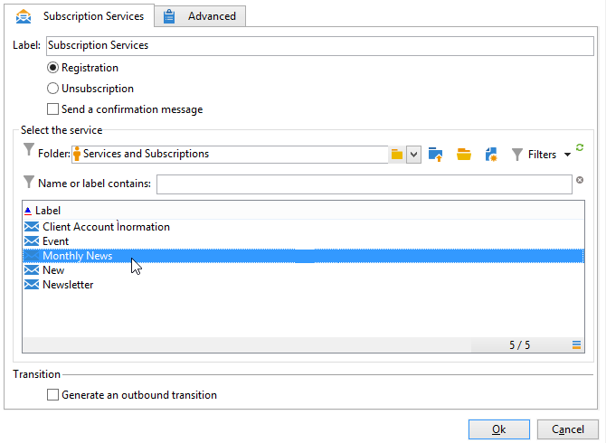

# Lidmaatschapsservices{#subscription-services}

A **Abonnementsdiensten** Met activiteit van het type -type kunt u een abonnement op een informatiedienst maken of verwijderen voor de populatie die in de overgang is opgegeven.

Om het te vormen, geef de activiteit uit en ga zijn etiket in, dan selecteer de uit te voeren actie (Abonnement of Unsubscription) en de dienst in kwestie, zoals in het volgende voorbeeld:

1. Voer het label van de activiteit in.
1. Selecteren **[!UICONTROL Generate an outbound transition]** als u aan het einde van de uitvoering een overgang wilt maken.

   Over het algemeen markeert een abonnement van een doel op een informatiedienst het einde van de doelworkflow. Daarom wordt de optie niet standaard geactiveerd.

1. Klikken **[!UICONTROL Subscription]** of **[!UICONTROL Unsubscription]** als u zich wilt abonneren op of een abonnement wilt nemen op de opgegeven populatie van of naar de geselecteerde informatiedienst.
1. Selecteren **[!UICONTROL Send a confirmation message]** om ontvangers op de hoogte te stellen van het feit dat zij zijn geabonneerd op of niet geabonneerd zijn op een service.

   De inhoud van dit bericht wordt gespecificeerd in een leveringsmalplaatje met betrekking tot de informatiedienst. Raadpleeg dit voor meer informatie.

## Voorbeeld: Een lijst met ontvangers abonneren op een nieuwsbrief {#example--subscribe-a-list-of-recipients-to-a-newsletter}

In één enkele operatie is de volgende workflow bedoeld om een lijst op te stellen van ontvangers die in aanmerking komen voor een nieuwsbrief, gericht op werkende mensen die in Parijs wonen, om hen te laten inschrijven.

Hiervoor moet u ook ontvangers uitsluiten die al zijn geabonneerd.

>[!CAUTION]
>
>Alvorens manueel ontvangers aan de dienst in te tekenen, verifieer dat deze ontvangers goedkeuren om mededelingen van u te ontvangen.

1. Voeg de volgende drie vragen toe:

   * Eén gericht op ontvangers in de leeftijd van 18 tot 60 jaar.
   * Een tweede gericht op ontvangers die in Parijs wonen.
   * Een derde gericht op ontvangers die momenteel niet aan de nieuwsbrief worden geabonneerd.

1. Voeg een doorsnedeactiviteit toe om de verschillende resultaten te verwijzen.
1. Voeg desgewenst een lijst bij om de lijst met de meest recente abonnees up-to-date te houden.
1. Voeg een activiteit van de abonnementsdiensten in, dan klik dit tweemaal om het te vormen.
1. Voer het activiteitenlabel in en selecteer **[!UICONTROL Subscription]**.

   Als u wilt, kunt u ontvangers op de hoogte stellen van hun abonnement op de nieuwsbrief door de **[!UICONTROL Send a confirmation message]** doos.

1. Selecteer de map waarin de nieuwsbrief zich bevindt en selecteer vervolgens de nieuwsbrief in de lijst die wordt weergegeven.
1. Laat de **[!UICONTROL Generate outbound transition]** niet geselecteerd zodat deze activiteit het eind van het werkschema zal merken, dan klik **[!UICONTROL Ok]**.

Tijdens werkschemauitvoering, worden de ontvangers die aan alle drie vragen beantwoorden toegevoegd aan de lijst en aan nieuwsbrief geabonneerd.

U kunt controleren of het abonnement is gelukt door naar de **[!UICONTROL Subscription]** voor uw ontvangers.

## Invoerparameters {#input-parameters}

* tableName
* schema

Elke binnenkomende gebeurtenis moet een doel specificeren dat door deze parameters wordt bepaald.
