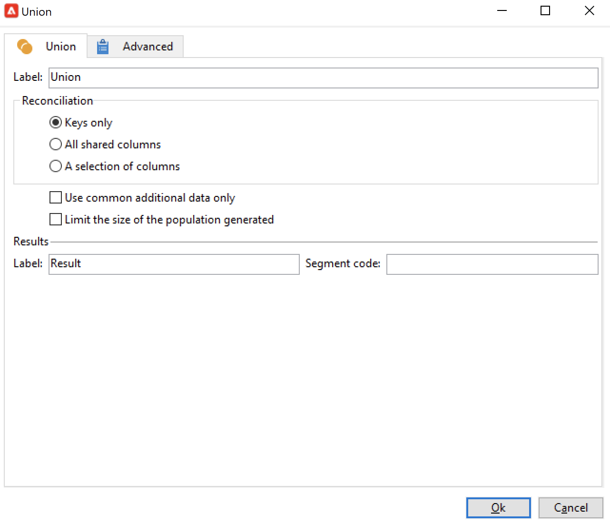

# Een targetingworkflow maken{#target-data}

De werkstroom kan worden gebruikt om het gegevensbestand te vragen en uw gegevens te segmenteren. De het werkschemamodule van de campagne is een krachtig hulpmiddel om gegevensbeheeractiviteiten uit te voeren, gegevens te halen te verrijken en om te zetten, publiek te beheren, en populaties te verfijnen.

Met doelgerichte workflows kunt u verschillende leveringsdoelen maken. U kunt query&#39;s maken, samenvoegingen of uitsluitingen definiëren op basis van specifieke criteria, planning toevoegen dankzij workflowactiviteiten. Het resultaat van deze gerichte actie kan automatisch worden overgedragen naar een lijst die als doel van leveringsacties kan dienen

Naast deze activiteiten kunt u met de opties voor gegevensbeheer gegevens manipuleren en geavanceerde functies gebruiken om complexe doelproblemen op te lossen. Voor meer op dit, verwijs naar [ Beheer van Gegevens ](targeting-workflows.md#data-management).

Al deze activiteiten vindt u op het eerste tabblad van de workflow.

>[!NOTE]
>
>Het richten activiteiten zijn gedetailleerd in [ deze sectie ](activities.md).

Doelworkflows kunnen worden gemaakt en bewerkt via het knooppunt **[!UICONTROL Profiles and Targets > Jobs > Targeting workflows]** van de Adobe Campaign-structuur of via het menu **[!UICONTROL Profiles and Targets > Targeting workflows]** van de startpagina.

Het richten van werkschema&#39;s binnen het kader van een campagne wordt opgeslagen met alle campagnewerkschema&#39;s.

## Belangrijke stappen om een doelworkflow te maken {#implementation-steps-}

De stappen voor het maken van een doelworkflow worden in de volgende secties beschreven:

1. **identificeer** gegevens in het gegevensbestand - zie [ vragen ](#create-queries) creëren
1. **bereidt** gegevens voor om leveringsbehoeften te voldoen - zie [ Verrijken en gegevens wijzigen ](#enrich-and-modify-data)
1. **Gegevens van het Gebruik** om updates of binnen een levering uit te voeren - zie [ het gegevensbestand ](use-workflow-data.md#update-the-database) bijwerken

De resultaten van alle verrijkingen en alle handgrepen die tijdens het richten worden uitgevoerd worden opgeslagen en toegankelijk op verpersoonlijkingsgebieden, met name voor gebruik wanneer het creëren van gepersonaliseerde berichten. Voor meer op dit, verwijs naar [ gegevens van het Doel ](use-workflow-data.md#target-data).

## Afmetingen gericht en filteren {#targeting-and-filtering-dimensions}

Tijdens de verrichtingen van de gegevenssegmentatie, wordt de het richten sleutel in kaart gebracht aan een het filtreren dimensie. Met de doeldimensie kunt u de doelgroep van de actie definiëren: ontvangers, begunstigden van contracten, exploitant, abonnees, enz. Met de filterdimensie kunt u de populatie selecteren op basis van bepaalde criteria: contractanten, abonnees van nieuwsbrieven, enz.

Bijvoorbeeld, om cliënten te selecteren die een leven-verzekering voor meer dan 5 jaar hebben gehad, selecteer de volgende het richten dimensie: **Clients** en de volgende het filtreren dimensie: **de houder van het Contract**. U kunt de het filtreren voorwaarden binnen de vraagactiviteit dan bepalen

Tijdens het gericht afmetingsselectiefase, slechts worden de compatibele het filtreren dimensies aangeboden in de interface.

Deze twee dimensies moeten met elkaar verband houden. De inhoud van de lijst **[!UICONTROL Filtering dimension]** is dus afhankelijk van de doeldimensie die in het eerste veld is opgegeven.

Bijvoorbeeld, voor ontvangers (**ontvanger**), zullen de volgende het filtreren dimensies beschikbaar zijn:

Terwijl voor **Bezoekers**, zal de lijst de volgende het filtreren dimensies bevatten:

## Query&#39;s maken {#create-queries}

### Werken met aanvullende gegevens {#select-data}

Met een **[!UICONTROL Query]** -activiteit kunt u basisgegevens selecteren om de doelpopulatie samen te stellen. Raadpleeg [deze sectie](query.md#create-a-query) voor meer informatie.

U kunt de volgende activiteiten ook gebruiken om gegevens van het gegevensbestand te vragen en te raffineren: [ Incrementele vraag ](incremental-query.md), [ leest lijst ](read-list.md).

Het is mogelijk aanvullende gegevens te verzamelen die gedurende de gehele levenscyclus van de werkstroom moeten worden doorgestuurd en verwerkt. Voor meer op dit, verwijs naar [ gegevens ](query.md#add-data) toevoegen en [ geef extra gegevens ](#edit-additional-data) uit.

### Aanvullende gegevens bewerken {#edit-additional-data}

Zodra extra gegevens zijn toegevoegd, kunt u het uitgeven of het gebruiken om het doel te raffineren dat in de vraagactiviteit wordt bepaald.

Met de koppeling **[!UICONTROL Edit additional data...]** kunt u de toegevoegde gegevens weergeven en wijzigen of toevoegen.

Als u gegevens wilt toevoegen aan de eerder gedefinieerde uitvoerkolommen, selecteert u deze in de lijst met beschikbare velden. Als u een nieuwe uitvoerkolom wilt maken, klikt u op het pictogram **[!UICONTROL Add]** , selecteert u het veld en klikt u op **[!UICONTROL Edit expression]** .

Klik de **Geavanceerde selectie** knoop.

Definieer een berekeningsmodus voor het veld dat moet worden toegevoegd, zoals bijvoorbeeld een aggregaat.

Met de optie **[!UICONTROL Add a sub-item]** kunt u berekende gegevens aan de verzameling koppelen. Hiermee kunt u de aanvullende gegevens uit de verzameling selecteren of geaggregeerde berekeningen voor verzamelingselementen definiëren.

De subelementen worden weergegeven in de substructuur van de verzameling waaraan ze zijn toegewezen.

Verzamelingen worden weergegeven op het subtabblad **[!UICONTROL Collections]** . U kunt de verzamelde elementen filteren door op het pictogram **[!UICONTROL Detail]** van de geselecteerde verzameling te klikken. Met de filterwizard kunt u de verzamelde gegevens selecteren en de filtervoorwaarden opgeven die op de gegevens in de verzameling moeten worden toegepast.

### Een doel verfijnen met behulp van aanvullende gegevens {#refine-the-target-using-additional-data}

De extra verzamelde gegevens kunnen u toelaten om gegevens het filtreren in het gegevensbestand te verfijnen. Klik hiertoe op de koppeling **[!UICONTROL Refine the target using additional data...]** : hiermee kunt u de toegevoegde gegevens overschrijven.

### Gegevens homogeniseren {#homogenize-data}

Bij **[!UICONTROL Union]** - of **[!UICONTROL Intersection]** -type-activiteiten kunt u ervoor kiezen alleen gedeelde aanvullende gegevens te behouden om de gegevens consistent te houden. In dit geval bevat de tijdelijke uitvoerwerktabel van deze activiteit alleen de aanvullende gegevens die in alle binnenkomende sets worden gevonden.

### Combineren met aanvullende gegevens {#reconciliation-with-additional-data}

Tijdens de afstemmingsfasen (**[!UICONTROL Union]**, **[!UICONTROL Intersection]**, enz.) activiteiten) selecteert u de kolommen die u wilt gebruiken voor het afstemmen van gegevens in de extra kolommen. Hiertoe configureert u een afstemming op een selectie van kolommen en geeft u de hoofdset op. Selecteer vervolgens de kolommen in de onderste kolom van het venster, zoals in het volgende voorbeeld wordt getoond:

Selecteer een expressie en bevestig deze.

### Subsets maken {#create-subsets}

Met de **[!UICONTROL Split]** -activiteit kunt u subsets maken op basis van criteria die zijn gedefinieerd via extractiequery&#39;s. Voor elke ondergroep, wanneer u een filtervoorwaarde op de bevolking uitgeeft, zult u tot de standaardvraagactiviteit toegang hebben die u de voorwaarden van de doelsegmentatie laat bepalen.

U kunt een doel in verscheidene subsets verdelen gebruikend slechts extra gegevens als het filtreren voorwaarden, of naast doelgegevens. U kunt externe gegevens ook gebruiken als u de **Federated optie van de Toegang van Gegevens** hebt gekocht.

Raadpleeg [deze sectie](#create-subsets-using-the-split-activity) voor meer informatie.

## Segmentgegevens {#segment-data}

### Verschillende doelen combineren (Unie) {#combine-several-targets--union-}

Met de vakbondsactiviteit kunt u het resultaat van verschillende activiteiten in één overgang combineren. Stellen hoeven niet noodzakelijkerwijs homogeen te zijn.

De volgende afstemmingsopties voor gegevens zijn beschikbaar:

* **[!UICONTROL Keys only]**

  Deze optie kan worden gebruikt als de inputpopulaties homogeen zijn.

* **[!UICONTROL All columns in common]**

  Met deze optie kunt u gegevens afstemmen op basis van alle kolommen die de verschillende populaties van het doel gemeen hebben.

  Adobe Campaign geeft kolommen aan op basis van hun naam. Een tolerantiedrempel wordt geaccepteerd: een kolom &#39;E-mail&#39; kan bijvoorbeeld worden herkend als identiek aan een kolom &#39;@email&#39;.

* **[!UICONTROL A selection of columns]**

  Selecteer deze optie om de lijst met kolommen te definiëren waarop de afstemming van gegevens wordt toegepast.

  Begin door de belangrijkste reeks (die bevat de brongegevens) te selecteren, dan de kolommen die voor de verbinding moeten worden gebruikt.

  

  >[!CAUTION]
  >
  >Tijdens de afstemming van gegevens worden populaties niet gededupliceerd.

  U kunt de populatiegrootte tot een bepaald aantal verslagen beperken. Klik hiertoe op de gewenste optie en geef het aantal records op dat u wilt behouden.

  Geef ook de prioriteit van de binnenkomende populaties op: in de onderste sectie van het venster worden de binnenkomende overgangen van de samenvoegactiviteit weergegeven en kunt u deze sorteren met de blauwe pijlen rechts van het venster.

  De gegevens worden eerst overgenomen uit de populatie van de eerste binnenkomende overgang in de lijst. Als het maximum niet is bereikt, worden ze onttrokken aan de populatie van de tweede binnenkomende overgang, enz.

  

### Verbindingsgegevens extraheren (doorsnede) {#extract-joint-data--intersection-}

Met het snijpunt kunt u alleen de regels herstellen die worden gedeeld door de populaties van binnenkomende overgangen. Deze activiteit moet als vakbondsactiviteit worden gevormd.

Bovendien is het mogelijk om slechts een selectie van kolommen te houden, of slechts de kolommen die door de binnenkomende bevolking worden gedeeld.

De intersectieactiviteit is gedetailleerd in de [ sectie van de Intersectie ](intersection.md).

### Een populatie uitsluiten (Uitsluiting) {#exclude-a-population--exclusion-}

Met de uitsluitingsactiviteit kunt u de elementen van een doel uitsluiten van een andere doelpopulatie. De doeldimensie van deze activiteit is die van de hoofdset.

Indien nodig, is het mogelijk om binnenkomende lijsten te manipuleren. Om een doel van een andere dimensie uit te sluiten, moet dit doel worden teruggebracht naar dezelfde doeldimensie als het hoofddoel. Klik hiertoe op de knop **[!UICONTROL Add]** en geef de voorwaarden voor het wijzigen van de afmetingen op.

Afstemming van gegevens vindt plaats via een id, een veranderende as of een samenvoeging.

### Subsets maken met de splitsingsactiviteit {#create-subsets-using-the-split-activity}

De **[!UICONTROL Split]** -activiteit is een standaardactiviteit waarmee u zoveel sets kunt maken als nodig via een of meerdere filterdimensies en waarbij u ook één uitvoerovergang per subset of een unieke overgang kunt genereren.

De extra gegevens die door de binnenkomende overgang worden overgebracht kunnen in de het filtreren criteria worden gebruikt.

Om het te vormen, moet u eerst criteria selecteren:

1. Sleep een **[!UICONTROL Split]** -activiteit in uw workflow en zet deze neer.
1. Selecteer op het tabblad **[!UICONTROL General]** de gewenste optie: **[!UICONTROL Use data from the target and additional data]** , **[!UICONTROL Use the additional data only]** of **[!UICONTROL Use external data]** .
1. Als de optie **[!UICONTROL Use data from the target and additional data]** is geselecteerd, kunt u met de doeldimensie alle gegevens gebruiken die door de binnenkomende overgang worden overgebracht.

   

   Wanneer subsets worden gemaakt, worden de eerder vermelde filterparameters gebruikt.

   Als u filtervoorwaarden wilt definiëren, kiest u de optie **[!UICONTROL Add a filtering condition on the inbound population]** en klikt u op de koppeling **[!UICONTROL Edit...]** . Geef vervolgens de filtervoorwaarden op voor het maken van deze subset.

   

   Een voorbeeld dat toont hoe te om het filtreren voorwaarden in de **[!UICONTROL Split]** activiteit te gebruiken om het doel in verschillende populaties te segmenteren wordt beschreven in [ deze sectie ](cross-channel-delivery-workflow.md).

   In het veld **[!UICONTROL Label]** kunt u de nieuwe subset een naam geven die overeenkomt met de uitgaande overgang.

   U kunt ook een segmentcode aan de subset toewijzen om deze te identificeren en te gebruiken om de populatie te bepalen.

   Indien nodig, kunt u de het richten en het filtreren dimensies individueel voor elke ondergroep veranderen u wilt tot stand brengen. Hiervoor bewerkt u de filtervoorwaarde van de subset en controleert u de optie **[!UICONTROL Use a specific filtering dimension]** .

   

1. Als de optie **[!UICONTROL Use the additional data only]** is geselecteerd, worden alleen aanvullende gegevens aangeboden voor filteren van subsets.

1. Als de **Verdeelde optie van de Toegang van Gegevens** wordt toegelaten, laat **[!UICONTROL Use external data]** u gegevens in een extern gegevensbestand verwerken dat reeds wordt gevormd, of een nieuwe verbinding tot stand brengen met een gegevensbestand.

Vervolgens moeten nieuwe subsets worden toegevoegd:

1. Klik op de knop **[!UICONTROL Add]** en definieer de filtervoorwaarden.

   

1. Definieer de filterdimensie op het tabblad **[!UICONTROL General]** van de activiteit (zie boven). Deze wordt standaard toegepast op alle subsets.

   

1. Indien nodig kunt u de filterdimensie voor elke subset afzonderlijk wijzigen. Hiermee kunt u een set maken voor alle houders van een Gold-kaart, één voor alle ontvangers die op de meest recente nieuwsbrief hebben geklikt en een derde voor personen van 18 tot en met 25 jaar die de laatste 30 dagen in de winkel een aankoop hebben gedaan, allemaal met dezelfde gesplitste activiteit. Selecteer hiertoe de optie **[!UICONTROL Use a specific filtering dimension]** en selecteer de context voor het filteren van gegevens.

Nadat subsets zijn gemaakt, toont de splitsingsactiviteit standaard evenveel uitvoerovergangen als er subsets zijn:

U kunt al deze subsets groeperen in één uitvoerovergang. In dit geval is de koppeling naar de desbetreffende subsets bijvoorbeeld zichtbaar in de segmentcode. Selecteer hiervoor de optie **[!UICONTROL Generate all subsets in the same table]** .

Bijvoorbeeld, kunt u één enkele leveringsactiviteit plaatsen en de leveringsinhoud personaliseren die op de segmentcode van elke ontvankelijke reeks wordt gebaseerd.

Subsets kunnen ook worden gemaakt met behulp van de **[!UICONTROL Cells]** -activiteit. Voor meer op dit, verwijs naar de [ sectie van Cellen ](cells.md).

### Doelgegevens gebruiken {#using-targeted-data}

Zodra de gegevens zijn geïdentificeerd en opgesteld, kunnen ze in de volgende context worden gebruikt:

* U kunt de gegevens in de database bijwerken na gegevensmanipulatie in de verschillende werkstroomfasen.

  Voor meer op dit, [ gegevens van de Update ](update-data.md).

* U kunt ook de inhoud van bestaande lijsten vernieuwen.

  Voor meer op dit, verwijs naar [ update van de Lijst ](list-update.md).

* U kunt leveringen rechtstreeks voorbereiden of starten in de workflow.

  Voor meer op dit, verwijs naar [ Levering ](delivery.md), [ de controle van de Levering ](delivery-control.md) en [ Ononderbroken levering ](continuous-delivery.md).

## Data management {#data-management}

In Adobe Campaign combineert het gegevensbeheer een reeks activiteiten om complexe doelgerichte problemen op te lossen door efficiëntere en flexibelere hulpmiddelen aan te bieden. Dit laat u verenigbaar beheer van alle communicatie met een contact uitvoeren gebruikend informatie met betrekking tot hun contracten, abonnementen, reactiviteit aan leveringen, enz. Met data management kunt u de levenscyclus van data bijhouden tijdens segmentatiebewerkingen, met name:

* Het vereenvoudigen en optimaliseren van targetingprocessen, door data op te nemen die niet in de datamart worden gemodelleerd (het maken van nieuwe tabellen: lokale extensie voor elke targetingworkflow afhankelijk van de configuratie).
* Het bijhouden en overbrengen van bufferberekeningen, vooral tijdens fasen voor de opbouw van doelen of voor databasebeheer.
* Het openen van externe databases (optioneel): heterogene databases waarmee tijdens het targetingproces rekening wordt gehouden.

Voor de uitvoering van deze transacties biedt Adobe Campaign:

* De activiteiten van de inzameling van gegevens: [ overdracht van het Dossier ](file-transfer.md), [ het laden van Gegevens (dossier) ](data-loading-file.md), [ het laden van Gegevens (RDBMS) ](data-loading-rdbms.md), [ gegevens van de Update ](update-data.md). In deze eerste stap voor het verzamelen van gegevens worden de gegevens voorbereid, zodat ze in andere activiteiten kunnen worden verwerkt. Verschillende parameters moeten worden gecontroleerd om ervoor te zorgen dat de workflow correct wordt uitgevoerd en de verwachte resultaten oplevert. Wanneer u bijvoorbeeld gegevens importeert, moet de primaire sleutel (sleutel) voor deze gegevens uniek zijn voor elke record.
* Het richten activiteiten die met de opties van het Beheer van Gegevens zijn verrijkt: [ Vraag ](query.md), [ Unie ](union.md), [ Intersectie ](intersection.md), [ Gesplitst ](split.md). Zo kunt u een samenvoeging of een doorsnede configureren tussen gegevens van verschillende doeldimensies, zolang de gegevens met elkaar in overeenstemming kunnen worden gebracht.
* De transformatieactiviteiten van gegevens: [ Verrijking ](enrichment.md), [ dimensie van de Verandering ](change-dimension.md).

>[!CAUTION]
>
>Wanneer twee workflows zijn gekoppeld, betekent het verwijderen van een brontabelelement niet dat alle gegevens die eraan zijn gekoppeld, worden verwijderd.
>  
>Als u bijvoorbeeld een ontvanger verwijdert via een workflow, wordt niet alle leveringsgeschiedenis van de ontvanger verwijderd. Als u echter een ontvanger rechtstreeks in de map &#39;Ontvangers&#39; verwijdert, worden alle gegevens die aan deze ontvanger zijn gekoppeld, ook verwijderd.

### Gegevens verrijken en wijzigen {#enrich-and-modify-data}

Naast het richten afmeting, laat de het filtreren afmeting u de aard van de verzamelde gegevens specificeren. Zie [deze sectie](targeting-workflows.md#targeting-and-filtering-dimensions).

De geïdentificeerde en verzamelde gegevens kunnen worden verrijkt, geaggregeerd en gemanipuleerd om de doelconstructie te optimaliseren. Om dit te doen, naast de activiteiten van de gegevensmanipulatie die in [ worden gedetailleerd deze sectie ](#segmen-data), gebruik het volgende:

* Met de activiteit **[!UICONTROL Enrichment]** kunt u tijdelijk kolommen aan een schema toevoegen en informatie aan bepaalde elementen toevoegen. Het is gedetailleerd in de [ sectie van de Verrijking ](enrichment.md) van de bewaarplaats van activiteiten.
* Met de **[!UICONTROL Edit schema]** -activiteit kunt u de structuur van een schema wijzigen. Het wordt gedetailleerd in [ uitgeeft schema ](edit-schema.md) sectie van de bewaarplaats van activiteiten.
* Met de **[!UICONTROL Change dimension]** -activiteit kunt u de doeldimensie tijdens de constructiecyclus van het doel wijzigen. Het wordt gedetailleerd in de [ dimensie van de Verandering ](change-dimension.md) sectie.
