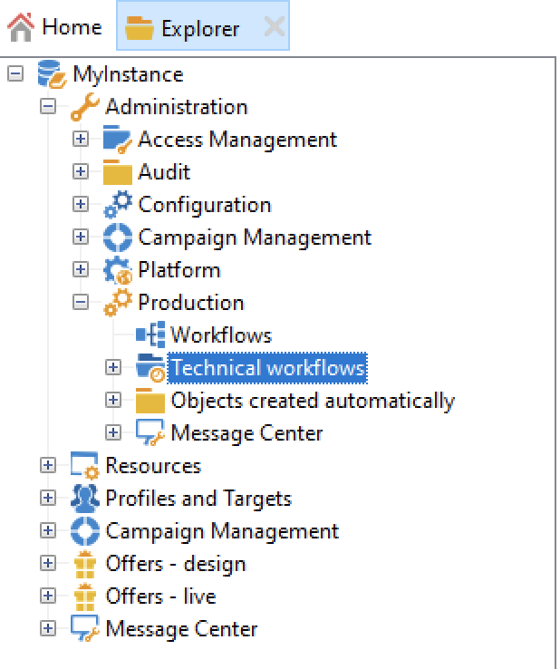

# Technische workflows{#about-technical-workflows}

Adobe Campaign wordt geleverd met een reeks ingebouwde technische workflows. Zij controleren verrichtingen en banen die voor periodieke uitvoering op de server worden gepland. De technische werkschema&#39;s voeren onderhoudsverrichtingen op uw gegevensbestand van de Campagne uit, beheren het volgen gegevens over leveringen, en ook opstelling voorlopige processen op leveringen.

Standaard zijn technische workflows beschikbaar in een submap van het volgende knooppunt: **[!UICONTROL Administration]** > **[!UICONTROL Production]** > **[!UICONTROL Technical workflows]** .

{width="50%" align="left" zoomable="yes"}

>[!NOTE]
>
>* De lijst van technische die werkschema&#39;s met elke module worden geïnstalleerd is beschikbaar in a [ deze sectie ](#list-technical-workflows).
>
>* Technische workflows die betrekking hebben op de invoegtoepassing Berichtcentrum worden standaard opgeslagen in het knooppunt **[!UICONTROL Administration]** > **[!UICONTROL Production]** > **[!UICONTROL Message Center]** > **[!UICONTROL Technical workflows]** .

De submap **[!UICONTROL Campaign process]** centraliseert de workflows die nodig zijn voor het uitvoeren van processen binnen de campagnes: taakmelding, voorraadbeheer, kostenberekening, enz.

## Technische workflows beheren en maken {#manage-tech-workflows}

De technische werkschema&#39;s van de campagne kunnen slechts door exploitanten met **toestemmingen van het Beleid** worden begonnen en worden gewijzigd. Leer hoe te om technische werkschema&#39;s in deze [ specifieke sectie ](monitor-technical-workflows.md) te controleren.

U kunt aangepaste technische workflows maken in het knooppunt **[!UICONTROL Administration > Production > Technical workflows]** van de boomstructuur. Native sjablonen zijn beschikbaar voor het maken van technische workflows. Zij kunnen worden gevormd om aan uw behoeften te passen. Dit proces is echter voorbehouden aan professionele gebruikers. De activiteiten die beschikbaar zijn in technische werkstromen zijn hetzelfde als voor het richten van werkstromen. [Meer informatie](targeting-workflows.md).

## Ingebouwde technische workflows {#list-technical-workflows}

De workflows die in deze pagina worden beschreven, worden geïnstalleerd met de ingebouwde Adobe Campaign-pakketten. Deze pakketten en de bijbehorende technische workflows zijn afhankelijk van uw licentieovereenkomst en invoegtoepassingen.

| Technische workflow | Pakket | Beschrijving |
|------|--------|-----------|
| **Alias het zuiveren** (aliasCleansing) | Standaard geïnstalleerd | Dit werkschema normaliseert [ opsommings ](../../v8/config/enumerations.md#alias-cleansing) waarden. Deze wordt standaard elke dag om 3 uur geactiveerd. |
| **Facturering** (het factureren) | Standaard geïnstalleerd | Deze workflow stuurt het systeemactiviteitenrapport per e-mail naar de &#39;factureringsoperator&#39;. Het wordt teweeggebracht 25e van elke maand op de instantie van de Marketing. |
| **de banen van de Campagne** (operationMgt) | Standaard geïnstalleerd | In deze workflow worden de taken voor marketingcampagnes beheerd (starttaken, bestanden uitpakken, enz.). Het leidt ook tot werkschema&#39;s met betrekking tot terugkomende en periodieke campagnes. |
| **verzamel gegevens voor de dienst HeatMap** (collectDataHeatMapService) | Standaard geïnstalleerd | Deze werkstroom wint gegevens terug die door de dienst HeatMap worden vereist. |
| **verzamel privacyverzoeken** (collectPrivacyRequests) | Privacygegevensbeschermingsverordening | Met deze workflow worden de gegevens van de ontvanger gegenereerd die in Adobe Campaign zijn opgeslagen en kunnen deze worden gedownload op het scherm van de privacyaanvraag. |
| **Kostenberekening** (budgetMgt) | Standaard geïnstalleerd | Deze workflow start de berekening van kosten en kostenposten voor de begrotingen, plannen, programma&#39;s, campagnes, leveringen en taken. |
| **Schoonmaak van het Gegevensbestand** (schoonmaakbeurt) | Standaard geïnstalleerd | Dit werkschema is het werkschema van het gegevensbestandonderhoud: het maakt verschillende berekeningen van de statistieken en de processen, en schrapt verouderde gegevens uit het gegevensbestand volgens de bepaalde configuratie in de plaatsingsmedewerker. Het wordt teweeggebracht elke dag om 4.00 uur door gebrek. |
| **Schrap geblokkeerde gebruikers van de LIJN** (deleteBlockedLineUsersV2) | LINE-kanaal | Deze workflow zorgt ervoor dat de gegevens van de gebruikers van de LIJN V2 worden verwijderd nadat ze de officiële account van de LIJN gedurende 180 dagen hebben geblokkeerd. |
| **Schrap privacy verzoekt om gegevens** (deletePrivacyRequestsData) | Privacygegevensbeschermingsverordening | Deze workflow verwijdert de gegevens die de ontvanger in Adobe Campaign heeft opgeslagen. |
| **de indicatoren van de Levering** (deliveryIndicators) | Standaard geïnstalleerd | Deze werkstroom werkt leveringsvolgindicatoren voor een levering bij. Deze workflow wordt standaard elke uur geactiveerd. |
| **stel FFDA onmiddellijk** op (ffdaDeploy) | Geïnstalleerd door gebrek op [ de plaatsingen van de Onderneming van de Campagne (FFDA) slechts ](../../v8/architecture/enterprise-deployment.md) | Voert een onmiddellijke plaatsing aan het gegevensbestand van de Wolk uit. [ leer meer over gegevensreplicatie ](../../v8/architecture/replication.md) |
| **Verdeelde marketing processen** (centralLocalMgt) | Centrale/lokale Marketing (Distributed Marketing) | Deze workflow begint met het verwerken van de gedistribueerde marketingmodule. Het lanceert de verwezenlijking van lokale campagnes en beheert berichten met betrekking tot orden en campagnepakketbeschikbaarheid. |
| **de purge van de Gebeurtenis** (webAnalyticsPurgeWebEvents) | Webanalytische connectors | Met deze workflow kunt u elke gebeurtenis uit het databaseveld verwijderen op basis van de periode die is geconfigureerd in het veld Lifespan. |
| **het publiek van de Uitvoer aan Adobe Experience Cloud** (exportSharedAudience) | Integratie met Adobe Experience Cloud | Deze workflow exporteert soorten publiek als gedeeld publiek/segmenten. Deze doelgroepen kunnen worden gebruikt in de verschillende Adobe Experience Cloud-oplossingen die u gebruikt. |
| **Voorspelling** (het voorspellen) | Standaard geïnstalleerd | Deze workflow analyseert leveringen die zijn opgeslagen in de voorlopige kalender (maakt voorlopige logbestanden). Het wordt teweeggebracht elke dag bij 1am door gebrek. |
| **Volledige gezamenlijke berekening (propositionrcp kube)** (agg_nmspropositioncp_full) | Aanbiedingsengine (interactie) | Deze workflow werkt het volledige aggregaat voor de keuzelijst met voorstellen van aanbiedingen bij. Het wordt teweeggebracht elke dag om 6.00 uur door gebrek. In dit aggregaat worden de volgende afmetingen vastgelegd: Kanaal, Levering, Aanbieding en Datum van marketing. De blokje van het Voorstel van het Voorstel van het Voorstel van het Voorstel wordt dan gebruikt om rapporten te produceren die op voorstellen worden gebaseerd. Leer meer over kubussen in [ deze sectie ](../../v8/reporting/gs-cubes.md). |
| **Identificatie van omgezette contacten** (webAnalyticsFindConverted) | Webanalytische connectors | Deze workflow indexeert bezoekers van de site die hun aankoop hebben voltooid na een campagne voor het opnieuw op de markt brengen van producten. De gegevens die door deze workflow worden hersteld, zijn toegankelijk via het efficiëntierapport voor opnieuw in de handel brengen (zie deze pagina). |
| **het publiek van de Invoer van Adobe Experience Cloud** (importSharedAudience) | Integratie met Adobe Experience Cloud | Met deze workflow kunt u soorten publiek/segmenten van verschillende Adobe Experience Cloud-oplossingen importeren in Adobe Campaign. |
| **Banen op leveringen in campagnes** (deliveryMgt) | Standaard geïnstalleerd | Deze workflow activeert de goedgekeurde leveringen en start de naverwerking van de serviceprovider voor een externe levering. Het verzendt ook goedkeuringsberichten en herinneringen. |
| **Banen op dienstverleners** (providerMgt) | Standaard geïnstalleerd | Dit werkschema begint de leverancier (e-mail aan de router en post-verwerking) te verwerken zodra de leveringen zijn goedgekeurd. |
| **MID aan migratie LineUserID** (MIDToUserIDMigration) | LINE-kanaal | Deze workflow genereert de LINE V2-gebruikers-id voor migratie van LIJN V1 naar LIJN V2. |
| **Centrum van het Bericht &lt;external_account_name>** (mcSynch_&lt;external_account_name>) | Transactionaal berichtenbeheer (Berichtcentrum - Controle) | Deze workflow: <ul><li>Hiermee wordt de lijst met gebeurtenissen hersteld die door de bewerking(en) zijn verwerkt.</li><li>synchroniseert met de tabel NmsBroadLogMsg om de kwalificaties van de leveringsberichten te herstellen.</li><li>Hiermee worden de logbestanden voor gebeurtenislevering hersteld zodra de synchronisatie met de tabel NmsBroadLogMsg is voltooid.</li><li>synchroniseert met de tabel NmsTrackingUrl om de tracking voor bezorgings-URL&#39;s te herstellen.</li><li>Hiermee worden URL&#39;s voor het bijhouden van gebeurtenissen hersteld zodra de synchronisatie met de tabel NmsTrackingUrl is voltooid.</li><li>Hiermee kunt u alle e-mailadressen herstellen die elke drie uur nadat een levering is verzonden, in quarantaine zijn geplaatst.</li></ul> |
| **MessageCenter volledige gezamenlijke berekening** (agg_messageCenter_full) | Transactionaal berichtenbeheer (Berichtcentrum - Controle) | Deze werkstroom werkt het Volledige aggregaat voor de kubus van het Centrum van het Bericht bij. Deze wordt standaard elke dag om 3 uur geactiveerd. In dit aggregaat worden de volgende afmetingen vastgelegd: Kanaal, Datum, Status en gebeurtenistype. De kubus van het centrum van het Bericht wordt dan gebruikt om rapporten te produceren die op gebeurtenissen worden gebaseerd. Meer informatie over kubussen vindt u in  |
| **Midden-sourcing (leveringstellers)** (defaultMidSourcingDlv) | Overschakelen naar middelmatige sourcing | Deze workflow verzamelt tellingsinformatie voor leveringen op de server voor midsourcing. De telgegevens omvatten algemene leveringsindicatoren zoals het aantal verzonden leveringen, enz. Trackinggegevens zoals die worden geopend, worden niet opgenomen. Deze wordt standaard om de tien minuten geactiveerd. |
| **Midden-sourcing (leveringslogboeken)** (defaultMidSourcingLog) | Overschakelen naar middelmatige sourcing | Deze workflow verzamelt leveringslogboeken op de server voor midsourcing. Deze wordt standaard elke uur geactiveerd. |
| **NMAC opt-out beheer** (mobileAppOptOutMgt) | Mobile App Channel (push) | Met deze workflow worden afmeldingsopties op mobiele apparaten bijgewerkt. Het wordt teweeggebracht om de 6 uur tussen 1am en middernacht. |
| **bericht van de Aanbieding** (aanbiedingMgt) | Standaard geïnstalleerd | Deze workflow implementeert goedgekeurde aanbiedingen in de onlineomgeving en in elke categorie in de aanbiedingencatalogus. |
| **Gepauzeerde werkschema&#39;s schoonmaakbeurt** (schoonmaakupPausedWorkflows) | Standaard geïnstalleerd | In deze workflow worden gepauzeerde workflows geanalyseerd waarvoor de ernst is ingesteld op Normaal en worden waarschuwingen en meldingen geactiveerd wanneer deze al te lang zijn gepauzeerd. Na een maand worden gepauzeerde technische workflows onvoorwaardelijk gestopt. Standaard wordt de activering elke maandag om 17.00 uur gestart. Voor meer informatie, verwijs naar [ Behandeling van gepauzeerde werkschema&#39;s ](monitor-workflow-execution.md#handling-of-paused-workflows). |
| **de verzoekschoonmaakbeurt van de Privacy** (CleupPrivacyRequests) | Privacygegevensbeschermingsverordening | Deze workflow wist de bestanden met toegangsverzoeken die ouder zijn dan 90 dagen. |
| **de partijgebeurtenissen van de Verwerking** (batchEventsProcessing) | Transactiebericht uitvoeren (Berichtcentrum - Uitvoering) | Met deze workflow kunt u batchgebeurtenissen in een wachtrij plaatsen voordat u ze aan een berichtsjabloon koppelt. |
| **Verwerking real time gebeurtenissen** (rtEventsProcessing) | Transactiebericht uitvoeren (Berichtcentrum - Uitvoering) | Dit werkschema laat u gebeurtenissen in real time in een rij zetten alvorens hen met een berichtmalplaatje te associëren. |
| **synchronisatie van de Positie** (propositionSynch) | Besturing van de aanbiedingsengine met uitvoeringsinstantie | Deze workflow synchroniseert voorstellingen tussen de marketinginstantie en de uitvoeringsinstantie die voor interacties wordt gebruikt. |
| **Terugwinning van Webgebeurtenissen** (webAnalyticsGetWebEvents) | Webanalytische connectors | Elk uur downloadt deze workflow segmenten op het gedrag van internetgebruikers op een bepaalde site, plaatst deze in de Adobe Campaign-database en start de workflow voor het opnieuw in de handel brengen. |
| **repliceer onmiddellijk gegevens FFDA** (ffdaReplicate) | Geïnstalleerd door gebrek op [ de plaatsingen van de Onderneming van de Campagne (FFDA) slechts ](../../v8/architecture/enterprise-deployment.md) | Repliceert de XS-gegevens voor een bepaalde externe account. [ leer meer over gegevensreplicatie ](../../v8/architecture/replication.md) |
| **Replicate nmsDelivery rij** (ffdaReplicateQueueDelivery) | Geïnstalleerd door gebrek op [ de plaatsingen van de Onderneming van de Campagne (FFDA) slechts ](../../v8/architecture/enterprise-deployment.md) | Wachtrij voor de tabel `nms:delivery` . [ leer meer over gegevensreplicatie ](../../v8/architecture/replication.md) |
| **Replicate nmsDlvExclusion rij** (ffdaReplicateQueueDlvExclusion) | Geïnstalleerd door gebrek op [ de plaatsingen van de Onderneming van de Campagne (FFDA) slechts ](../../v8/architecture/enterprise-deployment.md) | Wachtrij voor de tabel `nms:dlvExclusion` . [ leer meer over gegevensreplicatie ](../../v8/architecture/replication.md) |
| **Replicate nmsDlvMidRemoteIdRel rij** (ffdaReplicateQueueDlvMidRemoteIdRel) | Geïnstalleerd door gebrek op [ de plaatsingen van de Onderneming van de Campagne (FFDA) slechts ](../../v8/architecture/enterprise-deployment.md) | Wachtrij voor de tabel `nms:dlvRemoteIdRel` . [ leer meer over gegevensreplicatie ](../../v8/architecture/replication.md) |
| **Replicate nmsTrackingUrl rij** (ffdaReplicateQueueTrackingUrl)  **Replicate nmsTrackingUrl rij in gelijktijdig** (ffdaReplicateQueueTrackingUrl_2) | Geïnstalleerd door gebrek op [ de plaatsingen van de Onderneming van de Campagne (FFDA) slechts ](../../v8/architecture/enterprise-deployment.md) | Hiermee wordt een wachtrij geplaatst voor de tabel `nms:trackingUrl` , waarbij twee workflows worden gebruikt om de efficiëntie te verbeteren door aanvragen te verwerken op basis van verschillende prioriteiten. [ leer meer over gegevensreplicatie ](../../v8/architecture/replication.md) |
| **Replicate de lijsten van de Verwijzing** (ffdaReplicateReferenceTables) | Geïnstalleerd door gebrek op [ de plaatsingen van de Onderneming van de Campagne (FFDA) slechts ](../../v8/architecture/enterprise-deployment.md) | Voert automatische replicatie van ingebouwde lijsten uit die op het lokale gegevensbestand van de Campagne (PostgreSQL) en het gegevensbestand van de Wolk ([!DNL Snowflake]) aanwezig moeten zijn. Het is gepland om elk uur uit te voeren, dagelijks. Als **lastModified** gebied bestaat, gebeurt de replicatie incrementeel, anders wordt de volledige lijst herhaald. [ leer meer over gegevensreplicatie ](../../v8/architecture/replication.md) |
| **Herhaal het Opvoeren gegevens** (ffdaReplicateStagingData) | Geïnstalleerd door gebrek op [ de plaatsingen van de Onderneming van de Campagne (FFDA) slechts ](../../v8/architecture/enterprise-deployment.md) | Herhaalt het opvoeren gegevens voor unitaire vraag. Het is gepland om elk uur uit te voeren, dagelijks. [ leer meer over gegevensreplicatie ](../../v8/architecture/replication.md) |
| **het Melden van aggregaten** (reportingAggregates) | Levering | Deze workflow werkt aggregaten bij die worden gebruikt in rapporten. Deze wordt standaard elke dag om 2 uur geactiveerd. |
| **het verzenden van indicatoren en campagnerekenmerken** (webAnalyticsSendMetrics) | Webanalytische connectors | Met deze workflow kunt u e-mailcampagneindicatoren van Adobe Campaign naar Adobe Experience Cloud Suite verzenden via de Adobe® Analytics-connector. De betrokken indicatoren zijn als volgt: Verzonden (Verzonden), Totaal aantal van opent (iTotalRecipientOpen), Totaal aantal ontvangers die klikte (iTotalRecipientClick), Fouten (iError), Opt-Out (opt-out) (iOptOut). |
| **Beeld: Orders en alarm** (stockMgt) | Standaard geïnstalleerd | Deze workflow start voorraadberekening op de orderregels en beheert drempelwaarden voor waarschuwingen. |
| **de Mobiele apps van de Synchronisatie van de Inzameling van Gegevens van Adobe Experience Platform** (syncWithLaunch) | Standaard geïnstalleerd, vanaf versie 8.5 | Deze workflow synchroniseert automatisch mobiele eigenschappen van gegevensverzameling naar Adobe Campaign. |
| **het Volgen** (het volgen) | Standaard geïnstalleerd | Deze workflow voert het herstel en de consolidatie van trackinggegevens uit. Het verzekert ook de herberekening van het volgen en leveringsstatistieken, vooral die gebruikt door het archiveren van het Centrum van het Bericht werkschema. Deze wordt standaard één keer per uur geactiveerd. |
| **de gebeurtenisstatus van de Update** (updateEventsStatus) | Transactiebericht uitvoeren (Berichtcentrum - Uitvoering) | Met deze workflow kunt u een status aan een gebeurtenis toewijzen. Gebeurtenisstatussen zijn als volgt:<ul><li>In behandeling: de gebeurtenis bevindt zich in een wachtrij. Er is nog geen berichtsjabloon aan gekoppeld.</li><li>In afwachting van levering: de gebeurtenis bevindt zich in een wachtrij, is een berichtsjabloon eraan gekoppeld en wordt momenteel verwerkt door de levering.</li><li>Verzonden: deze status wordt gekopieerd uit de leveringslogboeken. Dit betekent dat de levering is verzonden.</li><li>Genegeerd door de levering: deze status wordt gekopieerd uit de leveringslogboeken. Het betekent dat de levering is genegeerd.</li><li>Leveringsfout: deze status wordt gekopieerd uit de leveringslogboeken. Het betekent dat de levering is mislukt.</li><li>Gebeurtenis niet gedekt: de gebeurtenis is niet gekoppeld aan een berichtsjabloon. De gebeurtenis wordt niet opnieuw verwerkt.</li></ul> |
| **Update voor leverability** (DeliabilityUpdate) | Standaard geïnstalleerd | Zodra het pakket voor de bewaking van de aflevering (e-mail aflevering) is geïnstalleerd, wordt deze workflow elke avond uitgevoerd en worden de kwalificatieregels voor stuiterende e-mailadressen en de lijst met domeinen en MX&#39;s beheerd. Hiervoor moet de HTTPS-poort open zijn op het platform. |
| **update unsubscriptions** (ffdaUnsubscribe) | Geïnstalleerd door gebrek op [ de plaatsingen van de Onderneming van de Campagne (FFDA) slechts ](../../v8/architecture/enterprise-deployment.md) | Deze workflow verwerkt afgeschreven berichten die als stuiterende mails zijn ontvangen (door gebruik te maken van de methode `<mailto>` List-Unsubscribe). Het loopt dagelijks, elke 1u, slechts op marketing instanties met een plaatsing van de Onderneming (FFDA).   het werkschema controleert uitzendingen van een bepaalde tijdwaaier (laatste verwerkingstijd en huidige tijd) die als afstotingen van het abonnement door de module inMail (merkteken dat in iFlags kolom van lijst NmsBroadLog wordt geplaatst) en processen een unsubscription afhankelijk van of de dienst van de breedband wordt geplaatst of niet:<ul><li>Als serviceId (niet bepaald) 0 is, zal de ontvanger worden gevoegd op lijst van gewenste personen.</li><li>Als serviceId niet 0 (verbonden aan een bestaande dienst) is, zal de ontvanger van die dienst worden afgemeld.</li></ul>  Nota: Dit werkschema behandelt slechts stuitende unsubscribes; unsubscribes die via opt-out verbinding worden gedaan en One-Click unsubscribtion (methode URL) worden afzonderlijk behandeld buiten dit werkschema. |
