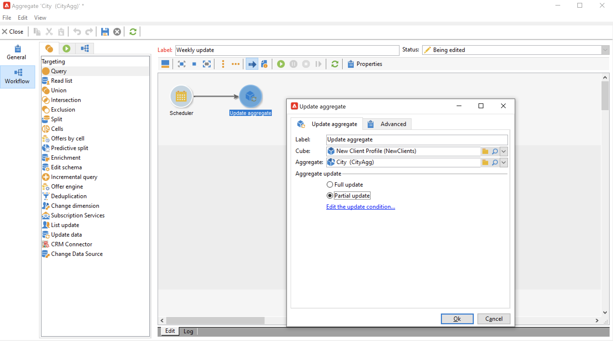

# Samenvoeging bijwerken{#update-aggregate}

Aggregaten gedefinieerd in [kubussen](../../v8/reporting/gs-cubes.md) voor rapportagedoeleinden kan worden bijgewerkt met een specifieke activiteit. A **[!UICONTROL Workflow]** is beschikbaar wanneer het vormen van het aggregaat.

Meer informatie over kubussen en aggregaten in [deze sectie](../../v8/reporting/customize-cubes.md#calculate-and-use-aggregates).

Als u een aggregaat wilt bijwerken, bewerkt u de **[!UICONTROL Update aggregate]** en selecteer de kubus en aggregaat die u wilt bijwerken.

U kunt een **Volledige update** of **Gedeeltelijke update**.

Standaard wordt een volledige update uitgevoerd tijdens elke berekening. Als u een gedeeltelijke update wilt inschakelen, selecteert u de optie en definieert u de updatevoorwaarden.

Een goede praktijk is om een **[!UICONTROL Scheduler]** activiteiten om de frequentie van de actualiseringen van de berekeningen in te stellen.
