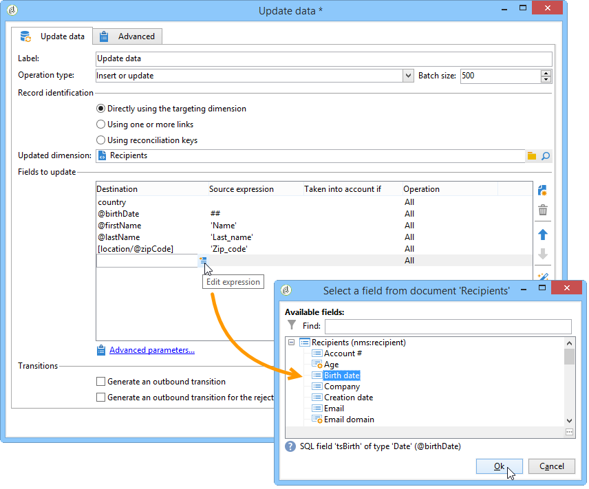

# Gegevens bijwerken{#update-data}

Een **gegevens van de Update** - type activiteit voert een massa update van de gebieden in het gegevensbestand uit.

## Type bewerking {#operation-type}

In het veld **[!UICONTROL Operation type]** kunt u het proces kiezen dat moet worden uitgevoerd op de gegevens in de database:

* **[!UICONTROL Insert or update]**: gegevens toevoegen of bijwerken als deze al zijn toegevoegd.
* **[!UICONTROL Insert]**: alleen gegevens toevoegen.
* **[!UICONTROL Update]**: alleen gegevens bijwerken.
* **[!UICONTROL Update and merge collections]** : werk gegevens bij en kies een primaire record en koppel vervolgens elementen die zijn gekoppeld aan de duplicaten in deze primaire record. Duplicaten kunnen vervolgens worden verwijderd zonder weeselementen in bijlage te maken.
* **[!UICONTROL Delete]**: Data verwijderen.

In het veld **[!UICONTROL Batch size]** kunt u het aantal inkomende overgangselementen selecteren dat moet worden bijgewerkt. Als u bijvoorbeeld 500 opgeeft, worden de eerste 500 records die worden afgehandeld, bijgewerkt.

## Registeridentificatie {#record-identification}

Geef op hoe de records in de database moeten worden geïdentificeerd:

* Als gegevensinvoer betrekking heeft op een bestaande doeldimensie, selecteert u de optie **[!UICONTROL By directly using the targeting dimension]** en selecteert u deze in het veld **[!UICONTROL Updated dimension]** .

  U kunt de velden voor de geselecteerde dimensie weergeven met de knop **[!UICONTROL Edit this link]** Vergroting glas.

* Geef anders een of meer koppelingen op die het mogelijk maken de gegevens in de database te identificeren of de afstemmingssleutels rechtstreeks te gebruiken.

## De velden selecteren die moeten worden bijgewerkt {#selecting-the-fields-to-be-updated}

Gebruik de optie **[!UICONTROL Automatically associate fields with the same name]** als Adobe Campaign automatisch de velden moet identificeren die moeten worden bijgewerkt.

U kunt het pictogram **[!UICONTROL Insert]** ook gebruiken om handmatig de databasevelden te selecteren die u wilt bijwerken.

Selecteer alle velden die u wilt bijwerken en voeg, indien nodig, voorwaarden toe afhankelijk van de update. Hiervoor gebruikt u de kolom **[!UICONTROL Taken into account if]**. De voorwaarden worden na elkaar toegepast en in overeenstemming met de volgorde in de lijst. Gebruik de pijlen aan de rechterkant om de volgorde van updates te wijzigen.

U kunt hetzelfde doelveld meerdere keren gebruiken.

In een **[!UICONTROL Insert or update]** -bewerking kunt u de campagne selecteren die u wilt toepassen, afzonderlijk of voor elk veld. Selecteer hiertoe de gewenste waarde in de kolom **[!UICONTROL Operation]** .

De velden **[!UICONTROL modifiedDate]** , **[!UICONTROL modifiedBy]** , **[!UICONTROL createdDate]** en **[!UICONTROL createdBy]** worden automatisch bijgewerkt tijdens gegevensupdates, tenzij de beheermodus specifiek is geconfigureerd in de tabel met veldupdates.

Record bijwerken wordt alleen uitgevoerd voor records die ten minste één verschil bevatten. Als de waarden gelijk zijn, wordt geen update uitgevoerd.

Met de koppeling **[!UICONTROL Advanced parameters]** kunt u aanvullende opties opgeven voor het bijwerken van gegevens en het beheren van duplicaten. U kunt ook:

* **[!UICONTROL Disable automatic key management]**.
* **[!UICONTROL Disable audit]**.
* **[!UICONTROL Empty the destination value if the source value is empty (NULL)]**. Deze optie is standaard automatisch ingeschakeld.
* **[!UICONTROL Update all columns with matching names]**.
* Geef voorwaarden op die rekening houden met bronelementen met een expressie in het veld **[!UICONTROL Enabled if]** .
* Geef voorwaarden op die duplicaten in overweging nemen met behulp van een expressie. Als u de optie **[!UICONTROL Ignore records which concern the same target]** inschakelt, wordt alleen het eerste item in de lijst met expressies in overweging genomen.

**[!UICONTROL Generate an outbound transition]**

Creeert een uitgaande overgang die aan het eind van uitvoering zal worden geactiveerd. Bij het bijwerken wordt doorgaans het einde van een doelworkflow aangegeven en wordt de optie daarom niet standaard geactiveerd.

**[!UICONTROL Generate an outbound transition for the rejects]**

Hiermee maakt u een uitgaande overgang die records bevat die na de update niet correct zijn verwerkt (bijvoorbeeld als er een duplicaat is). De update markeert doorgaans het einde van een doelworkflow en daarom wordt de optie niet standaard geactiveerd.

## Verzamelingen bijwerken en samenvoegen {#updating-and-merging-collections}

Door gegevens bij te werken en verzamelingen samen te voegen, kunt u de gegevens in een record bijwerken met behulp van gegevens uit een of meer secundaire records, zodat u desgewenst slechts één record kunt bijhouden. Deze updates worden beheerd door een set regels.

>[!NOTE]
>
>Met deze optie kunt u ook verwijzingen naar secundaire records uit werkstroomwerktabellen (targetWorkflow), leveringen (targetDelivery) en lijsten (targetList) verwerken. Indien nodig worden deze koppelingen weergegeven in de lijst waarin u velden en verzamelingen selecteert.

1. Selecteer de bewerking **[!UICONTROL Update and merge collections]** .

   

1. Selecteer de prioriteitsvolgorde voor de koppelingen. Zo kunt u het hoofdrecord identificeren. Welke koppelingen beschikbaar zijn, is afhankelijk van de binnenkomende overgang.

   

1. Selecteer de verzamelingen die u wilt verplaatsen naar de primaire record en de velden die u wilt bijwerken.

   Ga de regels in die op deze van toepassing zijn zodra één of veelvoudige secundaire verslagen worden geïdentificeerd. Hiervoor kunt u de Expression Builder gebruiken. Bijvoorbeeld door op te geven dat dit de meest recente bijgewerkte waarde is van alle verschillende records die moeten worden bewaard.

   Dan ga de voorwaarden in om met de regel rekening te houden.

   Geef ten slotte het type update op dat moet worden uitgevoerd. U kunt er bijvoorbeeld voor kiezen om de secundaire records te verwijderen nadat u de gegevens hebt bijgewerkt.

   U kunt bijvoorbeeld de samenvoeging configureren van verzamelingen die heterogene gegevens bevatten, zoals de abonnementenlijst voor een ontvanger. Gebruikend regels, kunt u nieuwe abonnementsgeschiedenissen van secundaire verslagabonnementen ook tot stand brengen, of zelfs de lijst van abonnementen van een secundair verslag verplaatsen naar een primair verslag.

1. Geef de volgorde op waarin u de secundaire records wilt verwerken door **[!UICONTROL Advanced parameters]** > **[!UICONTROL Duplicates]** te selecteren.

   

Gegevens voor secundaire records worden gekoppeld aan het hoofdrecord als de gedefinieerde regels van toepassing zijn. Afhankelijk van het geselecteerde type update kunnen de secundaire records worden verwijderd.

## Voorbeeld: Gegevens bijwerken na een verrijking {#example--update-data-following-an-enrichment}

De [ Stap 2: Het schrijven van verrijkte gegevens aan de lijst van &quot;Aankopen&quot;](create-a-summary-list.md#step-2--writing-enriched-data-to-the--purchases--table) sectie van het gebruiksgeval dat de details die tot een rechthoeklijst leiden een voorbeeld van een gegevensupdate na een verrijkingsactiviteit aanbieden.

## Invoerparameters {#input-parameters}

* tableName
* schema

Elke binnenkomende gebeurtenis moet een doel specificeren dat door deze parameters wordt bepaald.
