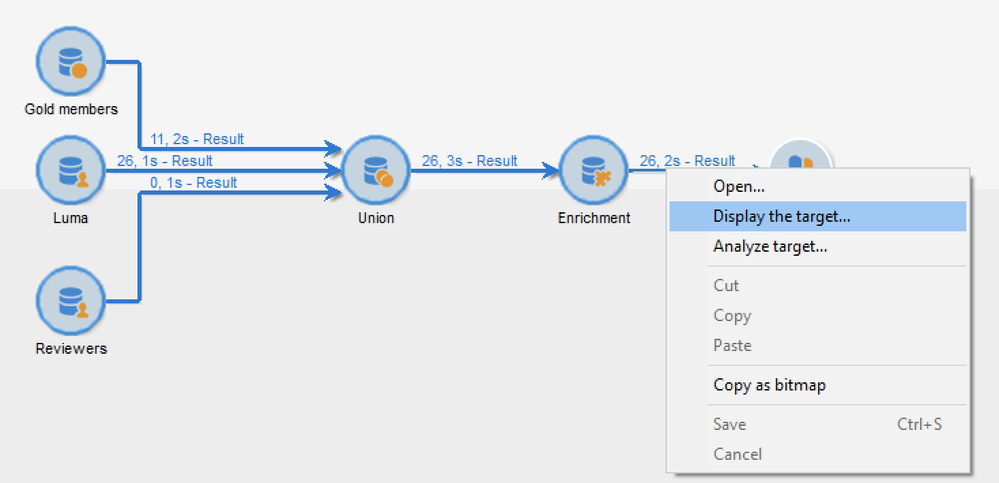

# Workflowgegevens gebruiken{#how-to-use-workflow-data}

U kunt workflowactiviteiten gebruiken om meerdere taken uit te voeren. Hieronder vindt u voorbeelden van het gebruik om de database bij te werken door lijsten te maken, abonnementen te beheren, berichten te verzenden via een workflow of uw leveringen en het publiek te verrijken.

Er is een set praktijkvoorbeelden beschikbaar in [deze sectie](workflow-use-cases.md).

## Levenscyclus van gegevens {#data-life-cycle}

### Tijdelijke werktabel voor workflows {#work-table}

In werkstromen, worden de gegevens die van één activiteit aan een andere worden vervoerd opgeslagen in een tijdelijke het werklijst.

Deze gegevens kunnen worden weergegeven en geanalyseerd door met de rechtermuisknop op de juiste overgang te klikken.



Selecteer hiertoe het relevante menu:

* **[!UICONTROL Display the target...]**

   In dit menu worden de beschikbare gegevens van de doelpopulatie weergegeven.

   

   U hebt toegang tot de structuur van de werktabel in het dialoogvenster **[!UICONTROL Schema]** tab.

   

   Raadpleeg [deze sectie](monitor-workflow-execution.md#worktables-and-workflow-schema) voor meer informatie.

* **[!UICONTROL Analyze target...]**

   In dit menu hebt u toegang tot de wizard voor beschrijvende analyse, waarmee u statistieken en rapporten over de overgangsgegevens kunt produceren.

   Raadpleeg voor meer informatie hierover [Campaign Classic v7-documentatie](https://experienceleague.adobe.com/docs/campaign-classic/using/reporting/analyzing-populations/about-descriptive-analysis.html){target=&quot;_blank&quot;}.

De doelgegevens worden gewist terwijl de workflow wordt uitgevoerd. Alleen de laatste werktabel is toegankelijk. U kunt het werkschema vormen zodat alle het werklijsten toegankelijk blijven: controleren **[!UICONTROL Keep the result of interim populations between two executions]** in de workfloweigenschappen.


>[!CAUTION]
>
>Deze optie moet **nooit** worden gecontroleerd in een **productie** workflow. Deze optie wordt gebruikt om de resultaten te analyseren en is alleen ontworpen voor testdoeleinden en moet daarom alleen worden gebruikt in ontwikkelings- of testomgevingen.


### Gebruik van doelgegevens {#target-data}

De gegevens die in de tijdelijke werkstroomlijst worden opgeslagen, zijn beschikbaar voor verpersoonlijkingstaken. Gegevens kunnen worden gebruikt in de verpersoonlijkingsvelden.

Hiermee kunt u gegevens die via een lijst zijn verzameld, bijvoorbeeld in een levering gebruiken. Hiervoor gebruikt u de volgende syntaxis:

```
%= targetData.FIELD %
```

**[!UICONTROL Target extension]** (targetData) type verpersoonlijkingselementen zijn niet beschikbaar voor het richten van werkschema&#39;s. Het leveringsdoel moet in het werkschema worden gebouwd en in de binnenkomende overgang van de levering worden gespecificeerd.

In het volgende voorbeeld, verzamelt u een lijst van informatie over klanten, die in gepersonaliseerde e-mail moet worden gebruikt. Voer de volgende stappen uit:

1. Maak een workflow voor het verzamelen van informatie, pas deze aan met de gegevens die al in de database staan en start vervolgens een levering.

   

1. In ons voorbeeld ziet de bestandsinhoud er als volgt uit:

   ```
   Music,First name,Last name,Account,CD/DVD,Card
   Pop,David,BLAIR,4323,CD,0
   Rock,Daniel,ARCARI,3222,DVD,1
   Disco,Uma,ALTON,0488,DVD,0
   Jazz,Paul,BOLES,6475,CD,1
   Jazz,David,BOUKHARI,0841,DVD,1
   [...]
   ```

   Als u het bestand wilt laden, configureert u de **[!UICONTROL Data loading (file)]** activiteit als hieronder:

   

1. Configureer de **[!UICONTROL Enrichment]** om de verzamelde gegevens te combineren met de gegevens die al in de Adobe Campaign-database zijn opgenomen. Hier is de afstemmingssleutel het rekeningnummer:

   

1. Dan vorm **[!UICONTROL Delivery]**: het wordt gecreeerd gebaseerd op een malplaatje, en de ontvangers worden gespecificeerd door de binnenkomende overgang.

   

   >[!CAUTION]
   >
   >Alleen gegevens in de overgang mogen worden gebruikt om de levering aan te passen. **targetData** de gebieden van de typeverpersoonlijking zijn slechts beschikbaar voor de binnenkomende bevolking van **[!UICONTROL Delivery]** activiteit.

1. In het leveringsmalplaatje, gebruik de gebieden die in het werkschema worden verzameld.

   Om dit te doen, voeg **[!UICONTROL Target extension]** type verpersoonlijkingsgebieden.

   

   Hier willen we het favoriete muziekgenre en mediatype (CD of DVD) van de klant invoegen, zoals vermeld in het bestand dat tijdens de workflow wordt verzameld.

   Als plus gaan we een coupon toevoegen voor houders van een loyaliteitskaart, dat wil zeggen ontvangers voor wie de waarde van de &#39;Kaart&#39; gelijk is aan 1.

   

   **[!UICONTROL Target extension]** (targetData) typegegevens worden opgenomen in leveringen gebruikend de zelfde kenmerken zoals alle verpersoonlijkingsgebieden. Ze kunnen ook worden gebruikt in het onderwerp, koppelingslabels of de koppelingen zelf.


## De database bijwerken {#update-the-database}

Alle verzamelde gegevens kunnen worden gebruikt om de database bij te werken, of in leveringen. U kunt bijvoorbeeld de personalisatiemogelijkheden voor berichtinhoud verrijken (het aantal contracten in het bericht opnemen, het gemiddelde winkelwagentje van het afgelopen jaar opgeven, enzovoort) of een gedetailleerde bevolkingsgerichtheid (verzend een bericht aan contractmedehouders, richt de 1.000 beste abonnees aan online diensten, enz.). Deze gegevens kunnen ook worden geëxporteerd of gearchiveerd in een lijst.

### Lijsten bijwerken  {#list-updates}

De gegevens van de Adobe Campaign-databank en de bestaande lijsten kunnen worden bijgewerkt met behulp van twee specifieke activiteiten:

* De **[!UICONTROL List update]** Met activiteit kunt u werktabellen opslaan in een database.

   U kunt een bestaande lijst selecteren of maken. In dit geval worden de naam en mogelijk de recordmap berekend.

   

   Zie [Lijstupdate](list-update.md).

* De **[!UICONTROL Update data]** de activiteit voert een massa update van de gebieden in het gegevensbestand uit.

   Raadpleeg voor meer informatie hierover [Gegevens bijwerken](update-data.md).

### Lidmaatschappen beheren {#subscription-management}

Als u via een workflow wilt weten hoe ontvangers zich moeten abonneren op een informatieservice of het abonnement moeten opzeggen, raadpleegt u [Abonnementsservices](subscription-services.md).
