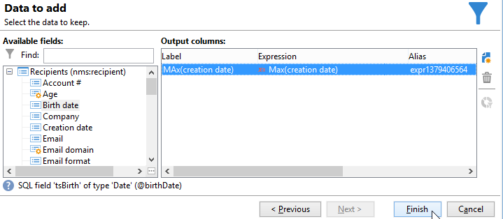

# Aggregaten gebruiken{#using-aggregates}

In dit geval wordt beschreven hoe de laatste ontvangers die aan de database zijn toegevoegd, automatisch kunnen worden geïdentificeerd.

Met behulp van het volgende proces wordt de aanmaakdatum van ontvangers in de database vergeleken met de laatst bekende datum waarop een ontvanger is gemaakt met een aggregaat. Alle ontvangers die op dezelfde dag zijn gemaakt, worden ook geselecteerd.

Om a **datum van de Aanmaak = max (de datum van de Aanmaak)** typefilter op de ontvangers uit te voeren, moet u een werkschema in werking stellen om deze stappen te volgen:

1. Haal de ontvangers van een database op met behulp van een standaardquery. Voor meer op deze stap, verwijs naar [ Creërend een vraag ](query.md#creating-a-query).
1. Bereken de laatste bekende datum een ontvanger werd gecreeerd gebruikend het resultaat dat van **wordt geproduceerd (de datum van de Verwezenlijking)** samenvoegingsfunctie.
1. Elke ontvanger aan de samenvoegingsfunctie verbinden resulteert in het zelfde schema.
1. Ontvangers filteren met het aggregaat via het bewerkte schema.

## Stap 1: Het totale resultaat berekenen {#step-1--calculating-the-aggregate-result}

1. Maak een query. Hier, is het doel om de laatste bekende aanmaakdatum uit alle ontvangers in het gegevensbestand te berekenen. De query bevat daarom geen filter.
1. Selecteer **[!UICONTROL Add data]**.
1. Selecteer **[!UICONTROL Data linked to the filtering dimension]** then **[!UICONTROL Filtering dimension data]** in de vensters die worden geopend.
1. In het **[!UICONTROL Data to add]** venster, voeg een kolom toe die de maximumwaarde voor het **gebied van de Aanmaakdatum** in de lijst van ontvangers berekent. U kunt de uitdrukkingsredacteur gebruiken of **maximum (@gecreeerd)** direct ingaan in een gebied in de **[!UICONTROL Expression]** kolom. Klik vervolgens op de knop **[!UICONTROL Finish]** .

   

1. Klik op **[!UICONTROL Edit additional data]** en vervolgens op **[!UICONTROL Advanced parameters...]** . Schakel de optie **[!UICONTROL Disable automatic adding of the primary keys of the targeting dimension]** in.

   Met deze optie zorgt u ervoor dat niet alle ontvangers als resultaat worden weergegeven en dat gegevens die expliciet worden toegevoegd, niet worden bewaard. In dit geval verwijst het naar de laatste datum waarop een ontvanger is gemaakt.

   Laat de optie **[!UICONTROL Remove duplicate rows (DISTINCT)]** ingeschakeld.

## Stap 2: De ontvangers en het resultaat van de aggregatiefunctie koppelen {#step-2--linking-the-recipients-and-the-aggregation-function-result}

Om de vraag te verbinden die ontvangers behandelt aan de vraag die de berekening van de samenvoegingsfunctie uitvoert, moet u schema gebruiken uitgeeft activiteit.

1. Definieer de query voor ontvangers als een hoofdset.
1. Voeg op het tabblad **[!UICONTROL Links]** een nieuwe koppeling toe en voer de informatie in het venster in dat als volgt wordt geopend:

   * Selecteer het tijdelijke schema voor het aggregaat. De gegevens voor dit schema worden toegevoegd aan de leden van de hoofdset.
   * Selecteer **[!UICONTROL Use a simple join]** om het geaggregeerde resultaat te koppelen aan elke ontvanger van de hoofdset.
   * Geef ten slotte op dat de koppeling een **[!UICONTROL Type 11 simple link]** is.

   

Het aggregatieresultaat is daarom gekoppeld aan elke ontvanger.

## Stap 3: Ontvangers filteren met het aggregaat. {#step-3--filtering-recipients-using-the-aggregate-}

Zodra de verbinding is gevestigd, maken het gezamenlijke resultaat en de ontvangers deel uit van het zelfde tijdelijke schema. Het is daarom mogelijk om een filter op het schema tot stand te brengen om de aanmaakdatum van ontvangers en de laatst bekende aanmaakdatum te vergelijken, die door de samenvoegingsfunctie wordt vertegenwoordigd. Dit filter wordt uitgevoerd met behulp van een splitsingsactiviteit.

1. In het **[!UICONTROL General]** lusje, uitgezochte **Ontvangers** als het richten dimensie en **geef schema** als het filtreren dimensie (om op de binnenkomende activiteit van het overgangschema te filtreren) uit.
1. Selecteer **[!UICONTROL Add a filtering condition on the inbound population]** op het tabblad **[!UICONTROL subsets]** en klik vervolgens op **[!UICONTROL Edit...]** .
1. Voeg met behulp van de expressie-editor een gelijkheidscriterium toe tussen de aanmaakdatum van de ontvangers en de aanmaakdatum die wordt berekend door het aggregaat.

   De datumtekstvelden in de database worden over het algemeen tot op de milliseconde opgeslagen. Daarom moet u deze voor de hele dag verlengen om te voorkomen dat ontvangers worden opgehaald die slechts die milliseconde hebben gemaakt.

   Om dit te doen, gebruik de **ToDate** functie, beschikbaar in de uitdrukkingsredacteur, die data en uren in eenvoudige data omzet.

   De voor de criteria te gebruiken uitdrukkingen zijn derhalve:

   * **[!UICONTROL Expression]**: `toDate([target/@created])` .
   * **[!UICONTROL Value]**: `toDate([datemax/expr####])` , waarbij expr##### betrekking heeft op het aggregaat dat is opgegeven in de query voor de aggregatiefunctie.

   

Het resultaat van de splitsingsactiviteit heeft dus betrekking op de ontvangers die op dezelfde dag zijn gemaakt als de laatst bekende aanmaakdatum.

Vervolgens kunt u andere activiteiten toevoegen, zoals een update van een lijst of een levering om de workflow te verrijken.
