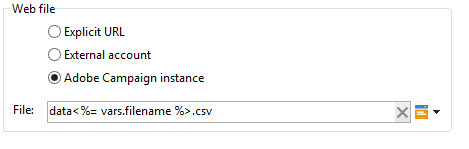

# Webdownload{#web-download}

De **Webdownload** activiteit start het downloaden van een bestand op een expliciete URL, een externe account of een Adobe Campaign-instantie. Het HTTP-protocol wordt gebruikt. Dit kan een download van de GET of van de POST zijn.

## Properties {#properties}

1. **Het webbestand selecteren**

   Als u het te downloaden bestand wilt opgeven, voert u de URL van het bestand in, gebruikt u de externe HTTP-account waar het bestand is opgeslagen of laadt u het bestand via een Adobe Campaign-instantie. De beschikbare parameters worden hieronder beschreven:

   * Als u de URL van het te downloaden bestand rechtstreeks wilt invoeren, selecteert u de optie **[!UICONTROL Explicit URL]** en geeft u de URL op in het desbetreffende veld. Deze URL kan worden samengesteld met variabele gegevens.

      

   * Als u een **[!UICONTROL External account]** selecteert u de account in de vervolgkeuzelijst en geeft u het bestand op dat u wilt downloaden.

      Externe accounts worden geconfigureerd via de **[!UICONTROL Administration > Platform > External accounts]** knooppunt van de boomstructuur Adobe Campaign. De accountparameters kunnen worden bewerkt via de **[!UICONTROL Edit link]** pictogram.

      

   * Selecteer de optie **[!UICONTROL Adobe Campaign Instance]** optie.

      

1. **Bestandshistorie**

   De **[!UICONTROL File historization settings...]** Met de koppeling kunt u de opslagmap van het bestand en de purgeerfrequentie van deze map opgeven.

   

   De volgende opties zijn beschikbaar:

   * **[!UICONTROL Use a default storage directory]**: het bestand wordt altijd verplaatst voordat het wordt verwerkt. Als deze optie is ingeschakeld, wordt het bestand verplaatst naar de standaardopslagmap (de **vars** directory van de installatiemap van Adobe Campaign). Als u een opslagmap wilt opgeven, schakelt u het selectievakje uit en voert u het pad ervan in het dialoogvenster **[!UICONTROL Storage directory]** field
   * **[!UICONTROL Number of files]**: Voer het maximumaantal bestanden in dat in de opslagmap moet worden bewaard.
   * **[!UICONTROL Maximum size (in Mb)]**: Voer de maximale capaciteit van de opslagdirectory in (in megabytes).

   Elk bestand wordt 24 uur bewaard voordat het aan de vastgestelde zuiveringsregels wordt onderworpen. Het leegmaken vindt plaats vlak voor het begin van de activiteit en houdt daarom geen rekening met het werkstroombestand dat wordt uitgevoerd.

   Bestanden worden verwijderd op basis van hun leeftijd (oudste naar nieuwste). De oudste bestanden worden gewist totdat beide regels voor leegmaken zijn geverifieerd. Daarom als een 100 dossiergrens wordt bepaald, betekent dit dat de opslagfolder altijd de 100 nieuwste dossiers vóór de aanvang van het werkschema zal bevatten, evenals die die die in het werkschema worden verwerkt dat lopend is.

   Als u niet langer een limiet wilt instellen voor de **[!UICONTROL Number of files]** en **[!UICONTROL Maximum size (in Mb)]** Voer 0 in als waarde.

1. **Geavanceerde parameters**

   De **[!UICONTROL Advanced parameters...]** met de koppeling kunt u de hieronder weergegeven aanvullende opties opgeven:

   

   De **[!UICONTROL Process errors]** deze optie is gedetailleerd in [Verwerkingsfouten](monitor-workflow-execution.md#processing-errors).

## Uitvoerparameters {#output-parameters}

* bestandsnaam: Volledige naam van het gedownloade bestand.
