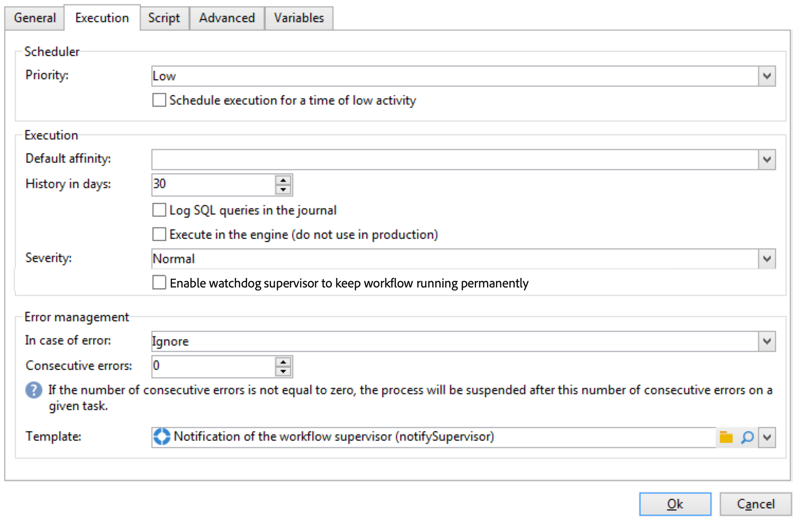

# Workfloweigenschappen{#workflow-properties}

## Tabblad Uitvoering {#execution-tab}

De **[!UICONTROL Execution]** tabblad van het dialoogvenster **[!UICONTROL Properties]** Het venster in een werkstroom is onderverdeeld in drie secties:

### Planner {#scheduler}

Deze sectie wordt alleen weergegeven in workflows voor campagnes.

* **[!UICONTROL Priority]**

   De workflowengine verwerkt de uit te voeren workflows op basis van het prioriteitscriterium op dit gebied. Alle workflows met bijvoorbeeld een **[!UICONTROL Average]** prioriteit zal worden uitgevoerd vóór degenen met een **[!UICONTROL Low]** prioriteit.

* **[!UICONTROL Schedule execution for a time of low activity]**

   Met deze optie wordt het begin van de workflow uitgesteld tot een minder drukke periode. Sommige workflows kunnen kostbaar zijn in termen van resources voor de database-engine. We raden aan uitvoering te plannen in een tijd van lage activiteit (bijvoorbeeld &#39;s nachts). Lage activiteitsperiodes worden gedefinieerd in de **[!UICONTROL Processes on campaigns]** technische workflow.

### Execution {#execution}

* **[!UICONTROL Default affinity]**

   Als uw installatie meerdere workflowservers bevat, gebruikt u dit veld om de computer te kiezen waarop de workflow wordt uitgevoerd. Als de waarde die in dit veld wordt gedefinieerd, op geen enkele server bestaat, blijft de workflow in behandeling.

   Zie dit .

* **[!UICONTROL History in days]**

   De het werklijsten van het gegevensbestand houden een geschiedenis van uitvoeringen (taken, gebeurtenissen, logboek). Hier kunt u het aantal dagen definiëren dat voor deze workflow moet worden gearchiveerd: het schoonmaakproces zal de oudste archieven eenmaal per dag verwijderen . Als de waarde in dit veld nul is, wordt het archief nooit verwijderd.

* **[!UICONTROL Log SQL queries in the journal]**

   Deze functionaliteit is gereserveerd voor geavanceerde gebruikers. Het heeft betrekking op werkstromen die gericht activiteiten (vraag, vereniging, doorsnede, enz.) bevatten. Als deze optie is ingeschakeld, worden de SQL-query&#39;s die tijdens de uitvoering van de workflow naar de database worden verzonden, weergegeven in Adobe Campaign: dit betekent dat u ze kunt analyseren om query&#39;s te optimaliseren of problemen te diagnosticeren.

   Vragen worden weergegeven in een **[!UICONTROL SQL logs]** tabblad dat wordt toegevoegd aan de workflow (behalve workflows voor campagnes) en de **[!UICONTROL Properties]** activiteit wanneer de optie wordt toegelaten. De **[!UICONTROL Audit]** bevat ook SQL-query&#39;s.

   

* **[!UICONTROL Execute in the engine]**

   Deze optie mag alleen worden gebruikt voor foutopsporing en nooit in productie. Wanneer deze optie is ingeschakeld, heeft de workflow prioriteit en worden alle andere workflows gestopt totdat deze is voltooid.

### Foutbeheer {#error-management}

* **[!UICONTROL Troubleshooting]**

   In dit veld kunt u de acties definiëren die moeten worden uitgevoerd als een workflowtaak fouten bevat. Er zijn twee mogelijke opties:

   * **[!UICONTROL Stop the process]**: de workflow wordt automatisch gepauzeerd. de workflowstatus verandert in **[!UICONTROL Failed]**. Als het probleem is opgelost, start u de workflow opnieuw met de **[!UICONTROL Start]** of **[!UICONTROL Restart]** knoppen.
   * **[!UICONTROL Ignore]**: de status van de taak die de fout heeft veroorzaakt, verandert in **[!UICONTROL Failed]**, maar de workflow houdt de **[!UICONTROL Started]** status. Deze configuratie is relevant voor terugkerende taken: als de tak een planner omvat, zal het normaal beginnen volgende tijd het werkschema wordt uitgevoerd.

* **[!UICONTROL Consecutive errors]**

   Dit veld is beschikbaar wanneer de **[!UICONTROL Ignore]** waarde is geselecteerd in het dialoogvenster **[!UICONTROL In case of errors]** veld. U kunt opgeven hoeveel fouten kunnen worden genegeerd voordat het proces wordt gestopt. Zodra dit aantal wordt bereikt, verandert de werkschemastatus in **[!UICONTROL Failed]**. Als de waarde van dit veld 0 is, wordt de workflow nooit gestopt, ongeacht het aantal fouten.

* **[!UICONTROL Template]**

   In dit veld kunt u de meldingssjabloon selecteren die naar de workflowsupervisors wordt verzonden wanneer de status van het veld verandert in **[!UICONTROL Failed]**.

   De betrokken operatoren worden via e-mail op de hoogte gesteld als hun profiel een e-mailadres bevat. Ga naar de **[!UICONTROL Supervisor(s)]** veld van de eigenschappen (**[!UICONTROL General]** ).

   

   De **[!UICONTROL Notification to a workflow supervisor]** het standaardmalplaatje omvat een verbinding voor de toegang tot van de console van Adobe Campaign via het Web zodat de ontvanger aan de kwestie kan werken zodra zij het programma worden geopend.

   Ga naar **[!UICONTROL Administration>Campaign management>Technical deliveries and templates]**.
