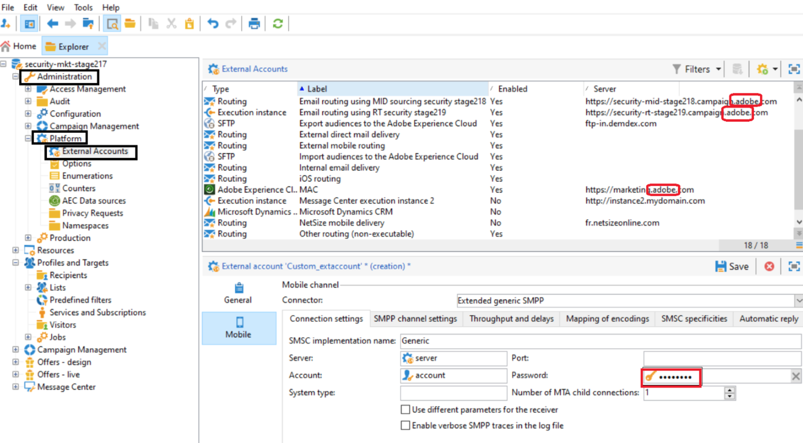

# Technische opmerking: Referentiegids voor rotatie {#ac-customer-credentials}

Als klant, bent u verantwoordelijk voor het vervangen van uw geloofsbrieven door een nieuwe reeks periodiek om het risico van compromis te verlichten.

## Referenties Adobe Campaign-opties {#ac-options-credentials}

Van de Ontdekkingsreiziger van Adobe Campaign, staat het **Beleid > Platform > de knoop van Opties** u toe om veranderingen in de opties van Adobe Campaign aan te brengen. Als u enkele gegevens hier hebt opgeslagen, moet u deze roteren.

## Referenties externe account {#ac-accounts-credentials}

Het **Beleid > Platform > de Externe knoop van Rekeningen** staat u toe om wijzigingen in de externe rekeningen van Adobe Campaign aan te brengen.

Roteer al uw referenties die u hebt opgeslagen in de externe accounts.

>[!CAUTION]
>
>**wijzigt niet** de Adobe beheerde geloofsbrieven. Externe accounts met een `adobe` verwante server mogen niet worden gewijzigd.

Voor de specifieke technische operatoren `mc*` (bv. mc1, mc2, enz.) en `Interaction*` (bv. interactie1, interactie2, enz.) kan een van de volgende twee methoden worden gevolgd:

1. De Adobe kan de geloofsbrieven voor dergelijke exploitanten veranderen en het met u delen. Houd er rekening mee dat alle integratie met deze operatoren stopt met werken totdat de gegevens voor deze operatoren aan uw zijde worden bijgewerkt.

1. De Adobe kan **nieuwe** exploitanten tot stand brengen die aan elke bestaande exploitanten beantwoorden en hen met u delen. Wanneer u overschakelt naar deze nieuwe operatoren, worden alle instanties van oude operatoren verwijderd.

## Persoonlijke sleutel/certificaat voor mobiele services  {#ac-key-credentials}

Raadpleeg de onderstaande koppelingen voor rotatie van de mobiele services met betrekking tot persoonlijke sleutels en certificaten.

* Voor Android, verwijs naar [ deze documentatie ](https://experienceleague.adobe.com/en/docs/campaign-classic/using/sending-messages/sending-push-notifications/configure-the-mobile-app/configuring-the-mobile-application-android){target="_blank"} .
Blader naar **creeer de mobiele toepassing van Android > vorm de API versie** sectie.

* Voor iOS, verwijs naar [ deze documentatie ](https://experienceleague.adobe.com/en/docs/campaign-classic/using/sending-messages/sending-push-notifications/configure-the-mobile-app/configuring-the-mobile-application){target="_blank"} .
Blader aan **Create iOS mobiele app->de wijze van de Authentificatie** sectie.

## GPG-toetsen {#ac-gpg-credentials}

Voor het roteren van GPG sleutels, moeten de volgende stappen worden gevolgd:

1. Decoderen van de bestaande gegevens met de bestaande sleutel. [Meer informatie](https://experienceleague.adobe.com/en/docs/control-panel/using/instances-settings/gpg-keys-management#decrypting-data){target="_blank"}.

1. Maak een nieuw GPG-sleutelpaar. Leer meer over GPG zeer belangrijk beheer in [ deze documentatie ](https://experienceleague.adobe.com/en/docs/control-panel/using/instances-settings/gpg-keys-management#decrypting-data){target="_blank"} .

1. Vervang het bestaande gebruik van de GPG-sleutel in alle workflows door de nieuwe sleutel.

1. Verwijder de bestaande GPG-sleutel.