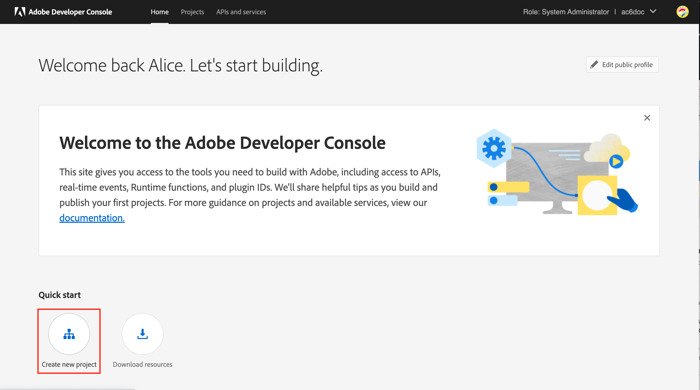

# Migratie van de technische actoren van de campagne naar Adobe Developer Console {#migrate-tech-users-to-ims}

Als onderdeel van de inspanningen om het beveiligings- en verificatieproces te versterken, te beginnen met Campagne v8.5, wordt het verificatieproces voor Campagne v8 verbeterd. De technische exploitanten kunnen het [&#x200B; Systeem van Adobe Identity Management (IMS) &#x200B;](https://helpx.adobe.com/nl/enterprise/using/identity.html){target="_blank"} nu gebruiken om met Campagne te verbinden. Leer meer over de nieuwe server aan het proces van de serverauthentificatie in [&#x200B; documentatie van Adobe Developer Console &#x200B;](https://developer.adobe.com/developer-console/docs/guides/authentication/ServerToServerAuthentication/){target="_blank"}.

Een technische operator is een Campagnegebruikersprofiel dat expliciet is gemaakt voor API-integratie. In dit artikel worden de stappen beschreven die nodig zijn om een technische operator via de Adobe Developer-console naar een technische account te migreren.


## Heb je invloed op?{#ims-impacts}

Als u API vraag van een systeem buiten Campaign in of hun instantie van de Marketing van de Campagne of de instantie van het Centrum van het Bericht in real time maakt, moet u de technische exploitant(en) aan technische rekening(en) door Adobe Developer Console migreren zoals hieronder gedetailleerd.

Deze verandering is van toepassing beginnend Campagne v8.5, en zal **verplicht** aanvang Campagne v8.6 zijn.


## Migratieproces {#ims-migration-procedure}

Voer de onderstaande stappen uit om een of meer technische accounts in de Adobe Developer Console te maken en gebruik vervolgens deze nieuwe accounts om de verificatiemethoden voor al uw externe systemen te kunnen wijzigen en API-aanroepen in Adobe Campaign uit te voeren.

Een overzicht van de stappen is:

* Een project maken in de Adobe Developer Console
* De juiste API&#39;s toewijzen aan het nieuwe project
* De vereiste profielen van het Product van de Campagne aan het project verlenen
* De API&#39;s bijwerken en de nieuwe gegevens van de technische account gebruiken
* Verwijder de verouderde technische operatoren uit uw Campagne-instantie

### Voorwaarden voor migratie{#ims-migration-prerequisites}

<!--To be able to create the technical accounts which replace the technical operators, the prerequisite that the proper Campaign Product Profiles exist within the Admin Console for all Campaign instances need to be validated. You can learn more about Product Profiles within the Adobe Console in [Adobe Developer Console documentation](https://developer.adobe.com/developer-console/docs/guides/projects/){target="_blank"}.-->

Voor API-aanroepen in de Message Center-instantie(s) had een productprofiel moeten worden gemaakt tijdens de upgrade naar Campagne v8.5 of tijdens de provisioning van de instantie. Dit productprofiel heeft de volgende naam:

`campaign - <your campaign instance> - messagecenter`

Als u reeds op IMS gebaseerde authentificatie voor gebruikerstoegang tot Campagne gebruikt, dan zouden de productprofielen nodig voor de API vraag reeds binnen Admin Console moeten bestaan. Als u een aangepaste operatorgroep gebruikt in Campagne voor de API-aanroepen naar de marketinginstantie, moet u dat productprofiel maken in de Admin Console.

Voor andere gevallen moet u contact opnemen met de Adobe Transition Manager, zodat technische teams van Adobe uw bestaande groepen met operatoren en benoemde rechten naar de productprofielen in de Admin Console kunnen migreren.


### Stap 1 - Maak uw Campagne-project in de Adobe Developer Console {#ims-migration-step-1}

De integratie wordt gecreeerd als deel van a **Project** binnen Adobe Developer Console. Leer meer over Projecten in [&#x200B; documentatie van Adobe Developer Console &#x200B;](https://developer.adobe.com/developer-console/docs/guides/projects/){target="_blank"}.

U kunt elk project gebruiken dat u eerder hebt gemaakt of u kunt een nieuw project maken. De stappen om een project tot stand te brengen zijn gedetailleerd in de [&#x200B; documentatie van Adobe Developer Console &#x200B;](https://developer.adobe.com/developer-console/docs/guides/getting-started/){target="_blank"}. U vindt hieronder de belangrijkste stappen

<!--
For this migration, you must add below APIs in your project: **I/O Management API** and **Adobe Campaign**.

-->

Om een nieuw project tot stand te brengen, klik **creeer nieuw project** van het belangrijkste scherm in Adobe Developer Console.



U kunt **gebruiken uitgeeft project** knoop om dit project anders te noemen.


### Stap 2 - voeg APIs aan uw project toe {#ims-migration-step-2}

Voeg vanuit het nieuwe projectscherm de API&#39;s toe die nodig zijn om dit project als een technische account te kunnen gebruiken voor uw API-aanroepen naar Adobe Campaign.

Ga als volgt te werk om API&#39;s aan uw project toe te voegen:

1. Klik op **voeg API** toe om APIs te selecteren om aan uw project toe te voegen.
   
1. Selecteer de Adobe Campaign API en voeg deze toe aan uw project door het selectievakje rechtsboven in de Adobe Campaign-kaart in te schakelen. Dit selectievakje wordt weergegeven wanneer u de muis boven de kaart houdt
   
1. Klik **daarna** bij de bodem van het scherm.

### Stap 3 - selecteer het authentificatietype  {#ims-migration-step-3}

In **vorm API** scherm, selecteer het vereiste authentificatietype. **OAuth Server-aan-Server** Authentificatie wordt vereist voor dit project. Verzeker het wordt geselecteerd en klik **daarna** bij de bodem van het scherm.


<!--
Once your project is created in the Adobe Developer Console, add an API that uses Server-to-Server authentication. Learn how to set up the OAuth Server-to-Server credential in [Adobe Developer Console documentation](https://developer.adobe.com/developer-console/docs/guides/authentication/ServerToServerAuthentication/implementation/){target="_blank"}.

When the API has been successfully connected, you can access the newly generated credentials including Client ID and Client Secret, as well as generate an access token.-->

### Stap 4 - Selecteer de productprofielen {#ims-migration-step-4}

Zoals beschreven in de sectie Voorwaarden moet u de juiste productprofielen toewijzen die door het project worden gebruikt. In deze stap moet u het productprofiel of de profielen selecteren die moeten worden gebruikt door de technische account die wordt gemaakt.

Als dit technische account wordt gebruikt om API-aanroepen uit te voeren naar de Message Center-instantie, moet u het Adobe-productprofiel maken selecteren dat eindigt met `messagecenter` .

Voor API-aanroepen naar de marketinginstantie(s) selecteert u het productprofiel dat overeenkomt met de instantie en de Operator Group.

Zodra de vereiste productprofielen zijn geselecteerd klik op **sparen gevormde API** bij de bodem van het scherm.

<!--
You can now add your Campaign product profile to the project, as detailed below:

1. Open the Adobe Campaign API.
1. Click the **Edit product profiles** button

    

1. Assign all the relevant Product Profiles to the API, for example 'messagecenter', and save your changes.
1. Browse to the **Credential details** tab of your project, and copy the **Technical Account Email** value.-->

### Stap 5 - voeg toe I/O beheer API aan uw project {#ims-migration-step-5}


Klik in het projectscherm op **[!UICONTROL + Add to Project]** en kies **[!UICONTROL API]** linksboven in het scherm om de API voor I/O-beheer aan dit project toe te voegen.


In **voeg API** scherm toe, scrol neer om de **I/O Beheer API** kaart te vinden. Selecteer het door checkbox te klikken die verschijnt wanneer u over de kaart beweegt. Dan klik **daarna** bij de bodem van het scherm.


In **vorm API** scherm, is de authentificatie OAuth server-aan-Server reeds bestaand. Klik **sparen gevormde API** bij de bodem van het scherm.


Dit neemt u terug naar het scherm van het Project binnen het I/O Beheer API van het pas gecreëerde project. Klik op de projectnaam in de broodkruimels bij de bovenkant van het scherm om terug naar de belangrijkste pagina van de Details van het Project te nemen.


### Stap 6 - verifieer de projectopstelling {#ims-migration-step-6}

Herzie uw project om het te verzekeren kijkt gelijkaardig aan hieronder met **I/O Beheer API** en **Adobe Campaign API** zichtbaar in de sectie van Producten en van de Diensten en **OAuth Server-aan-Server** in de sectie van Geloofsbrieven.


### Stap 7 - Valideer uw configuratie {#ims-migration-step-7}

Om de verbinding uit te proberen, volg de stappen in de [&#x200B; de geloofsbrieven van Adobe Developer Console gids &#x200B;](https://developer.adobe.com/developer-console/docs/guides/authentication/ServerToServerAuthentication/implementation/#generate-access-tokens){target="_blank"} voor het produceren van een toegangstoken worden gedetailleerd en kopieer het bevel van de Steekproef cURL verstrekte. U kunt een soapaanroep maken met deze gegevens om te testen of u de Adobe Campaign-instantie(s) correct kunt verifiëren en er verbinding mee kunt maken. We raden u aan deze validatie uit te voeren voordat u alle wijzigingen aanbrengt in de integratie van de externe API.

### Stap 8 - De integratie van de externe API bijwerken {#ims-migration-step-8}

U moet nu alle API-integraties bijwerken en aanroepen naar Adobe Campaign uitvoeren om het zojuist gemaakte technische account te kunnen gebruiken.

Voor verdere details over API integratiestappen, met inbegrip van een steekproefcode voor vlotte integratie, verwijs naar [&#x200B; de authentificatiedocumentatie van Adobe Developer Console &#x200B;](https://developer.adobe.com/developer-console/docs/guides/authentication/ServerToServerAuthentication/){target="_blank"}.

Hieronder vindt u voorbeelden van SOAP-aanroepen die de aanroepen voor en na migratie naar systemen van derden weergeven.

Wanneer u Adobe Identity Management System (IMS)-verificatie gebruikt om een WSDL-bestand te genereren, moet u de `Authorization: Bearer <IMS_Technical_Token_Token>` toevoegen aan de postbode:

```
curl --location --request POST 'https://<instance_url>/nl/jsp/schemawsdl.jsp?schema=nms:rtEvent' \--header 'Authorization: Bearer <Technical account access token>'
```

Zodra het migratieproces wordt bereikt en bevestigd, worden de Vraag van Soap als volgt bijgewerkt:

* Vóór de migratie: er was geen ondersteuning voor het token voor toegang tot de technische account.

  ```sql
  POST /nl/jsp/soaprouter.jsp HTTP/1.1
  Host: localhost:8080
  Content-Type: application/soap+xml;
  SOAPAction: "nms:rtEvent#PushEvent"
  charset=utf-8
  
  <?xml version="1.0" encoding="utf-8"?>  <soapenv:Envelope xmlns:soapenv="http://schemas.xmlsoap.org/soap/envelope/" xmlns:urn="urn:nms:rtEvent">
  <soapenv:Header/>
  <soapenv:Body>
      <urn:PushEvent>
          <urn:sessiontoken>SESSION_TOKEN</urn:sessiontoken>
          <urn:domEvent>
              <!--You may enter ANY elements at this point-->
              <rtEvent type="type" email="name@domain.com"/>
          </urn:domEvent>
      </urn:PushEvent>
  </soapenv:Body>
  </soapenv:Envelope>
  ```

* Na de migratie: er is ondersteuning voor het token voor toegang tot de technische account. Van het toegangstoken wordt verwacht dat het in `Authorization` kopbal als Token van de Drager wordt geleverd. Het gebruik van sessietoken moet hier worden genegeerd, zoals in het onderstaande voorbeeld met soapoproepen wordt getoond.

  ```sql
  POST /nl/jsp/soaprouter.jsp HTTP/1.1
  Host: localhost:8080
  Content-Type: application/soap+xml;
  SOAPAction: "nms:rtEvent#PushEvent"
  charset=utf-8
  Authorization: Bearer <IMS_Technical_Token_Token>
  
  <?xml version="1.0" encoding="utf-8"?>  <soapenv:Envelope xmlns:soapenv="http://schemas.xmlsoap.org/soap/envelope/" xmlns:urn="urn:nms:rtEvent">
  <soapenv:Header/>
  <soapenv:Body>
      <urn:PushEvent>
          <urn:sessiontoken></urn:sessiontoken>
          <urn:domEvent>
              <!--You may enter ANY elements at this point-->
              <rtEvent type="type" email="name@domain.com"/>
          </urn:domEvent>
      </urn:PushEvent>
  </soapenv:Body>
  </soapenv:Envelope>
  ```

### Stap 9 - (facultatief) Werk de technische rekeningexploitant binnen de cliënt van de Campagne console bij {#ims-migration-step-9}

Deze stap is optioneel en alleen beschikbaar binnen de marketinginstantie(s), niet binnen een Message Center-instantie. Indien specifieke mapmachtigingen of benoemde rechten zijn gedefinieerd voor de technische exploitant, niet via de toegewezen groep(en) bedieners. U moet nu de nieuwe gebruiker van de technische account in de Admin Console bijwerken om de vereiste machtigingen voor mappen of benoemde rechten te verlenen.

De gebruiker van de Technische Rekening zal NIET in Adobe Campaign bestaan tot minstens één API vraag aan de Instantie van de Campagne wordt gemaakt, waarbij IMS de gebruiker binnen Campagne zal creëren. Als u niet van de technische gebruikers binnen Campagne kunt de plaats bepalen, verzeker u een API vraag zoals geschetst [&#x200B; in Stap 7 &#x200B;](#ims-migration-step-7) met succes kunt verzenden.

1. Als u de wijzigingen die nodig zijn voor de nieuwe gebruiker van de technische account wilt toepassen, zoekt u deze via e-mailadres in de clientconsole van de campagne. Dit e-mailadres is gemaakt tijdens de bovenstaande stappen voor het maken en verifiëren van projecten.

   U kunt van dit e-mailadres de plaats bepalen door op de **OAuth Server-aan-Server** rubriek in de **Credentials** sectie van het Project te klikken.

   

   In het Scherm van Geloofsbrieven, scrol neer om van **Technical Account E-mail &#x200B;** zoeken en de **knoop van het Exemplaar** te klikken.

   

1. U moet nu de nieuwe technische operator bijwerken in de Adobe Campaign-clientconsole. U moet de bestaande technische omslagtoestemmingen van de exploitant op de nieuwe technische exploitant toepassen.

   Ga als volgt te werk om deze operator bij te werken:

   1. Van de ontdekkingsreiziger van de de cliëntconsole van de Campagne, doorblader aan het **Beleid > Beheer van de Toegang > Operatoren**.
   1. Toegang krijgen tot de bestaande technische operator die wordt gebruikt voor API&#39;s.
   1. Blader naar de machtigingen voor de map en controleer de rechten.
   1. Pas de zelfde toestemmingen op de pas gecreëerde technische exploitant toe. E-mail van deze exploitant is de **Technische die waarde E-mail van de Rekening** vroeger wordt gekopieerd.
   1. Sla uw wijzigingen op.


>[!CAUTION]
>
>De nieuwe technische exploitant moet minstens één API vraag hebben gemaakt om aan de cliëntconsole van de Campagne te worden toegevoegd.
>

### Stap 10 - Verwijder de oude technische operator uit Adobe Campaign {#ims-migration-step-10}

Nadat u alle systemen van derden hebt gemigreerd om de nieuwe technische account met IMS-verificatie te gebruiken, kunt u de oude technische operator verwijderen uit de Campagne-clientconsole.

U doet dit door het programma te openen in de de cliëntconsole van de Campagne, navigerend aan **Beleid > het Beheer van de Toegang > Operatoren** en plaatsend de oude Technische Gebruikers en het schrappen van hen.
