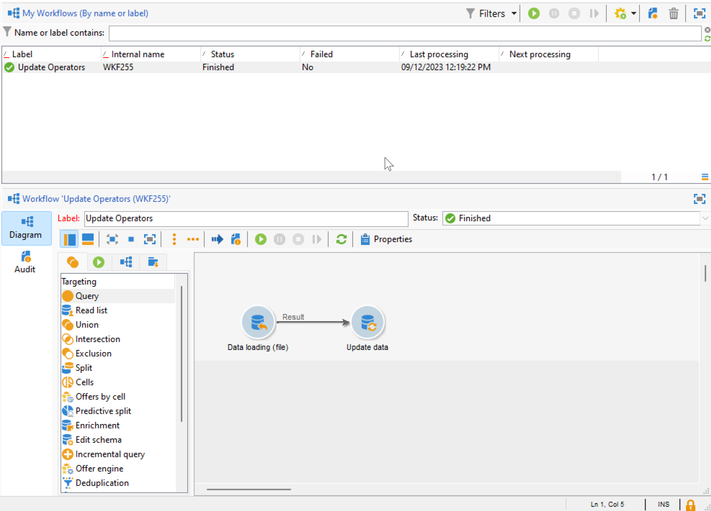

# Campagnebeheerders migreren naar Adobe Identity Management System (IMS) {#migrate-users-to-ims}

Vanaf Campagne v8.6 wordt het verificatieproces naar Campagne v8 verbeterd. Alle exploitanten zullen [&#x200B; het Systeem van Adobe Identity Management (IMS) &#x200B;](https://helpx.adobe.com/nl/enterprise/using/identity.html){target="_blank"} **slechts** gebruiken om met Campagne te verbinden. Verbinding maken met gebruiker/wachtwoord (ook wel native verificatie genoemd) is niet langer toegestaan. Adobe raadt aan deze migratie uit te voeren in Campagne v8.5.2 om probleemloos te kunnen migreren naar Campagne v8.6.

Als klant van de beheerde services van Campaign Classic v7 geldt deze procedure ook voor u als u naar Campagne v8 migreert.

In dit artikel worden de stappen beschreven die nodig zijn om een technische operator naar een technische account op de Adobe Developer-console te migreren.

## Wat is er veranderd?{#move-to-ims-changes}

Met Campaign v8 zouden alle gewone gebruikers al verbinding moeten maken met de Adobe Campaign-clientconsole via hun Adobe ID, via Adobe Identity Management System (IMS). Bij sommige oudere configuraties waren de gebruikers-/wachtwoordverbindingen echter nog steeds beschikbaar. **dit wordt niet meer toegelaten beginnende Campagne v8.6.**

Daarnaast roept de Adobe Campaign-clienttoepassing als onderdeel van de inspanningen om het beveiligings- en verificatieproces te versterken nu de campagne-API&#39;s rechtstreeks aan met het token van de technische IMS-account. De migratie voor technische exploitanten is gedetailleerd in een specifiek artikel, beschikbaar in [&#x200B; deze pagina &#x200B;](ims-migration.md).

Deze verandering is van toepassing beginnend Campagne v8.5.2, en is **verplicht** beginnend Campagne v8.6.

## Heb je invloed op?{#migrate-ims-impacts}

Als de exploitanten in uw organisatie met de cliëntconsole van de Campagne gebruikend hun login/wachtwoord verbinden (alias. (native verificatie), heeft dit invloed op u en moet u deze operator(s) migreren naar Adobe IMS, zoals hieronder beschreven.

De migratie aan [&#x200B; Identity Management Systeem van Adobe (IMS) &#x200B;](https://helpx.adobe.com/nl/enterprise/using/identity.html){target="_blank"} is een veiligheidsvereiste om uw milieu&#39;s veilig en gestandaardiseerd te maken, aangezien de meeste andere oplossingen en apps van Adobe Experience Cloud reeds op IMS zijn.

## Hoe migreren?{#ims-migration-procedure}

### Vereisten{#ims-migration-prerequisites}

Voordat u het migratieproces start, moet u contact opnemen met uw Adobe-vertegenwoordiger (Transition Manager), zodat technische teams van Adobe uw bestaande Operator-groepen en benoemde rechten kunnen migreren naar Adobe Identity Management System (IMS).

### Belangrijkste stappen {#ims-migration-steps}

De belangrijkste stappen voor deze migratie worden hieronder weergegeven:

1. Adobe upgradet uw omgevingen naar Campagne v8.5.2.
1. Na de upgrade kunt u nog steeds nieuwe gebruikers maken met beide methoden, als native gebruiker of met IMS.
1. Uw interne beheerder van de Campagne moet unieke e-mails toevoegen aan alle native gebruikers op de Campagne clientconsole en zodra dit is gebeurd, aan uw Adobe Transition Manager bevestigen. Deze stap wordt gedetailleerd in [&#x200B; deze sectie &#x200B;](#ims-migration-id).
1. Werk samen met Adobe om een datum te beveiligen waarop Adobe de automatische migratie voor uw niet-technische gebruikers (operators) en productprofielen kan uitvoeren. Deze stap vereist een uurvenster zonder onderbreking aan om het even welk van uw instanties.
1. Uw interne beheerder van de Campagne bevestigt deze veranderingen, en verstrekt aftekening. Na deze migratie moet u geen andere operator meer maken die wordt geverifieerd met zijn aanmeldingsnaam en wachtwoord.

U kunt uw technische exploitant(s) nu migreren aan Adobe Developer Console zoals die in [&#x200B; wordt gedetailleerd dit technologie &#x200B;](ims-migration.md). Deze stap is verplicht als u campagne-API&#39;s gebruikt.

Zodra deze migratie is voltooid, bevestigt u dit aan uw Adobe Transition Manager: Adobe markeert de migratie als voltooid en blokkeert het maken van nieuwe native gebruikers en het aanmelden van native gebruikers. Uw omgeving wordt dan beveiligd en gestandaardiseerd.

## Veelgestelde vragen {#ims-migration-faq}

### Wanneer kan ik de migratie starten? {#ims-migration-start}

Een voorwaarde voor de migratie aan [&#x200B; Adobe Identity Management Systeem (IMS) &#x200B;](https://helpx.adobe.com/nl/enterprise/using/identity.html){target="_blank"} moet uw milieu bevorderen aan Campagne v8.5.2.

U kunt de migratie van IMS op uw werkgebiedomgeving starten zodra deze is bijgewerkt naar Campagne v8.5.2 en dienovereenkomstig plannen voor de productieomgeving.

### Wat gebeurt er na upgrade van de build naar Campagne v8.5.2? {#ims-migration-after-upgrade}

Nadat uw milieu&#39;s aan Campagne v8.5.2 zijn bevorderd, kunt u uw overgang aan [&#x200B; het Systeem van Adobe Identity Management (IMS) in werking stellen &#x200B;](https://helpx.adobe.com/nl/enterprise/using/identity.html){target="_blank"}.

Het maken van nieuwe native gebruikers is nog steeds toegestaan totdat de IMS-migratie is voltooid.

### Wanneer is de migratie voltooid? {#ims-migration-end}

Zodra de migratie van eindgebruikers en de migratie van technische gebruikers naar het Adobe Identity Management System (IMS) is voltooid, moet u contact opnemen met uw Adobe Transition Manager zodat Adobe uw migratie als voltooid kan markeren en het maken van gebruikers vanaf de clientconsole kan blokkeren en de aanmelding van de native gebruiker kan uitschakelen.

### Hoe kunt u na de migratie gebruikers maken? {#ims-migration-native}

Zodra de volledige IMS-migratie is voltooid, past Adobe de beperkingen toe die het maken van nieuwe native gebruikers blokkeren. Deze beperkingen worden niet toegepast totdat de IMS-migratie is voltooid.

Voor nieuwe klanten - het maken van nieuwe native gebruikers is niet vanaf het begin toegestaan.

Als beheerder van de Campagne, kunt u toestemmingen aan de gebruikers van uw organisatie via Adobe Admin Console en de cliëntconsole van de Campagne verlenen. Gebruikers melden zich aan bij Adobe Campaign met hun Adobe ID. Leer meer in [&#x200B; deze documentatie &#x200B;](../../v8/start/gs-permissions.md).

### E-mails toevoegen voor huidige native gebruikers? {#ims-migration-id}

Als Campagnebeheerder moet u e-mailadressen toevoegen aan alle native gebruikers vanaf de clientconsole. Volg onderstaande stappen om dit te doen:

1. Verbind met de cliëntconsole en doorblader aan **Beleid > het Beheer van de Toegang > Exploitanten**.
1. Selecteer de operator die u wilt bijwerken in de lijst met operatoren.
1. Ga e-mail van de exploitant in de **sectie van de Contactpunten** van de exploitantvorm in.
1. Sla uw wijzigingen op.

Als werkstroomtoezichthouder, of een beheerder van de Campagne, kunt u een bulkupdate van uw exploitanten met een werkschema ook uitvoeren.

+++Belangrijke stappen om uw operatoren bij te werken met een workflow

Voer de volgende stappen uit om een bulkupdate van uw native operatoren uit te voeren:

1. Maak een workflow om alle operatoren die verbinding maken met Campagne in de native verificatiemodus, uit te pakken in een CSV-bestand. Gebruik de activiteit van de a **Vraag** en de extractie van a **Gegevens (dossier)** activiteit om het Csv- dossier tot stand te brengen. Voor elke operator kunt u op basis van de profielgegevens de volgende kolommen exporteren: `Name, Label`.

   Leer meer over de **activiteit van de Vraag** in [&#x200B; deze pagina &#x200B;](../../automation/workflow/query.md)

   Leer meer over de **extractie van Gegevens (dossier)** activiteit in [&#x200B; deze pagina &#x200B;](../../automation/workflow/extraction-file.md)

1. Werk het CSV-bestand bij met een nieuwe kolom die de e-mails van uw operatoren bevat.

1. Creeer een werkschema om bijgewerkte gegevens in te voeren, met het laden van a **Gegevens (dossier)** activiteit en een **gegevens van de Update** activiteit in het werkschema.

   {width="70%"}

1. Bewerk de **het laden van Gegevens (dossier)** activiteit en bepaal de montages om het bijgewerkte Csv- dossier te laden, zoals in de hieronder steekproef.

   {width="70%"}

   Leer meer over het **laden van Gegevens (dossier)** activiteit in [&#x200B; deze pagina &#x200B;](../../automation/workflow/data-loading-file.md)

1. Bewerk de **gegevens van de Update** activiteit en bepaal de montages zoals per de steekproef hieronder. Merk op dat de **Bijgewerkte afmeting** is veranderd in `Operators (xtk)`.

   {width="70%"}

   Leer meer over de **gegevens van de Update** activiteit in [&#x200B; deze pagina &#x200B;](../../automation/workflow/update-data.md)

1. Voer de workflow uit en controleer de resultaten. Het e-mailadres is toegevoegd aan het profiel van de operator.

   {width="70%"}

+++

### Hoe u zich via IMS aanmeldt bij Campaign? {#ims-migration-log}

Leer hoe te met Campagne met uw Adobe ID in [&#x200B; te verbinden deze sectie &#x200B;](../../v8/start/connect.md).

### Zal er tijdens deze migratie een onderbreking plaatsvinden? {#ims-migration-downtime}

Om de migratie af te ronden (gebruikers en productprofielen migreren), heeft Adobe een periode van één uur zonder downtime nodig voor een van uw instanties (workflows, enz.).

Tijdens dit tijdsbestek moeten alle Campagnegebruikers zich afmelden en zich opnieuw aanmelden bij hun Adobe ID zodra de migratie naar IMS is voltooid.

### Wat gebeurt er met gebruikers die zijn aangemeld tijdens IMS-gebruikersmigratie? {#ims-migration-log-off}

Adobe raadt alle gebruikers sterk aan zich af te melden tijdens het migratievenster.

### De gebruikers in mijn organisatie gebruiken reeds IMS, moet ik nog uitvoeren IMS Migratie?{#ims-migration-needed}

Deze migratie kent twee aspecten: migratie van eindgebruikers en migratie van technische gebruikers (wordt gebruikt in API&#39;s in uw aangepaste code).

Als al uw gebruikers (campagneoperatoren) zich op IMS bevinden, hoeft u deze migratie niet uit te voeren. Nochtans, moet u nog Technische gebruikers migreren u in douanecode zou kunnen gebruikt. Meer informatie vindt u [op deze pagina](ims-migration.md).

Zodra deze migratie is voltooid, moet u contact opnemen met uw Adobe Transition Manager zodat Adobe de migratie kan voltooien.

### Hoe te om het de authentificatietype van uw Operatoren te bekijken?

Leer hoe te om het authentificatietype van uw Exploitanten in Campagne te bekijken:

1. Van de **Ontdekkingsreiziger**, toegang **Beleid** `>` **Toegangsbeheer** `>` **Operatoren**.

1. Klik de kopbalrij met de rechtermuisknop aan en selecteer **vormen lijst** menu.

   

1. Voeg **Gehandicapte Rekening** en **Type van Authentificatie** als **kolommen van de Output** toe.

   

U kunt de lijst van uw **Operatoren** en hun **Type van Authentificatie** nu zien.

## Nuttige koppelingen {#ims-useful-links}

* [Migratie van technische gebruikers naar Adobe Developer-console](ims-migration.md)
* [Verbinding maken met Adobe Campaign v8](../../v8/start/connect.md)
* [Toegang en machtigingen in Adobe Campaign v8](../../v8/start/gs-permissions.md)
* [Opmerkingen bij de release van Adobe Campaign v8](../../v8/start/release-notes.md)
* [&#x200B; wat is het Systeem van Adobe Identity Management (IMS) &#x200B;](https://helpx.adobe.com/nl/enterprise/using/identity.html){target="_blank"}
