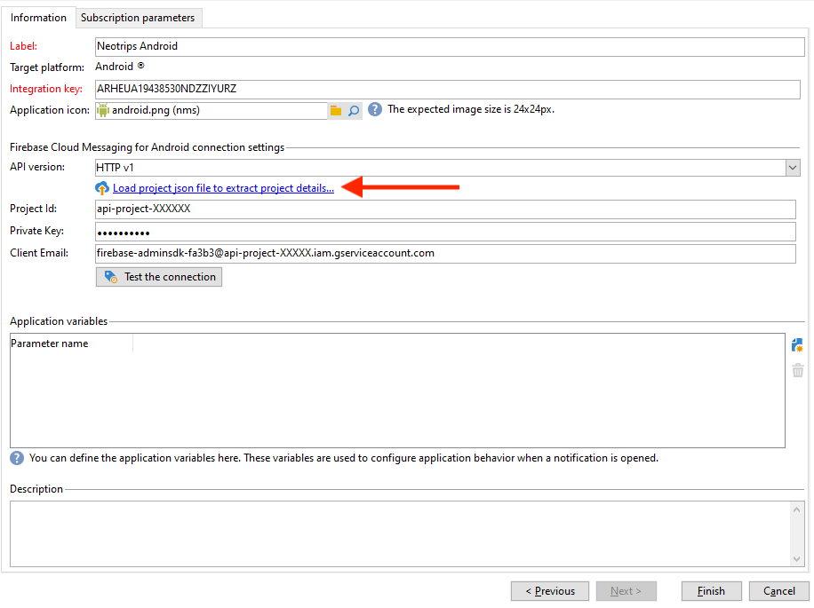

# Wijzigingen in pushmeldingskanaal {#push-upgrade}

Met Campagne kunt u pushmeldingen verzenden op Android-apparaten. Hiervoor is de campagne afhankelijk van specifieke externe Android-accounts en abonnementenservices. Enkele belangrijke wijzigingen in de FCM-service (Firebase Cloud Messaging) van Android worden in 2024 gepubliceerd en kunnen van invloed zijn op uw Adobe Campaign-implementatie.

## Wat is er veranderd? {#fcm-changes}

Als onderdeel van de voortdurende inspanningen van Google om haar diensten te verbeteren, zullen de bestaande FCM API&#39;s worden stopgezet op **20 juni 2024**. Meer informatie over het HTTP-protocol voor Firebase Cloud Messaging vindt u in [Google-documentatie](https://firebase.google.com/docs/cloud-messaging/http-server-ref){target="_blank"}.

Adobe Campaign Classic v7 en Adobe Campaign v8 ondersteunen al de nieuwste API&#39;s voor het verzenden van pushberichten. Sommige oude implementaties zijn echter nog steeds afhankelijk van de oudere API&#39;s. Deze implementaties moeten worden bijgewerkt.

## Heeft dit gevolgen voor u? {#fcm-impact}

Als uw huidige implementatie ondersteuning biedt voor abonnementsservices die verbinding maken met FCM via de verouderde API&#39;s, heeft dit gevolgen voor u. Migratie naar de nieuwste API&#39;s is verplicht om elke onderbreking van de service te voorkomen. In dat geval zullen de teams van de Adobe u bereiken.

Als u wilt controleren of er gevolgen voor u zijn, kunt u het filter **Services en abonnementen** volgens het onderstaande filter:

* Als een van uw actieve pushberichtcampagnes de **HTTP (verouderd)** API, heeft deze wijziging rechtstreeks invloed op uw installatie. U moet uw huidige configuraties controleren en migreren naar de nieuwere API&#39;s, zoals hieronder wordt beschreven.

* Als uw opstelling exclusief gebruikmaakt van **HTTP v1** API voor Android Push-berichten, dan voldoet u al aan de eisen en hoeft u verder niets te doen.

## Hoe migreren?{#fcm-migration-procedure}

### Vereisten{#fcm-migration-prerequisites}

* Voor Campaign Classic v7 is de ondersteuning van HTTP v1 toegevoegd in versie 20.3.1. Als uw omgeving op een oudere versie wordt uitgevoerd, is het een eerste vereiste voor de migratie naar HTTP v1 om uw omgeving te upgraden naar de [nieuwste Campaign Classic maken](https://experienceleague.adobe.com/docs/campaign-classic/using/release-notes/latest-release.html){target="_blank"}. Voor Campagne v8 wordt HTTP v1 ondersteund door alle releases. Er is geen upgrade nodig.

* Voor het uitvoeren van de migratie is het JSON-bestand van de Android Firebase Admin SDK-service vereist om de mobiele toepassing naar HTTPv1 te verplaatsen. Zie dit [page](https://firebase.google.com/docs/admin/setup#initialize-sdk){target="_blank"}.

* Voor Hybride, Gehoste en Managed Services plaatsingen, contacteer Adobe om uw Real-Time (RT) uitvoeringsserver bij te werken.

### Migratieprocedure {#fcm-migration-steps}

Om uw milieu aan HTTP v1 te migreren, volg deze stappen op uw Marketing en Real-Time uitvoeringsservers:

1. Blader naar uw lijst met **Services en abonnementen**.

1. Zoek alle mobiele toepassingen met de **HTTP (verouderd)** API-versie.

1. Stel voor elk van deze mobiele toepassingen de optie **API-versie** tot **HTTP v1**.

1. Klik op de knop **[!UICONTROL Load project json file to extract project details...]** koppeling gebruiken om uw JSON-sleutelbestand rechtstreeks te laden.

   U kunt ook handmatig de volgende gegevens invoeren:
   * **[!UICONTROL Project Id]**
   * **[!UICONTROL Private Key]**
   * **[!UICONTROL Client Email]**

   

1. Klikken **[!UICONTROL Test the connection]** om te controleren of uw configuratie correct is en of de marketingserver toegang heeft tot de FCM. Merk op dat voor implementaties van middelhoge bronnen, de **[!UICONTROL Test connection]** kan niet controleren of de server toegang heeft tot de FCM-service (Android Firebase Cloud Messaging).

1. Als optie kunt u de inhoud van een pushbericht verrijken met wat **[!UICONTROL Application variables]** indien nodig. Deze zijn volledig aanpasbaar en een deel van de berichtlading wordt verzonden naar het mobiele apparaat.

1. Klik op **[!UICONTROL Finish]** en vervolgens op **[!UICONTROL Save]**.

Hieronder vindt u de namen van FCM-ladingen om uw pushmelding verder aan te passen:

| Berichttype | Configureerbaar berichtelement (FCM-ladenaam) | Configureerbare opties (FCM-ladenaam) |
|:-:|:-:|:-:|
| gegevensbericht | N.v.t. | validate_only |
| meldingsbericht | title, body, android_channel_id, icon, sound, tag, color, click_action, image, ticker, sticky, visibility, notification_priority, notification_count   | validate_only |

>[!NOTE]
>
>De overgang naar de HTTP v1-API wordt toegepast op alle nieuwe leveringen. Leveringen in retry, in uitvoering en in gebruik blijven de HTTP (verouderde) API gebruiken.

### Wat is de invloed op mijn Android-apps? {#fcm-apps}

Er zijn geen specifieke wijzigingen vereist in de code van de Android Mobile-toepassingen en het meldingsgedrag moet niet worden gewijzigd.

Met HTTP v1 kunt u uw pushmelding echter verder aanpassen met **[!UICONTROL HTTPV1 additional options]**.

* Gebruik de **[!UICONTROL Ticker]** om de tekst van de markering van uw melding in te stellen.
* Gebruik de **[!UICONTROL Image]** om de URL van de afbeelding in te stellen die in uw melding moet worden weergegeven.
* Gebruik de **[!UICONTROL Notification Count]** veld om het aantal nieuwe ongelezen gegevens in te stellen dat rechtstreeks op het toepassingspictogram moet worden weergegeven.
* Stel de **[!UICONTROL Sticky]** optie aan vals zodat het bericht automatisch wordt verworpen wanneer de gebruiker het klikt. Indien ingesteld op true, wordt het bericht nog steeds weergegeven, zelfs wanneer de gebruiker erop klikt.
* Stel de **[!UICONTROL Notification Priority]** niveau van uw bericht aan gebrek, minimum, laag of hoog.
* Stel de **[!UICONTROL Visibility]** niveau van uw kennisgeving aan publiek, privé of geheim.

Voor meer informatie over de **[!UICONTROL HTTP v1 additional options]** en hoe u deze velden kunt vullen, raadpleegt u [FCM-documentatie](https://firebase.google.com/docs/reference/fcm/rest/v1/projects.messages#androidnotification){target="_blank"}.

