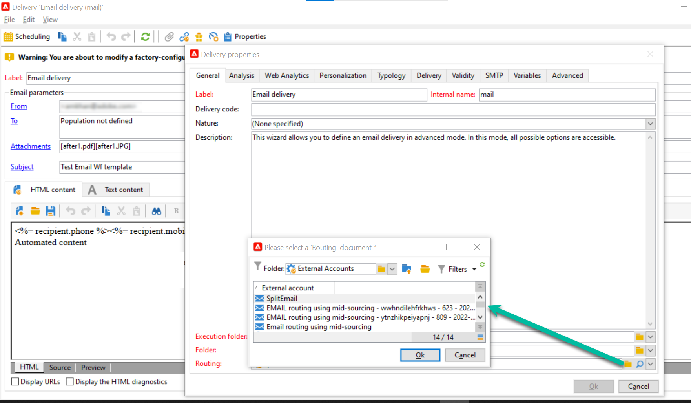

# Aan de slag met de campagnearchitectuur{#gs-ac-archi}

## Omgevingen {#environments}

Campagne wordt beschikbaar gesteld als individuele instanties waarbij elke instantie een volledige omgeving van de Campagne vertegenwoordigt.

Er zijn twee typen omgevingen beschikbaar:

* **Productieomgeving**: gastheren de toepassingen voor de bedrijfsartsen.

* **Niet-productieomgeving**: wordt gebruikt voor verschillende prestatie- en kwaliteitstests voordat wijzigingen in de toepassing worden doorgevoerd in de productieomgeving.

U kunt pakketten van de ene omgeving naar de andere exporteren en importeren.

 Meer informatie over pakketten in [Campaign Classic v7-documentatie](https://experienceleague.adobe.com/docs/campaign-classic/using/getting-started/administration-basics/working-with-data-packages.html){target="_blank"}

## Implementatiemodel {#ac-deployment}

Er zijn twee implementatiemodellen beschikbaar: **Implementatie van FDA voor campagnes** (P1-P3) en **Implementatie van Campagne Enterprise (FFDA)** (P4)

### Implementatie van FDA voor campagnes {#ac-deployment-fda}

In haar [FDA-implementatie](fda-deployment.md), [!DNL Adobe Campaign] v8 kan worden verbonden met [!DNL Snowflake] tot gegevens toegang hebben via de Federale functie voor gegevenstoegang: u kunt externe gegevens en informatie die in uw [!DNL Snowflake] database zonder de structuur van Adobe Campaign-gegevens te wijzigen. PostSQL is het primaire gegevensbestand, en u kunt Snowflake als secundair gegevensbestand gebruiken om dan uw gegevensmodel uit te breiden en uw gegevens in Snowflake op te slaan. Vervolgens kunt u ETL, segmentatie en rapporten uitvoeren voor een grote gegevensset met uitstekende prestaties.

{zoomable=&quot;yes&quot;}

>[!NOTE]
>
>In dit implementatiemodel [!DNL Snowflake] secundaire database is alleen op verzoek beschikbaar. Uw implementatie laten bijwerken met [!DNL Snowflake], neemt u contact op met uw Adobe Transition Manager.
>

### Implementatie van Campagne Enterprise (FFDA) {#ac-deployment-ffda}

In de context van een [Implementatie in het kader van Enterprise (FFDA)](enterprise-deployment.md), [!DNL Adobe Campaign] v8 werkt met twee databases : een lokaal [!DNL Campaign] database voor realtime berichten en eenheidquery&#39;s in de gebruikersinterface en schrijven via API&#39;s en een cloud [!DNL Snowflake] database voor de uitvoering van campagnes, batchquery&#39;s en workflowuitvoering.

Campagne v8 Enterprise introduceert het concept **Volledige Federale Toegang van Gegevens** (FFDA): alle gegevens zijn nu extern beschikbaar in de Cloud Database. Met deze nieuwe architectuur vereenvoudigt de implementatie van Campaign v8 Enterprise (FFDA) het gegevensbeheer: er is geen index vereist voor de Cloud Database. U hoeft alleen de tabellen te maken, de gegevens te kopiëren en te starten. De Cloud-databasetechnologie vereist geen specifiek onderhoud om het prestatieniveau te garanderen.

{zoomable=&quot;yes&quot;}

## Uitvoering van gesplitste levering {#split}

>[!AVAILABILITY]
>
>Deze functie is alleen beschikbaar voor klanten met meerdere MID-instanties.

Afhankelijk van het pakket Campagne v8 beschikt u over een specifiek aantal instanties voor midsourcing die verantwoordelijk zijn voor het uitvoeren van leveringen.

De externe accounts van alle kanalen gebruiken standaard een **[!UICONTROL Alternate]** het verpletteren van wijze, betekenend dat één levering van elke middeninstantie in een tijd afwisselend wordt verzonden.

Om betere prestaties zowel in termen van snelheid als schaal te verzekeren, kunt u levering toestaan om automatisch over uw middelsourcinginstanties worden verdeeld om sneller aan de ontvangers te worden geleverd. Deze bewerking is transparant bij het uitvoeren van de levering vanuit de marketinginstantie: zodra de levering is verzonden, worden alle logboeken samengevoegd, voordat ze naar de marketinginstantie worden teruggestuurd naar één leveringsobject.

Hiertoe worden aanvullende externe rekeningen bij de **[!UICONTROL Split]** de verpletterende wijze wordt gecreeerd op levering voor elk kanaal:

* Levering splitsen - E-mail (splitDeliveryEmail)
* Aflevering splitsen - SMS (splitDeliverySMS)
* Split Delivery - iOS (splitDeliveryIOS)
* Aflevering splitsen - Android (splitDeliveryAndroid)

>[!IMPORTANT]
>
>De gesplitste verpletterende wijze wordt toegelaten door gebrek voor de &quot;Gesplitste Levering - E-mail&quot;rekening. Voor alle andere kanalen externe rekeningen, bereik uit uw Manager van de Overgang van de Adobe om de optie te hebben toegelaten.
>
>Standaard is de waarde voor drempelgrootte voor het splitsen van een levering tussen meerdere midden 100 kB. U kunt deze waarde wijzigen in de optie &quot;NmsDelivery_MultiMidSplitThreshold&quot; in het dialoogvenster **[!UICONTROL Administration]** / **[!UICONTROL Platform]** / **[!UICONTROL Options]** -menu.

om gespleten externe rekeningen als standaardrekening voor het verzenden van leveringen te maken, moet u de verpletterende leverancier in uw leveringsmalplaatjes veranderen. Ga als volgt te werk om dit te doen:

1. Ga naar de **[!UICONTROL Resources]** / **[!UICONTROL Templates]** / **[!UICONTROL Delivery templates]** en opent u de gewenste leveringssjabloon. In dit voorbeeld willen we de sjabloon voor e-maillevering bewerken.

   

1. Klik op de knop **[!UICONTROL Properties]** knoop en verander de verpletterende leverancier in de overeenkomstige gespleten levering externe rekening.

   

1. Sla uw wijzigingen op. Alle die leveringen gebruikend het malplaatje worden verzonden zullen nu de gespleten verpletterende wijze door gebrek gebruiken.

<!--In addition, you can select split external accounts as the default routing provider for all future delivery templates. To do this, change the value of the **[!UICONTROL xtkoption NmsBroadcast_DefaultProvider]** option to the name of the split account.

 -->

## Berichtencentrum{#transac-msg-archi}

Transactioneel overseinen (het Centrum van het Bericht) is de module van de Campagne die voor het beheren van trekkerberichten wordt ontworpen.

 Meer informatie over het verzenden van transactieberichten in [deze sectie](../send/transactional.md).

Als reactie op een actie van een klant op een website, wordt een gebeurtenis verzonden Campagne door REST API, en het berichtmalplaatje wordt bevolkt met de informatie of de gegevens die door de API vraag worden verstrekt, en een transactiebericht wordt verzonden in real time naar de klant. Deze berichten kunnen individueel of in partijen via e-mail, SMS of push-berichten worden verzonden.

In deze specifieke architectuur, wordt de uitvoeringscel gescheiden van de controleinstantie om hoge beschikbaarheid en ladingsbeheer te verzekeren.

* De **Control-instantie** (of marketinginstantie) wordt door marketers en IT-teams gebruikt om berichtsjablonen te maken, te configureren en te publiceren. Deze instantie centraliseert ook gebeurteniscontrole en geschiedenis.

   Meer informatie over het maken en publiceren van berichtsjablonen in [deze sectie](../send/transactional.md).

* De **Uitvoeringsinstantie** treitert binnenkomende gebeurtenissen (bijvoorbeeld opnieuw instellen van wachtwoord of bestellingen van een website) op en stuurt gepersonaliseerde berichten. Er kunnen meer dan één uitvoeringsinstantie zijn om berichten te verwerken via het taakverdelingsmechanisme en het aantal gebeurtenissen te schalen dat moet worden uitgevoerd voor maximale beschikbaarheid.

>[!CAUTION]
>
>De bedieningsinstantie en de uitvoeringsinstantie(s) moeten op verschillende computers zijn geïnstalleerd. Ze kunnen niet dezelfde Campagne-instantie delen.

### Verificatie

Om deze mogelijkheden te gebruiken, de gebruikers van Adobe Campaign login aan de controleinstantie om transactionele berichtmalplaatjes tot stand te brengen, de berichtvoorproef te produceren gebruikend een zaadlijst, vertoningsrapporten en controle uitvoeringsinstantie(s).

* Één enkele uitvoeringsinstantie wanneer het in wisselwerking staan met een Adobe ontvangen de uitvoeringsinstantie van het Centrum van het Bericht, kan een extern systeem een zittingsteken eerst terugwinnen (dat door gebrek in 24 uren) verloopt, door een api vraag aan de methode van de zittingsopening van een sessie te maken, gebruikend een verstrekt rekeningslogin en wachtwoord.
Dan, met sessionToken die door de uitvoeringsinstantie in antwoord op de bovengenoemde vraag wordt verstrekt, kan de externe toepassing BEEP api aanroepen (rtEvents of batchEvents) maken om mededelingen te verzenden, zonder de behoefte om in elke vraag van de ZEEP de rekeningslogin en het wachtwoord te omvatten.

* Meerdere uitvoeringsinstanties In een architectuur met meerdere uitvoeringsinstanties van meerdere cellen met meerdere uitvoeringsinstanties achter een taakverdelingsmechanisme, gaat de openings van een sessiemethode die door de externe toepassing wordt aangeroepen door het taakverdelingsmechanisme: daarom kan geen tokengebaseerde verificatie worden gebruikt. Een op gebruiker/wachtwoord-gebaseerde authentificatie wordt vereist.

Meer informatie over Transactionele berichtengebeurtenissen in [deze pagina](../send/event-processing.md).
