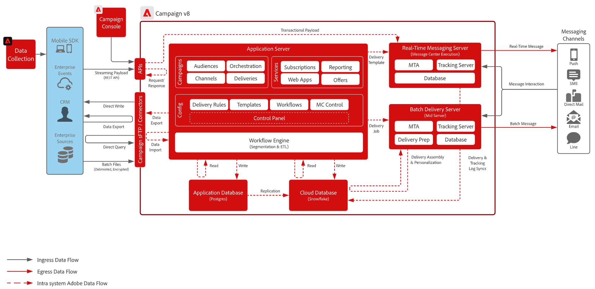

# Aan de slag met de campagnearchitectuur{#gs-ac-archi}

## Omgevingen {#environments}

Campagne wordt beschikbaar gesteld als individuele instanties waarbij elke instantie een volledige omgeving van de Campagne vertegenwoordigt.

Er zijn twee typen omgevingen beschikbaar:

* **het milieu van de Productie**: gastheren de toepassingen voor de bedrijfsartsen.

* **niet-productiemilieu**: gebruikt voor diverse prestaties en kwaliteitstests alvorens de veranderingen in de toepassing aan het productiemilieu worden geduwd.

U kunt pakketten van de ene omgeving naar de andere exporteren en importeren.

Leer meer over pakketten in [ Campaign Classic v7 documentatie ](https://experienceleague.adobe.com/docs/campaign-classic/using/getting-started/administration-basics/working-with-data-packages.html) {target="_blank"}

## Implementatiemodel {#ac-deployment}

Twee plaatsingsmodellen zijn beschikbaar: **plaatsing FDA van de Campagne** (P1-P3) en **plaatsing van de Onderneming van de Campagne (FFDA)** (P4).

### Implementatie van FDA voor campagnes {#ac-deployment-fda}

In zijn [ plaatsing FDA ](fda-deployment.md), [!DNL Adobe Campaign] v8 kan met [!DNL Snowflake] worden verbonden om tot gegevens door het vermogen van de Toegang van Federatieve Gegevens toegang te hebben: u kunt tot externe gegevens en informatie toegang hebben en verwerken die in uw [!DNL Snowflake] gegevensbestand worden opgeslagen zonder de structuur van de gegevens van Adobe Campaign te veranderen. PostgreSQL is de primaire database en u kunt Snowflake gebruiken als de secundaire database om vervolgens uw gegevensmodel uit te breiden en uw gegevens op te slaan in Snowflake. Vervolgens kunt u ETL, segmentatie en rapporten uitvoeren voor een grote gegevensset met uitstekende prestaties.

{zoomable="yes"}

>[!NOTE]
>
>In dit implementatiemodel is de [!DNL Snowflake] secundaire database alleen op verzoek beschikbaar. Neem contact op met uw Adobe Transition Manager als u uw implementatie wilt bijwerken met [!DNL Snowflake] .
>

### Implementatie van Campagne Enterprise (FFDA) {#ac-deployment-ffda}

In de context van een [ plaatsing van de Onderneming (FFDA) ](enterprise-deployment.md), [!DNL Adobe Campaign] werkt v8 met twee gegevensbestanden: een lokaal [!DNL Campaign] gegevensbestand voor het gebruikersinterface overseinen in real time en unitaire vragen en schrijven door APIs, en een gegevensbestand van de Wolk [!DNL Snowflake] voor campagneuitvoering, partijvragen en werkschemauitvoering.

De Onderneming van de campagne v8 brengt het concept **Volledige Federatieve Toegang van Gegevens** (FFDA): alle gegevens zijn nu ver op het Gegevensbestand van de Wolk. Met deze nieuwe architectuur vereenvoudigt de implementatie van Campaign v8 Enterprise (FFDA) het gegevensbeheer: er is geen index vereist voor de Cloud Database. U hoeft alleen de tabellen te maken, de gegevens te kopiëren en te starten. De Cloud-databasetechnologie vereist geen specifiek onderhoud om het prestatieniveau te garanderen.

{zoomable="yes"}

## Uitvoering van gesplitste levering {#split}

>[!AVAILABILITY]
>
>Deze functie is alleen beschikbaar voor klanten met meerdere MID-instanties (mid-sourcing).

Afhankelijk van het pakket Campagne v8 beschikt u over een specifiek aantal instanties voor midsourcing die verantwoordelijk zijn voor het uitvoeren van leveringen.

Door gebrek, gebruiken de externe rekeningen voor alle kanalen een **[!UICONTROL Alternate]** verpletterende wijze, die betekent dat één levering van elke mid-sourcing (MID) instantie tegelijkertijd afwisselend wordt verzonden.

Om betere prestaties zowel in termen van snelheid als schaal te verzekeren, kunt u levering toestaan om automatisch over uw middelsourcinginstanties worden verdeeld om sneller aan de ontvangers te worden geleverd. Deze bewerking is transparant bij het uitvoeren van de levering vanuit de marketinginstantie: zodra de levering is verzonden, worden alle logboeken samengevoegd, voordat ze naar de marketinginstantie worden teruggestuurd naar één leveringsobject.

Hiervoor worden extra externe accounts met de routeringsmodus **[!UICONTROL Split]** gemaakt bij de provisioning voor elk kanaal:

* Levering splitsen - E-mail (splitDeliveryEmail)
* Aflevering splitsen - SMS (splitDeliverySMS)
* Split Delivery - iOS (splitDeliveryIOS)
* Aflevering splitsen - Android (splitDeliveryAndroid)

>[!IMPORTANT]
>
>De gesplitste verpletterende wijze wordt toegelaten door gebrek voor de &quot;Gesplitste Levering - E-mail&quot;rekening. Neem voor alle andere kanalen externe accounts contact op met de Adobe Transition Manager om de optie in te schakelen.
>
>Standaard is de waarde voor drempelgrootte voor het splitsen van een levering onder meerdere MID-instanties (mid-sourcing) 100 kB. U kunt deze waarde wijzigen in de optie &quot;NmsDelivery_MultiMidSplitThreshold&quot; in het menu **[!UICONTROL Administration]** / **[!UICONTROL Platform]** / **[!UICONTROL Options]** .

om gespleten externe rekeningen als standaardrekening voor het verzenden van leveringen te maken, moet u de verpletterende leverancier in uw leveringsmalplaatjes veranderen. Ga als volgt te werk om dit te doen:

1. Navigeer naar de map **[!UICONTROL Resources]** / **[!UICONTROL Templates]** / **[!UICONTROL Delivery templates]** en open de gewenste leveringssjabloon. In dit voorbeeld willen we de sjabloon voor e-maillevering bewerken.

   

1. Klik op de knop **[!UICONTROL Properties]** en wijzig de verpletterende provider in de corresponderende gesplitste levering externe account.

   

1. Sla uw wijzigingen op. Alle die leveringen gebruikend het malplaatje worden verzonden zullen nu de gespleten verpletterende wijze door gebrek gebruiken.

<!--In addition, you can select split external accounts as the default routing provider for all future delivery templates. To do this, change the value of the **[!UICONTROL xtkoption NmsBroadcast_DefaultProvider]** option to the name of the split account.

 -->

## Berichtencentrum{#transac-msg-archi}

Transactioneel overseinen (het Centrum van het Bericht) is de module van de Campagne die voor het beheren van trekkerberichten wordt ontworpen.

Leer hoe te om transactionele berichten in [ deze sectie ](../send/transactional.md) te verzenden.

Als reactie op een actie van een klant op een website, wordt een gebeurtenis verzonden Campagne door REST API, en het berichtmalplaatje wordt bevolkt met de informatie of de gegevens die door de API vraag worden verstrekt, en een transactiebericht wordt verzonden in real time naar de klant. Deze berichten kunnen individueel of in partijen via e-mail, SMS of push-berichten worden verzonden.

In deze specifieke architectuur, wordt de uitvoeringscel gescheiden van de controleinstantie om hoge beschikbaarheid en ladingsbeheer te verzekeren.

* De **instantie van de Controle** (of instantie van de Marketing) wordt gebruikt door marketers en de teams van IT om berichtmalplaatjes tot stand te brengen, te vormen en te publiceren. Deze instantie centraliseert ook gebeurteniscontrole en geschiedenis.

  Leer om berichtmalplaatjes in [ deze sectie ](../send/transactional.md) tot stand te brengen en te publiceren.

* De **instantie van de Uitvoering** retreives inkomende gebeurtenissen (wachtwoordteruggestelde of orden van een website bijvoorbeeld) en verzendt gepersonaliseerde berichten. Er kunnen meer dan één uitvoeringsinstantie zijn om berichten te verwerken via het taakverdelingsmechanisme en het aantal gebeurtenissen te schalen dat moet worden uitgevoerd voor maximale beschikbaarheid.

>[!CAUTION]
>
>De bedieningsinstantie en de uitvoeringsinstantie(s) moeten op verschillende computers zijn geïnstalleerd. Ze kunnen niet dezelfde Campagne-instantie delen.

### Verificatie

Om deze mogelijkheden te gebruiken, de gebruikers van Adobe Campaign login aan de controleinstantie om transactionele berichtmalplaatjes tot stand te brengen, de berichtvoorproef te produceren gebruikend een zaadlijst, vertoningsrapporten en controle uitvoeringsinstantie(s).

* Eén uitvoeringsinstantie
Wanneer het in wisselwerking staan met een op Adobe gehoste de uitvoeringsinstantie van het Centrum van het Bericht, kan een extern systeem een zittingsteken eerst terugwinnen (dat door gebrek in 24 uren) verloopt, door een api vraag aan de methode van de zittingsopening van een sessie te maken, gebruikend een verstrekt rekeningslogin en wachtwoord.
Daarna, met sessionToken die door de uitvoeringsinstantie in antwoord op de bovengenoemde vraag wordt verstrekt, kan de externe toepassing SOAP api aanroepen (rtEvents of batchEvents) maken om mededelingen te verzenden, zonder de behoefte om in elke SOAP te omvatten de rekeningslogin en het wachtwoord.

* Meerdere uitvoeringen
In een multi-cel uitvoeringsarchitectuur met veelvoudige uitvoeringsinstanties achter een ladingsverdelingsmechanisme, gaat de openings van een sessiemethode die door de externe toepassing wordt aangehaald door het ladingsverdelingsmechanisme: daarom, kan een op teken-gebaseerde authentificatie niet worden gebruikt. Een op gebruiker/wachtwoord-gebaseerde authentificatie wordt vereist.

Leer meer over Transactionele overseinengebeurtenissen in [ deze pagina ](../send/event-processing.md).
