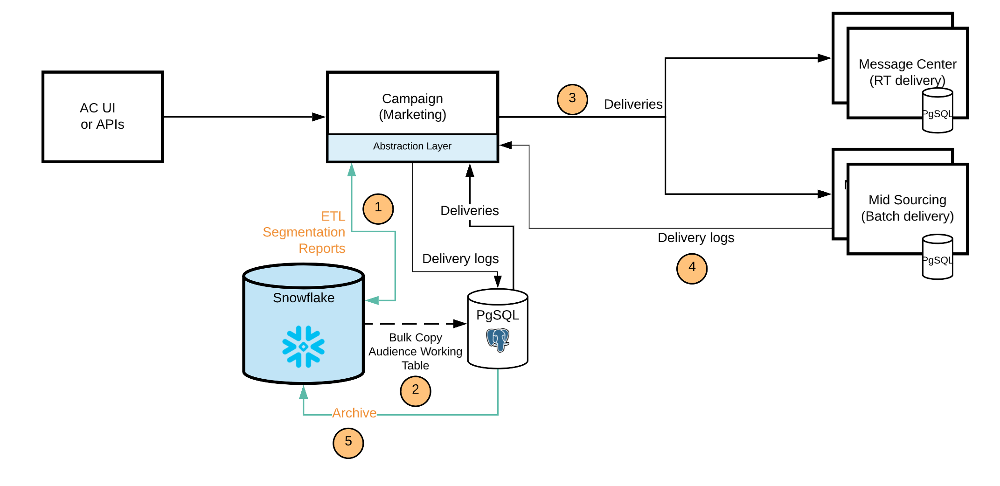

# [!DNL Campaign] FDA-implementatie{#gs-fda}

In zijn (standaard) plaatsing van FDA van de Campagne, [!DNL Adobe Campaign] v8 kan met [!DNL Snowflake] worden verbonden om tot gegevens door [ tot stand te brengen Federated het vermogen van de Toegang van Gegevens ](../connect/fda.md): u kunt tot externe gegevens en informatie dan toegang hebben en verwerken die in uw [!DNL Snowflake] gegevensbestand worden opgeslagen zonder de structuur van de gegevens van Adobe Campaign te veranderen.

>[!NOTE]
>
>In dit implementatiemodel is de [!DNL Snowflake] secundaire database alleen op verzoek beschikbaar. Neem contact op met uw Adobe Transition Manager als u uw implementatie wilt bijwerken met [!DNL Snowflake] .
>

## Voordelen{#fda-benefits}

Dit implementatiemodel biedt de volgende voordelen:

* **Opslag en prestaties**
U kunt uw historische gegevens verplaatsen naar [!DNL Snowflake] en vervolgens de afhankelijkheden reduceren tot de limiet voor Adobe Campaign-id&#39;s. Deze architectuur vermindert ook uw afhankelijkheid van opslag PostgreSQL en prestatiesgrenzen. Omdat minder gegevens worden opgeslagen in de Campagne-database, zijn de prestaties beter en worden de onderhoudstaken sneller uitgevoerd.

* **modeluitbreiding van Gegevens en gegevensbeheer**
U kunt tabellen maken in [!DNL Snowflake] en deze koppelen aan Adobe Campaign, bijvoorbeeld om gearchiveerde gegevens te gebruiken gedurende een bewaarperiode, of om segmentatieprocessen uit te voeren met uitstekende prestaties.

  Met deze architectuur kunt u ook workflowmogelijkheden voor gegevensbeheer gebruiken in [!DNL Snowflake] . Alleen aggregaten en tijdelijke tabellen worden verplaatst naar Campagne voor personalisatie- en leveringsdoeleinden.

## Architectuur{#fda-archi}

Met dit implementatiemodel kunnen Adobe Campaign-gebruikers hun gegevens uitbreiden naar [!DNL Snowflake] en gebruikmaken van de voordelen van één geïntegreerd gegevensplatform voor krachtige informatie over marketingcampagnegegevens in real-time. Het voorziet gebruikers van de capaciteit om diepe waarde van hun gegevens te ontgrendelen door één enkel, verenigd, en makkelijk te gebruiken platform voor gegevensanalyse aan te bieden. Het platform voor cloudgegevens vereist geen beheer omdat het oneindig geschaald kan worden uitgebreid om elk volume aan marketinggegevens van Adobe Campaign te ondersteunen.

De algemene communicatie tussen servers en processen wordt uitgevoerd volgens het volgende schema:

PostgreSQL is het primaire gegevensbestand, en Snowflake kan als secundair gegevensbestand worden gebruikt. U kunt uw gegevensmodel uitbreiden en uw gegevens opslaan op Snowflake. Vervolgens kunt u ETL, segmentatie en rapporten uitvoeren voor een grote gegevensset met uitstekende prestaties.
