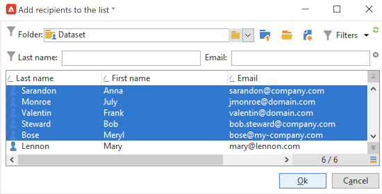
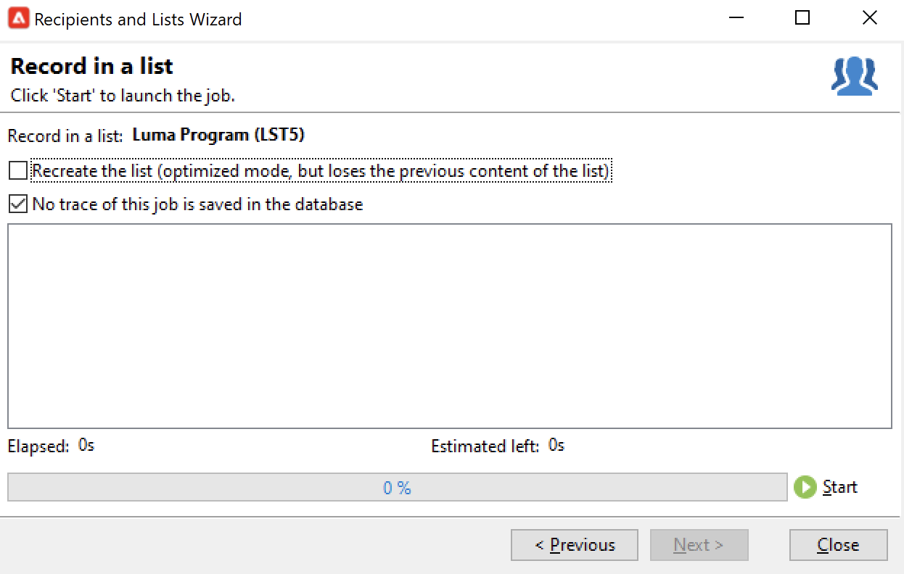
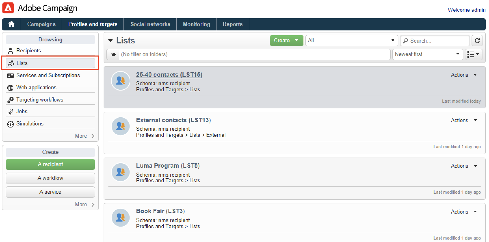

# Een publiek in een lijst maken{#create-segments}

Met de lijsten Campagne kunt u uw publiek maken en organiseren.

Een lijst is een statische reeks contacten die in leveringsacties kunnen worden gericht of tijdens de invoer of een andere werkschemaactie worden bijgewerkt. Bijvoorbeeld, kan een populatie die uit het gegevensbestand via een vraag wordt gehaald als lijst worden opgeslagen.

Lijsten worden gemaakt en beheerd via de **[!UICONTROL Lists]** in de **[!UICONTROL Profiles and targets]** tab. Deze lijst is gebaseerd op de standaard Adobe Campaign-profieltabel (nms:ontvanger). [Meer informatie](../dev/datamodel.md#ootb-profiles.md)

U kunt een lijst maken met de **Lijst bijwerken** activiteit in een werkstroom. Deze activiteit slaat de resulterende bevolking in een lijst op. Met deze lijst kunt u een nieuwe lijst maken of een bestaande lijst bijwerken. Als u lijsten wilt maken met andere typen gegevens dan de ingebouwde profielentabel, moet u een workflow uitvoeren. Als u bijvoorbeeld een query op de bezoekerslijst gebruikt en de lijst vervolgens bijwerkt, kunt u een bezoekerslijst maken. [Meer informatie](#create-a-list-wf).

Bekijk deze video voor meer informatie over Lijstbeheer in Adobe Campaign.

>[!VIDEO](https://video.tv.adobe.com/v/334909?quality=12)

## Een lijst met contactpersonen maken {#create-a-list-of-contacts}

Volg onderstaande stappen om een lijst met contactpersonen te maken:

1. Klik op de knop **[!UICONTROL Create]** en selecteert u **[!UICONTROL New list]**.

   

1. Voer de gegevens in het dialoogvenster **[!UICONTROL Edit]** van het venster voor het maken van de lijst.

   

   * Voer de naam van de lijst in het dialoogvenster **[!UICONTROL Label]** en, indien nodig, de interne naam wijzigen.
   * Voeg een beschrijving voor deze lijst toe.
   * U kunt een vervaldatum opgeven: wanneer deze datum is bereikt, wordt de lijst gewist en automatisch verwijderd.

1. In de **[!UICONTROL Content]** tabblad, klikt u op **[!UICONTROL Add]** om de profielen te selecteren die tot de lijst behoren.

   

   U kunt een nieuw profiel maken en dit rechtstreeks vanuit dit venster toevoegen met de opdracht **[!UICONTROL Create]** pictogram. Het profiel wordt toegevoegd aan de database.

1. Klikken **[!UICONTROL Save]** om de lijst op te slaan. Het wordt dan toegevoegd aan het overzicht van lijsten.

## Gefilterde contactpersonen omzetten in een lijst {#convert-data-to-a-list}

U kunt profielen selecteren en toevoegen aan een lijst. Volg onderstaande stappen om dit te doen:

1. Selecteer profielen in Campagneverkenner en klik met de rechtermuisknop.

   Deze profielen kunnen worden gefilterd om aan specifieke criteria te voldoen.

1. Selecteer **[!UICONTROL Actions > Associate selection with a list...]**.

   

1. Selecteer een bestaande lijst of maak een nieuwe lijst en klik op **[!UICONTROL Next]**.

   

1. Klik op de knop **[!UICONTROL Start]**.

   

Selecteer **[!UICONTROL Recreate the list]** om de bestaande inhoud uit de lijst te verwijderen en het maken van de lijst te optimaliseren (er is geen query nodig om te controleren of de profielen al aan de lijst zijn gekoppeld).

Als u de optie **[!UICONTROL No trace of this job is saved in the database]** kunt u de uitvoeringsmap selecteren (of maken) waarin de informatie wordt opgeslagen die aan dit proces is gekoppeld.

In de bovenste sectie van het venster kunt u de uitvoering controleren. De **[!UICONTROL Stop]** laat u het proces tegenhouden. De reeds verwerkte contacten zullen met de lijst worden verbonden.

Zodra de uitvoering wordt gebeëindigd, heb toegang tot **[!UICONTROL Profiles and Targets > Lists]** en selecteer de lijst: de **[!UICONTROL Content]** worden de profielen weergegeven die aan deze lijst zijn gekoppeld.

## Een lijst maken met een workflow  {#create-a-list-wf}

U kunt de **[!UICONTROL List update]** activiteit om een lijst te creëren of een bevolking aan een lijst van ontvangers toe te voegen.

In het onderstaande voorbeeld maakt u een lijst met alle ontvangers tussen 25 en 40.

1. Selecteren **[!UICONTROL Profiles and targets]**, en **[!UICONTROL Targeting workflows]** en maakt u vervolgens een nieuwe workflow op basis van de **[!UICONTROL Create]** knop.
1. Voer een label voor deze workflow in, bijvoorbeeld &#39;25-40 contactpersonen&#39;, voeg een beschrijving toe en klik op **[!UICONTROL Next]**.

   

1. Een **[!UICONTROL Query]** activiteit om de doelbevolking te bepalen, en de vraag uit te geven.

   

1. Definieer de filtervoorwaarden als volgt:

   

   Leer hoe u een query maakt in een workflow in [Campaign Classic v7-documentatie](https://experienceleague.adobe.com/docs/campaign-classic/using/automating-with-workflows/targeting-activities/query.html#creating-a-query){target=&quot;_blank&quot;}

1. Voeg een label voor deze query toe en sla uw wijzigingen op.
1. Voeg een **[!UICONTROL List update]** en bewerken.

   

1. Voer een label in voor de activiteit.
1. Selecteer **[!UICONTROL Create the list if necessary (Computed name)]** om aan te geven dat de lijst wordt gemaakt zodra de eerste workflow is uitgevoerd en vervolgens wordt bijgewerkt met de volgende uitvoeringen.
1. Selecteer een map en voer een label voor de lijst in.
1. Selecteer **[!UICONTROL Database of the targeting dimension]** om de tabel op te slaan.
1. Laat de **[!UICONTROL Purge the list if it exists (otherwise add to the list)]** Selecteer deze optie om ontvangers te verwijderen die niet voldoen aan de criteria voor het opgeven van doelen en om de nieuwe criteria in de lijst in te voegen.
1. Laat ook de **[!UICONTROL Create or use a list with its own table]** optie ingeschakeld.
1. Laat de **[!UICONTROL Generate an outbound transition]** optie uitgeschakeld.
1. Klikken **[!UICONTROL Ok]** en sla de workflow op.
1. Start de workflow.

   De lijst met overeenkomende ontvangers wordt dan gemaakt. U hebt toegang tot deze lijst via de **[!UICONTROL Lists]** vermelding van de homepage.

   

   U kunt deze werkstroom terugkomen door een planner aan het werkschema toe te voegen. Meer informatie in [Campaign Classic v7-documentatie](https://experienceleague.adobe.com/docs/campaign-classic/using/automating-with-workflows/flow-control-activities/scheduler.html){target=&quot;_blank&quot;}.

## Een profiel uit een lijst verwijderen {#remove-a-profile-from-a-list}

Als u een profiel uit een lijst wilt verwijderen, bewerkt u de lijst en selecteert u het profiel in het dialoogvenster **[!UICONTROL Content]** en klikt u op de knop **[!UICONTROL Delete]** pictogram.

## Een lijst met profielen verwijderen {#delete-a-list-of-profiles}

Als u een lijst wilt verwijderen, bladert u ernaar in Campagneverkenner, selecteert u de lijst en klikt u met de rechtermuisknop. Kies **[!UICONTROL Delete]**. U wordt in een waarschuwingsbericht gevraagd de verwijdering te bevestigen.

>[!NOTE]
>
>Wanneer u een lijst verwijdert, worden de profielen in de lijst niet gewijzigd, maar worden de gegevens in het bijbehorende profiel bijgewerkt.
