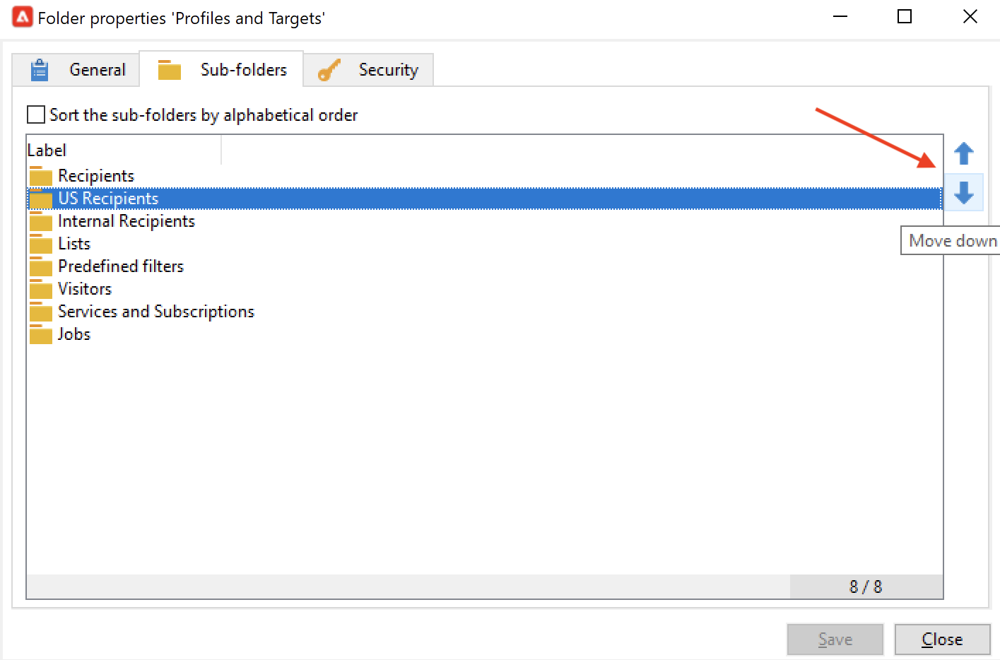

# Mappen en weergaven beheren {#folders-and-views}

De omslagen van de campagne zijn knopen in de ontdekkingsboomstructuur. Gebaseerd op hun type, bevatten zij bepaalde soorten gegevens.

Een weergave is een specifieke map die geen gegevens bevat, maar die gegevens weergeeft die fysiek zijn opgeslagen in andere mappen van hetzelfde type. Als u bijvoorbeeld een leveringsmap naar een weergave stuurt, worden in deze map alle leveringen weergegeven. Deze gegevens kunnen vervolgens worden gefilterd.

>[!NOTE]
>Als u weergaven wilt onderscheiden van standaardmappen, wordt hun naam weergegeven in lichtblauw in plaats van zwart.

U kunt machtigingen toewijzen aan mappen om de toegang tot bepaalde gegevens te beperken. [Meer informatie](#restrict-access-to-a-folder)

## Tips en trucs bij het werken met mappen

* **Ingebouwde mappen gebruiken** om het voor elke persoon die bij het project betrokken is gemakkelijker te maken om de toepassing te gebruiken, te handhaven en problemen op te lossen. Maak geen aangepaste mapstructuren voor ontvangers, lijsten, leveringen, enz., maar gebruik de standaardmappen, zoals **Beheer**, **Profielen en doelen**, **Campagnebeheer**.

* **Submappen maken** Sla uw technische workflows bijvoorbeeld op in de ingebouwde map: **[!UICONTROL Administration > Production > Technical Workflows]** en maakt submappen per workflowtype.

* **Een naamgevingsconventie definiëren en toepassen** U kunt bijvoorbeeld de werkstromen in alfabetische volgorde benoemen, zodat ze in de volgorde van uitvoering worden gesorteerd, zoals:

   A1 - ontvangers van de invoer, begint om 10:00; A2 - Importopdrachten beginnen om 11.00 uur.

## Een map maken{#create-a-folder}

Als u een map wilt maken, klikt u met de rechtermuisknop op een bestaande map en gebruikt u het contextmenu.

Als u hetzelfde type map wilt maken als de map die u hebt geselecteerd, kiest u de eerste optie in het contextmenu. Selecteer in een map Ontvangers bijvoorbeeld de optie **[!UICONTROL Create a new 'Recipients' folder]**.

U kunt de nieuwe map slepen en neerzetten om de boomstructuur van de Campagneverkenner naar wens in te delen.

Als u een ander type map wilt maken, klikt u met de rechtermuisknop op een bestaande map en selecteert u **[!UICONTROL Add new folder]**. U kunt alle typen mappen maken, afhankelijk van de gegevens die moeten worden opgeslagen.

>[!CAUTION]
>Deze wijzigingen gelden voor alle campagnegebruikers.

## Een map naar een weergave converteren{#turn-a-folder-to-a-view}

Een weergave is een specifieke map die geen gegevens bevat, maar die gegevens weergeeft die fysiek zijn opgeslagen in andere mappen van hetzelfde type.

U kunt elke map naar een weergave verplaatsen, maar de map moet leeg zijn. Alle gegevens die in de map zijn opgeslagen, worden verwijderd wanneer u de map naar een weergave verplaatst.

>[!CAUTION]
>
>In een weergave worden gegevens weergegeven en hebt u toegang tot deze gegevens, zelfs als de gegevens niet fysiek zijn opgeslagen in de weergavemap. Om toegang tot de inhoud te hebben, moet de exploitant de aangewezen toestemmingen in de bronomslagen, minstens Gelezen toegang hebben.
>
>Als u toegang tot een weergave wilt verlenen zonder toegang tot de bronmap te verlenen, verleent u geen leestoegang tot het bovenliggende knooppunt van de bronmap.

In het onderstaande voorbeeld maken we een nieuwe map waarin alleen Amerikaanse leveringen worden weergegeven op basis van hun interne naam.

1. Een **[!UICONTROL Deliveries]** map en noem deze **Leveringen in de VS**.
1. Klik met de rechtermuisknop op deze map en selecteer **[!UICONTROL Properties...]**.
1. Selecteer op het tabblad **[!UICONTROL Restriction]** de optie **[!UICONTROL This folder is a view]**. Alle leveringen in het gegevensbestand zullen dan worden getoond.

   

1. Definieer de filtercriteria in de query-editor in het centrale gedeelte van het venster: alleen de leveringen die overeenkomen met het filter worden weergegeven in de map.

   

   >[!NOTE]
   >
   >Leer hoe u query&#39;s ontwerpt in [deze pagina](create-filters.md#advanced-filters)

>[!CAUTION]
>
>Bij het beheren [transactieberichten](../send/transactional.md) gebeurtenissen, de **[!UICONTROL Real time events]** of **[!UICONTROL Batch events]** mappen mogen niet worden ingesteld als weergaven van de uitvoeringsinstanties, omdat dit tot machtigingsproblemen kan leiden.

## Uw mappen ordenen{#organize-your-folders}

Standaard wordt boven aan de hiërarchie een nieuwe map toegevoegd.

Bladeren in het dialoogvenster **Submappen** tabblad van een mapeigenschappen om de submappen ervan te ordenen.

U kunt de mappen met de pijlen naar rechts verplaatsen of de **[!UICONTROL Sort the sub-folders in alphabetical order]** automatisch sorteren.

## Gegevens in een map filteren{#filter-data-in-a-folder}

Als u gegevens wilt filteren die in een map zijn opgeslagen, opent u de eigenschappen van de map en selecteert u het tabblad Beperking.

De map hieronder bevat bijvoorbeeld alleen contactpersonen met een e-mailadres en waarvan de oorsprong niet als &#39;Extern&#39; is gemarkeerd of leeg is.

## Toegang tot een map beperken{#restrict-access-to-a-folder}

De toestemmingen van het gebruik op omslagen om toegang tot de gegevens van de Campagne te organiseren en te controleren.

Voer de volgende stappen uit als u machtigingen voor een specifieke map Campagne wilt bewerken:

1. Klik met de rechtermuisknop op de map en selecteer **[!UICONTROL Properties...]**.
1. Bladeren naar de **[!UICONTROL Security]** om machtigingen voor deze map weer te geven.

   

* Naar **een groep of een operator autoriseren** klikt u op de knop **[!UICONTROL Add]** en selecteert u de groep of operator om machtigingen voor deze map toe te wijzen.
* Naar **een groep of een exploitant verbieden**, klikt u op **[!UICONTROL Delete]** en selecteert u de groep of operator om de autorisatie voor deze map te verwijderen.
* Naar **de rechten selecteren die aan een groep of een exploitant zijn toegewezen** selecteert u de groep of operator, selecteert u de toegangsrechten die u wilt verlenen en deselecteert u de andere rechten.

### Machtigingen voor doorgeven {#propagate-permissions}

Om toestemmingen en toegangsrechten te verspreiden, selecteer **[!UICONTROL Propagate]** in de mapeigenschappen.

De in dit venster gedefinieerde autorisaties worden vervolgens toegepast op alle submappen van het huidige knooppunt. U kunt deze machtigingen altijd voor elk van de submappen te veel laden.

>[!NOTE]
>
>De optie Ongedaan maken **[!UICONTROL Propagate]** Als u een map kiest, wordt deze niet gewist voor de submappen: u moet het uitdrukkelijk voor elk van de subomslagen ontruimen.

### Toegang verlenen aan alle marktdeelnemers {#grant-access-to-all-operators}

In de **[!UICONTROL Security]** selecteert u de **[!UICONTROL System folder]** toegang verlenen tot alle operatoren, ongeacht hun machtigingen.

Als deze optie wordt ontruimd, moet u de exploitant (of hun groep) terug aan de lijst van toestemmingen uitdrukkelijk toevoegen opdat zij toegang hebben.
