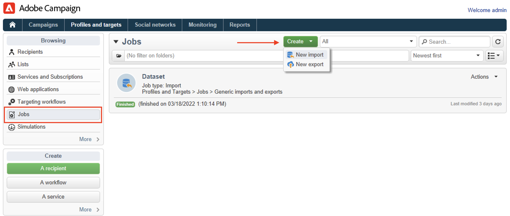

# Profielen importeren uit een bestand{#create-profiles}

Als u de Campagne-database wilt vullen, kunt u [profielen handmatig toevoegen](create-profiles.md) of importprofielen zoals hieronder beschreven. U kunt ook geïmporteerde bestanden gebruiken om contactgegevens bij te werken.

## Profielen importeren met een workflow {#import-profiles-with-a-wf}

Workflows kunnen handig zijn om een aantal importprocessen te automatiseren. Of u nu gegevens uit een lokaal bestand of uit een SFTP importeert, u kunt workflows gebruiken om de procedures voor gegevensbeheer te standaardiseren.

### Gegevens uit een lijst gebruiken: Leeslijst {#data-from-read-list}

Bereid en structureer uw gegevens in een dossier om het met een werkschema in te voeren. [Meer informatie](https://experienceleague.adobe.com/docs/campaign/automation/workflows/wf-activities/targeting-activities/read-list.html).

### Gegevens uit een bestand laden {#data-from-a-file}

De gegevens die in een werkstroom worden verwerkt, kunnen uit een gestructureerd bestand worden geëxtraheerd, zodat het bestand in Adobe Campaign kan worden geïmporteerd. [Meer informatie](https://experienceleague.adobe.com/docs/campaign/automation/workflows/wf-activities/action-activities/data-loading--file-.html).

Nadat gegevens zijn verzameld, kunt u deze gebruiken in uw workflows, bijvoorbeeld om een levering te verrijken of de database bij te werken. Raadpleeg [deze sectie](https://experienceleague.adobe.com/docs/campaign/automation/workflows/introduction/use-workflow-data.html) voor meer informatie.

## Invoer met één opname{#import-jobs}

Adobe Campaign biedt algemene importmogelijkheden waarmee u bijvoorbeeld een lijst met klanten of vooruitzichten kunt ophalen die vervolgens deel gaan uitmaken van een doelpopulatie, of gegevens uit externe bestanden aan uw database kunt leveren.

Algemene invoer wordt beheerd vanuit de **[!UICONTROL Profiles and Targets > Jobs]** menu van de startpagina van Adobe Campaign.

De stappen voor het uitvoeren van een generieke importbewerking worden beschreven in [Campaign Classic v7-documentatie](https://experienceleague.adobe.com/docs/campaign-classic/using/getting-started/importing-and-exporting-data/generic-imports-exports/about-generic-imports-exports.html){target=&quot;_blank&quot;}.
