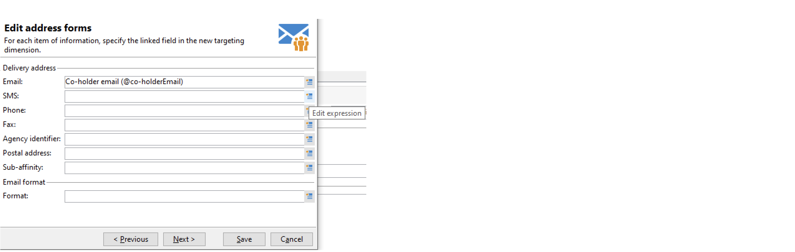

# Werken met doeltoewijzingen{#gs-target-mappings}

Standaard wordt voor leveringssjablonen het doel **[!UICONTROL Recipients]**. Daarom worden bij de vaststelling van hun streefdoelen de gebieden van de **nms:ontvanger** tabel.

U kunt andere doeltoewijzingen voor uw leveringen gebruiken, of een nieuwe doelafbeelding tot stand brengen.

## Ingebouwde doeltoewijzingen {#ootb-mappings}

Adobe Campaign wordt geleverd met de volgende ingebouwde doeltoewijzingen:

| Naam | Gebruiken voor | Schema |
|---|---|---|
| Ontvangers | Leveren aan ontvangers (ingebouwde ontvankelijke lijst) | nms:ontvanger |
| Bezoekers | Leveren aan bezoekers van wie de profielen via verwijzing (virale marketing) voor bv zijn verzameld. | mns:bezoeker |
| Lidmaatschappen | Leveren aan ontvangers die zijn geabonneerd op een informatiedienst zoals een nieuwsbrief | nms:abonnement |
| Abonnementen van bezoekers | Leveren aan bezoekers die zijn geabonneerd op een informatiedienst | nms:bezoekerSub |
| Operatoren | Leveren aan Adobe Campaign-operatoren | nms:operator |
| Extern bestand | Afleveren via een bestand dat alle benodigde informatie voor levering bevat | Geen gekoppeld schema, geen doel ingevoerd |

## Doeltoewijzing maken {#new-mapping}

U kunt ook een doeltoewijzing maken. U moet mogelijk een aangepaste doeltoewijzing toevoegen, bijvoorbeeld als:

* u gebruikt een aangepaste ontvankelijke lijst,
* u vormt een het filtreren afmeting die van ingebouwde het richten afmeting op het scherm van de doelafbeelding verschillend is.

Meer informatie over aangepaste tabellen voor ontvangers vindt u in [deze pagina](../dev/custom-recipient.md).

Met de wizard voor het maken van Adobe Campaign-doeltoewijzingen kunt u alle schema&#39;s maken die nodig zijn om uw aangepaste doeltoewijzing te gebruiken.

1. Bladeren naar **[!UICONTROL Administration]** `>` **[!UICONTROL Campaign Management]** `>` **[!UICONTROL Target mappings]** van Adobe Campaign Explorer.

1. Creeer een nieuwe doelafbeelding en selecteer uw douaneschema als het richten afmeting.

   

1. Geef de velden op waarin de profielgegevens worden opgeslagen: achternaam, voornaam, e-mail, adres, enz.

   

1. Specificeer de parameters voor informatieopslag, met inbegrip van het achtervoegsel van de uitbreidingsregelingen voor hen om gemakkelijk identificeerbaar te zijn.

   

   U kunt kiezen of u uitsluitingen wilt opslaan (**excludelog**), met berichten (**uitzenden**) of in een aparte tabel.

   U kunt ook kiezen of u het bijhouden van gegevens voor deze leveringstoewijzing wilt beheren (**trackinglog**).

1. Selecteer vervolgens de extensies waarmee u rekening wilt houden. Het extensietype is afhankelijk van de campagne-instellingen en invoegtoepassingen.

   

   Klik op de knop **[!UICONTROL Save]** knop voor het maken van de toewijzing van levering: alle gekoppelde tabellen worden automatisch gemaakt op basis van de geselecteerde parameters.

