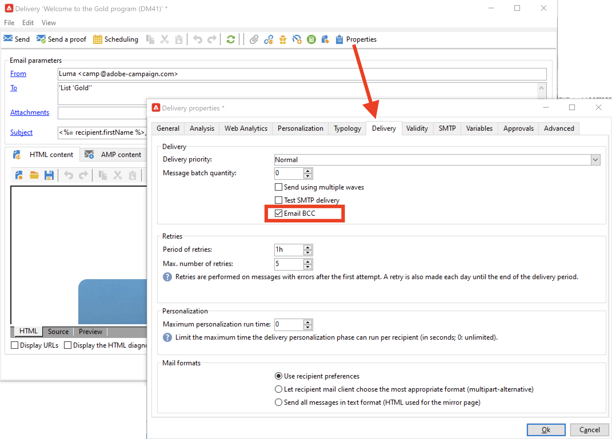

# Instellingen voor e-mailkanalen voor campagne

## BCC e-mailen

U kunt Adobe Campaign zo configureren dat een kopie van de e-mails die u van uw platform hebt ontvangen, bewaard blijft.

>[!NOTE]
>BCC-functionaliteit voor e-mail is optioneel. Controleer hiervoor uw licentieovereenkomst.

Adobe Campaign zelf beheert gearchiveerde bestanden niet. Het laat u toe om de berichten van uw keus naar een specifiek adres te verzenden, van waar zij kunnen worden verwerkt en worden gearchiveerd gebruikend een extern systeem.

Hiervoor worden .eml-bestanden die overeenkomen met de verzonden e-mails, overgebracht naar een externe server, zoals een SMTP-e-mailserver. De archiveringsbestemming is een BCC e-mailadres (onzichtbaar voor de leverende ontvangers) dat u moet specificeren.

Let op:

* U kunt **één** BCC e-mailadres slechts gebruiken.

* Er wordt alleen rekening gehouden met e-mailberichten die zijn verzonden, maar met bedragen.

?? Als Beheerde gebruiker van Cloud Services, [contacteer Adobe](../start/campaign-faq.md#support) om E-mail BCC in Campagne te activeren. Het BCC e-mailadres van uw keus moet aan het team van de Adobe worden verstrekt die het voor u zal vormen.

Zodra e-mail BCC wordt gevormd, zorg ervoor de eigenschap in het leveringsmalplaatje of in de levering door de **e-mailBCC** optie wordt toegelaten.

**Verwante** onderwerpen in Campaign Classic v7 documentatie:

* [De spiegelpagina](https://experienceleague.adobe.com/docs/campaign-classic/using/sending-messages/sending-emails/sending-an-email/email-parameters.html#generating-mirror-page) genereren{target=&quot;_blank&quot;}

* [E-mailindeling](https://experienceleague.adobe.com/docs/campaign-classic/using/sending-messages/sending-emails/sending-an-email/email-parameters.html#selecting-message-formats) selecteren{target=&quot;_blank&quot;}

* [Tekencodering](https://experienceleague.adobe.com/docs/campaign-classic/using/sending-messages/sending-emails/sending-an-email/email-parameters.html#character-encoding) selecteren{target=&quot;_blank&quot;}

* [Stel het e-mailadres](https://experienceleague.adobe.com/docs/campaign-classic/using/sending-messages/sending-emails/sending-an-email/email-parameters.html#managing-bounce-emails) voor de stuiterende waarde in {target=&quot;_blank&quot;}

* [E-mailleveringssjablonen](https://experienceleague.adobe.com/docs/campaign-classic/using/sending-messages/using-delivery-templates/about-templates.html) gebruiken{target=&quot;_blank&quot;}

* [Uitleveringsfouten](https://experienceleague.adobe.com/docs/campaign-classic/using/sending-messages/monitoring-deliveries/understanding-delivery-failures.html) begrijpen {target=&quot;_blank&quot;}
