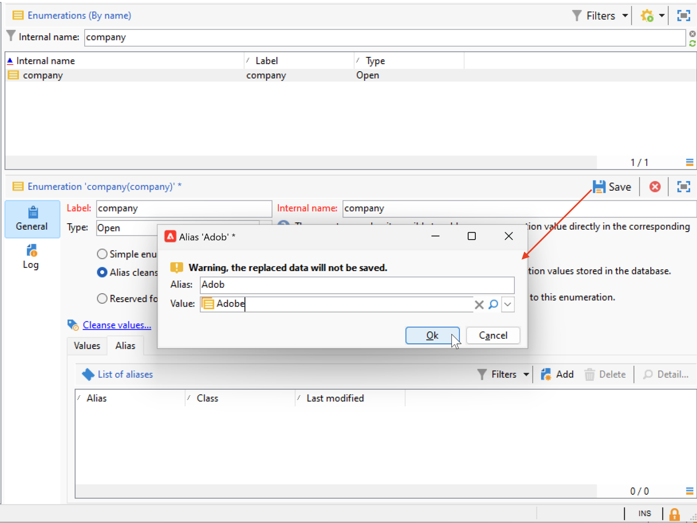

# Werken met opsommingen {#enumerations}

Een opsomming (ook wel een gedetailleerde lijst genoemd) is een vooraf gedefinieerde lijst met waarden die u kunt gebruiken om bepaalde velden in te vullen. Opsommingen helpen bij het standaardiseren van veldwaarden, het consistenter maken van gegevens en het vereenvoudigen van query&#39;s.

Wanneer deze zijn gedefinieerd, worden de waarden weergegeven in een vervolgkeuzelijst. Een waarde kan rechtstreeks worden geselecteerd of worden ingevoerd met behulp van voorspellende invoer, die overeenkomende items voorstelt en voltooit. Sommige velden bevatten vooraf gedefinieerde opsommingen en indien nodig kunnen aanvullende opsommingen worden gemaakt.

## Soorten opsommingen {#types-of-enum}

Opsommingen worden opgeslagen in de map **[!UICONTROL Administration > Platform > Enumerations]** van de browser.

Een opsomming kan zijn: **Open**, **Systeem**, **Emoticon** of **Gesloten**.

* Een **Open** opsomming staat gebruikers toe om nieuwe waarden direct op de gebieden toe te voegen die op deze opsomming worden gebaseerd.
* A **Gesloten** opsomming heeft een vaste lijst van waarden die slechts van de **[!UICONTROL Administration > Platform > Enumerations]** omslag van de ontdekkingsreiziger kunnen worden gewijzigd.
* Een **Emoticon** opsomming wordt gebruikt om de emoticonlijst bij te werken. Meer informatie
* De opsomming van het A **Systeem** wordt geassocieerd aan systeemgebieden en komt met een Interne naam.

Voor **Open** en **Gesloten** opsommingen, zijn de specifieke opties beschikbaar:

* **Eenvoudige opsomming** is het standaardtype.
* **Alias zuiverend** opsomming wordt gebruikt om de opsommingswaarden te harmoniseren die in het gegevensbestand worden opgeslagen. [Meer informatie](#alias-cleansing)
* **Gereserveerd voor het binden** is een optie die u toestaat om kubuswaarden aan deze opsomming te verbinden. [Meer informatie](../reporting/gs-cubes.md)

## Aliasreiniging {#alias-cleansing}

In opsommingsvelden kan een waarde worden geselecteerd in de vervolgkeuzelijst of handmatig worden ingevoerd als deze niet beschikbaar is in de lijst. Aangepaste waarden kunnen aan de opsomming worden toegevoegd wanneer de optie **[!UICONTROL Open]** is ingeschakeld. Deze waarden kunnen later worden gestandaardiseerd via het opschonen van aliassen, waardoor variaties automatisch worden vervangen door de juiste term (bijvoorbeeld door `Adob` om te zetten in `Adobe` ).

>[!CAUTION]
>
>Het zuiveren van gegevens is een kritieke verrichting die gegevensbestandwaarden beïnvloedt. Adobe Campaign voert updates van massagegevens uit, wat kan leiden tot het verwijderen van bepaalde waarden. Deze bewerking is alleen bedoeld voor professionele gebruikers.

Schakel de optie **[!UICONTROL Alias cleansing]** in om mogelijkheden voor het opschonen van gegevens te gebruiken voor een opsomming. Als deze optie is geselecteerd, wordt de tab **[!UICONTROL Alias]** onder in het venster weergegeven.

Wanneer een gebruiker een waarde ingaat die niet in een Alias het zuiveren opsomming bestaat, wordt het toegevoegd aan de **lijst van Waarden**. U kunt [&#x200B; aliassen van deze waarden &#x200B;](#convert-to-alias) tot stand brengen, of [&#x200B; nieuwe aliassen van kras &#x200B;](#create-alias) creëren.

### Een alias maken{#create-alias}

Voer de volgende stappen uit om een alias te maken:

1. Klik op de knop **[!UICONTROL Add]** op het tabblad **[!UICONTROL Alias]** .
1. Voer de alias in die u wilt converteren en selecteer de waarde die u wilt toepassen in de vervolgkeuzelijst.

   

1. Klik op **[!UICONTROL Ok]** en bevestig het.

1. Sla uw wijzigingen op. De vervanging van waarden wordt uitgevoerd door het **Alias zuiverend** werkschema dat elke nacht wordt uitgevoerd. Verwijs naar [&#x200B; gegevens van de Looppas zuiverend &#x200B;](#running-data-cleansing).

Voor alle gebieden die op deze opsomming worden gebaseerd, wanneer een gebruiker de waarde **Adobe** op een &quot;bedrijf&quot;gebied (in de Console van de Cliënt van Adobe Campaign, in een Webvorm) ingaat, zal het automatisch door de waarde **Adobe** worden vervangen.

### Een onjuiste waarde omzetten in een alias{#convert-to-alias}

U kunt ook een bestaande opsommingswaarde omzetten in een alias. Dit doet u als volgt:

1. Klik met de rechtermuisknop in de lijst met waarden van een opsomming en blader naar **[!UICONTROL Actions... > Convert values into aliases...]** .

    om

1. Selecteer de waarden die in aliassen moeten worden omgezet en klik op **[!UICONTROL Next]** .
1. Klik op **[!UICONTROL Start]** om de conversie uit te voeren.

   Zodra de uitvoering volledig is, worden aliassen toegevoegd aan de lijst, in **Alias** tabel. U kunt een correcte waarde associëren om verkeerde ingangen te vervangen. Dit doet u als volgt:

1. Selecteer een waarde die u wilt opschonen.
1. Klik het **Detail..** knoop.
1. Selecteer de nieuwe waarde in de vervolgkeuzelijst.

   

>[!NOTE]
>
>U kunt de instanties van een alias bijhouden in de kolom **[!UICONTROL Hits]** op het subtabblad **[!UICONTROL Alias]** . Het aantal keren dat deze waarde is ingevoerd, kan worden weergegeven.  [Meer informatie](#calculate-entry-occurrences).

### Gegevens wissen {#running-data-cleansing}

De gegevens worden gewist door de technische workflow van **[!UICONTROL Alias cleansing]** . Standaard wordt de transactie dagelijks uitgevoerd.

Het opschonen kan ook worden geactiveerd via de koppeling **[!UICONTROL Cleanse values...]** .

Met de koppeling **[!UICONTROL Advanced parameters...]** kunt u de datum instellen vanaf welke verzamelde waarden in aanmerking worden genomen.

Klik op de knop **[!UICONTROL Start]** om gegevens te wissen.

### Voorvallen monitoren {#calculate-entry-occurrences}

Het subtabblad **[!UICONTROL Alias]** van een opsomming kan het aantal exemplaren van een alias weergeven voor alle ingevoerde waarden. Deze informatie is een schatting en wordt weergegeven in de kolom **[!UICONTROL Hits]** .

>[!CAUTION]
>
>Het berekenen van voorvallen van aliasinggegevens kan lang duren.
>

U kunt de aanraakberekening handmatig uitvoeren via de koppeling **[!UICONTROL Cleanse values...]** . Klik hiertoe op de koppeling **[!UICONTROL Advanced parameters...]** en selecteer een of meer opties.

* **[!UICONTROL Update the number of alias hits]** : hiermee kunt u treffers bijwerken die al zijn berekend op basis van de ingevoerde datum.
* **[!UICONTROL Recalculate the number of alias hits from the start]**: hiermee kunt u berekeningen uitvoeren op het hele Adobe Campaign-platform.

U kunt ook een specifieke workflow maken, zodat de berekening automatisch gedurende een bepaalde periode wordt uitgevoerd, bijvoorbeeld eenmaal per week.

Hiertoe maakt u een kopie van de **[!UICONTROL Alias cleansing]** -workflow, wijzigt u de planner en gebruikt u de volgende instellingen in de **[!UICONTROL Enumeration value cleansing]** -activiteit:

* **- updateHits** om het aantal aliashits bij te werken,
* **- updateHits:full** om alle aliashits opnieuw te berekenen.
