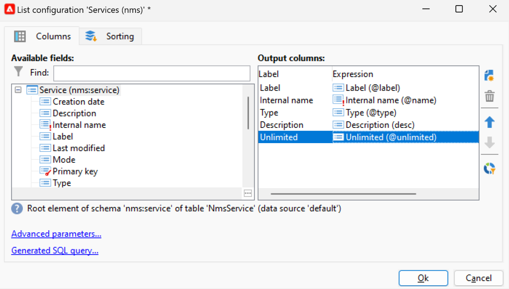

# Instellingen voor de gebruikersinterface voor campagnes {#ui-settings}

## Standaardeenheden {#default-units}

In Adobe Campaign kunnen voor velden die een duur uitdrukken (bijvoorbeeld geldigheidsperiode van de middelen, goedkeuringstermijn voor een taak enz.) de waarden als volgt worden uitgedrukt **eenheden**:

* **[!UICONTROL s]** voor seconden
* **[!UICONTROL mn]** voor minuten
* **[!UICONTROL h]** voor uren
* **[!UICONTROL d]** dagen

## Campagneverkenner aanpassen{#customize-explorer}

U kunt mappen toevoegen aan Campagneverkenner, weergaven maken en machtigingen toewijzen.

Leer hoe u mappen en weergaven beheert in [deze pagina](../audiences/folders-and-views.md)

## Lijsten beheren en aanpassen{#customize-lists}

In de de cliëntconsole van de Campagne, worden de gegevens getoond in lijsten. U kunt deze lijsten aan uw behoeften aanpassen. U kunt bijvoorbeeld kolommen, filtergegevens, telrecords toevoegen, uw instellingen opslaan en delen.

Bovendien kunt u filters maken en opslaan.  Meer informatie over filters in [deze pagina](../audiences/create-filters.md).

### Aantal records {#number-of-records}

Standaard laadt Adobe Campaign de eerste 200 records van een lijst. Dit betekent dat niet noodzakelijkerwijs alle records van de tabel worden weergegeven die u bekijkt. U kunt een telling van het aantal verslagen in de lijst in werking stellen en meer verslagen laden.

In het onderste rechtergedeelte van het lijstscherm, **teller** toont hoeveel records zijn geladen en het totale aantal records in de database (na het toepassen van filters):

Als een vraagteken in plaats van het nummer aan de rechterkant wordt weergegeven, bijvoorbeeld `240/?`klikt u op de teller om de berekening te starten.

Als u aanvullende records wilt laden en weergeven, klikt u op **[!UICONTROL Continue loading]**. Standaard worden 200 records geladen. Als u het standaardaantal records dat u wilt laden wilt wijzigen, gebruikt u de opdracht **[!UICONTROL Configure list]** in de rechterbenedenhoek van de lijst. Klik in het lijstconfiguratievenster op **[!UICONTROL Advanced parameters]** (linksonder) en wijzig het aantal regels dat moet worden opgehaald.

Als u alle records wilt laden, klikt u met de rechtermuisknop op de lijst en selecteert u **[!UICONTROL Load all]**.

>[!CAUTION]
>
>Wanneer een lijst een hoog volume records bevat, kan het enige tijd duren voordat het bestand volledig is geladen.

### Kolommen toevoegen en verwijderen {#add-columns}

Voor elke lijst, kan de ingebouwde kolomconfiguratie worden aangepast om meer informatie te tonen of ongebruikte kolommen te verbergen.

Wanneer gegevens in de details van een record worden weergegeven, klikt u met de rechtermuisknop op het veld en selecteert u **[!UICONTROL Add in the list]**.

De kolom wordt rechts van de bestaande kolommen toegevoegd.

U kunt het scherm van de lijstconfiguratie ook gebruiken om kolommen toe te voegen en te verwijderen:

1. Klik in een lijst met records op **[!UICONTROL Configure list]** in de rechterbenedensectie.
1. Dubbelklik op de velden die u wilt toevoegen in het dialoogvenster **[!UICONTROL Available fields]** lijst: zij worden toegevoegd aan de **[!UICONTROL Output columns]** lijst.

   

   >[!NOTE]
   >
   >Geavanceerde velden worden standaard niet weergegeven. Klik op de knop **Geavanceerde velden weergeven** in de rechterbenedensectie van de lijst met beschikbare velden.
   >
   >Velden worden aangegeven met specifieke pictogrammen: SQL-velden, gekoppelde tabellen, berekende velden, enzovoort. Voor elk geselecteerd veld wordt de beschrijving weergegeven onder de lijst met beschikbare velden.

1. Gebruik de pijlen omhoog en omlaag om de **weergavevolgorde**.

1. Klikken **[!UICONTROL OK]** om de configuratie te bevestigen en het resultaat te tonen.

Als u een kolom moet verwijderen, selecteert u deze en klikt u op de knop **Prullenbak** pictogram.

U kunt de **[!UICONTROL Distribution of values]** pictogram om de verdeling van waarden voor het geselecteerde veld in de huidige map weer te geven.

### Een nieuwe kolom maken {#create-a-new-column}

U kunt nieuwe kolommen maken om extra velden in de lijst weer te geven.

Ga als volgt te werk om een kolom te maken:

1. Klik in een lijst met records op **[!UICONTROL Configure list]** in de rechterbenedensectie.
1. Klik op de knop **[!UICONTROL Add]** om een nieuw veld in de lijst weer te geven.
1. Configureer het veld dat u in de kolom wilt toevoegen.

### Gegevens weergeven in submappen {#display-sub-folders-records}

Lijsten kunnen worden weergegeven:

* Alle records in de geselecteerde map (standaard)
* Alle records in de geselecteerde map en de bijbehorende submappen

Als u van de ene weergavemodus naar de andere wilt schakelen, klikt u op **[!UICONTROL Display sub-levels]** op de werkbalk Campagne.

### Een lijstconfiguratie opslaan {#saving-a-list-configuration}

De lijstconfiguraties worden plaatselijk bepaald voor elke gebruiker. Wanneer de lokale cache wordt gewist, worden lokale configuraties uitgeschakeld.

De parameters die u instelt, gelden standaard voor alle lijsten met het corresponderende maptype. Wanneer u wijzigt hoe de lijst van ontvangers van een omslag wordt getoond, wordt deze configuratie toegepast op alle andere ontvankelijke omslagen.

U kunt meer dan één configuratie opslaan die op verschillende omslagen van het zelfde type moet worden toegepast. De configuratie wordt opgeslagen met de eigenschappen van de map die de gegevens bevat en kan opnieuw worden toegepast.

Volg onderstaande stappen om een lijstconfiguratie op te slaan zodat deze opnieuw kan worden gebruikt:

1. Klik in de Verkenner met de rechtermuisknop op de map met de weergegeven gegevens.
1. Selecteer **[!UICONTROL Properties]**.
1. Klikken **[!UICONTROL Advanced settings]** en geef vervolgens een naam op in het dialoogvenster **[!UICONTROL Configuration]** veld.
1. Klikken **[!UICONTROL OK]** en klik vervolgens op **[!UICONTROL Save]**.

U kunt deze configuratie dan toepassen om het even welke andere omslag van het zelfde type. Meer informatie over mappen in [deze pagina](../audiences/folders-and-views.md).

### Een lijst exporteren {#exporting-a-list}

Als u gegevens uit een lijst wilt exporteren, moet u een wizard voor exporteren gebruiken. Als u deze wilt openen, selecteert u de elementen die u wilt exporteren in de lijst, klikt u met de rechtermuisknop en selecteert u **[!UICONTROL Export...]**.

<!--The use of the import and export functions is explained in [Generic imports and exports](../../platform/using/about-generic-imports-exports.md).-->

>[!CAUTION]
>
>Elementen uit een lijst mogen niet worden geëxporteerd met de functie Kopiëren/Plakken.

### Een lijst sorteren {#sorting-a-list}

Lijsten kunnen een grote hoeveelheid gegevens bevatten. U kunt deze gegevens sorteren of eenvoudige of geavanceerde filters toepassen. Door te sorteren kunt u gegevens in oplopende of aflopende volgorde weergeven. Met filters kunt u alleen geselecteerde gegevens definiëren en combineren.

Klik op de kolomkop om een oplopende of aflopende sortering toe te passen of om het sorteren van gegevens te annuleren. De actieve sorteerstatus en sorteervolgorde worden aangegeven met een blauwe pijl vóór het kolomlabel. Een rood streepje vóór het kolomlabel betekent dat de sortering wordt toegepast op gegevens die uit de database zijn geïndexeerd. Deze sorteermethode wordt gebruikt om sorteertaken te optimaliseren.

U kunt ook sorteren configureren of sorteercriteria combineren. Volg de onderstaande stappen om dit te doen:

1. **[!UICONTROL Configure list]** en rechts van de lijst.
1. Klik in het lijstconfiguratievenster op de knop **[!UICONTROL Sorting]** tab.
1. Selecteer de velden die u wilt sorteren en de sorteerrichting (oplopend of aflopend).
1. De sorteerprioriteit wordt gedefinieerd door de volgorde van de sorteerkolommen. Als u de prioriteit wilt wijzigen, gebruikt u de juiste pictogrammen om de volgorde van de kolommen te wijzigen.

   De sorteerprioriteit heeft geen invloed op de weergave van de kolommen in de lijst.

1. Klikken **[!UICONTROL Ok]** om deze configuratie te bevestigen en het resultaat in de lijst te tonen.

## Werken met opsommingen {#enumerations}

Een opsomming (ook wel &#39;gespecificeerde lijst&#39; genoemd) is een lijst met waarden die door het systeem worden voorgesteld om velden te vullen. Gebruik opsommingen om de waarden van deze velden te standaardiseren, hulp bij gegevensinvoer of gebruik binnen query&#39;s.

De lijst met waarden wordt weergegeven als een vervolgkeuzelijst waaruit u de waarde kunt selecteren die in het veld moet worden ingevoerd. In de vervolgkeuzelijst is ook voorspellende invoer mogelijk: Voer de eerste letters in en de rest wordt door de toepassing ingevuld.

De waarden voor dit type veld worden gedefinieerd en het algemene beheer van deze velden (het toevoegen/verwijderen van een waarde) wordt uitgevoerd via de **[!UICONTROL Administration > Platform > Enumerations]** knooppunt van de structuur.

### Soorten opsommingen {#types-of-enum}

Opsommingen worden opgeslagen in de **[!UICONTROL Administration > Platform > Enumerations]** map van de verkenner.

Ze kunnen: Open, Systeem, Emoticon of Gesloten.

* An **Openen** Met opsomming kunnen gebruikers rechtstreeks nieuwe waarden toevoegen in de velden die op deze opsomming zijn gebaseerd.
* A **Gesloten** de opsomming heeft een vaste lijst met waarden die alleen vanuit de **[!UICONTROL Administration > Platform > Enumerations]** map van de verkenner.
* An **Emoticon** de opsomming wordt gebruikt om de emoticonlijst bij te werken. Meer informatie
* A **Systeem** opsomming is gekoppeld aan systeemvelden en wordt aangeduid met een interne naam.

Voor **Openen** en **Gesloten** opsommingen, specifieke opties zijn beschikbaar:

* **Eenvoudige opsomming** is het standaardstandaardtype.
* **Aliasreiniging** de opsomming wordt gebruikt om de in de database opgeslagen opsommingswaarden te harmoniseren. [Meer informatie](#alias-cleansing)
* **Gereserveerd voor binden** is een optie waarmee u kubuswaarden aan deze opsomming kunt koppelen. [Meer informatie](../reporting/gs-cubes.md)

### Aliasreiniging {#alias-cleansing}

In de opsommingsvelden kunt u een waarde selecteren of een aangepaste waarde invoeren die niet beschikbaar is in de vervolgkeuzelijst. U kunt aangepaste waarden toevoegen aan de bestaande opsommingswaarden als een nieuwe waarde, in dit geval de **[!UICONTROL Open]** moet geselecteerd zijn. Deze aangepaste waarden kunnen worden gereinigd met gebruik van aliasreinigingsmogelijkheden. Bijvoorbeeld wanneer een gebruiker een `Adob` in plaats van `Adobe`, kan het proces van het zuiveren van alias het automatisch door de correcte termijn vervangen.

>[!CAUTION]
>
>Het zuiveren van gegevens is een kritiek proces dat de gegevens in het gegevensbestand beïnvloedt. Adobe Campaign voert massagegevensupdates uit, wat ertoe kan leiden dat sommige waarden worden verwijderd. Deze bewerking is daarom voorbehouden aan professionele gebruikers.

De optie **[!UICONTROL Alias cleansing]** optie om gegevens te gebruiken zuiverend mogelijkheden voor een opsomming. Als deze optie is geselecteerd, wordt **[!UICONTROL Alias]** wordt onder in het venster weergegeven.

Wanneer een gebruiker een waarde invoert die niet bestaat in een opsomming voor Alias-zuivering, wordt deze toegevoegd aan de lijst **Waarden** lijst. U kunt [aliassen maken op basis van deze waarden](#convert-to-alias), of [nieuwe aliassen maken vanaf nul](#create-alias).

#### Een alias maken{#create-alias}

Voer de volgende stappen uit om een alias te maken:

1. Klikken **[!UICONTROL Add]** van de **[!UICONTROL Alias]** tab.
1. Voer de alias in die u wilt omzetten en selecteer de waarde die u wilt toepassen in de vervolgkeuzelijst.

   

1. Klikken **[!UICONTROL Ok]** en bevestigen.

1. Sla uw wijzigingen op. De vervanging van waarden wordt uitgevoerd door de **Aliasreiniging** workflow die elke nacht wordt uitgevoerd. Zie [Gegevens wissen](#running-data-cleansing).

Voor alle velden die op deze opsomming zijn gebaseerd, wanneer een gebruiker de waarde invoert **Adobe** in een veld &quot;bedrijf&quot; (in de Adobe Campaign-console, in een webformulier) wordt deze automatisch vervangen door de waarde **Adobe**.

#### Een onjuiste waarde omzetten in een alias{#convert-to-alias}

U kunt ook een bestaande opsommingswaarde omzetten in een alias. Dit doet u als volgt:

1. Klik in de lijst met waarden van een opsomming met de rechtermuisknop en blader naar **[!UICONTROL Actions... > Convert values into aliases...]**.

   

1. Selecteer de waarden die u wilt converteren in aliassen en klik op **[!UICONTROL Next]**.
1. Klikken **[!UICONTROL Start]** om de conversie uit te voeren.

   Wanneer de uitvoering is voltooid, worden aliassen toegevoegd aan de lijst, in het dialoogvenster **Alias** tab. U kunt een correcte waarde associëren om verkeerde ingangen te vervangen. Dit doet u als volgt:

1. Selecteer een waarde die u wilt opschonen.
1. Klik op de knop **Details...** knop.
1. Selecteer de nieuwe waarde in de vervolgkeuzelijst.

   

>[!NOTE]
>
>U kunt het voorkomen van een alias in volgen **[!UICONTROL Hits]** in de **[!UICONTROL Alias]** subtab. Het aantal keren dat deze waarde is ingevoerd, kan worden weergegeven.  [Meer informatie](#calculate-entry-occurrences).

#### Gegevens wissen {#running-data-cleansing}

De gegevens worden gewist door de **[!UICONTROL Alias cleansing]** technische workflow. Standaard wordt de transactie dagelijks uitgevoerd.

Het opschonen kan ook worden geactiveerd via de **[!UICONTROL Cleanse values...]** koppeling.

De **[!UICONTROL Advanced parameters...]** Met de koppeling kunt u de datum instellen vanaf welke verzamelde waarden in aanmerking worden genomen.

Klik op de knop **[!UICONTROL Start]** om gegevens te wissen.

##### Voorvallen monitoren {#calculate-entry-occurrences}

De **[!UICONTROL Alias]** Het subtabblad van een opsomming kan het aantal exemplaren van een alias weergeven voor alle ingevoerde waarden. Deze informatie is een schatting en wordt weergegeven in de **[!UICONTROL Hits]** kolom.

>[!CAUTION]
>
>Het berekenen van voorvallen van aliasinggegevens kan lang duren.

U kunt de aanraakberekening handmatig uitvoeren via de **[!UICONTROL Cleanse values...]** koppeling. Om dit te doen, klik **[!UICONTROL Advanced parameters...]** koppelen en optie(s) selecteren.

* **[!UICONTROL Update the number of alias hits]**: hiermee kunt u resultaten bijwerken die al zijn berekend op basis van de ingevoerde datum.
* **[!UICONTROL Recalculate the number of alias hits from the start]**: Hiermee kunt u berekeningen uitvoeren op het hele Adobe Campaign-platform.

U kunt ook een specifieke workflow maken, zodat de berekening automatisch gedurende een bepaalde periode wordt uitgevoerd, bijvoorbeeld eenmaal per week.

Hiertoe maakt u een kopie van het **[!UICONTROL Alias cleansing]** de werkstroom, verandert de planner en gebruikt de volgende montages in **[!UICONTROL Enumeration value cleansing]** activiteit:

* **-updateHits** om het aantal aliashits bij te werken,
* **-updateHits:full** om alle aliashits opnieuw te berekenen.
