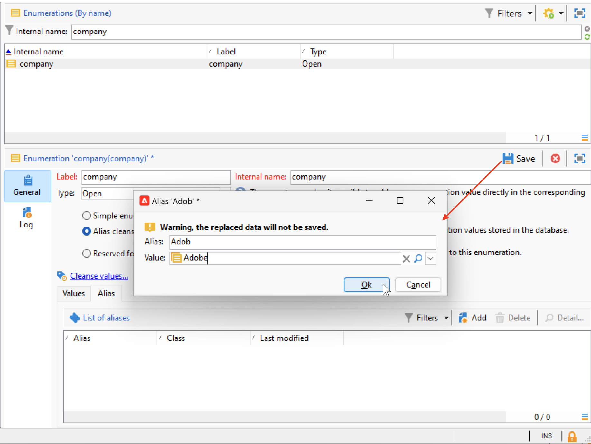

# Instellingen voor de gebruikersinterface voor campagnes {#ui-settings}

## Standaardeenheden {#default-units}

In Adobe Campaign, voor gebieden die een duur (b.v. geldigheidsperiode van de middelen, goedkeuringstermijn voor een taak, enz. uitdrukken) uitdrukken, kunnen de waarden in de volgende **eenheden** worden uitgedrukt:

* **[!UICONTROL s]** voor seconden
* **[!UICONTROL mn]** minuten
* **[!UICONTROL h]** gedurende uren
* **[!UICONTROL d]** dagen

## Campagneverkenner aanpassen{#customize-explorer}

U kunt mappen toevoegen aan Campagneverkenner, weergaven maken en machtigingen toewijzen.

Leer hoe te om omslagen en meningen in [ te beheren deze pagina ](../audiences/folders-and-views.md)

## Lijsten beheren en aanpassen {#customize-lists}

In de de cliëntconsole van de Campagne, worden de gegevens getoond in lijsten. U kunt deze lijsten aan uw behoeften aanpassen. U kunt bijvoorbeeld kolommen, filtergegevens, telrecords toevoegen, uw instellingen opslaan en delen.

Bovendien kunt u filters maken en opslaan.  Leer meer over filters in [ deze pagina ](../audiences/create-filters.md).

### Aantal records {#number-of-records}

Standaard laadt Adobe Campaign de eerste 200 records van een lijst. Dit betekent dat niet noodzakelijkerwijs alle records van de tabel worden weergegeven die u bekijkt. U kunt een telling van het aantal verslagen in de lijst in werking stellen en meer verslagen laden.

In het lagere rechterdeel van het lijstscherm, a **teller** toont hoeveel verslagen zijn geladen en het totale aantal verslagen in het gegevensbestand (na het toepassen van om het even welke filters):

Als er een vraagteken wordt weergegeven in plaats van het nummer aan de rechterkant, bijvoorbeeld `240/?` , klikt u op de teller om de berekening te starten.

Klik op **[!UICONTROL Continue loading]** om aanvullende records te laden en weer te geven. Standaard worden 200 records geladen. Als u het standaardaantal records dat u wilt laden wilt wijzigen, gebruikt u het pictogram **[!UICONTROL Configure list]** in de rechteronderhoek van de lijst. Klik in het lijstconfiguratievenster op **[!UICONTROL Advanced parameters]** (linksonder) en wijzig het aantal regels dat moet worden opgehaald.

Als u alle records wilt laden, klikt u met de rechtermuisknop op de lijst en selecteert u **[!UICONTROL Load all]** .

>[!CAUTION]
>
>Wanneer een lijst een hoog volume records bevat, kan het enige tijd duren voordat het bestand volledig is geladen.
>

### Kolommen toevoegen en verwijderen {#add-columns}

Voor elke lijst, kan de ingebouwde kolomconfiguratie worden aangepast om meer informatie te tonen of ongebruikte kolommen te verbergen.

Wanneer gegevens in het detail van een record worden weergegeven, klikt u met de rechtermuisknop op het veld en selecteert u **[!UICONTROL Add in the list]** .

 toe

De kolom wordt rechts van de bestaande kolommen toegevoegd.

 toe

U kunt het scherm van de lijstconfiguratie ook gebruiken om kolommen toe te voegen en te verwijderen:

1. Klik in een lijst met records op het pictogram **[!UICONTROL Configure list]** in de rechterbenedensectie.
1. Dubbelklik op de velden die u wilt toevoegen aan de lijst **[!UICONTROL Available fields]** : deze worden toegevoegd aan de lijst van **[!UICONTROL Output columns]** .

   

   >[!NOTE]
   >
   >Geavanceerde velden worden standaard niet weergegeven. Om hen te tonen, klik het **Vertoning geavanceerde gebieden** pictogram, op de lagere juiste sectie van de lijst van beschikbare gebieden.
   >
   >Velden worden aangegeven met specifieke pictogrammen: SQL-velden, gekoppelde tabellen, berekende velden enzovoort. Voor elk geselecteerd veld wordt de beschrijving weergegeven onder de lijst met beschikbare velden.
   >

1. Gebruik omhoog/onderaan pijlen om de **vertoningsorde** te wijzigen.

1. Klik **[!UICONTROL OK]** om de configuratie te bevestigen en het resultaat te tonen.

Als u een kolom moet verwijderen, het selecteren en het **pictogram van het Afval** klikken.

Met het pictogram **[!UICONTROL Distribution of values]** kunt u de verdeling van waarden voor het geselecteerde veld in de huidige map weergeven.

### Een nieuwe kolom maken {#create-a-new-column}

U kunt nieuwe kolommen maken om extra velden in de lijst weer te geven.

Ga als volgt te werk om een kolom te maken:

1. Klik in een lijst met records op het pictogram **[!UICONTROL Configure list]** in de rechterbenedensectie.
1. Klik op het pictogram **[!UICONTROL Add]** om een nieuw veld in de lijst weer te geven.
1. Configureer het veld dat u in de kolom wilt toevoegen.

### Gegevens weergeven in submappen {#display-sub-folders-records}

Lijsten kunnen worden weergegeven:

* Alle records in de geselecteerde map (standaard)
* Alle records in de geselecteerde map en de bijbehorende submappen

Als u van de ene weergavemodus naar de andere wilt schakelen, klikt u op **[!UICONTROL Display sub-levels]** op de werkbalk Campagne.

### Een lijstconfiguratie opslaan {#saving-a-list-configuration}

De lijstconfiguraties worden plaatselijk bepaald voor elke gebruiker. Wanneer de lokale cache wordt gewist, worden lokale configuraties uitgeschakeld.

De parameters die u instelt, gelden standaard voor alle lijsten met het corresponderende maptype. Wanneer u wijzigt hoe de lijst van ontvangers van een omslag wordt getoond, wordt deze configuratie toegepast op alle andere ontvankelijke omslagen.

U kunt meer dan één configuratie opslaan die op verschillende omslagen van het zelfde type moet worden toegepast. De configuratie wordt opgeslagen met de eigenschappen van de map die de gegevens bevat en kan opnieuw worden toegepast.

Volg onderstaande stappen om een lijstconfiguratie op te slaan zodat deze opnieuw kan worden gebruikt:

1. Klik in de Verkenner met de rechtermuisknop op de map met de weergegeven gegevens.
1. Selecteer **[!UICONTROL Properties]**.
1. Klik op **[!UICONTROL Advanced settings]** en geef een naam op in het veld **[!UICONTROL Configuration]** .
1. Klik op **[!UICONTROL OK]** en vervolgens op **[!UICONTROL Save]** .

U kunt deze configuratie dan toepassen om het even welke andere omslag van het zelfde type. Leer meer over omslagen in [ deze pagina ](../audiences/folders-and-views.md).

### Een lijst exporteren {#exporting-a-list}

Als u gegevens uit een lijst wilt exporteren, moet u een wizard voor exporteren gebruiken. Als u deze wilt openen, selecteert u de elementen die u wilt exporteren in de lijst, klikt u met de rechtermuisknop en selecteert u **[!UICONTROL Export...]** .

<!--The use of the import and export functions is explained in [Generic imports and exports](../../platform/using/about-generic-imports-exports.md).-->

>[!CAUTION]
>
>Elementen uit een lijst mogen niet worden geëxporteerd met de functie Kopiëren/Plakken.

### Een lijst sorteren {#sorting-a-list}

Lijsten kunnen veel gegevens bevatten. U kunt deze gegevens sorteren of eenvoudige of geavanceerde filters toepassen. Door te sorteren kunt u gegevens in oplopende of aflopende volgorde weergeven. Met filters kunt u alleen geselecteerde gegevens definiëren en combineren.

Klik op de kolomkop om oplopende of aflopende sortering toe te passen of om gegevenssortering te annuleren. De actieve sorteerstatus en sorteervolgorde worden aangegeven met een blauwe pijl vóór het kolomlabel. Een rood streepje vóór het kolomlabel betekent dat de sortering wordt toegepast op gegevens die uit de database zijn geïndexeerd. Deze sorteermethode wordt gebruikt om sorteertaken te optimaliseren.

U kunt ook sorteren configureren of sorteercriteria combineren. Hiervoor voert u de volgende stappen uit:

1. **[!UICONTROL Configure list]** onder en rechts van de lijst.
1. Klik in het lijstconfiguratievenster op de tab **[!UICONTROL Sorting]** .
1. Selecteer de velden die u wilt sorteren en de sorteerrichting (oplopend of aflopend).
1. De sorteerprioriteit wordt gedefinieerd door de volgorde van de sorteerkolommen. Als u de prioriteit wilt wijzigen, gebruikt u de juiste pictogrammen om de volgorde van de kolommen te wijzigen.

   De sorteerprioriteit heeft geen invloed op de weergave van de kolommen in de lijst.

1. Klik op **[!UICONTROL Ok]** om deze configuratie te bevestigen en het resultaat in de lijst weer te geven.

## Werken met opsommingen {#enumerations}

Een opsomming (ook wel &#39;gespecificeerde lijst&#39; genoemd) is een lijst met waarden die door het systeem worden voorgesteld om velden te vullen. Gebruik opsommingen om de waarden van deze velden te standaardiseren, hulp bij gegevensinvoer of gebruik binnen query&#39;s.

De lijst met waarden wordt weergegeven als een vervolgkeuzelijst waaruit u de waarde kunt selecteren die in het veld moet worden ingevoerd. In de vervolgkeuzelijst is ook voorspelbare invoer mogelijk: voer de eerste letters in en de toepassing vult de rest in.

De waarden voor dit type veld worden gedefinieerd en het algemene beheer van deze velden (het toevoegen/verwijderen van een waarde) wordt uitgevoerd via het knooppunt **[!UICONTROL Administration > Platform > Enumerations]** van de structuur.

### Soorten opsommingen {#types-of-enum}

Opsommingen worden opgeslagen in de map **[!UICONTROL Administration > Platform > Enumerations]** van de browser.

Ze kunnen zijn: Open, System, Emoticon of Closed.

* Een **Open** opsomming staat gebruikers toe om nieuwe waarden direct op de gebieden toe te voegen die op deze opsomming worden gebaseerd.
* A **Gesloten** opsomming heeft een vaste lijst van waarden die slechts van de **[!UICONTROL Administration > Platform > Enumerations]** omslag van de ontdekkingsreiziger kunnen worden gewijzigd.
* Een **Emoticon** opsomming wordt gebruikt om de emoticonlijst bij te werken. Meer informatie
* De opsomming van het A **Systeem** wordt geassocieerd aan systeemgebieden en komt met een Interne naam.

Voor **Open** en **Gesloten** opsommingen, zijn de specifieke opties beschikbaar:

* **Eenvoudige opsomming** is het standaardtype.
* **Alias zuiverend** opsomming wordt gebruikt om de opsommingswaarden te harmoniseren die in het gegevensbestand worden opgeslagen. [Meer informatie](#alias-cleansing)
* **Gereserveerd voor het binden** is een optie die u toestaat om kubuswaarden aan deze opsomming te verbinden. [Meer informatie](../reporting/gs-cubes.md)

### Aliasreiniging {#alias-cleansing}

In de opsommingsvelden kunt u een waarde selecteren of een aangepaste waarde invoeren die niet beschikbaar is in de vervolgkeuzelijst. U kunt aangepaste waarden toevoegen aan de bestaande opsommingswaarden als een nieuwe waarde. In dit geval moet de optie **[!UICONTROL Open]** zijn geselecteerd. Deze aangepaste waarden kunnen worden gereinigd met gebruik van aliasreinigingsmogelijkheden. Als een gebruiker bijvoorbeeld `Adob` invoert in plaats van `Adobe` , kan het proces voor het opschonen van aliassen het automatisch vervangen door de juiste term.

>[!CAUTION]
>
>Het zuiveren van gegevens is een kritiek proces dat de gegevens in het gegevensbestand beïnvloedt. Adobe Campaign voert massagegevensupdates uit, wat ertoe kan leiden dat sommige waarden worden verwijderd. Deze bewerking is daarom voorbehouden aan professionele gebruikers.

Schakel de optie **[!UICONTROL Alias cleansing]** in om mogelijkheden voor het opschonen van gegevens te gebruiken voor een opsomming. Als deze optie is geselecteerd, wordt de tab **[!UICONTROL Alias]** onder in het venster weergegeven.

Wanneer een gebruiker een waarde ingaat die niet in een Alias het zuiveren opsomming bestaat, wordt het toegevoegd aan de **lijst van Waarden**. U kunt [ aliassen van deze waarden ](#convert-to-alias) tot stand brengen, of [ nieuwe aliassen van kras ](#create-alias) creëren.

#### Een alias maken{#create-alias}

Voer de volgende stappen uit om een alias te maken:

1. Klik op de knop **[!UICONTROL Add]** op het tabblad **[!UICONTROL Alias]** .
1. Voer de alias in die u wilt converteren en selecteer de waarde die u wilt toepassen in de vervolgkeuzelijst.

   

1. Klik op **[!UICONTROL Ok]** en bevestig het.

1. Sla uw wijzigingen op. De vervanging van waarden wordt uitgevoerd door het **Alias zuiverend** werkschema dat elke nacht wordt uitgevoerd. Verwijs naar [ gegevens van de Looppas zuiverend ](#running-data-cleansing).

Voor alle gebieden die op deze opsomming worden gebaseerd, wanneer een gebruiker de waarde **Adobe** op een &quot;bedrijf&quot;gebied (in de de cliëntconsole van Adobe Campaign, in een Webvorm) ingaat, zal het automatisch door de waarde **Adobe** worden vervangen.

#### Een onjuiste waarde omzetten in een alias{#convert-to-alias}

U kunt ook een bestaande opsommingswaarde omzetten in een alias. Dit doet u als volgt:

1. Klik met de rechtermuisknop in de lijst met waarden van een opsomming en blader naar **[!UICONTROL Actions... > Convert values into aliases...]** .

    om

1. Selecteer de waarden die in aliassen moeten worden omgezet en klik op **[!UICONTROL Next]** .
1. Klik op **[!UICONTROL Start]** om de conversie uit te voeren.

   Zodra de uitvoering volledig is, worden aliassen toegevoegd aan de lijst, in **Alias** tabel. U kunt een correcte waarde associëren om verkeerde ingangen te vervangen. Dit doet u als volgt:

1. Selecteer een waarde die u wilt opschonen.
1. Klik het **Detail..** knoop.
1. Selecteer de nieuwe waarde in de vervolgkeuzelijst.

   

>[!NOTE]
>
>U kunt de instanties van een alias bijhouden in de kolom **[!UICONTROL Hits]** op het subtabblad **[!UICONTROL Alias]** . Het aantal keren dat deze waarde is ingevoerd, kan worden weergegeven.  [Meer informatie](#calculate-entry-occurrences).

#### Gegevens wissen {#running-data-cleansing}

De gegevens worden gewist door de technische workflow van **[!UICONTROL Alias cleansing]** . Standaard wordt de transactie dagelijks uitgevoerd.

Het opschonen kan ook worden geactiveerd via de koppeling **[!UICONTROL Cleanse values...]** .

Met de koppeling **[!UICONTROL Advanced parameters...]** kunt u de datum instellen vanaf welke verzamelde waarden in aanmerking worden genomen.

Klik op de knop **[!UICONTROL Start]** om gegevens te wissen.

##### Voorvallen monitoren {#calculate-entry-occurrences}

Het subtabblad **[!UICONTROL Alias]** van een opsomming kan het aantal exemplaren van een alias weergeven voor alle ingevoerde waarden. Deze informatie is een schatting en wordt weergegeven in de kolom **[!UICONTROL Hits]** .

>[!CAUTION]
>
>Het berekenen van voorvallen van aliasinggegevens kan lang duren.
>

U kunt de aanraakberekening handmatig uitvoeren via de koppeling **[!UICONTROL Cleanse values...]** . Klik hiertoe op de koppeling **[!UICONTROL Advanced parameters...]** en selecteer een of meer opties.

* **[!UICONTROL Update the number of alias hits]** : hiermee kunt u treffers bijwerken die al zijn berekend op basis van de ingevoerde datum.
* **[!UICONTROL Recalculate the number of alias hits from the start]**: hiermee kunt u berekeningen uitvoeren op het hele Adobe Campaign-platform.

U kunt ook een specifieke workflow maken, zodat de berekening automatisch gedurende een bepaalde periode wordt uitgevoerd, bijvoorbeeld eenmaal per week.

Hiertoe maakt u een kopie van de **[!UICONTROL Alias cleansing]** -workflow, wijzigt u de planner en gebruikt u de volgende instellingen in de **[!UICONTROL Enumeration value cleansing]** -activiteit:

* **- updateHits** om het aantal aliashits bij te werken,
* **- updateHits:full** om alle aliashits opnieuw te berekenen.
