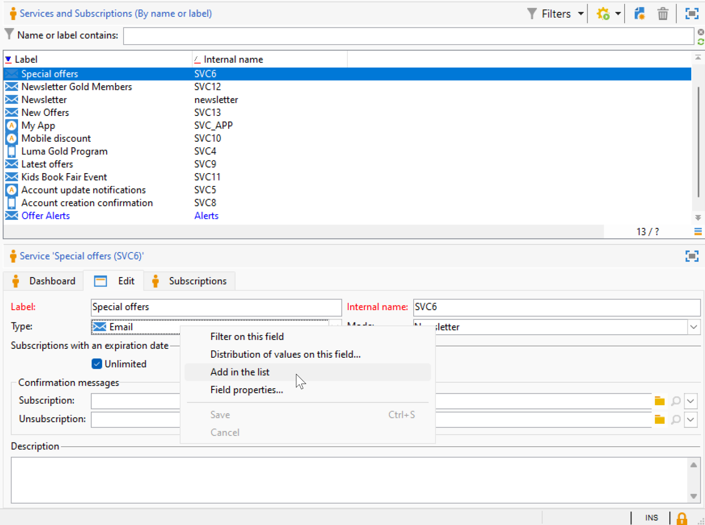

# Instellingen voor de gebruikersinterface voor campagnes {#ui-settings}

## Standaardeenheden {#default-units}

In Adobe Campaign, voor gebieden die een duur (b.v. geldigheidsperiode van de middelen, goedkeuringstermijn voor een taak, enz. uitdrukken) uitdrukken, kunnen de waarden in de volgende **eenheden** worden uitgedrukt:

* **[!UICONTROL s]** voor seconden
* **[!UICONTROL mn]** minuten
* **[!UICONTROL h]** gedurende uren
* **[!UICONTROL d]** dagen

## Campagneverkenner aanpassen{#customize-explorer}

U kunt mappen toevoegen aan Campagneverkenner, weergaven maken en machtigingen toewijzen.

Leer hoe te om omslagen en meningen in [ te beheren deze pagina ](../audiences/folders-and-views.md)

## Lijsten beheren en aanpassen {#customize-lists}

In de Console van de Cliënt van de Campagne, worden de gegevens getoond in lijsten. U kunt deze lijsten aan uw behoeften aanpassen. U kunt bijvoorbeeld kolommen, filtergegevens, telrecords toevoegen, uw instellingen opslaan en delen.

Bovendien kunt u filters maken en opslaan.  Leer meer over filters in [ deze pagina ](../audiences/create-filters.md).

### Aantal records {#number-of-records}

Standaard laadt Adobe Campaign de eerste 200 records van een lijst. Dit betekent dat niet noodzakelijkerwijs alle records van de tabel worden weergegeven die u bekijkt. U kunt een telling van het aantal verslagen in de lijst in werking stellen en meer verslagen laden.

In het lagere rechterdeel van het lijstscherm, a **teller** toont hoeveel verslagen zijn geladen en het totale aantal verslagen in het gegevensbestand (na het toepassen van om het even welke filters):

Als er een vraagteken wordt weergegeven in plaats van het nummer aan de rechterkant, bijvoorbeeld `240/?` , klikt u op de teller om de berekening te starten.

Klik op **[!UICONTROL Continue loading]** om aanvullende records te laden en weer te geven. Standaard worden 200 records geladen. Als u het standaardaantal records dat u wilt laden wilt wijzigen, gebruikt u het pictogram **[!UICONTROL Configure list]** in de rechteronderhoek van de lijst. Klik in het lijstconfiguratievenster op **[!UICONTROL Advanced parameters]** (linksonder) en wijzig het aantal regels dat moet worden opgehaald.

Als u alle records wilt laden, klikt u met de rechtermuisknop op de lijst en selecteert u **[!UICONTROL Load all]** .

>[!CAUTION]
>
>Wanneer een lijst een hoog volume records bevat, kan het enige tijd duren voordat het bestand volledig is geladen.
>

### Kolommen toevoegen en verwijderen {#add-columns}

Voor elke lijst, kan de ingebouwde kolomconfiguratie worden aangepast om meer informatie te tonen of ongebruikte kolommen te verbergen.

Wanneer gegevens in het detail van een record worden weergegeven, klikt u met de rechtermuisknop op het veld en selecteert u **[!UICONTROL Add in the list]** .

 toe

De kolom wordt rechts van de bestaande kolommen toegevoegd.

 toe

U kunt het scherm van de lijstconfiguratie ook gebruiken om kolommen toe te voegen en te verwijderen:

1. Klik in een lijst met records op het pictogram **[!UICONTROL Configure list]** in de rechterbenedensectie.
1. Dubbelklik op de velden die u wilt toevoegen aan de lijst **[!UICONTROL Available fields]** : deze worden toegevoegd aan de lijst van **[!UICONTROL Output columns]** .

   

   >[!NOTE]
   >
   >Geavanceerde velden worden standaard niet weergegeven. Om hen te tonen, klik het **Vertoning geavanceerde gebieden** pictogram, op de lagere juiste sectie van de lijst van beschikbare gebieden.
   >
   >Velden worden aangegeven met specifieke pictogrammen: SQL-velden, gekoppelde tabellen, berekende velden enzovoort. Voor elk geselecteerd veld wordt de beschrijving weergegeven onder de lijst met beschikbare velden.
   >

1. Gebruik omhoog/onderaan pijlen om de **vertoningsorde** te wijzigen.

1. Klik **[!UICONTROL OK]** om de configuratie te bevestigen en het resultaat te tonen.

Als u een kolom moet verwijderen, het selecteren en het **pictogram van het Afval** klikken.

Met het pictogram **[!UICONTROL Distribution of values]** kunt u de verdeling van waarden voor het geselecteerde veld in de huidige map weergeven.

### Een nieuwe kolom maken {#create-a-new-column}

U kunt nieuwe kolommen maken om extra velden in de lijst weer te geven.

Ga als volgt te werk om een kolom te maken:

1. Klik in een lijst met records op het pictogram **[!UICONTROL Configure list]** in de rechterbenedensectie.
1. Klik op het pictogram **[!UICONTROL Add]** om een nieuw veld in de lijst weer te geven.
1. Configureer het veld dat u in de kolom wilt toevoegen.

### Gegevens weergeven in submappen {#display-sub-folders-records}

Lijsten kunnen worden weergegeven:

* Alle records in de geselecteerde map (standaard)
* Alle records in de geselecteerde map en de bijbehorende submappen

Als u van de ene weergavemodus naar de andere wilt schakelen, klikt u op **[!UICONTROL Display sub-levels]** op de werkbalk Campagne.

### Een lijstconfiguratie opslaan {#saving-a-list-configuration}

De lijstconfiguraties worden plaatselijk bepaald voor elke gebruiker. Wanneer de lokale cache wordt gewist, worden lokale configuraties uitgeschakeld.

De parameters die u instelt, gelden standaard voor alle lijsten met het corresponderende maptype. Wanneer u wijzigt hoe de lijst van ontvangers van een omslag wordt getoond, wordt deze configuratie toegepast op alle andere ontvankelijke omslagen.

U kunt meer dan één configuratie opslaan die op verschillende omslagen van het zelfde type moet worden toegepast. De configuratie wordt opgeslagen met de eigenschappen van de map die de gegevens bevat en kan opnieuw worden toegepast.

Volg onderstaande stappen om een lijstconfiguratie op te slaan zodat deze opnieuw kan worden gebruikt:

1. Klik in de Verkenner met de rechtermuisknop op de map met de weergegeven gegevens.
1. Selecteer **[!UICONTROL Properties]**.
1. Klik op **[!UICONTROL Advanced settings]** en geef een naam op in het veld **[!UICONTROL Configuration]** .
1. Klik op **[!UICONTROL OK]** en vervolgens op **[!UICONTROL Save]** .

U kunt deze configuratie dan toepassen om het even welke andere omslag van het zelfde type. Leer meer over omslagen in [ deze pagina ](../audiences/folders-and-views.md).

### Een lijst exporteren {#exporting-a-list}

Als u gegevens uit een lijst wilt exporteren, moet u een wizard voor exporteren gebruiken. Als u deze wilt openen, selecteert u de elementen die u wilt exporteren in de lijst, klikt u met de rechtermuisknop en selecteert u **[!UICONTROL Export...]** .

<!--The use of the import and export functions is explained in [Generic imports and exports](../../platform/using/about-generic-imports-exports.md).-->

>[!CAUTION]
>
>Elementen uit een lijst mogen niet worden geëxporteerd met de functie Kopiëren/Plakken.

### Een lijst sorteren {#sorting-a-list}

Lijsten kunnen veel gegevens bevatten. U kunt deze gegevens sorteren of eenvoudige of geavanceerde filters toepassen. Door te sorteren kunt u gegevens in oplopende of aflopende volgorde weergeven. Met filters kunt u alleen geselecteerde gegevens definiëren en combineren.

Klik op de kolomkop om oplopende of aflopende sortering toe te passen of om gegevenssortering te annuleren. De actieve sorteerstatus en sorteervolgorde worden aangegeven met een blauwe pijl vóór het kolomlabel. Een rood streepje vóór het kolomlabel betekent dat de sortering wordt toegepast op gegevens die uit de database zijn geïndexeerd. Deze sorteermethode wordt gebruikt om sorteertaken te optimaliseren.

U kunt ook sorteren configureren of sorteercriteria combineren. Hiervoor voert u de volgende stappen uit:

1. **[!UICONTROL Configure list]** onder en rechts van de lijst.
1. Klik in het lijstconfiguratievenster op de tab **[!UICONTROL Sorting]** .
1. Selecteer de velden die u wilt sorteren en de sorteerrichting (oplopend of aflopend).
1. De sorteerprioriteit wordt gedefinieerd door de volgorde van de sorteerkolommen. Als u de prioriteit wilt wijzigen, gebruikt u de juiste pictogrammen om de volgorde van de kolommen te wijzigen.

   De sorteerprioriteit heeft geen invloed op de weergave van de kolommen in de lijst.

1. Klik op **[!UICONTROL Ok]** om deze configuratie te bevestigen en het resultaat in de lijst weer te geven.

## Aanvullende bronnen

* **[Begin met het de gebruikersinterface van de Campagne](../start/campaign-ui.md)** - ontdekt hoe te om tot de interface van Adobe Campaign toegang te hebben en te doorbladeren.
* **[Werk met Opsommingen](../dev/enumerations.md)** - normaliseer gebiedswaarden met vooraf bepaalde drop-down lijsten voor snellere, consistentere gegevensingang.
