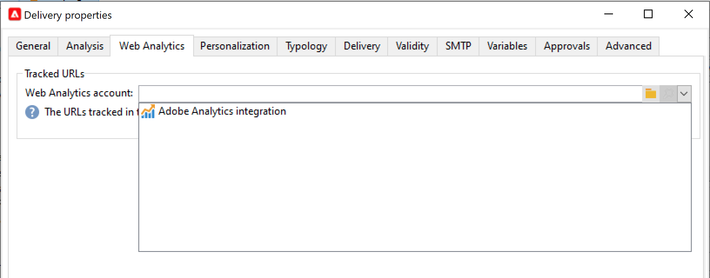

# Werken met campagne en Adobe Analytics {#ac-aa}

U kunt Adobe Analytics configureren om Campagne en Analytics te integreren.

Deze integratie staat Adobe Campaign en Adobe Analytics toe om door de **toe:voegen-op de schakelaars van de Analyse van het Web in wisselwerking te staan 0&rbrace;.** Deze integratie stuurt indicatoren en kenmerken van e-mailcampagnes die door Adobe Campaign aan Adobe Analytics worden geleverd.

>[!NOTE]
>
>Als Beheerde gebruiker van Cloud Servicen, [ contact Adobe ](../start/campaign-faq.md#support) om Campagne met de diensten en de oplossingen van Adobe Experience Cloud te verbinden. De de schakelaartoe:voegen-op van de Analyse van het Web moet op uw milieu, door het specifieke pakket worden geïnstalleerd.

Met Adobe Analytics Connector kan Adobe Campaign de internetdoelgroep meten (Web Analytics). Met de hulpprogramma&#39;s voor webanalyse kan Adobe Campaign indicatoren en campagnerekenmerken doorsturen naar Analytics.

De actieomtrek van elk gereedschap is als volgt:

* **Adobe Analytics** merkt de e-mailcampagnes die met Adobe Campaign worden gelanceerd

* **Adobe Campaign** verzendt de indicatoren en campagneattributen naar de schakelaar, die hen beurtelings aan het analytische hulpmiddel van het Web door:sturen

>[!CAUTION]
>
>Adobe Analytics Connector is niet compatibel met Transactional Messaging (Message Center).

Als u de verbinding Campagne-Analytics wilt instellen, moet u de volgende bewerkingen uitvoeren:

1. [Uw rapportsuite maken in Adobe Analytics](#report-suite-analytics)
1. [Conversievariabelen en succesgebeurtenissen configureren](#configure-conversion-success)
1. [Uw externe account configureren in Adobe Campaign](#external-account-ac)

## Uw analyserapportsuite maken {#report-suite-analytics}

Voer de onderstaande stappen uit om uw **[!UICONTROL Report suite]** in [!DNL Adobe Analytics] te maken:

1. Selecteer vanuit [!DNL Adobe Analytics] het **[!UICONTROL Admin tab]** en klik vervolgens op **[!UICONTROL All admin]**.

   

1. Klik op **[!UICONTROL Report suites]**.

   

1. Klik op de pagina **[!UICONTROL Report suite manager]** op **[!UICONTROL Create new]** en vervolgens op **[!UICONTROL Report suite]**.

   Voor de gedetailleerde procedure op **[!UICONTROL Report suite]** verwezenlijking, verwijs naar [ Documentatie van Adobe Analytics ](https://experienceleague.adobe.com/docs/analytics/admin/manage-report-suites/new-report-suite/t-create-a-report-suite.html#prerequisites){target="_blank"} .

   

1. Selecteer een sjabloon.

1. Configureer uw nieuwe rapportsuite met de volgende informatie:

   * **[!UICONTROL Report Suite ID]**
   * **[!UICONTROL Site Title]**
   * **[!UICONTROL Time Zone]**
   * **[!UICONTROL Go Live Date]**
   * **[!UICONTROL Estimated Page Views Per Day]**

   

1. Klik na de configuratie op **[!UICONTROL Create report suite]**.

## Conversievariabelen en succesgebeurtenissen configureren {#configure-conversion-success}

Nadat u uw **[!UICONTROL Report suite]** hebt gemaakt, moet u de **[!UICONTROL Conversion variables]** en **[!UICONTROL Success events]** als volgt configureren:

1. Selecteer de eerder geconfigureerde **[!UICONTROL Report suite]**.

1. Selecteer via de knop **[!UICONTROL Edit settings]** de optie  **[!UICONTROL Conversion]** >  **[!UICONTROL Conversion variables]**.

   

1. Klik op **[!UICONTROL Add new]** om de id&#39;s te maken die nodig zijn voor het meten van de impact van de e-mailcampagne, dat wil zeggen de interne naam van de campagne (cid) en de tabel-id van de iNmsBroadlog (bid).

   Leren hoe te om **[!UICONTROL Conversion variables]** uit te geven, verwijs naar deze [ Documentatie van Adobe Analytics ](https://experienceleague.adobe.com/docs/analytics/admin/admin-tools/conversion-variables/t-conversion-variables-admin.html#admin-tools){target="_blank"} .

   

1. Klik op **[!UICONTROL Save]** wanneer u klaar bent met de configuratie.

1. Als u vervolgens uw **[!UICONTROL Success events]** wilt maken, selecteert u **[!UICONTROL Conversion]** > **[!UICONTROL Success events]** via de knop **[!UICONTROL Edit settings]**.

   

1. Klik op **[!UICONTROL Add new]** om de volgende **[!UICONTROL Success events]** te configureren:

   * **[!UICONTROL Clicked]**
   * **[!UICONTROL Opened]**
   * **[!UICONTROL Person clicks]**
   * **[!UICONTROL Processed]**
   * **[!UICONTROL Scheduled]**
   * **[!UICONTROL Sent]**
   * **[!UICONTROL Total bounces]**
   * **[!UICONTROL Unique Clicks]**
   * **[!UICONTROL Unique Opens]**
   * **[!UICONTROL Unsubscribed]**

   Leren hoe te om **[!UICONTROL Success events]** te vormen, verwijs naar deze [ Documentatie van Adobe Analytics ](https://experienceleague.adobe.com/docs/analytics/admin/admin-tools/manage-report-suites/edit-report-suite/conversion-variables/success-event.html)

   

1. Klik op **[!UICONTROL Save]** wanneer u klaar bent met de configuratie.

Wanneer uw rapportsuite is geconfigureerd, moet u de **[!UICONTROL External accounts]** in Adobe Campaign configureren.

## Uw externe account voor campagne configureren {#external-account-ac}

U moet nu uw **[!UICONTROL Web Analytics]** externe account in Adobe Campaign configureren om de synchronisatie tussen de twee oplossingen in te schakelen.

Als een van uw **[!UICONTROL Report suite]**, **[!UICONTROL Conversion variables]** of **[!UICONTROL Success events]** niet zichtbaar is tijdens het configureren van uw externe account, betekent dit dat u geen toestemming hebt voor deze nieuwe gemaakte component in het **[!UICONTROL Product profile]** dat aan de gebruiker is gekoppeld.

Voor meer informatie over dit, verwijs naar de [ profielen van het Product voor Adobe Analytics ](https://experienceleague.adobe.com/docs/analytics/admin/admin-console/permissions/product-profile.html#product-profile-admins){target="_blank"}  pagina.

1. Blader naar de map **[!UICONTROL Administration]** > **[!UICONTROL Platform]** > **[!UICONTROL External accounts]** van de Adobe Campaign Explorer-boomstructuur en klik op **[!UICONTROL New]** .

   

1. Gebruik de vervolgkeuzelijst om het type **[!UICONTROL Web Analytics]** en **[!UICONTROL Adobe Analytics]** in de vervolgkeuzelijst **[!UICONTROL Integration]** te selecteren.

   

1. Klik op **[!UICONTROL Configure]** naast de vervolgkeuzelijst **[!UICONTROL Integration]**.

1. Wijs in het venster **[!UICONTROL Configure Analytics integration]** uw externe account toe met de eerder gemaakte rapportsuite en geef de volgende informatie op:

   * **[!UICONTROL E-Mail]**
   * **[!UICONTROL IMS Org]**
   * **[!UICONTROL Analytics Company]**
   * **[!UICONTROL Report Suite]**

1. Wijs in de categorie **[!UICONTROL eVars]** de twee **[!UICONTROL Conversion variables]** toe die zijn geconfigureerd in [!DNL Adobe Analytics].

   >[!NOTE]
   >
   >De velden Campagne-id en Broadload-id worden via JavaScript verzameld op de landingspagina of via verwerkingsregels. [ leer meer bij verwerkingsregels ](https://experienceleague.adobe.com/en/docs/analytics/admin/admin-tools/manage-report-suites/edit-report-suite/report-suite-general/c-processing-rules/processing-rules)

   

1. Wijs in de categorie **[!UICONTROL Events]** de tien **[!UICONTROL Success events]** toe die zijn geconfigureerd in [!DNL Adobe Analytics].

1. Klik op **[!UICONTROL Submit]** wanneer u gereed bent. Adobe Campaign maakt een **[!UICONTROL Data source]**, **[!UICONTROL Calculated metrics]**, **[!UICONTROL Remarketing segments]** en **[!UICONTROL Classifications]** in de toegewezen Analytics **[!UICONTROL Report Suite]**.

   Als deze synchronisatie tussen [!DNL Adobe Analytics] en Adobe Campaign is voltooid, kunt u het venster sluiten.

1. De instellingen kunnen worden weergegeven via het abblad **[!UICONTROL Data Settings]** in het venster **[!UICONTROL Configure Analytics integration]**.

   Met de knop **[!UICONTROL Sync]** synchroniseert [!DNL Adobe Campaign] de naamswijzigingen die zijn uitgevoerd in [!DNL Adobe Analytics]. Als de component is verwijderd is in [!DNL Adobe Analytics], zal de component worden doorgehaald in [!DNL Adobe Campaign] of worden weergegeven met het bericht **niet gevonden**.

   

   >[!NOTE]
   >
   > U kunt geen segmenten toevoegen of verwijderen in deze versie van Campagne v8.

1. Vanaf uw **[!UICONTROL External account]** klikt u op de koppeling **[!UICONTROL Enrich the formula...]** om de URL-berekeningsformule te wijzigen en de integratiegegevens van de webanalyticstool (campagne-id&#39;s) en de domeinen van de sites op te geven waarvan de activiteit moet worden bijgehouden.

   

1. Geef de domeinnaam of -namen van de sites op.

   

1. Klik op **[!UICONTROL Next]** en zorg ervoor dat de domeinnamen zijn opgeslagen.

   

1. Indien nodig kunt u de berekeningsformule overladen. U doet dit door het selectievakje in te schakelen en de formule rechtstreeks in het venster te bewerken.

   >[!IMPORTANT]
   >
   >Deze configuratiemodus is voorbehouden aan ervaren gebruikers: elke fout in deze formule kan ertoe leiden dat e-mailleveringen worden stopgezet.

1. Met het tabblad **[!UICONTROL Advanced]** kunt u meer technische instellingen configureren of wijzigen.

   * **[!UICONTROL Lifespan]**: hiermee kunt u de vertraging (in dagen) opgeven waarna de webgebeurtenissen in Adobe Campaign zijn hersteld door technische workflows. Standaard: 180 dagen.
   * **[!UICONTROL Persistence]**: hiermee wordt de periode weergegeven waarin alle webgebeurtenissen (bijvoorbeeld een aankoop) kunnen worden toegewezen aan een remarketingcampagne, Standaard: 7 dagen.

>[!NOTE]
>
>Als u verschillende metingstools voor doelgroepen gebruikt, kunt u **[!UICONTROL Other]** selecteren in de vervolgkeuzelijst **[!UICONTROL Partners]** wanneer u een extern account maakt. U mag slechts naar één externe account verwijzen in de leveringseigenschappen: u moet daarom de formule van bijgehouden URL&#39;s aanpassen door de parameters toe te voegen die door Adobe-tools en alle andere gebruikte meettools worden verwacht.

## Technische workflow van webanalyseprocessen {#technical-workflows-of-web-analytics-processes}

De gegevensuitwisseling tussen Adobe Campaign en Adobe Analytics wordt afgehandeld door een technische workflow die als achtergrondtaak wordt uitgevoerd.

Deze workflow is beschikbaar in de boomstructuur van Campagne Explorer, onder **[!UICONTROL Administration]** > **[!UICONTROL Production]** > **[!UICONTROL Technical workflows]** > **[!UICONTROL Web analytics process]** map.

Met de **[!UICONTROL Sending of indicators and campaign attributes]** -workflow kunt u e-mailcampagnemarameters via Adobe Campaign naar de Adobe Experience Cloud verzenden via Adobe Analytics Connector. Deze workflow wordt elke dag om 04.00 uur gestart en het kan 24 uur duren voordat de gegevens naar Analytics worden verzonden.

Deze workflow moet niet opnieuw worden gestart, anders worden alle eerdere gegevens opnieuw verzonden, waardoor de resultaten van Analytics kunnen worden scheefgetrokken.

De betreffende indicatoren zijn:

* **[!UICONTROL Messages to deliver]** (@toDeliver)
* **[!UICONTROL Processed]** (@processed)
* **[!UICONTROL Success]** (@success)
* **[!UICONTROL Total count of opens]** (@totalRecipientOpen)
* **[!UICONTROL Recipients who have opened]** (@recipientOpen)
* **[!UICONTROL Total number of recipients who clicked]** (@totalRecipientClick)
* **[!UICONTROL People who clicked]** (@personClick)
* **[!UICONTROL Number of distinct clicks]** (@recipientClick)
* **[!UICONTROL Opt-Out]** (@optOut)
* **[!UICONTROL Errors]** (@error)

>[!NOTE]
>
>De verzonden gegevens zijn de delta die op de laatste momentopname wordt gebaseerd, wat tot negatieve waarde in de metrische gegevens kan leiden.

De verzonden kenmerken zijn als volgt:

* **[!UICONTROL Internal name]** (@internalName)
* **[!UICONTROL Label]** (@label)
* **[!UICONTROL Label]** (operation/@label): alleen als het pakket **Campaign** is geïnstalleerd
* **[!UICONTROL Nature]** (operation/@nature): alleen als het pakket **Campaign** is geïnstalleerd
* **[!UICONTROL Tag 1]** (webAnalytics/@tag1)
* **[!UICONTROL Tag 2]** (webAnalytics/@tag2)
* **[!UICONTROL Tag 3]** (webAnalytics/@tag3)
* **[!UICONTROL Contact date]** (scheduling/@contactDate)

## Leveringen bijhouden {#tracking-deliveries-in-adobe-campaign}

Als u wilt dat de Adobe Experience Cloud de activiteit op de sites kan volgen wanneer de levering door Adobe Campaign wordt verzonden, moet u in de leveringseigenschappen verwijzen naar de bijbehorende connector. Hiervoor voert u de volgende stappen uit:

1. Open de levering van de campagne die u wilt bijhouden.

   

1. Open de leveringseigenschappen.
1. Ga naar het tabblad **[!UICONTROL Web Analytics]** en selecteer het eerder gemaakte externe account. Verwijs naar [ vorm uw externe rekening in Adobe Campaign ](#external-account-ac).

   

1. U kunt nu uw levering verzenden en uw rapport bekijken in Adobe Analytics.

## Nieuwe marketingcampagne maken {#create-a-re-marketing-campaign}

Om uw remarketingcampagne voor te bereiden maakt u eenvoudig leveringssjablonen die voor remarketingcampagnes worden gebruikt. Configureer vervolgens uw remarketingcampagne en koppel deze aan een segment. Elk segment moet een andere remarketingcampagne voeren.

Remarketingcampagnes worden automatisch gestart zodra Adobe Campaign de segmenten heeft hersteld waarin het gedrag wordt geanalyseerd van de mensen die voor de eerste campagne zijn geselecteerd. In het geval van het verlaten van het winkelwagentje of het bekijken van een product zonder aankoop, wordt een levering verzonden naar de betrokken ontvangers zodat hun site kan bladeren om hun aankoop af te ronden.

Adobe Campaign biedt persoonlijke leveringssjablonen die u kunt gebruiken of zelf in een database kunt zetten om campagnes voor te bereiden.

1. Ga in **[!UICONTROL Explorer]** naar de map **[!UICONTROL Resources]** > **[!UICONTROL Templates]** > **[!UICONTROL Delivery templates]** van de Adobe Campaign-structuur.
1. Dupliceer de sjabloon **[!UICONTROL Email delivery (re-marketing)]** of de voorbeelden van remarketingsjablonen die door Adobe Campaign worden aangeboden.
1. Personaliseer de sjabloon naar wens en sla deze op.
1. Maak een nieuwe campagne en selecteer de sjabloon **[!UICONTROL Re-marketing campaign]** in de vervolgkeuzelijst.
1. Klik op de koppeling **[!UICONTROL Configure...]** om het segment en de leveringssjabloon op te geven die aan de campagne zijn gekoppeld.
1. Selecteer Analytics e [ externe rekening ](#external-account-ac), en het betrokken segment.
1. Selecteer de leveringsjabloon die voor deze remarketingcampagne moet worden gebruikt en klik vervolgens op **[!UICONTROL Finish]** om het venster te sluiten.
1. Klik op **[!UICONTROL OK]** om het campagnevenster te sluiten.

Het rapport **[!UICONTROL Re-marketing efficiency]** is toegankelijk via de globale rapportpagina. Hiermee kunt u het aantal geconverteerde contacten bekijken (d.w.z. die iets hebben gekocht) in relatie tot het aantal verlaten winkelwagens na de Adobe Campaign-remarketingcampagne. De omrekeningskoers wordt berekend per week, maand of sinds het begin van de synchronisatie tussen Adobe Campaign en Adobe Analytics.

**Verwante onderwerpen**

* [Campagne - Experience Cloud brengt integratie teweeg](ac-triggers.md)
