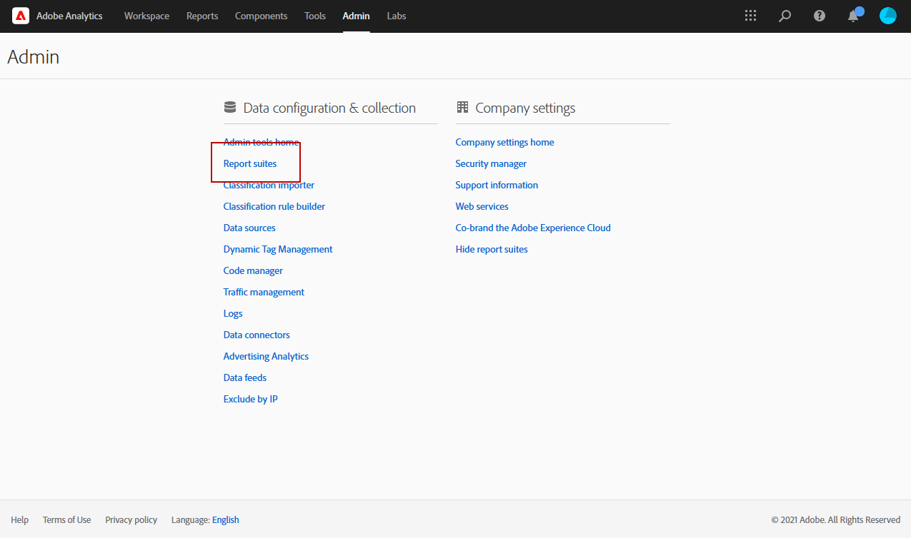
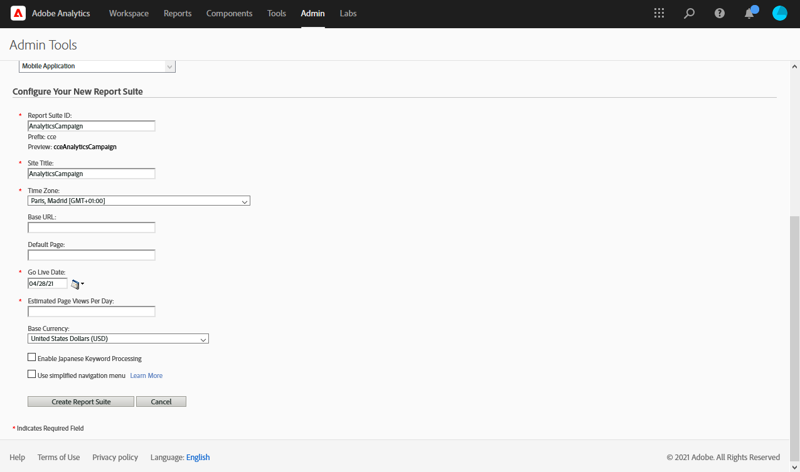
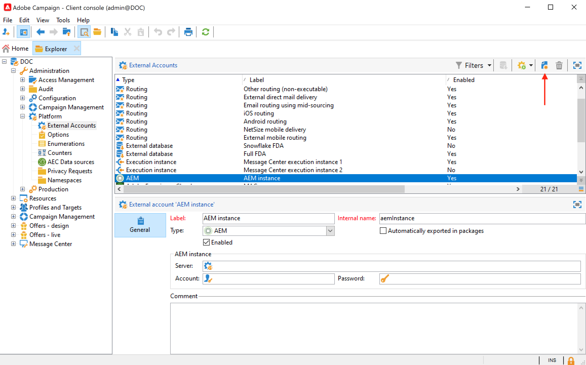
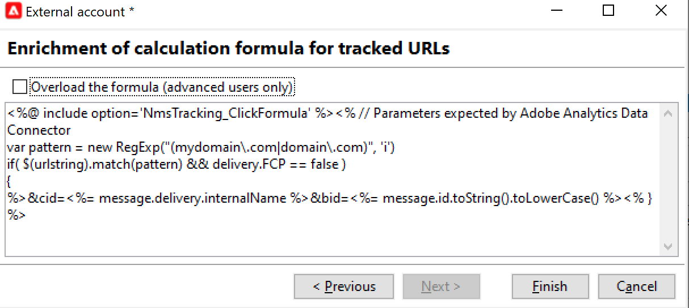

# Werken met campagne en Adobe Analytics

U kunt Adobe Analytics configureren om Campagne en Analytics te integreren.

Dankzij deze integratie kunnen Adobe Campaign en Adobe Analytics via de **Webanalytische connectors** invoegtoepassing. Deze integratie stuurt indicatoren en kenmerken van e-mailcampagnes die door Adobe Campaign aan Adobe Analytics worden geleverd.

  Als gebruiker van Beheerde Cloud Services, [contact Adobe](../start/campaign-faq.md#support) om Campagne met de diensten en de oplossingen van Adobe Experience Cloud te verbinden. De de schakelaartoe:voegen-op van de Analyse van het Web moet op uw milieu, door het specifieke pakket worden geïnstalleerd.

Met Adobe Analytics Connector kan Adobe Campaign de internetdoelgroep meten (Web Analytics). Met de hulpprogramma&#39;s voor webanalyse kan Adobe Campaign indicatoren en campagnerekenmerken doorsturen naar Analytics.

De actieomtrek van elk gereedschap is als volgt:

* **Adobe Analytics** markeert de e-mailcampagnes die met Adobe Campaign zijn gestart

* **Adobe Campaign** verzendt de indicatoren en campagnerekenmerken naar de schakelaar, die hen aan het analytische hulpmiddel van het Web terugstuurt

>[!CAUTION]
>
>Adobe Analytics Connector is niet compatibel met Transactional Messaging (Message Center).

Als u de verbinding Campagne-Analytics wilt instellen, moet u de volgende bewerkingen uitvoeren:

1. [Uw rapportsuite maken in Adobe Analytics](#report-suite-analytics)
1. [Conversievariabelen en succesgebeurtenissen configureren](#configure-conversion-success)
1. [Externe account configureren in Adobe Campaign](#external-account-ac)

## Uw analyserapportsuite maken {#report-suite-analytics}

Om uw **[!UICONTROL Report suite]** in [!DNL Adobe Analytics]volgt u de onderstaande stappen:

1. Selecteer vanuit [!DNL Adobe Analytics] het **[!UICONTROL Admin tab]** en klik vervolgens op **[!UICONTROL All admin]**.

   

1. Klik op **[!UICONTROL Report suites]**.

   

1. Klik op de pagina **[!UICONTROL Report suite manager]** op **[!UICONTROL Create new]** en vervolgens op **[!UICONTROL Report suite]**.

   Raadpleeg voor de gedetailleerde procedure over het maken van **[!UICONTROL Report suite]** deze [sectie](https://experienceleague.adobe.com/docs/analytics/admin/manage-report-suites/new-report-suite/t-create-a-report-suite.html?lang=nl#prerequisites).

   

1. Selecteer een sjabloon.

1. Configureer uw nieuwe rapportsuite met de volgende informatie:

   * **[!UICONTROL Report Suite ID]**
   * **[!UICONTROL Site Title]**
   * **[!UICONTROL Time Zone]**
   * **[!UICONTROL Go Live Date]**
   * **[!UICONTROL Estimated Page Views Per Day]**

   

1. Klik na de configuratie op **[!UICONTROL Create report suite]**.

## Conversievariabelen en succesgebeurtenissen configureren {#configure-conversion-success}

Nadat u uw **[!UICONTROL Report suite]** hebt gemaakt, moet u de **[!UICONTROL Conversion variables]** en **[!UICONTROL Success events]** als volgt configureren:

1. Selecteer de eerder geconfigureerde **[!UICONTROL Report suite]**.

1. Selecteer via de knop **[!UICONTROL Edit settings]** de optie  **[!UICONTROL Conversion]** >  **[!UICONTROL Conversion variables]**.

   

1. Klik op **[!UICONTROL Add new]** om de id&#39;s te maken die nodig zijn voor het meten van de impact van de e-mailcampagne, dat wil zeggen de interne naam van de campagne (cid) en de tabel-id van de iNmsBroadlog (bid).

   Voor informatie over de bewerking van **[!UICONTROL Conversion variables]** raadpleegt u deze [sectie](https://experienceleague.adobe.com/docs/analytics/admin/admin-tools/conversion-variables/t-conversion-variables-admin.html?lang=nl#admin-tools).

   

1. Klik op **[!UICONTROL Save]** wanneer u klaar bent met de configuratie.

1. Als u vervolgens uw **[!UICONTROL Success events]** wilt maken, selecteert u **[!UICONTROL Conversion]** > **[!UICONTROL Success events]** via de knop **[!UICONTROL Edit settings]**.

   

1. Klik op **[!UICONTROL Add new]** om de volgende **[!UICONTROL Success events]** te configureren:

   * **[!UICONTROL Clicked]**
   * **[!UICONTROL Opened]**
   * **[!UICONTROL Person clicks]**
   * **[!UICONTROL Processed]**
   * **[!UICONTROL Scheduled]**
   * **[!UICONTROL Sent]**
   * **[!UICONTROL Total bounces]**
   * **[!UICONTROL Unique Clicks]**
   * **[!UICONTROL Unique Opens]**
   * **[!UICONTROL Unsubscribed]**

   Voor meer informatie over de configuratie van **[!UICONTROL Success events]** raadpleegt u deze [sectie](https://experienceleague.adobe.com/docs/analytics/admin/admin-tools/success-events/t-success-events.html?lang=nl#admin-tools)

   

1. Klik op **[!UICONTROL Save]** wanneer u klaar bent.

Wanneer uw rapportreeks wordt gevormd, zult u moeten vormen **[!UICONTROL External accounts]** in Adobe Campaign.

## Uw externe account voor campagne configureren {#external-account-ac}

U moet nu uw **[!UICONTROL Web Analytics]** externe account in Adobe Campaign configureren om de synchronisatie tussen de twee oplossingen in te schakelen.

Als een van uw **[!UICONTROL Report suite]**, **[!UICONTROL Conversion variables]** of **[!UICONTROL Success events]** niet zichtbaar is tijdens het configureren van uw externe account, betekent dit dat u geen toestemming hebt voor deze nieuwe gemaakte component in het **[!UICONTROL Product profile]** dat aan de gebruiker is gekoppeld.

Raadpleeg voor meer informatie hierover de pagina [Productprofielen voor Adobe Analytics](https://experienceleague.adobe.com/docs/analytics/admin/admin-console/permissions/product-profile.html?lang=nl#product-profile-admins).

1. Ga naar de map **[!UICONTROL Administration]** > **[!UICONTROL Platform]** > **[!UICONTROL External accounts]** in de Adobe Campaign-structuur en klik op **[!UICONTROL New]**.

   

1. Gebruik de vervolgkeuzelijst om het type **[!UICONTROL Web Analytics]** en **[!UICONTROL Adobe Analytics]** in de vervolgkeuzelijst **[!UICONTROL Integration]** te selecteren.

   

1. Klik op **[!UICONTROL Configure]** naast de vervolgkeuzelijst **[!UICONTROL Integration]**.

1. Wijs in het venster **[!UICONTROL Configure Analytics integration]** uw externe account toe met de eerder gemaakte rapportsuite en geef de volgende informatie op:

   * **[!UICONTROL E-Mail]**
   * **[!UICONTROL IMS Org]**
   * **[!UICONTROL Analytics Company]**
   * **[!UICONTROL Report Suite]**

1. Wijs in de categorie **[!UICONTROL eVars]** de twee **[!UICONTROL Conversion variables]** toe die zijn geconfigureerd in [!DNL Adobe Analytics].

   

1. Wijs in de categorie **[!UICONTROL Events]** de tien **[!UICONTROL Success events]** toe die zijn geconfigureerd in [!DNL Adobe Analytics].

1. Klik op **[!UICONTROL Submit]** wanneer u gereed bent. Adobe Campaign maakt een **[!UICONTROL Data source]**, **[!UICONTROL Calculated metrics]**, **[!UICONTROL Remarketing segments]** en **[!UICONTROL Classifications]** in de toegewezen Analytics **[!UICONTROL Report Suite]**.

   Als deze synchronisatie tussen [!DNL Adobe Analytics] en Adobe Campaign is voltooid, kunt u het venster sluiten.

1. De instellingen kunnen worden weergegeven via het abblad **[!UICONTROL Data Settings]** in het venster **[!UICONTROL Configure Analytics integration]**.

   Met de knop **[!UICONTROL Sync]** synchroniseert [!DNL Adobe Campaign] de naamswijzigingen die zijn uitgevoerd in [!DNL Adobe Analytics]. Als de component is verwijderd is in [!DNL Adobe Analytics], zal de component worden doorgehaald in [!DNL Adobe Campaign] of worden weergegeven met het bericht **niet gevonden**.

   

   >[!NOTE]
   >
   > U kunt geen segmenten toevoegen of verwijderen in deze versie van Campagne v8.

1. Vanaf uw **[!UICONTROL External account]** klikt u op de koppeling **[!UICONTROL Enrich the formula...]** om de URL-berekeningsformule te wijzigen en de integratiegegevens van de webanalyticstool (campagne-id&#39;s) en de domeinen van de sites op te geven waarvan de activiteit moet worden bijgehouden.

   

1. Geef de domeinnaam of -namen van de sites op.

   

1. Klik op **[!UICONTROL Next]** en zorg ervoor dat de domeinnamen zijn opgeslagen.

   

1. Indien nodig kunt u de berekeningsformule overladen. U doet dit door het selectievakje in te schakelen en de formule rechtstreeks in het venster te bewerken.

   >[!IMPORTANT]
   >
   >Deze configuratiemodus is voorbehouden aan ervaren gebruikers: elke fout in deze formule kan ertoe leiden dat e-mailleveringen worden stopgezet.

1. Met het tabblad **[!UICONTROL Advanced]** kunt u meer technische instellingen configureren of wijzigen.

   * **[!UICONTROL Lifespan]**: hiermee kunt u de vertraging opgeven (in dagen_) waarna de webgebeurtenissen worden hersteld in Adobe Campaign door technische workflows. Standaard: 180 dagen.
   * **[!UICONTROL Persistence]**: hiermee wordt de periode weergegeven waarin alle webgebeurtenissen (bijvoorbeeld een aankoop) kunnen worden toegewezen aan een remarketingcampagne, Standaard: 7 dagen.

>[!NOTE]
>
>Als u verschillende metingstools voor doelgroepen gebruikt, kunt u **[!UICONTROL Other]** selecteren in de vervolgkeuzelijst **[!UICONTROL Partners]** wanneer u een extern account maakt. U mag slechts naar één externe account verwijzen in de leveringseigenschappen: u moet daarom de formule van bijgehouden URL&#39;s aanpassen door de parameters toe te voegen die door Adobe-tools en alle andere gebruikte meettools worden verwacht.

## Technische workflow van webanalyseprocessen {#technical-workflows-of-web-analytics-processes}

De gegevensuitwisseling tussen Adobe Campaign en Adobe Analytics wordt afgehandeld door een technische workflow die als achtergrondtaak wordt uitgevoerd.

Deze workflow is beschikbaar in de boomstructuur van Campagne Explorer, onder de **[!UICONTROL Administration]** > **[!UICONTROL Production]** > **[!UICONTROL Technical workflows]** > **[!UICONTROL Web analytics process]** map.

De **[!UICONTROL Sending of indicators and campaign attributes]** Met de workflow kunt u via Adobe Campaign e-mailcampagneindicatoren naar de Adobe Experience Cloud verzenden via Adobe Analytics Connector. Deze workflow wordt elke dag om 04.00 uur gestart en het kan 24 uur duren voordat de gegevens naar Analytics worden verzonden.

Deze workflow moet niet opnieuw worden gestart, anders worden alle eerdere gegevens opnieuw verzonden, waardoor de resultaten van Analytics kunnen worden scheefgetrokken.

De betreffende indicatoren zijn:

* **[!UICONTROL Messages to deliver]** (@toDeliver)
* **[!UICONTROL Processed]** (@processed)
* **[!UICONTROL Success]** (@success)
* **[!UICONTROL Total count of opens]** (@totalRecipientOpen)
* **[!UICONTROL Recipients who have opened]** (@recipientOpen)
* **[!UICONTROL Total number of recipients who clicked]** (@totalRecipientClick)
* **[!UICONTROL People who clicked]** (@personClick)
* **[!UICONTROL Number of distinct clicks]** (@recipientClick)
* **[!UICONTROL Opt-Out]** (@optOut)
* **[!UICONTROL Errors]** (@error)

>[!NOTE]
>
>De verzonden gegevens zijn de delta die op de laatste momentopname wordt gebaseerd, wat tot negatieve waarde in de metrische gegevens kan leiden.

De verzonden kenmerken zijn als volgt:

* **[!UICONTROL Internal name]** (@internalName)
* **[!UICONTROL Label]** (@label)
* **[!UICONTROL Label]** (operation/@label): alleen als het pakket **Campaign** is geïnstalleerd
* **[!UICONTROL Nature]** (operation/@nature): alleen als het pakket **Campaign** is geïnstalleerd
* **[!UICONTROL Tag 1]** (webAnalytics/@tag1)
* **[!UICONTROL Tag 2]** (webAnalytics/@tag2)
* **[!UICONTROL Tag 3]** (webAnalytics/@tag3)
* **[!UICONTROL Contact date]** (scheduling/@contactDate)

## Leveringen bijhouden {#tracking-deliveries-in-adobe-campaign}

Als u wilt dat de Adobe Experience Cloud de activiteit op de sites kan volgen wanneer de levering door Adobe Campaign wordt verzonden, moet u in de leveringseigenschappen verwijzen naar de bijbehorende connector. Hiervoor voert u de volgende stappen uit:

1. Open de levering van de campagne die u wilt bijhouden.

   

1. Open de leveringseigenschappen.
1. Ga naar het tabblad **[!UICONTROL Web Analytics]** en selecteer het eerder gemaakte externe account. Raadpleeg [Uw externe account configureren in Adobe Campaign](#external-account-ac).

   

1. U kunt nu uw levering verzenden en uw rapport bekijken in Adobe Analytics.

**Verwante onderwerpen**

* [Campagne - Experience Cloud Triggers-integratie](ac-triggers.md)
