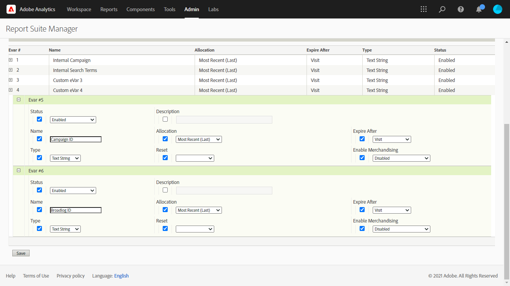
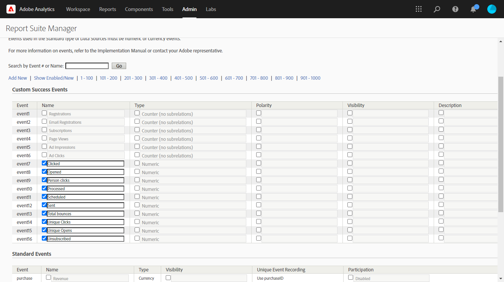

# Werken met campagne en Adobe Analytics

U kunt Adobe Analytics configureren om Campagne en Analytics te integreren.

Dankzij deze integratie kunnen Adobe Campaign en Adobe Analytics communiceren via de **Web Analytics-connectors** add-on. Deze integratie stuurt indicatoren en kenmerken van e-mailcampagnes die door Adobe Campaign aan Adobe Analytics worden geleverd.

[!DNL :speech_balloon:] Als gebruiker van Beheerde Cloud Services,  [contacteer ](../start/campaign-faq.md#support) Adobe om Campagne met de diensten en de oplossingen van Adobe Experience Cloud te verbinden. Adobe Identity Management Service (IMS) moet voor uw instantie worden geïmplementeerd. [Meer informatie](../start/connect.md#connect-ims). De de schakelaartoe:voegen-op van de Analyse van het Web moet op uw milieu, door het specifieke pakket worden geïnstalleerd.

Met Adobe Analytics Connector kan Adobe Campaign het internetpubliek meten (Web Analytics). Met de hulpprogramma&#39;s voor webanalyse kan Adobe Campaign indicatoren en campagnerekenmerken doorsturen naar Analytics.

De actieomtrek van elk gereedschap is als volgt:

* **Adobe** Analytici markeert de e-mailcampagnes die zijn gestart met Adobe Campaign

* **Adobe** Campaignsend de indicatoren en campagneattributen naar de schakelaar, die hen aan het hulpmiddel van de Analyse van het Web beurtelings door:sturen

>[!CAUTION]
>
>Adobe Analytics Connector is niet compatibel met Transaction messaging (Message Center).

Als u de verbinding Campagne-Analytics wilt instellen, moet u de volgende bewerkingen uitvoeren:

1. [Uw rapportsuite maken in Adobe Analytics](#report-suite-analytics)
1. [Conversievariabelen en Succesgebeurtenissen configureren](#configure-conversion-success)
1. [Uw externe account configureren in Adobe Campaign](#external-account-ac)

## Maak uw analyserapportsuite {#report-suite-analytics}

Voer de onderstaande stappen uit om uw **[!UICONTROL Report suite]** in [!DNL Adobe Analytics] te maken:

1. Selecteer [!DNL Adobe Analytics] en klik vervolgens **[!UICONTROL All admin]**.**[!UICONTROL Admin tab]**

   

1. Klik op **[!UICONTROL Report suites]**.

   

1. Klik op **[!UICONTROL Report suite manager]** op **[!UICONTROL Create new]** en **[!UICONTROL Report suite]**.

   Raadpleeg deze [sectie](https://experienceleague.adobe.com/docs/analytics/admin/manage-report-suites/new-report-suite/t-create-a-report-suite.html?lang=en#prerequisites) voor de gedetailleerde procedure voor het maken van **[!UICONTROL Report suite]**.

   

1. Selecteer een sjabloon.

1. Vorm uw nieuwe rapportreeks met de volgende informatie:

   * **[!UICONTROL Report Suite ID]**
   * **[!UICONTROL Site Title]**
   * **[!UICONTROL Time Zone]**
   * **[!UICONTROL Go Live Date]**
   * **[!UICONTROL Estimated Page Views Per Day]**

   

1. Wanneer gevormd, klik **[!UICONTROL Create report suite]**.

## Configureer uw conversievariabelen en Succesgebeurtenissen {#configure-conversion-success}

Nadat u uw **[!UICONTROL Report suite]** hebt gemaakt, moet u de **[!UICONTROL Conversion variables]** en **[!UICONTROL Success events]** als volgt configureren:

1. Selecteer de eerder geconfigureerde **[!UICONTROL Report suite]**.

1. Selecteer **[!UICONTROL Conversion]** > **[!UICONTROL Conversion variables]** op de knop **[!UICONTROL Edit settings]**.

   

1. Klik op **[!UICONTROL Add new]** om de id&#39;s te maken die nodig zijn voor het meten van de impact van de e-mailcampagne, dat wil zeggen de interne naam van de campagne (cid) en de tabel-id NmsBroadlog (bid).

   Als u wilt leren hoe u **[!UICONTROL Conversion variables]** kunt bewerken, raadpleegt u deze [sectie](https://experienceleague.adobe.com/docs/analytics/admin/admin-tools/conversion-variables/t-conversion-variables-admin.html?lang=en#admin-tools).

   

1. Klik **[!UICONTROL Save]** wanneer gereed.

1. Als u vervolgens uw **[!UICONTROL Success events]** wilt maken, selecteert u **[!UICONTROL Conversion]** > **[!UICONTROL Success events]** op de knop **[!UICONTROL Edit settings]**.

   

1. Klik **[!UICONTROL Add new]** om het volgende **[!UICONTROL Success events]** te vormen:

   * **[!UICONTROL Clicked]**
   * **[!UICONTROL Opened]**
   * **[!UICONTROL Person clicks]**
   * **[!UICONTROL Processed]**
   * **[!UICONTROL Scheduled]**
   * **[!UICONTROL Sent]**
   * **[!UICONTROL Total bounces]**
   * **[!UICONTROL Unique Clicks]**
   * **[!UICONTROL Unique Opens]**
   * **[!UICONTROL Unsubscribed]**

   Als u wilt leren hoe u **[!UICONTROL Success events]** configureert, raadpleegt u deze [sectie](https://experienceleague.adobe.com/docs/analytics/admin/admin-tools/success-events/t-success-events.html?lang=en#admin-tools)

   

1. Klik **[!UICONTROL Save]** wanneer gereed.

Wanneer uw rapportreeks wordt gevormd, zult u **[!UICONTROL External accounts]** in Adobe Campaign moeten vormen.

## Uw externe account voor campagne configureren {#external-account-ac}

U moet nu uw **[!UICONTROL Web Analytics]** externe rekening in Adobe Campaign vormen om de synchronisatie tussen de twee oplossingen toe te laten.

Als een van uw **[!UICONTROL Report suite]**, **[!UICONTROL Conversion variables]** of **[!UICONTROL Success events]** niet zichtbaar is tijdens het configureren van uw externe account, betekent dit dat u een machtiging voor deze nieuwe component mist in de **[!UICONTROL Product profile]** die aan de gebruiker is gekoppeld.

Raadpleeg voor meer informatie hierover de pagina [Productprofielen voor Adobe Analytics](https://experienceleague.adobe.com/docs/analytics/admin/admin-console/permissions/product-profile.html?lang=en#product-profile-admins).

1. Ga naar **[!UICONTROL Administration]** > **[!UICONTROL Platform]** > **[!UICONTROL External accounts]** omslag van de boom van Adobe Campaign en klik **[!UICONTROL New]**.

   

1. Gebruik de vervolgkeuzelijst om het type **[!UICONTROL Web Analytics]** en **[!UICONTROL Adobe Analytics]** in de vervolgkeuzelijst **[!UICONTROL Integration]** te selecteren.

   

1. Klik **[!UICONTROL Configure]** naast **[!UICONTROL Integration]** drop-down.

1. Wijs in het venster **[!UICONTROL Configure Analytics integration]** uw externe account toe met de eerder gemaakte rapportsuite die de volgende informatie bevat:

   * **[!UICONTROL E-Mail]**
   * **[!UICONTROL IMS Org]**
   * **[!UICONTROL Analytics Company]**
   * **[!UICONTROL Report Suite]**

1. Wijs in de categorie **[!UICONTROL eVars]** de twee **[!UICONTROL Conversion variables]** die zijn geconfigureerd in [!DNL Adobe Analytics] toe.

   

1. Wijs in de categorie **[!UICONTROL Events]** de tien **[!UICONTROL Success events]** toe die zijn geconfigureerd in [!DNL Adobe Analytics].

1. Klik **[!UICONTROL Submit]** wanneer gereed. Adobe Campaign maakt een **[!UICONTROL Data source]**, **[!UICONTROL Calculated metrics]**, **[!UICONTROL Remarketing segments]** en **[!UICONTROL Classifications]** in de toegewezen Analytics **[!UICONTROL Report Suite]**.

   Als deze synchronisatie tussen [!DNL Adobe Analytics] en Adobe Campaign is voltooid, kunt u het venster sluiten.

1. De instellingen kunnen worden weergegeven via het tabblad **[!UICONTROL Data Settings]** in het venster **[!UICONTROL Configure Analytics integration]**.

   Met de knop **[!UICONTROL Sync]** synchroniseert [!DNL Adobe Campaign] de wijzigingen in de naam die in [!DNL Adobe Analytics] zijn doorgevoerd. Als de component in [!DNL Adobe Analytics] wordt geschrapt, zal de component in [!DNL Adobe Campaign] worden doorgehaald of met een **niet gevonden** bericht worden getoond.

   

   >[!NOTE]
   >
   > U kunt geen segmenten toevoegen of verwijderen in deze versie van Campagne v8.

1. Klik in uw **[!UICONTROL External account]** op de koppeling **[!UICONTROL Enrich the formula...]** om de URL-berekeningsformule te wijzigen en de integratiegegevens van het hulpprogramma Webanalyse (campagne-id&#39;s) en de domeinen van de sites op te geven waarvan de activiteit moet worden bijgehouden.

   

1. Geef de domeinnaam of -namen van de sites op.

   

1. Klik **[!UICONTROL Next]** en zorg ervoor de domeinnamen zijn bewaard.

   

1. Indien nodig, kunt u de berekeningsformule te veel laden. U doet dit door het selectievakje in te schakelen en de formule rechtstreeks in het venster te bewerken.

   >[!IMPORTANT]
   >
   >Deze configuratiewijze is gereserveerd voor deskundige gebruikers: Als deze formule een fout bevat, kunnen e-mailleveringen gestopt worden.

1. Met het tabblad **[!UICONTROL Advanced]** kunt u meer technische instellingen configureren of wijzigen.

   * **[!UICONTROL Lifespan]**: Hiermee kunt u de vertraging opgeven (in dagen_ waarna de webgebeurtenissen in Adobe Campaign zijn hersteld door technische workflows. Standaard: 180 dagen.
   * **[!UICONTROL Persistence]**: Hiermee kunt u de periode opgeven gedurende welke alle webgebeurtenissen (bijvoorbeeld een aankoop) kunnen worden toegewezen aan een campagne voor het opnieuw op de markt brengen, Standaard: 7 dagen.

>[!NOTE]
>
>Als u verschillende publiekmeetgereedschappen gebruikt, kunt u **[!UICONTROL Other]** in de vervolgkeuzelijst **[!UICONTROL Partners]** selecteren wanneer u de externe account maakt. U mag slechts naar één externe account verwijzen in de leveringseigenschappen: u moet daarom de formule van bijgehouden URL&#39;s aanpassen door de parameters toe te voegen die door de Adobe en alle andere gebruikte meetinstrumenten worden verwacht.

## Technische workflow van webanalyseprocessen {#technical-workflows-of-web-analytics-processes}

De gegevensuitwisseling tussen Adobe Campaign en Adobe Analytics wordt afgehandeld door een technische workflow die als achtergrondtaak wordt uitgevoerd.

Deze workflow is beschikbaar in de boomstructuur Campagne Explorer onder **[!UICONTROL Administration]** > **[!UICONTROL Production]** > **[!UICONTROL Technical workflows]** > **[!UICONTROL Web analytics process]**.

Met de **[!UICONTROL Sending of indicators and campaign attributes]**-workflow kunt u e-mailcampagne-indicatoren via Adobe Campaign naar de Adobe Experience Cloud verzenden via Adobe Analytics Connector. Deze workflow wordt elke dag om 4 uur gestart en het kan 24 uur duren voordat de gegevens naar Analytics worden verzonden.

Deze workflow moet niet opnieuw worden gestart, anders worden alle eerdere gegevens opnieuw verzonden, waardoor de resultaten van Analytics kunnen worden scheefgetrokken.

Het gaat om indicatoren die:

* **[!UICONTROL Messages to deliver]** (@toDeliver)
* **[!UICONTROL Processed]** (@processing)
* **[!UICONTROL Success]** (@geslaagd)
* **[!UICONTROL Total count of opens]** (@totalRecipientOpen)
* **[!UICONTROL Recipients who have opened]** (@ontvangerOpen)
* **[!UICONTROL Total number of recipients who clicked]** (@totalRecipientClick)
* **[!UICONTROL People who clicked]** (@personClick)
* **[!UICONTROL Number of distinct clicks]** (@receivingClick)
* **[!UICONTROL Opt-Out]** (@optOut)
* **[!UICONTROL Errors]** (@fout)

>[!NOTE]
>
>De verzonden gegevens zijn de delta die op de laatste momentopname wordt gebaseerd die tot negatieve waarde in de metrische gegevens kan leiden.

De verzonden kenmerken zijn als volgt:

* **[!UICONTROL Internal name]** (@internalName)
* **[!UICONTROL Label]** (@label)
* **[!UICONTROL Label]** (operation/@label): alleen als het  **** Campaignpackage is geïnstalleerd
* **[!UICONTROL Nature]** (operation/@nature): alleen als het  **** Campaignpackage is geïnstalleerd
* **[!UICONTROL Tag 1]** (webAnalytics/@tag1)
* **[!UICONTROL Tag 2]** (webAnalytics/@tag2)
* **[!UICONTROL Tag 3]** (webAnalytics/@tag3)
* **[!UICONTROL Contact date]** (planning/@contactDate)

## Leveringen bijhouden {#tracking-deliveries-in-adobe-campaign}

Als u wilt dat de Adobe Experience Cloud de activiteit op de sites kan volgen wanneer de levering door Adobe Campaign wordt verzonden, moet u in de leveringseigenschappen verwijzen naar de bijbehorende connector. Hiervoor voert u de volgende stappen uit:

1. Open de levering van de campagne die u wilt bijhouden.

   

1. Open de leveringseigenschappen.
1. Ga naar het tabblad **[!UICONTROL Web Analytics]** en selecteer de eerder gemaakte externe account. Raadpleeg [Uw externe account configureren in Adobe Campaign](#external-account-ac).

   

1. Je kunt nu je levering verzenden en je rapport bekijken in Adobe Analytics.

**Verwante onderwerpen**

* [Campagne - Experience Cloud Triggers-integratie](ac-triggers.md)
