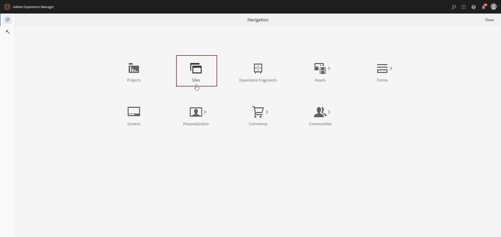
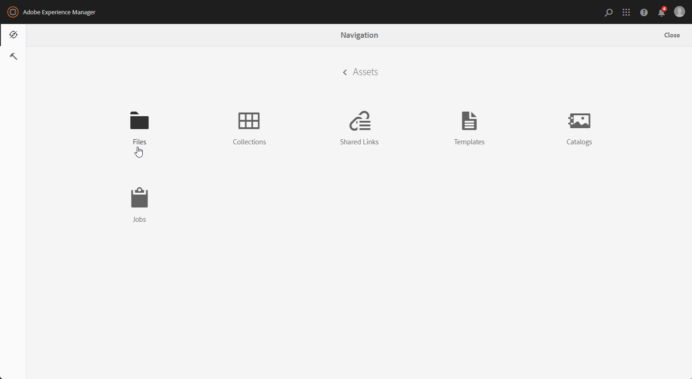
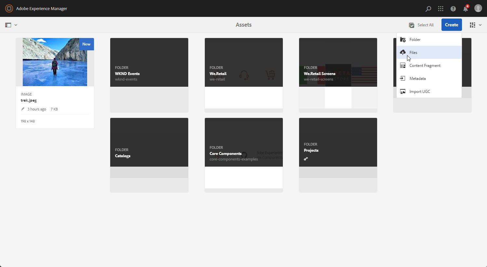
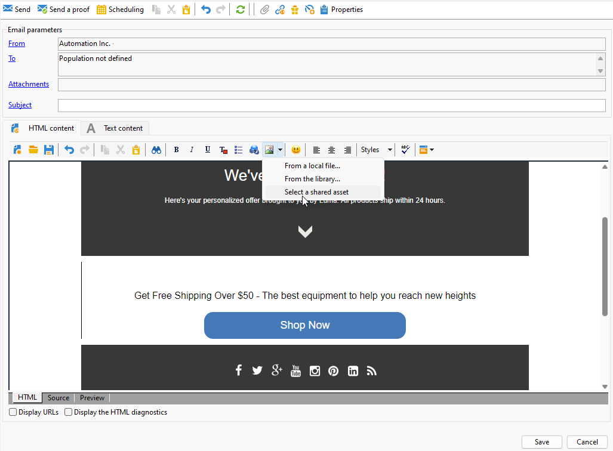

# Werken met campagne en Adobe Experience Manager {#ac-aem}

Dankzij de integratie tussen Adobe Campaign en Adobe Experience Manager kunt u de inhoud van uw e-mailleveringen en uw formulieren direct in Adobe Experience Manager beheren.

[ ontdekt hoe te om uw Adobe Experience Manager als inhoud van Cloud Service binnen de Interface van het Web van de Campagne uit te geven ](https://experienceleague.adobe.com/docs/campaign-web/v8/integrations/aem-content.html){target="_blank"}.

[ Leer meer over Adobe Experience Manager in dit document ](https://experienceleague.adobe.com/docs/experience-manager-65/administering/integration/campaignonpremise.html#aem-and-adobe-campaign-integration-workflow){target="_blank"}.

>[!NOTE]
>
>Als Beheerde gebruiker van de Diensten van de Wolk, [ contacteer Adobe ](../start/campaign-faq.md#support) om Adobe Experience Manager met Campagne te integreren.

## Inhoud importeren uit Adobe Experience Manager {#integrating-with-aem}

Deze integratie kan bijvoorbeeld worden gebruikt voor het maken van een nieuwsbrief in Adobe Experience Manager die vervolgens in Adobe Campaign wordt gebruikt als onderdeel van een e-mailcampagne.

**van Adobe Experience Manager:**

1. Navigeer naar de auteurinstantie van [!DNL Adobe Experience Manager] en klik op Adobe Experience in de linkerbovenhoek van de pagina. Kies **[!UICONTROL Sites]** in het menu.

   

1. Toegang **[!UICONTROL Campaigns > Name of your brand (here we.Shopping) > Main Area > Email]**.

1. Klik op **[!UICONTROL Create]** en selecteer **[!UICONTROL Page]** in het vervolgkeuzemenu.

   

1. Selecteer de sjabloon **[!UICONTROL Adobe Campaign Email]** en geef de nieuwsbrief een naam.

1. Open na het maken van de pagina het menu **[!UICONTROL Page information]** en klik op **[!UICONTROL Open Properties]** .

   

1. Pas uw e-mailinhoud aan door componenten toe te voegen, zoals personalisatievelden van Adobe Campaign. Leer meer in [ documentatie van Adobe Experience Manager ](https://experienceleague.adobe.com/docs/experience-manager-65/content/sites/authoring/aem-adobe-campaign/campaign.html#editing-email-content){target="_blank"}.

1. Wanneer uw e-mail gereed is, navigeert u naar het menu **[!UICONTROL Page information]** en klikt u op **[!UICONTROL Start workflow]** .

   

1. Selecteer in de eerste vervolgkeuzelijst **[!UICONTROL Approve Adobe Campaign]** als workflowmodel en klik op **[!UICONTROL Start workflow]** .

   

1. Boven aan de pagina wordt een disclaimer weergegeven met de tekst `This page is subject to the workflow Approve for Adobe Campaign` . Klik op **[!UICONTROL Complete]** naast de disclaimer om de revisie te bevestigen en klik op **[!UICONTROL Ok]** .

1. Klik nogmaals op **[!UICONTROL Complete]** en selecteer **[!UICONTROL Newsletter approval]** in de vervolgkeuzelijst **[!UICONTROL Next Step]** .

   

Uw nieuwsbrief is nu klaar en gesynchroniseerd in Adobe Campaign.

**van Adobe Campaign:**

1. Klik op de tab **[!UICONTROL Campaigns]** op **[!UICONTROL Deliveries]** then **[!UICONTROL Create]** .

1. Kies de sjabloon **[!UICONTROL Email delivery with AEM content (mailAEMContent)]** in de vervolgkeuzelijst **[!UICONTROL Delivery template]** .

   

1. Voeg een **[!UICONTROL Label]** toe aan uw levering en klik op **[!UICONTROL Continue]** .

1. Klik op **[!UICONTROL Synchronize]** om toegang te krijgen tot uw AEM-leveringen.

   Als de knop niet zichtbaar is in uw interface, navigeert u naar de knop **[!UICONTROL Properties]** en opent u het tabblad **[!UICONTROL Advanced]** . Zorg ervoor dat het veld **[!UICONTROL Content editing mode]** is geconfigureerd voor **[!UICONTROL AEM]** en voer uw AEM-instantiedetails in het veld **[!UICONTROL AEM account]** in.

   

1. Selecteer de AEM-levering die eerder in [!DNL Adobe Experience Manager] is gemaakt en bevestig door op **[!UICONTROL Ok]** te klikken.

   

1. Klik op de knop **[!UICONTROL Refresh content]** wanneer u wijzigingen aanbrengt in de levering van AEM.

   

1. Als u de koppeling tussen Experience Manager en Campagne wilt verwijderen, klikt u op **[!UICONTROL Desynchronize]** .

Uw e-mail kan nu naar uw publiek worden verzonden.

## Elementen importeren uit Adobe Experience Manager Assets-bibliotheek {#assets-library}

U kunt ook rechtstreeks elementen van uw [!DNL Adobe Experience Manager Assets Library] invoegen tijdens het bewerken van een e-mail- of landingspagina in Adobe Campaign. Deze functionaliteit wordt gedetailleerd in [ documentatie van Adobe Experience Manager Assets ](https://experienceleague.adobe.com/docs/experience-manager-65/content/assets/managing/manage-assets.html){target="_blank"}.

**van Adobe Experience Manager:**

1. Navigeer naar de auteurinstantie van [!DNL Adobe Experience Manager] en klik op Adobe Experience in de linkerbovenhoek van de pagina. Kies **[!UICONTROL Assets]** `>` **[!UICONTROL Files]** in het menu.

   

1. Klik **creëren** toen **Dossiers** om uw activa in uw **Bibliotheek van Adobe Experience Manager Assets** in te voeren. Leer meer in [ documentatie van de Manager van de Ervaring van Adobe ](https://experienceleague.adobe.com/docs/experience-manager-65/content/assets/managing/manage-assets.html#uploading-assets){target="_blank"}.

   

1. Verander uw activa indien nodig en selecteer **uploaden**.

Uw activa wordt nu geupload aan uw **Bibliotheek van Adobe Experience Manager Assets**.

**van Adobe Campaign:**

1. In Adobe Campaign, creeer een nieuwe levering door aan het **lusje van Campagnes** te doorbladeren, **Leveringen** te klikken en **te klikken creeer** knoop boven de lijst van bestaande leveringen.

   

1. Selecteer a **malplaatje van de Levering**, dan uw levering noemen.

1. Definieer en pas de inhoud van het bericht aan. [Meer informatie](../send/email.md)

1. Om uw **bibliotheek van Adobe Experience Manager Assets** te gebruiken, heb toegang tot **[!UICONTROL Properties]** van uw levering van AEM en selecteer het **[!UICONTROL Advanced]** lusje.

   Kies uw **rekening van AEM** en laat de **[!UICONTROL Use above AEM instance as shared asset library]** optie toe.

   

1. Van het **pictogram van het Beeld**, heb toegang tot het **[!UICONTROL Select a shared asset]** menu.

   

1. Van het selectievenster, selecteer een beeld van uw **bibliotheek van Adobe Experience Manager Assets**, toen **Uitgezocht**.

   

Uw middel wordt nu geüpload naar uw e-maillevering. U kunt nu het doelpubliek opgeven, de levering bevestigen en doorgaan met het verzenden ervan.
