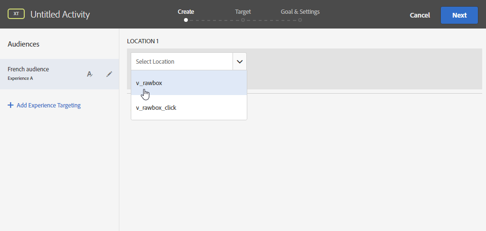

# Werken met campagne en Adobe Target

Connect Campagne en Target gebruiken om een aanbod van Adobe Target op te nemen in een Adobe Campaign-e-maillevering.

Deze integratie helpt u om gebruiksgevallen als volgt uit te voeren: wanneer een ontvanger een e-mailbericht opent dat via Adobe Campaign is verzonden, kunt u met een aanroep naar Adobe Target een dynamische versie van de inhoud weergeven. Deze dynamische versie wordt berekend op basis van de regels die vooraf zijn opgegeven bij het maken van de e-mail.

>[!NOTE]
>De integratie ondersteunt alleen statische afbeeldingen. De andere typen inhoud kunnen niet worden gepersonaliseerd.

?? Als Beheerde gebruiker van Cloud Services, [contacteer Adobe](../start/campaign-faq.md#support) om de trekkers van Experience Cloud met Campagne uit te voeren.

Adobe Target kan de volgende gegevenstypen gebruiken:

* Gegevens uit de Adobe Campaign-database
* Segmenten die zijn gekoppeld aan de bezoekersidentiteitskaart in Adobe Target, alleen als voor de gebruikte gegevens geen wettelijke beperkingen gelden
* Adobe Target-gegevens: gebruikersagent, IP-adres, geolocalisatiegegevens

## Dynamische inhoud invoegen

In het onderstaande voorbeeld leert u hoe u **een dynamisch aanbod** van Adobe Target kunt integreren in een Adobe Campaign-e-mail.

We willen een boodschap maken met een beeld dat dynamisch zal veranderen afhankelijk van het land van de ontvanger. De gegevens worden samen met elke mbox-aanvraag verzonden en zijn afhankelijk van het IP-adres van de bezoeker.

In deze e-mail, willen wij één van de beelden dynamisch volgens de volgende gebruiker-ervaringen variëren:

* Het e-mailbericht wordt geopend in Frankrijk.
* Het e-mailbericht wordt geopend in de Verenigde Staten.
* Als geen van deze voorwaarden van toepassing is, wordt een standaardafbeelding weergegeven.

In Adobe Campaign en Adobe Target moeten de volgende stappen worden gezet:

1. [De dynamische aanbieding in een e-mail invoegen](#inserting-dynamic-offer)
1. [Omleidingsvoorstellen maken](#create-redirect-offers)
1. [Soorten publiek maken](#audiences-target)
1. [Een ervaring maken die gericht is op activiteiten](#creating-targeting-activity)
1. [Het bericht voorvertonen en verzenden](#preview-send-email)

### De dynamische aanbieding in een e-mail invoegen {#inserting-dynamic-offer}

Definieer in Adobe Campaign het doel en de inhoud van uw e-mail. U kunt een dynamische afbeelding invoegen vanuit Adobe Target.

Hiervoor geeft u de URL van de standaardafbeelding, de locatienaam en de velden op die u naar Adobe Target wilt overbrengen.

In Adobe Campaign kunt u op twee manieren een dynamische afbeelding van Target invoegen in een e-mailbericht:

* Als u de digitale inhoudeditor gebruikt, kiest u een bestaande afbeelding en selecteert u **[!UICONTROL Insert]** > **[!UICONTROL Dynamic image served by Adobe Target]** op de werkbalk.

   

* Als u de standaardeditor gebruikt, plaatst u de cursor op de plaats waar u de afbeelding wilt invoegen en selecteert u **[!UICONTROL Include]** > **[!UICONTROL Dynamic image served by Adobe Target...]** in het vervolgkeuzemenu Verpersoonlijking.

   

Vervolgens kunt u de afbeeldingsparameters definiëren:

* De URL van **[!UICONTROL Default image]** is de afbeelding die wordt weergegeven wanneer aan geen van de voorwaarden wordt voldaan. U kunt ook een afbeelding selecteren in de middelenbibliotheek.
* De **[!UICONTROL Target location]** is de naam van de locatie van uw dynamische aanbieding. Je moet deze locatie selecteren in je Adobe Target-activiteit.
* Met de **[!UICONTROL Landing Page]** kunt u de standaardafbeelding omleiden naar een standaardbestemmingspagina. Deze URL is alleen van toepassing wanneer de standaardafbeelding wordt weergegeven in het laatste e-mailbericht. Het is optioneel.
* **[!UICONTROL Additional decision parameters]** bepaalt de afbeelding tussen de gebieden die in de segmenten van Adobe Target en de gebieden van Adobe Campaign worden bepaald. De Adobe Campaign-velden die worden gebruikt, moeten zijn opgegeven in de keuzelijst. In ons voorbeeld hebben we het veld Land toegevoegd.

Als u Enterprise-machtigingen gebruikt in uw instellingen in Adobe Target, voegt u de bijbehorende eigenschap toe in dit veld. Meer informatie over de rechten van Target Enterprise vindt u op [deze pagina](https://experienceleague.adobe.com/docs/target/using/administer/manage-users/enterprise/properties-overview.html?lang=en#administer).

### Omleidingsvoorstellen maken {#create-redirect-offers}

In Adobe Target kunt u verschillende versies van uw voorstel maken. Afhankelijk van elke gebruikerservaring kan een omleidingsaanbod worden gemaakt en kunt u opgeven welke afbeelding wordt weergegeven.

In ons geval hebben we twee doorgifteaanbiedingen nodig, de derde (de standaard) moet in Adobe Campaign worden gedefinieerd.

1. Als u een nieuwe omleidingsaanbieding wilt maken in Target Standard, klikt u op **[!UICONTROL Content]** tabblad.**[!UICONTROL Code offers]**

1. Klik op **[!UICONTROL Create]** en vervolgens op **[!UICONTROL Redirect Offer]**.

   

1. Voer een naam in voor het voorstel en de URL van de afbeelding.

   

1. Volg dezelfde procedure voor het resterende doorleidingsaanbod. Raadpleeg [deze pagina](https://experienceleague.adobe.com/docs/target/using/experiences/offers/offer-redirect.html?lang=en#experiences) voor meer informatie.

### Soorten publiek maken {#audiences-target}

In Adobe Target moet u de twee soorten publiek maken waarin de personen die uw aanbieding bezoeken, worden ingedeeld voor de verschillende inhoud die moet worden geleverd. Voor elk publiek, voeg een regel toe om te bepalen wie de aanbieding zal kunnen zien.

1. Als u een nieuw publiek in Doel wilt maken, klikt u op **[!UICONTROL Create Audience]** op het tabblad **[!UICONTROL Audiences]**.

   

1. Voeg een naam toe aan uw publiek.

   

1. Klik op **[!UICONTROL Add a rule]** en selecteer een categorie. De regel gebruikt specifieke criteria om de bezoekers te richten. U kunt de regels verfijnen door voorwaarden toe te voegen of door nieuwe regels te maken in andere categorieën.

1. Volg dezelfde procedure voor het resterende publiek.

### Een ervaring maken die gericht is op activiteiten {#creating-targeting-activity}

In Adobe Target moeten we een Experience Targeting-activiteit creëren, de verschillende ervaringen definiëren en ze koppelen aan de overeenkomstige aanbiedingen.

Eerst moet u het publiek definiëren:

1. Als u een Experience Targeting-activiteit wilt maken, klikt u op **[!UICONTROL Activities]** en **[!UICONTROL Experience Targeting]** op het tabblad **[!UICONTROL Create Activity]**.

   

1. Selecteer **[!UICONTROL Form]** als **[!UICONTROL Experience Composer]**.

1. Kies een publiek door op de knop **[!UICONTROL Change audience]** te klikken.

   

1. Selecteer het publiek dat in de vorige stappen is gemaakt.

   

1. Maak een andere ervaring door op **[!UICONTROL Add Experience Targeting]** te klikken.

Voeg vervolgens inhoud toe voor elk publiek:

1. Selecteer de locatienaam die u hebt gekozen bij het invoegen van het dynamische aanbod in Adobe Campaign.

   

1. Klik op de vervolgkeuzelijst en selecteer **[!UICONTROL Change Redirect Offer]**.

   

1. Selecteer het omleidingsvoorstel dat u eerder hebt gemaakt.

   

1. Voer dezelfde stappen uit voor de tweede ervaring.

In het venster **[!UICONTROL Target]** wordt uw activiteit samengevat. Indien nodig kunt u andere ervaringen toevoegen.

In het venster **[!UICONTROL Goal & Settings]** kunt u uw activiteit aanpassen door een prioriteit, een doelstelling of een duur in te stellen.

In de sectie **[!UICONTROL Reporting Settings]** kunt u een handeling selecteren en de parameters bewerken die bepalen wanneer uw doel wordt bereikt.

## Het bericht voorvertonen en verzenden {#preview-send-email}

In Adobe Campaign kunt u nu een voorbeeld van uw e-mail bekijken en de weergave ervan testen op verschillende ontvangers.

U zult merken dat de afbeelding verandert op basis van de verschillende ervaringen die zijn gemaakt.

U kunt nu uw e-mail verzenden, inclusief een dynamisch voorstel van Target.

