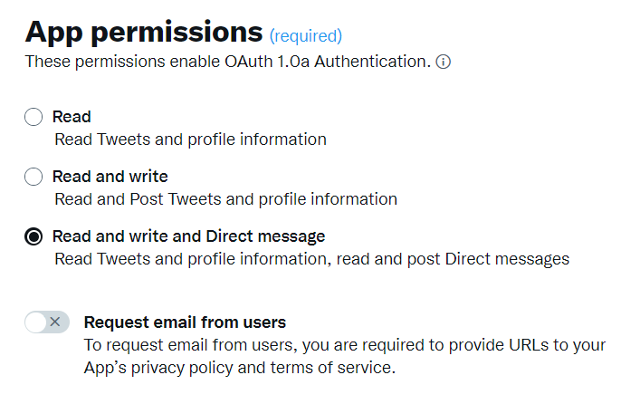

# Werken met Campagne en X (Twitter) {#tw-ac-ovv}

De **Beheer van sociale netwerken (sociale marketing)** kunt u via X (voorheen bekend als Twitter) communiceren met uw klanten. Gebruik deze mogelijkheid om:

* Post berichten en verzend DMs - Gebruik de Sociale Marketing van Adobe Campaign om berichten op X te posten. U kunt ook directe berichten verzenden naar al uw volgers.

* Verzamel nieuwe contacten - Adobe Campaign Social Marketing maakt het ook gemakkelijk om nieuwe contacten te verwerven: contacteer gebruikers en vraag hen of zij hun profielinformatie willen delen. Als ze het accepteren, herstelt Adobe Campaign automatisch de gegevens, waarmee u doelgerichte campagnes kunt voeren en waar mogelijk kanaalstrategieën kunt implementeren.

>[!NOTE]
>
>Als gebruiker van beheerde Cloud Servicen, [contact Adobe](../start/campaign-faq.md#support) om campagne te verbinden met X.  **Beheer van sociale netwerken (sociale marketing)** De invoegtoepassing moet op uw omgeving worden geïnstalleerd via het toegewezen pakket en de externe account van de Twitter moet worden geconfigureerd.

Als u Adobe Campaign wilt configureren om tweets te posten naar uw X-accounts, kunt u voor deze accounts schrijfrechten delegeren aan Adobe Campaign. Hiervoor moet u:

1. Maak een X-account en meld u aan voor een ontwikkelingsaccount. [Meer informatie](#dev-account)
1. (optioneel) Maak een test-X-account voor het verzenden van proefdrukken. [Meer informatie](#tw-test-account)
1. Maak een X-toepassing (één app per X-account). [Meer informatie](#create-an-app-on-twitter)
1. Nieuwe service maken voor **[!UICONTROL Twitter]** (één service per X-account). [Meer informatie](#create-tw-service)
1. Synchroniseer uw X-account met campagne. [Meer informatie](#synchro-tw-accounts)

## X-ontwikkelingsaccount {#dev-account}

Als u met deze integratie wilt beginnen, moet u zich aanmelden voor een [X-ontwikkelingsaccount](https://developer.twitter.com){target="_blank"}.

De campagne gebruikt versie 1.1 van X API. Om het te gebruiken, moet u voor Verhoogde toegang via het Portaal van de Ontwikkelaar aanvragen. Meer informatie over X Verhoogde Toegang [op deze pagina](https://developer.twitter.com/en/portal/products/elevated){target="_blank"}.

## Een toepassing maken op X {#create-an-app-on-twitter}

Zodra u met Verhoogde toegang bent goedgekeurd, creeer een X toepassing om Adobe Campaign toe te laten om posten op uw rekening van X tot stand te brengen. Hiervoor voert u de volgende stappen uit:

1. Meld u aan bij uw X-account.
1. Verbinden met [X-ontwikkelaarsportal](https://developer.twitter.com/en/apps){target="_blank"}.
1. Selecteren **Een app maken**.
1. Laat X de medewerker u door het proces begeleiden.
1. Als je Adobe Campaign wilt toestaan om berichten op je account te maken, kun je de opdracht **Toepassingsmachtigingen** in het gedeelte Gebruikersverificatie dat is ingesteld in uw app. Selecteren **Berichten lezen, schrijven en direct verzenden**.

   

1. In de **Type app** sectie, selecteert u **Web App, Automated App of Bot**. U kunt de **URL voor terugbellen** veld leeg is en uw configuratie opslaan.

   

1. Ga terug naar het dashboard voor uw app, selecteer uw app en blader naar de **Toetsen en tokens** tab. Onder **Toegangstoken en geheim**, als de **Berichten lezen, schrijven en direct verzenden** De machtiging wordt niet vermeld. U moet de token en het geheim van uw app opnieuw genereren. Alle toetsen en tokens moeten bij het maken worden opgeslagen. U zult hen nodig hebben om uw dienst van de Twitter van de Campagne te vormen.

   

>[!NOTE]
>
>U hebt één toepassing per X-account nodig. Als gevolg hiervan moet u een andere testtoepassing maken om proefdrukken naar uw testaccount te verzenden.
>

## Een Twitter maken in Campagne {#create-tw-service}

Als u uw Campagne-instantie wilt koppelen aan uw X-account, maakt u een **Twitter** de dienst en afgevaardigde schrijven toegang tot Campagne.

>[!CAUTION]
>
>Een maken **Twitter** service per X-account. Als gevolg hiervan moet u een andere testservice maken om proefdrukken naar uw [testaccount](#tw-test-account).
>
>Elk **Twitter** De dienst moet ook door Adobe op uw instantie worden gecreeerd MID. Neem contact op met uw Adobe om uw omgeving te configureren.
>

Als u instellingen wilt invoeren, hebt u toegang tot zowel de Adobe Campaign-clientconsole als uw X-toepassingsmachtigingen.

1. In **Adobe Campaign**, bladert u naar de **[!UICONTROL Profiles and targets]** en selecteert u de **[!UICONTROL Services and Subscriptions]** link
1. Maak een nieuwe service.
1. Selecteer de **[!UICONTROL Twitter]** type.
1. Voer het label en de interne naam van de service in.

   >[!CAUTION]
   >
   >De **[!UICONTROL Internal name]** van de service moet precies dezelfde naam hebben als uw X-account.
   >

1. Standaard worden volgers opgeslagen in de **[!UICONTROL Visitors]** map. U kunt een andere locatie selecteren in het menu **[!UICONTROL Visitor folder]** veld. [Meer informatie](../send/twitter.md#direct-tw-messages)

   

   >[!NOTE]
   >
   >De **[!UICONTROL Synchronize subscriptions]** optie is standaard ingeschakeld: met deze optie wordt automatisch de lijst van uw X-volgers hersteld, zodat u [sturen hen directe berichten](../send/twitter.md#direct-tw-messages). Synchronisatie wordt uitgevoerd door een [specifieke technische workflow](#synchro-tw-accounts).

1. Kopieer de inhoud van de **API-sleutel** en **[API-sleutelgeheim]** velden en plak deze in de **[!UICONTROL Consumer key]** en **[!UICONTROL Consumer secret]** velden van uw campagne **Twitter** service.

1. Kopieer de inhoud van de **Toegangstoken** en **Toegangstoken geheim** velden en plak deze in de **[!UICONTROL Access token]** en **[!UICONTROL Access token secret]** velden van uw campagne **Twitter** service.

1. Klik in de Campagne-clientconsole op **[!UICONTROL Save]**. U hebt nu schrijftoegang gedelegeerd aan Adobe Campaign.

U kunt de instellingen controleren door:

* Bewerk de **Twitter** service die u zojuist hebt gemaakt.
* Bladeren in het dialoogvenster **[!UICONTROL Twitter page]** tab: uw Twitter account moet worden weergegeven.
  

## Uw X-account synchroniseren {#synchro-tw-accounts}

De synchronisatie tussen Campagne en X wordt beheerd door specifieke technische werkschema&#39;s. Deze workflows worden opgeslagen in de **[!UICONTROL Administration > Production > Technical workflows > Managing social networks]** map.

Deze worden standaard gestopt: u moet ze handmatig starten wanneer u de functie **Sociale marketing** -module.

De **[!UICONTROL Synchronization of Twitter accounts]** met de technische workflow worden X-accounts in Adobe Campaign gesynchroniseerd. Deze workflow herstelt de lijst met X-volgers, zodat u deze rechtstreeks kunt verzenden. [Meer informatie](../send/twitter.md#direct-tw-messages)

Deze workflow wordt standaard elke donderdag om 7.30 uur geactiveerd. U kunt de **[!UICONTROL Execute pending task(s) now]** als u de workflow op elk gewenst moment wilt starten terwijl u deze integratie implementeert.  U kunt de planner ook uitgeven om het werkschema te veranderen dat frequentie teweegbrengt. Meer informatie vindt u [op deze pagina](../../automation/workflow/scheduler.md).

>[!CAUTION]
>
>Om de lijst van X abonnees terug te krijgen, **[!UICONTROL Twitter account synchronization]** Deze optie moet worden gecontroleerd op de service die aan de account is gekoppeld. [Meer informatie](#create-tw-service)

De volgende mappen worden opgeslagen in een specifieke tabel: de tabel met bezoekers. Blader naar de **[!UICONTROL Profiles and Targets > Visitors]**.

Voor elke volgende gegevens slaat Adobe Campaign de volgende gegevens op:

* **[!UICONTROL Origin]**: TWITTER
* **[!UICONTROL External ID]**: gebruikers-id
* **[!UICONTROL Username]**: accountnaam van de gebruiker
* **[!UICONTROL Full name]**: naam van de gebruiker
* **[!UICONTROL Number of friends]**: aantal volgers
* **[!UICONTROL Checked]**: in dit veld wordt aangegeven of de gebruiker een geverifieerde Twitter-account heeft

Zodra deze configuratie wordt gedaan, kunt u berichten op uw rekeningen van X tot stand brengen en directe berichten verzenden naar uw volgers. [Meer informatie](../send/twitter.md)

## Een testaccount maken op X {#tw-test-account}

Naast X-account maakt u een persoonlijke X-account die u kunt gebruiken voor verzending [proefdrukken van tweet](../send/twitter.md#send-tw-proofs). Hiervoor voert u de volgende stappen uit:

1. Maak een nieuw X-account.
1. Toegang krijgen tot de account  **Instellingen**.
1. Bladeren naar **Privacy en veiligheid** en **Publiek en tags toepassen** en de **Protect je berichten** -optie. Je berichten en andere accountgegevens zijn alleen zichtbaar voor mensen die je volgen.

Configureer uw X-app en Campagne-service om met deze testaccount te werken, zoals hierboven beschreven.
