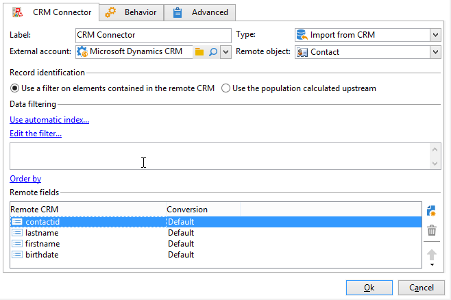

# Gegevens synchroniseren tussen Campagne en uw CRM {#data-synchronization}

De synchronisatie van gegevens tussen Adobe Campaign en uw CRM wordt beheerd door **CRM-connector** workflowactiviteit.

Als u bijvoorbeeld de Microsoft Dynamics-gegevens wilt importeren in Adobe Campaign, maakt u het volgende type workflow:

Deze workflow importeert de contactpersonen via Microsoft Dynamics, synchroniseert deze met de bestaande Adobe Campaign-gegevens, verwijdert dubbele contactpersonen en werkt de Adobe Campaign-database bij.

De **[!UICONTROL CRM Connector]** activiteit moet worden gevormd om gegevens te synchroniseren.

Met deze activiteit kunt u:

* Invoer uit de BCR - [Meer informatie](#importing-from-the-crm)
* Exporteren naar CRM - [Meer informatie](#exporting-to-the-crm)
* Objecten importeren die zijn verwijderd in de CRM - [Meer informatie](#importing-objects-deleted-in-the-crm)
* Objecten verwijderen in de CRM-toepassing - [Meer informatie](#deleting-objects-in-the-crm)

Selecteer de externe rekening die CRM aanpast dat u synchronisatie met wilt vormen, dan selecteren het voorwerp om te synchroniseren: rekeningen, kansen, lood, contacten, enz.

De configuratie van deze activiteit hangt af van het uit te voeren proces. Hieronder worden verschillende configuraties beschreven.

## Invoer uit de BCR {#importing-from-the-crm}

Om gegevens via CRM in Adobe Campaign te importeren, moet u het volgende type workflow maken:

1. Selecteer een **[!UICONTROL Import from the CRM]** -bewerking.
1. In de **[!UICONTROL Remote object]** Selecteer het object dat u wilt importeren. Dit object komt overeen met een van de tabellen die in Adobe Campaign zijn gemaakt tijdens de verbindingsconfiguratie.
1. In de **[!UICONTROL Remote fields]** de velden in die u wilt importeren.

   Als u een veld wilt toevoegen, klikt u op de knop **[!UICONTROL Add]** klikt u op de werkbalk op de knop **[!UICONTROL Edit expression]** pictogram.

   Wijzig zo nodig de gegevensindeling met de vervolgkeuzelijst van het dialoogvenster **[!UICONTROL Conversion]** kolommen. Mogelijke conversietypen worden nader beschreven in [deze sectie](#data-format).

   >[!CAUTION]
   >
   >De identificator van de record in de CRM is verplicht voor het koppelen van objecten in CRM en in Adobe Campaign. Deze wordt automatisch toegevoegd wanneer het vak wordt goedgekeurd.
   >
   >De laatste wijzigingsdatum aan de CRM-zijde is ook verplicht voor de incrementele invoer van gegevens.

1. U kunt de te importeren gegevens filteren op basis van uw behoeften. Om dit te doen, klik **[!UICONTROL Edit the filter...]** koppeling.

   In het volgende voorbeeld importeert Adobe Campaign alleen contactpersonen waarvoor enige activiteit is opgenomen sinds 1 november 2021.

   

   >[!CAUTION]
   >
   >De beperkingen met betrekking tot de gegevensfiltermodi worden nader beschreven in [deze sectie](#filtering-data).

1. Selecteer de **[!UICONTROL Use automatic index...]** optie voor het automatisch beheren van incrementele objectsynchronisatie tussen uw CRM en Adobe Campaign, afhankelijk van de datum en de laatste wijziging.

   Raadpleeg [deze sectie](#variable-management) voor meer informatie.

### Variabelen beheren {#variable-management}

Activeer **[!UICONTROL Automatic index]** gebruiken om alleen objecten te verzamelen die zijn gewijzigd sinds de laatste import.

De datum van de laatste synchronisatie wordt opgeslagen in een optie die in het configuratievenster wordt gespecificeerd, door gebrek: **LASTIMPORT_&lt;%=instance.internalName%>_&lt;%=activityName%>**.

>[!NOTE]
>
>Deze opmerking is alleen van toepassing op het generieke **[!UICONTROL CRM Connector]** activiteit. Voor andere CRM-activiteiten is het proces automatisch.
>
>Deze optie moet handmatig worden gemaakt en ingevuld onder **[!UICONTROL Administration]** > **[!UICONTROL Platform]** > **[!UICONTROL Options]**. Dit moet een tekstoptie zijn en de waarde ervan moet overeenkomen met de volgende indeling: **yyyy/MM/dd hh:mm:ss**.
> 
>U moet deze optie handmatig bijwerken als u wilt doorgaan met importeren.

U kunt het verre gebied van CRM specificeren dat in aanmerking moet worden genomen om de meest recente veranderingen te identificeren.

Standaard worden de volgende velden gebruikt (in de opgegeven volgorde):

* Voor Microsoft Dynamics: **gewijzigd**,
* Voor Salesforce.com: **LastModifiedDate**, **SystemModstamp**.

De **[!UICONTROL Automatic index]** Deze optie genereert drie variabelen die in de synchronisatieworkflow kunnen worden gebruikt via een **[!UICONTROL JavaScript code]** type activiteit. Deze activiteiten zijn:

* **vars.crmOptionName**: naam van de optie die de laatste importdatum bevat.
* **vars.crmStartImport**: begindatum (inbegrepen) van de laatste gegevensimport.
* **vars.crmEndDate**: einddatum (exclusief) van de laatste gegevensimport.

  >[!NOTE]
  >
  >Deze datums worden in de volgende notatie weergegeven: **yyyy/MM/dd hh:mm:ss**.

### Gegevens filteren {#filtering-data}

Om efficiënte werking met diverse CRMs te verzekeren, moeten de filters worden gecreeerd gebruikend de volgende regels:

* Elk filterniveau mag slechts één type operator gebruiken.
* De operator AND NOT wordt niet ondersteund.
* Vergelijkingen mogen alleen betrekking hebben op null-waarden (&#39;is leeg&#39;/&#39;is geen leeg&#39; type) of getallen. Dit betekent dat de waarde (rechterkolom) wordt beoordeeld en dat het resultaat van deze beoordeling een getal moet zijn. Vergelijking van JOIN-typen wordt daarom niet ondersteund.
* De waarde in de rechterkolom wordt beoordeeld in JavaScript.
* JOIN-vergelijkingen worden niet ondersteund.
* De expressie in de linkerkolom moet een veld zijn. Het kan geen combinatie zijn van verschillende expressies, een getal, enzovoort.

### Volgorde van {#order-by}

In Microsoft Dynamics en Salesforce.com kunt u de externe velden die u wilt importeren in oplopende of aflopende volgorde sorteren.

Om dit te doen, klik **[!UICONTROL Order by]** en voeg de kolommen aan de lijst toe.

De volgorde van de kolommen in de lijst is de sorteervolgorde:

### Registeridentificatie {#record-identification}

In plaats van elementen te importeren die zijn opgenomen (en mogelijk zijn gefilterd) in uw CRM, kunt u een populatie gebruiken die vooraf is berekend in de workflow.

Selecteer de optie **[!UICONTROL Use the population calculated upstream]** en geeft u het veld op dat de externe id bevat.

Selecteer vervolgens de velden van de binnenkomende populatie die u wilt importeren, zoals hieronder wordt weergegeven:

## Exporteren naar de CRM {#exporting-to-the-crm}

Exporteer Adobe Campaign-gegevens naar uw CRM om de volledige inhoud te kopiëren naar uw CRM-database.

Als u gegevens wilt exporteren naar uw CRM, maakt u het volgende type workflow:

1. Selecteer een **[!UICONTROL Export to CRM]** -bewerking.
1. Ga naar de **[!UICONTROL Remote object]** en selecteer het object dat u wilt exporteren. Dit object komt overeen met een van de tabellen die in Adobe Campaign zijn gemaakt tijdens de verbindingsconfiguratie.

   >[!CAUTION]
   >
   >De exportfunctie van de **[!UICONTROL CRM Connector]** activiteit kan gebieden op uw CRM opnemen of bijwerken. Om gebiedsupdates in CRM toe te laten, specificeer de primaire sleutel van de verre lijst. Als de sleutel ontbreekt, worden gegevens ingevoegd in plaats van bijgewerkt.

1. Als u sneller wilt exporteren, controleert u de opdracht  **[!UICONTROL Export in Batches]** -optie.

   

1. In de **[!UICONTROL Mapping]** sectie, klikken **[!UICONTROL New]** om de velden te specificeren die geëxporteerd moeten worden en hun toewijzing in uw CRM.

   Als u een veld wilt toevoegen, klikt u op de knop **[!UICONTROL Add]** klikt u op de werkbalk op de knop **[!UICONTROL Edit expression]** pictogram.

   >[!NOTE]
   >
   >Als geen gelijke voor een gebied wordt bepaald, kunnen de waarden niet worden bijgewerkt: zij worden opgenomen direct in uw CRM.

   Wijzig zo nodig de gegevensindeling met de vervolgkeuzelijst van het dialoogvenster **[!UICONTROL Conversion]** kolommen. Mogelijke conversietypen worden nader beschreven in [deze sectie](#data-format).

   >[!NOTE]
   >
   >De lijst met te exporteren records en het resultaat van de export worden opgeslagen in een tijdelijk bestand dat toegankelijk blijft totdat de workflow is voltooid of opnieuw is gestart. Hierdoor kunt u het proces veilig starten in het geval van fouten.

## Aanvullende configuraties {#additional-configurations}

### Gegevensindeling {#data-format}

U kunt gegevensindeling direct omzetten wanneer u deze importeert in of vanuit uw CRM.

Selecteer hiertoe de conversie die in de overeenkomende kolom moet worden toegepast.

De **[!UICONTROL Default]** in de modus Automatische gegevensomzetting, die in de meeste gevallen overeenkomt met een kopie/plakken van de gegevens. Tijdzonebeheer wordt echter toegepast.

Andere mogelijke omzettingen zijn:

* **[!UICONTROL Date only]**: verwijdert velden Datum- en tijdtype.
* **[!UICONTROL Without time offset]**: hiermee wordt het tijdzonebeheer geannuleerd dat in de standaardmodus wordt toegepast.
* **[!UICONTROL Copy/Paste]**: gebruikt onbewerkte gegevens zoals tekenreeksen (geen conversie).

### Fout bij verwerken {#error-processing}

In het kader van de invoer of de uitvoer van gegevens, kunt u een specifiek proces op fouten en verwerpingen toepassen. Selecteer de optie **[!UICONTROL Keep the rejections in a file]** en **[!UICONTROL Process errors]** in de **[!UICONTROL Behavior]** tab.

Met deze opties voegt u de gerelateerde uitvoerovergangen toe.

Voeg vervolgens de relevante activiteiten in om gegevens te verwerken. Voeg bijvoorbeeld een **Wachten** activiteit en planningpogingen voor fouten.

De **[!UICONTROL Reject]** Met uitvoerovergang hebt u toegang tot het uitvoerschema dat de specifieke kolommen bevat die relevant zijn voor foutberichten en -codes. Voor Salesforce.com is deze kolom **errorSymbol** (foutsymbool, anders dan de foutcode), **errorMessage** (beschrijving van de foutcontext).

## Objecten importeren die zijn verwijderd in de CRM {#importing-objects-deleted-in-the-crm}

U kunt objecten die in uw CRM zijn verwijderd, importeren naar Adobe Campaign.

1. Selecteer een **[!UICONTROL Import objects deleted in the CRM]** -bewerking.
1. Ga naar de **[!UICONTROL Remote object]** vervolgkeuzelijst en selecteer het object waarop het proces betrekking heeft. Dit object komt overeen met een van de tabellen die in Adobe Campaign zijn gemaakt tijdens de verbindingsconfiguratie.
1. Geef de verwijderingsperiode op die in de **[!UICONTROL Start date]** en de **[!UICONTROL End date]** velden (datums worden opgenomen).

   >[!CAUTION]
   >
   >De verwijderingsperiode moet overeenkomen met uw specifieke CRM-beperkingen. Voor Salesforce.com kunnen elementen die meer dan 30 dagen geleden zijn verwijderd, bijvoorbeeld niet worden hersteld.

## Objecten verwijderen in de CRM-toepassing {#deleting-objects-in-the-crm}

Om voorwerpen op uw CRM te schrappen, specificeer de primaire sleutel van de verre te schrappen elementen.

De **[!UICONTROL Behavior]** kunt u de verwerking van afwijzingen inschakelen. Met deze optie wordt een tweede uitvoerovergang gegenereerd voor de **[!UICONTROL CRM connector]** activiteit. Raadpleeg voor meer informatie hierover [Fout bij verwerken](#error-processing).
